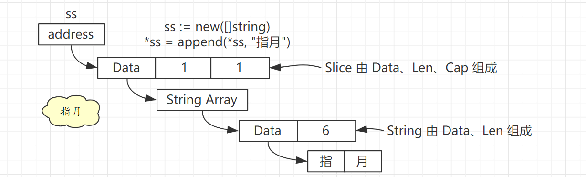
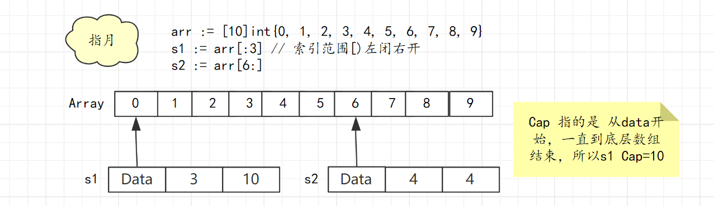

# Slice

## 1. 概述

Go 语言中的 Slice 具体实现如下：

```go
type SliceHeader struct {
	Data uintptr
	Len  int
	Cap  int
}
```

* Data：真实数据的地址
* Len：元素个数
* Cap：容量

Slice 的元素存在一段连续的内存中，实际上就是一个数组，Data 就是这个底层数组的起始地址。


具体结构如下：

```go
ss := new([]string)
*ss = append(*ss, "指月")
```

整个结构如下图：




**ss 为一个指向 String Slice 的指针，Slice 的 Data 指向的是 String Array，String Array 每个元素都是一个 String，最后由 String 的 Data 指向最终的 字符串内容。**

## 2. 相关操作

### 1. 初始化

**var**

```go
var ints []int
```

这时只是定义了 Slice，初始化了 SliceHeader 这个结构，并没有分配内存开辟底层数组，所以 Data 字段为 nil，同样的 Len 和 Cap 则为0。

**new 关键字**

使用 new 关键字和之前直接定义是一样的，都不会初始化 Slice 的  3个字段，不过 new 关键字返回的是指针。

```go
ints:=new([]int)
```

**make 关键字**

```go
var ints = make([]int, 4, 8)
```

想这样，通过 make 关键字初始话化 Slice 时，可以指定 Len 和 Cap ，同时也会开辟一个长度为 Cap 的底层数组，同时该数组元素初始化为指定类型的零值。

> 这里就是 Len =4 Cap=8 Data 数组长度为8，元素皆为 Int 型的零值 0。


### 2. 访问

已经存储的元素可以安全访问，超过这个范围则为越界访问，会发生 panic。

```go
var ints = make([]int, 4, 8)
fmt.Println(ints[4]) // panic: runtime error: index out of range [4] with length 4
```

初始化时 Len=4，通过 ints[4] 访问第 5 个元素则为越界访问。

> 所以 Slice 访问边界实际由 Len 属性决定。

### 3. 添加元素

需要注意的是，由于指定了Len=4，所以后续添加元素则会从第5个位置开始,例子如下：

```go
var ints = make([]int, 4, 8)
ints = append(ints, 1)
fmt.Println(ints) //[0 0 0 0 1]
```


### 4. 删除元素

Slice 删除元素没有直接调用的方法，所以比较麻烦。

具体逻辑为：将待删除元素之前的元素和之后的元素拼接形成一个新的 Slice，这样待删除元素就算是删掉了。

```go
s1 := []int{1, 2, 3, 4, 5}
before := s1[:1] // 1
after := s1[2:] // 3 4 5
s2 := append(before, after...)
fmt.Println("s1:", s1)
fmt.Println("s2:", s2) // 1 3 4 5
```


## 3. 底层数组

Slice 的 Data 字段指向的就是 Slice 的底层数组，但是没有限制只能从数组起始地址开始，可以从数组中任意元素开始。所以 Slice 的底层数组是可以共用的。例子如下：

```go
arr := [10]int{0, 1, 2, 3, 4, 5, 6, 7, 8, 9}
s1 := arr[:3]
s2 := arr[6:]
```

具体结构图如下：



对 Slice 的更改实际都是在修改 底层数组。如果底层数组可以满足要求，则会修改底层数组，否则就会重新开辟一个底层数组。

> 比如这里对 s2 进行 append 操作就会开辟新数组，因为这个数组已经满了。

正是因为有开辟新数组的可能，所以每次 append 的结果都需要用一个变量来接收，因为可能 append 后返回的不在是以前那个 Slice 了。

例子如下：

```go
func SliceArray() {
	arr := [10]int{0, 1, 2, 3, 4, 5, 6, 7, 8, 9}
	s1 := arr[:3] // 索引范围[)左闭右开
	s2 := arr[6:]
	fmt.Println("s1:", s1)
	fmt.Println("s2:", s2)
	s3 := append(s2, 10)
	fmt.Println("s2:", s2) // s2:[6 7 8 9] 
	fmt.Println("s3:", s3) // s3:[6 7 8 9 10] 
}
```

可以看到对 s2 append 后返回的新切片 s3 ，底层开辟了新数组，所以已经和 s1、s2 没关系了、


## 4. 扩容

Slice 扩容分为 4 个步骤，例子如下

> s1 cap 为 2，所以 append 时必定会触发扩容。

```go
s1 := []int{1, 2}
s1 = append(s1, 3, 4, 5, 6, 7)
fmt.Println(cap(s1)) // 扩容后容量为 8
```


**STEP1：预估容量**

* 1）**如果**：oldCap * 2 < targetCap，newCap --> targetCap，如果旧容量翻倍也不满足所需目标容量，则新容量就是目标所需容量。
* 2）**否则**：
  * 1）oldLen < 1024 , newCap = oldCap * 2, 如果扩容前元素个数小于 1024，那么新容量直接翻倍。
  * 2）oldLen > 1024 ,newCap = oldCap * 1.25, 如果扩容前元素个数大于 1024，那么新容量则翻 1.25 倍。

> 所以 s1 预估容量为  7，走的是第一条逻辑。

**STEP2：预估容量需要多大内存**

预估容量确定的是元素个数，newCap 个元素需要占用多大内存呢？这就和元素类型挂钩了。

所需内存 = 预估容量 * 元素类型大小

>s1 所需内容 = 7 * 8 = 56 字节


**STEP3：匹配合适内存规则**

step2 中确定了所需内存大小，但是 Go 语言的`内存分配模块`只提供`固定规格`的内存,比如 8 16 32 48 64 80 96 112 ...这样的规格。对于所有内存申请都会分配一个满足要求且浪费最少的内存规则。

> 所以 s1 扩容申请 56 字节会得到一个 64 字节的空间。


**步骤四：确定最终容量**

最终容量 = 分配内存 / 元素类型大小

> step3 中分配了一个 64 字节的内存，int64 每个元素占 8 字节，所以最终容量为 64 / 8 = 8。


## 5. 与 String 互转

Slice 由 Data、Len、Cap 构成，String 由 Data、Len 构成，二者只相差了一个 Cap 属性。

通过 unsafe 包可以快速进行二者的转换。

```go
func String2Bytes(str string) []byte {
	sh := (*reflect.SliceHeader)(unsafe.Pointer(&str))
	// slice 比 string 多一个 cap 属性 这里给 cap 单独赋值
	sh.Cap = sh.Len
	return *(*[]byte)(unsafe.Pointer(sh))
}

func Bytes2String(buf []byte) string {
	return *(*string)(unsafe.Pointer(&buf))
}
```

Go 语言标准库中 strings.Builder 就使用到了 unsafe.Pointer 来提升效率。

```go
// strings/builder.go 47 行
func (b *Builder) String() string {
	return *(*string)(unsafe.Pointer(&b.buf))
}
```


## 6 .参考

`https://draveness.me/golang/docs/part2-foundation/ch03-datastructure/golang-array-and-slice/`

`https://www.bilibili.com/video/BV1hv411x7we?p=2`

`https://blog.golang.org/slices-intro`