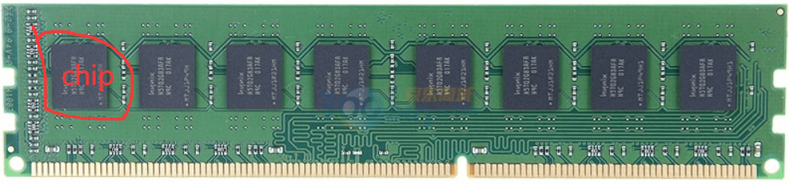
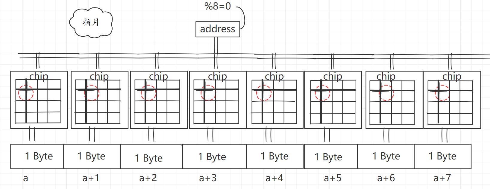

# 内存对齐

## 1. 内存概述

### 内存设计

内存条如下



内存条上的 8 个黑色小方块称之为 **chip**，整个合起来叫做 **rank**。

chip 中又分为多个 **bank**，bank 这里就可以通过行列方式来进行访问了。

### 内存访问

内存访问一般采取**并行**方式，比如 8 Byte 的数据并不会都存在第一个 chip,而是分散到各个 chip 中存储。比如 chip1 存储 Byte1，chip2 存储 Byte2,依次类推。读取的时候分别从 8 个 chip 中读取出 1Byte，拼接起来就是完整的 8 Byte。

> 可以简单的理解为这样使得内存访问效率提升了 8 倍。


具体读取方式如下




**可以看到内存的真实存放情况并不是我们想象的那样是逻辑连续的。**


## 2. 内存字节对齐

这里说的内存对齐指的是存入内存之前的数据。即分散之前的，或者说是读取出来拼接好后的那一部分数据需要对齐。

否则就不能迅速的从各个 chip 将对应的数据读取出来，需要分多次读取，这样效率势必会降低不少。

### 例子

假设有一个 8Byte 的数据，进行内存对齐后地址分别为 0~7。

然后分别存到 8 个 chip 中，假设是存在 （1,1）这个位置的。

读取时只需要分别读取8个chip 的（1,1）位置数据然后组合起来就是完成的数据了。

如果没有内存对齐，比如分配的地址是(1~8)。

这样分别存到 8 个chip之后就不会是相同的地址了。

现在 0 这个位置虽然没有数据，但是chip 中还是要给它流出位置来，万一后面会写入数据呢。

所以现在8个chip的（1，1）这个位置中，chip1的（1,1）是空的，后续7个chip分别存储了（1~7）的数据，剩下的位置8这个数据，会存在下一个坐标，比如(1,2),然后后续的9~15又是空的。chip1的（1,2）存放了数据8，但是其他chip的(1,2)位置暂时还是空的。

所以最后要读取（1~8）的所有数据就需要分别读取出8个chip上的位置（1,1）和（1，2）然后剔除掉不要的数据最后拼接起来才是完整的数据。

> 之所以有的 CPU 可能实现随机内存访问，就是因为实现了这个数据过滤拼接的功能，但是这样在内存读取效率会大打折扣。


## 3. Go 语言内存对齐

具体对齐方式和平台有关。

**32 位平台指针宽度和寄存器宽度都是4字节，64位平台则都是8字节。**

在Go语言中**寄存器宽度**也称之为**机器字长**或者**最大对齐边界**。


### 对齐规则

在分析之前，我们先看下内存对齐的规则：

**规则一**

对于具体类型来说，**对齐值=min(平台最大对齐边界，类型大小Sizeof长度)**。**也就是在平台最大对齐边界和类型的内存占用大小之间，取最小值为该类型的对齐值**。我的电脑默认是8，所以最大值不会超过8.

为什么不统一按照平台最大对齐边界或者类型大小来对齐？

主要是为了节约内存。直接按平台最大对齐边界对齐的话，如果数据类型长度小于最大对齐边界的时候就会造成内存浪费，比如 int8占1byte也按照8byte对齐就会浪费7byte空间，按照类型大小长度对齐也有同样的问题，所以才取二者中的最小值。

**规则二**

struct 在每个字段都内存对齐之后，其本身也要进行对齐，**对齐值为各个成员对齐值中的最大值**。

结构体对齐是为了保证**结构体数组**中的各个元素能正常访问，由于数组内存是连续的，如果结构体不对齐势必会导致，数组的第二个及其后面的元素无法正常访问。


在这里再次提醒，对齐值也叫对齐系数、对齐倍数，对齐模数。这就是说，**每个字段在内存中的偏移量是对齐值的倍数即可**。


### 类型长度

windows 64位系统 编译器默认对齐值=8

| 类型                     | 大小 | 对齐系数 | 备注                             |
| ------------------------ | ---- | -------- | -------------------------------- |
| bool                     | 1    | 1        |                                  |
| byte                     | 1    | 1        |                                  |
| int8                     | 1    | 1        |                                  |
| int16                    | 2    | 2        |                                  |
| int32                    | 4    | 4        |                                  |
| int64                    | 8    | 8        |                                  |
| float32                  | 4    | 4        |                                  |
| float64                  | 8    | 8        |                                  |
| map                      | 8    | 8        |                                  |
| string                   | 16   | 8        | 对齐系数不会超过编译器默认对齐值 |
| array ([1]string{"xxx"}) | 16   | 8        |                                  |
| slice ([]string{"xxx"})  | 24   | 8        |                                  |

### 例子

```go
type Part1 struct {
	A bool              // 长度1 偏移0 填充0 总大小1
	B byte              // 长度1 偏移1 填充0 总大小2
	C int8              // 长度1 偏移2 填充0 总大小3
	D int16             // 长度2 偏移3 填充1 总大小6
	E int32             // 长度4 偏移5 填充2 总大小12
	F int64             // 长度8 偏移11 填充4 总大小22
	G float32           // 长度4 偏移21 填充2 总大小28
	H float64           // 长度8 偏移27 填充4 总大小40
	I string            // 长度16 偏移39 填充0 总大小56
	J map[string]string // 长度8 偏移55 填充0 总大小64
	K []string          // 长度24 偏移63 填充0 总大小88
	L [1]string         // 长度16 偏移87 填充0 总大小104
	//104 刚好是8的倍数 不需要填充
}
```


## 4. 小结

内存对齐主要就是为了迎合内存设计。

而内存之所以这么设计是为了提升内存访问效率。


## 参考

`https://go101.org/article/memory-layout.html`

`https://www.bilibili.com/video/BV1hv411x7we`

`https://xie.infoq.cn/article/594a7f54c639accb53796cfc7`

