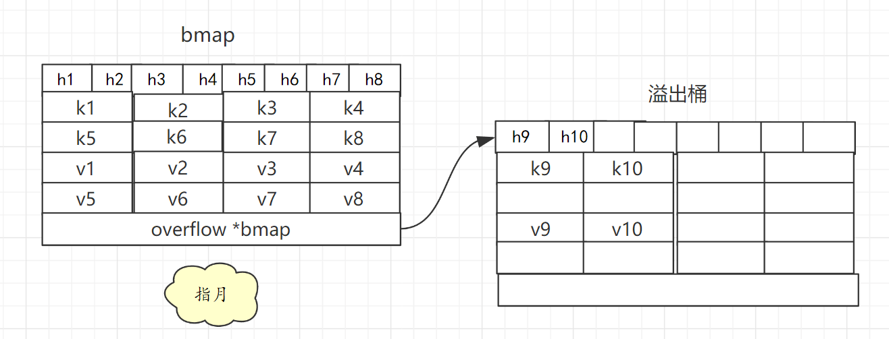
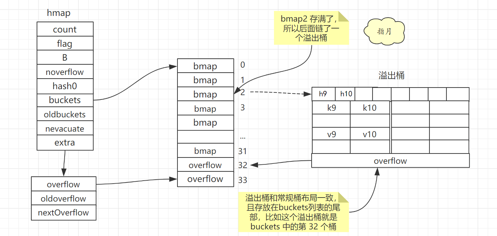

# Map


## 1. 概述

Map 是一种 Key-Value 数据结构，

## 2. 哈希表

### 1. 哈希函数

使用哈希函数对 Key 进行处理，得到哈希值，Hash(k1)-->hash

### 2. 选择桶

根据哈希值找到对应的存储位置

* 1） **取模法**：哈希值与桶个数(这里用 m 代替)取模，得到桶编号则是当前 key 存储的位置 hash % m --> index
* 2）**与运算法**：哈希值与 m-1 进行与运算，hash & (m-1),若想要最终结果落在[0,m-1)且不出现空桶，则 m 必须是 2 的 整数次幂。若 m 为 2 的 整数次幂，则其二进制表示只有最高位为1，m-1 的二进制表示则出了这位之外的低位全为 1，这样就能保证最终结果落在[0,m-1)且不出现空桶。

### 3. 哈希冲突

不同的 Key 进过 哈希函数 处理后，可能得到相同的值，这就是哈希冲突。常用解决方案如下：

* 1）**开放地址法**：
  * 写入：当前桶被占用，则依次往后遍历，找到第一个为空的桶，将数据存到这个桶。
  * 查询：根据哈希值找到这个桶,发现 key 对不上，则依次往后遍历，直到 key 对应上，如果遇到空桶，则说明该 Key 不存在。
* 2）**拉链法**：
  * 写入：当前桶被占用，则这个桶后面链接一个新桶用来存储这个键值即可。即当前桶中存放的是一条键值链表。
  * 查询：根据哈希值找到这个桶,发现 key 对不上，就顺着链表往后查找，如果 Key 不在链表中则说明该 Key 不存在。

### 4. 扩容

哈希冲突的发生会影响哈希表的读取效率，解决方案有两个

* 1）选择散列均匀的哈希函数
* 2）适时对哈希表扩容


一般把 存储键值对的数目 与 桶的数目的比值称为 负载因子（LoadFactor）,也是哈希表是否需要扩容的判定依据。

> LoadFactor = count / m

扩容则会创建新桶，然后将数据从旧桶中复制到新桶。

如果哈希表中的数据较多，一次性迁移所有数据到新桶，需要消耗大量时间。一般会使用**渐进式扩容**，将迁移过程分散到多次哈希表读写操作中。

拿一个字段记录迁移进度， 每次哈希表读写操作时，检测到当前处于扩容阶段就完成一部分迁移任务，然后更新迁移进度。直到所有键值对迁移完成后才算是真正完成扩容。

> 渐进式扩容可以避免一次性扩容带来的性能瞬时抖动，Redis 中也使用了渐进式扩容来保证性能稳定。


## 3. Go Map

Go 语言中的 map 底层实现也是用的 哈希表。

### 数据结构

具体实现如下：

```go
// runtime/map.go 115行
type hmap struct {

	count     int // map 中的键值对个数
	flags     uint8
	B         uint8  // 桶的个数是2的多少次幂 2^B 因为哈希表中桶的数量都 2 的倍数，所以该字段会存储对数
	noverflow uint16 // 使用的溢出桶个数
	hash0     uint32 // 哈希种子，它能为哈希函数的结果引入随机性

	buckets    unsafe.Pointer // 指向桶的指针
	oldbuckets unsafe.Pointer // 扩容阶段存储旧桶
	nevacuate  uintptr        // 渐进式扩容阶段 下一个要迁移的旧桶编号

	extra *mapextra // 指向 mapextra结构体的指针，记录的是溢出桶相关信息
}
```


map 中的桶的定义如下：

```go
// runtime/map.go 149行
type bmap struct {
	// tophash generally contains the top byte of the hash value
	// for each key in this bucket. If tophash[0] < minTopHash,
	// tophash[0] is a bucket evacuation state instead.
	tophash [bucketCnt]uint8
	// Followed by bucketCnt keys and then bucketCnt elems.
	// NOTE: packing all the keys together and then all the elems together makes the
	// code a bit more complicated than alternating key/elem/key/elem/... but it allows
	// us to eliminate padding which would be needed for, e.g., map[int64]int8.
	// Followed by an overflow pointer.
}
```

在运行期间，`runtime.bmap` 结构体其实不止包含 `tophash` 字段，因为哈希表中可能存储不同类型的键值对，而且 Go 语言也不支持泛型，所以键值对占据的内存空间大小只能在**编译时进行推导**。

> src/cmd/compile/internal/gc/reflect.go 中的 bmap 函数重建它的结构
>
> 在线预览：`https://github.com/golang/go/blob/ac0ba6707c1655ea4316b41d06571a0303cc60eb/src/cmd/compile/internal/gc/reflect.go#L83`

```go
type bmap struct {
    topbits  [8]uint8
    keys     [8]keytype
    values   [8]valuetype
    pad      uintptr
    overflow uintptr
}
```


根据注释可以知道，bmap 结构如下：

* 开头是 tophash，存储的是哈希值的高8位，通过比较不同键的哈希的高 8 位可以减少访问键值对次数以提高性能。
* 中间是所有键，然后是所有值
  * 将键存一起，值存一起，这样分开存可以减少一些字节填充。比如 key 是 int64 value 是int8 ，按  key/elem/key/elem/ 这样存的话，每个 value 都要填充成 int64 才能对齐。
* 最后跟着一个 overflow 指针，指向溢出桶

大概是这个样子的



**一个桶可以放 8 个键值对。**

一个桶（即bmap）存满后，如果还有溢出桶可用，就拿一个溢出桶过来，指针存在 overflow 属性中，然后将后续键值对存到溢出桶中。这样可以减少扩容次数，防止频繁扩容。

> 溢出桶通过 extra.nextOverflow 字段获取。
>
> 溢出桶是在 Go 语言还使用 C 语言实现时使用的设计，由于它能够减少扩容的频率所以一直使用至今。
>
> `https://github.com/golang/go/commit/0c6b55e76ba6d59f57c81ca1160d833c79270753`

Go 语言认为 哈希表桶数目大于 2^4 时就有较大概率使用到溢出桶，此时就会分配 2^(B-4) 个溢出桶。

> 哈希表桶数目为 2^5 次方时，B=5，所以会分配  2^(5-4) 即 2 个溢出桶。

溢出桶和常规桶一样，在内存中也是连续的，前 2^B 个当做常规桶用，后面 2^(B-4) 当做溢出桶用。

map 中的字段`extra *mapextra `，记录的就是溢出桶相关信息，`mapextra `定义如下：

```go
type mapextra struct {
	// If both key and elem do not contain pointers and are inline, then we mark bucket
	// type as containing no pointers. This avoids scanning such maps.
	// However, bmap.overflow is a pointer. In order to keep overflow buckets
	// alive, we store pointers to all overflow buckets in hmap.extra.overflow and hmap.extra.oldoverflow.
	// overflow and oldoverflow are only used if key and elem do not contain pointers.
	// overflow contains overflow buckets for hmap.buckets.
	// oldoverflow contains overflow buckets for hmap.oldbuckets.
	// The indirection allows to store a pointer to the slice in hiter.
	overflow    *[]*bmap // 已经使用的溢出桶
	oldoverflow *[]*bmap // 扩容阶段旧桶用到的溢出桶

	// nextOverflow holds a pointer to a free overflow bucket.
	nextOverflow *bmap // 指向下一个空闲的溢出桶
}
```

大概结构如下：




### 扩容

Go 语言 map 负载因子为 6.5，超过则会触发翻倍扩容。

LoadFactor < 6.5 但是 使用溢出桶较多(即 noverflow 值较大)，则会触发等量扩容。

具体怎么才算多呢?

* 1）B <=15 时 noverflow > 2^B；即常规桶小于 2^15 的时候，溢出桶大于常规桶就算较多。
* 2）B > 15 时 noverflow > 2^15 ；即常规桶大于 2^15 的时候，溢出桶大于  2^15 就算较多。

**等量扩容的意义？**

只有当 map 中的数据被大量删除后才会出现 LoadFactor < 6.5 但是 使用溢出桶较多(即 noverflow 值较大)的情况。

这样 map 中有大量内存被浪费了，虽然每个桶都只用了一点点空间，但是没办法回收，只能放着。

等量扩容在数据迁移过程中就会**让数据更加紧凑，减少溢出桶的使用**。


## 4. 简单使用

### 1. 初始化

Go 语言 map 一般使用 make 关键字初始化。

```go
	h2 := make(map[string]string)
	h2["k1"] = "v1"
	h2["k2"] = "v2"
	h2["k3"] = "v3"
```

Go 语言也支持使用字面量的方式初始化哈希，一般都会使用 `key: value` 的语法来表示键值对

```go
hash := map[string]string{
	"k1": "v1",
	"k2": "v2",
	"k3": "v3",
}
```

我们需要在初始化哈希时声明键值对的类型，这种使用字面量初始化的方式最终都会通过[ `cmd/compile/internal/gc/sinit.go/maplit()`](https://github.com/golang/go/blob/ac0ba6707c1655ea4316b41d06571a0303cc60eb/src/cmd/compile/internal/gc/sinit.go#L753) 初始化，我们来分析一下该函数初始化哈希的过程：

```go
func maplit(n *Node, m *Node, init *Nodes) {
	a := nod(OMAKE, nil, nil)
	a.Esc = n.Esc
	a.List.Set2(typenod(n.Type), nodintconst(int64(n.List.Len())))
	litas(m, a, init)

	entries := n.List.Slice()
	if len(entries) > 25 {
		...
		return
	}

	// Build list of var[c] = expr.
	// Use temporaries so that mapassign1 can have addressable key, elem.
	...
}
```

当哈希表中的元素数量少于或者等于 25 个时，编译器会将字面量初始化的结构体转换成以下的代码，将所有的键值对一次加入到哈希表中：

```go
hash := make(map[string]int, 3)
hash["1"] = 2
hash["3"] = 4
hash["5"] = 6
```

这种初始化的方式与的数组和切片]几乎完全相同，由此看来集合类型的初始化在 Go 语言中有着相同的处理逻辑。

**运行时**

当创建的哈希被分配到栈上并且其容量小于 `BUCKETSIZE = 8` 时，Go 语言在编译阶段会使用如下方式快速初始化哈希，这也是编译器对小容量的哈希做的优化：

```go
var h *hmap
var hv hmap
var bv bmap
h := &hv
b := &bv
h.buckets = b
h.hash0 = fashtrand0()
```

除了上述特定的优化之外，无论 `make` 是从哪里来的，只要我们使用 `make` 创建哈希，Go 语言编译器都会在类型检查]期间将它们转换成 [`runtime.makemap`](https://github.com/golang/go/blob/ac0ba6707c1655ea4316b41d06571a0303cc60eb/src/runtime/map.go#L303)，使用字面量初始化哈希也只是语言提供的辅助工具，最后调用的都是 `runtime.makemap`：

```go
func makemap(t *maptype, hint int, h *hmap) *hmap {
	mem, overflow := math.MulUintptr(uintptr(hint), t.bucket.size)
	if overflow || mem > maxAlloc {
		hint = 0
	}

	if h == nil {
		h = new(hmap)
	}
	h.hash0 = fastrand()

	B := uint8(0)
	for overLoadFactor(hint, B) {
		B++
	}
	h.B = B

	if h.B != 0 {
		var nextOverflow *bmap
		h.buckets, nextOverflow = makeBucketArray(t, h.B, nil)
		if nextOverflow != nil {
			h.extra = new(mapextra)
			h.extra.nextOverflow = nextOverflow
		}
	}
	return h
}
```

这个函数会按照下面的步骤执行：

1. 计算哈希占用的内存是否溢出或者超出能分配的最大值；
2. 调用 `runtime.fastrand`获取一个随机的哈希种子；
3. 根据传入的 `hint` 计算出需要的最小需要的桶的数量；
4. 使用 `runtime.makeBucketArray` 创建用于保存桶的数组；

`runtime.makeBucketArray`会根据传入的 `B` 计算出的需要创建的桶数量并在内存中分配一片连续的空间用于存储数据：

```go
func makeBucketArray(t *maptype, b uint8, dirtyalloc unsafe.Pointer) (buckets unsafe.Pointer, nextOverflow *bmap) {
	base := bucketShift(b)
	nbuckets := base
	if b >= 4 {
		nbuckets += bucketShift(b - 4)
		sz := t.bucket.size * nbuckets
		up := roundupsize(sz)
		if up != sz {
			nbuckets = up / t.bucket.size
		}
	}

	buckets = newarray(t.bucket, int(nbuckets))
	if base != nbuckets {
		nextOverflow = (*bmap)(add(buckets, base*uintptr(t.bucketsize)))
		last := (*bmap)(add(buckets, (nbuckets-1)*uintptr(t.bucketsize)))
		last.setoverflow(t, (*bmap)(buckets))
	}
	return buckets, nextOverflow
}
```

- 当桶的数量小于 2424 时，由于数据较少、使用溢出桶的可能性较低，会省略创建的过程以减少额外开销；
- 当桶的数量多于 2424 时，会额外创建 2B−42B−4 个溢出桶；

### 2. 读写操作


TODO

## 5. 参考

`https://draveness.me/golang/docs/part2-foundation/ch03-datastructure/golang-hashmap/`

`https://cloud.tencent.com/developer/article/1468799`

`https://www.bilibili.com/video/BV1hv411x7we?p=4`

