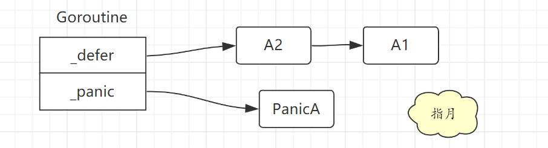
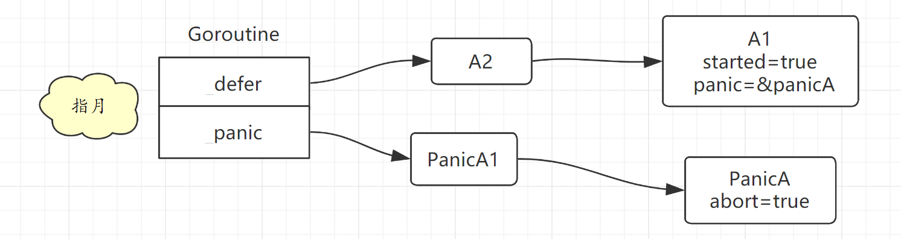

# Panic Recover

## 1.概述

和 defer 一样，**panic 也是以链表形式存储的**,同样是存储在 goroutine 结构体中。

```go
// src/runtime/runtime2.go 395行
type g struct {

	_panic       *_panic // innermost panic - offset known to liblink
	_defer       *_defer // innermost defer
}
```

panic 链表中链的是一个一个 _panic 结构体。

和 defer 一样，**发生新的 panic 时也是在 _panic 链表头上插入新的 _panic 结构体**。

```go
type _panic struct {
	argp      unsafe.Pointer // defer 的参数空间地址
	arg       interface{}    // panic 自己的参数
	link      *_panic        // 链接到之前发生的panic

	recovered bool           // 标识panic是否被恢复
	aborted   bool           // panic是否被终止
    pc        uintptr        
	sp        unsafe.Pointer 
	goexit    bool
}
```

最后的 pc、sp、goexit 三个字段主要是为了修复 runtime.Goexit 带来的问题引入的。

> runtime.Goexit 能够只结束调用该函数的 Goroutine 而不影响其他的 Goroutine，但是该函数会被 `defer` 中的 `panic` 和 `recover` 取消，引入这三个字段就是为了保证该函数的一定会生效。

例子

```go
func A() {
	defer A1()
	defer A2()
	panic("panic A")
}
func A1() {}
func A2() {}
```

具体结构如下图所示：




## 2. 正常流程

编译器会将关键字 `panic` 转换成`runtime.gopanic`函数，该函数执行过程包括以下几个步骤：

* 1）创建新的 runtime._panic 并添加到 Goroutine 的 _panic 链表头
* 2）在循环中不断从当前 Goroutine 的 `_defer` 中链表获取`runtime._defer`,并调用  runtime.reflectcall，运行延迟调用函数。
* 3）调用 runtime.fatalpanic 中止整个程序。

不过 panic 导致的 defer 链表执行和正常 defer 执行有所不同。

```go
type _defer struct {

	started bool
	_panic    *_panic  // panic that is running defer
}
```

panic 触发defer执行时，会将 _defer 结构体中的 started 字段标记为 true，同时把 _panic 字段指向自己，表示这个 defer 是由这个 panic 触发的。

> 这样做主要是为了中止panic，因为defer 函数中有可能还会发生panic。


**defer 中的 panic**

如果 defer 函数中也发生了 panic，同样的按照上述逻辑，会创建一个 _panic 结构体，并插入到当前 goroutine 的  _panic 链表头，此时正在执行的 panic 就变成了这个刚发生的 panic。

这个 panic 执行时也会先去执行 defer 链表，然后发现 defer 链表头指向的 defer 的 started 标记为true，而且 _panic 字段指向的也不是自己，所以就会根据 _panic 指针找到对应的 panic，并将其标记为已终止，即将 aborted 字段设置为 true。

**打印 panic信息**

打印 panic 信息的时候，会从 _panic 链表尾部开始打印，也就是按照 panic 发生的顺序逐个输出。


**例子**

```go
func A() {
	defer A1()
	defer A2()
	panic("panic A")
}

func A1() {
	panic("panic A1")
}
func A2() {

}
```

具体结构如下图所示：




**小结**

没有 recover 的 panic 执行流程就是这个样子了，关键点如下：

* 1）**panic 执行 defer 函数的方式**：先标记后释放， 目的是为了终止之前发生的 panic。
* 2）**异常信息输出方式**：从 _panic 链表尾部开始打印，也就是按照 panic 发生的顺序逐个输出


## 3. 带 recover 的 panic

recover 只做一件事，就是把当前执行的 panic 置为已恢复，即把 recovered 字段置为 true。

### 执行流程

* 1）触发 panic。
* 2）panic 开始执行 defer 链表
* 3）defer 中有 recover，把当前 panic 恢复了（将当前 panic 的 recovered 字段置为 true）。
* 4）每个 defer 函数执行完成后，panic 处理流程都会检查当前 panic 是否被它(即刚刚执行的defer函数)恢复了。
* 5）panic 处理流程发现当前 panic 已经被恢复了，于是将其从 panic 链表移除，同时对应的也会把前面执行过的那个 defer 函数移除，不过移除前需要保存 _defer.pc 和 _defer.sp 这两个字段的值。
* 6）根据前面保存的 _defer.pc 和 _defer.sp 跳出当前 panic 的处理流程。


### recover

编译器会将关键字 `recover` 转换成 runtime.gorecover,代码如下：

```go
func gorecover(argp uintptr) interface{} {
	gp := getg()
	p := gp._panic
	if p != nil && !p.recovered && argp == uintptr(p.argp) {
		p.recovered = true
		return p.arg
	}
	return nil
}
```

### 恢复流程

之前 defer 注册的时候，例子如下：

```go
func A() {
	defer B()
}
func B() {
 // dosomething
}
```

伪指令大概是这样子的：

```go
func A() {
    r = deferproc(8,B)
    if r > 0{
        goto ret
    }
    // dosomething
    runtime.deferreturn()
    return
 ret:
     runtime.deferreturn()
}
```

sp 是当前函数的栈指针，pc 字段就是调用 deferproc函数的返回地址，也就是下面这段逻辑：

```go
if r > 0{
    goto ret
}
```

所以 将寄存器的 r 的值改成了 1，然后进入 if 逻辑，通过 goto 跳转到 ret 位置去执行  runtime.deferreturn()。

这样就退出了 panic 处理流程。然后由于函数退出前要先执行 defer 链表，所以又进入了 defer 链表的调用流程，直到整个 defer 链表执行完毕，函数正常退出，不会打印任何 panic 信息。


**需要注意的是:只有执行 recover 的函数，正常返回后，才会进入 panic 处理流程，去检查 panic 是否被恢复。**

### recover后再次 panic

如果 recover 执行后，又触发了 panic，情况就又不一样了：

* 1）defer 中执行 recover 将当前 panic 标记为已恢复，然后在这个 defer 函数中又触发了 panic。
* 2）将当前这个触发的 panic 添加到 _panic 链表头，由这个 panic 开始再次去执行 defer 链表
* 3）发现第一个 defer 已经被执行了(就是刚才调用recover的那个)，但是触发的 panic 不是自己，于是把对应的 panic 标记为已终止，然后把这个已执行的 defer 移除。
* 4）继续执行后续的 defer。
* 5）最后打印出 panic 信息，不过由于其中有个 panic 是被 recover 过的，所以打印的异常信息中也会将其体现出来。


## 4. 参考

`https://www.bilibili.com/video/BV1hv411x7we?p=11`

`https://draveness.me/golang/docs/part2-foundation/ch05-keyword/golang-panic-recover`