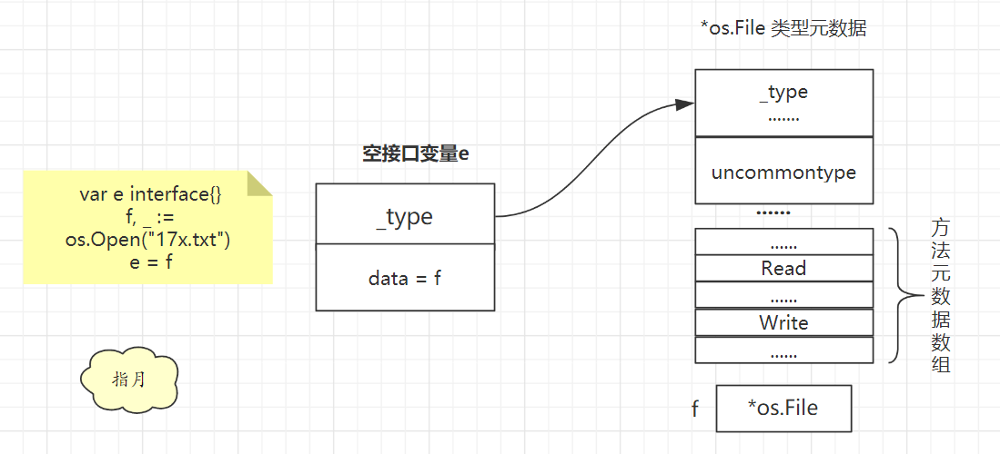
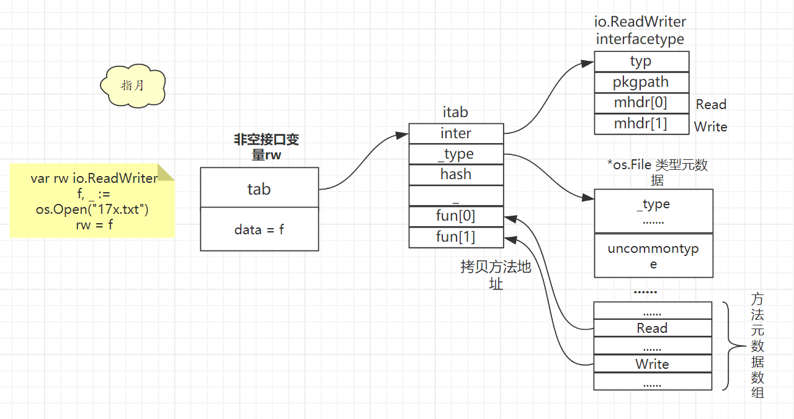

# Go 接口

## 1. 概述

Go 语言中的接口是一组方法的签名，它是 Go 语言的重要组成部分。

接口的本质是引入一个新的中间层，调用方可以通过接口与具体实现分离，解除上下游的耦合，上层的模块不再需要依赖下层的具体模块，只需要依赖一个约定好的接口。

除了解耦有依赖关系的上下游，接口还能够帮助我们隐藏底层实现，减少关注点。

定义接口需要使用 `interface` 关键字，在接口中我们只能定义方法签名，不能包含成员变量，一个常见的 Go 语言接口是这样的：

```go
type error interface {
	Error() string
}
```

如果一个类型需要实现 `error` 接口，那么它只需要实现 `Error() string` 方法，下面的 `RPCError` 结构体就是 `error` 接口的一个实现：

```go
type RPCError struct {
	Code    int64
	Message string
}

func (e *RPCError) Error() string {
	return fmt.Sprintf("%s, code=%d", e.Message, e.Code)
}
```

Go 语言中**接口的实现都是隐式的**，我们只需要实现 `Error() string` 方法就实现了 `error` 接口。


## 2. 空接口 eface

空接口可以接收任意类型的数据，只需要记录这个数据的地址的类型就可以了。具体定义如下：

```go
// src/runtime/runtime2.go 205行
type eface struct {
	_type *_type
	data  unsafe.Pointer
}
```

* **_type**：指向接口的动态类型元数据
* **data**：指向接口的动态值

> _type 结构体存储的类型信息中的通用部分。

空接口类型变量，在被赋值前 _type 和 data 都为 nil。

```go
var e interface{}
```

现在给 e 赋值，将 fd 赋值给 e。

```go
fd, _ := os.Open("17x.txt")
e = fd
```

fd 是一个 `*os.File`类型，根据类型系统章节内容可以知道，`*os.File` 类型的类型元数据也是由 _type 和 uncommontype 两部分组成。

赋值给空接口 e 之后，e 的_type就会指向`*os.File` 类型的类型元数据。

同时由于 fd 本身就是一个指针，所以 e 的 data 字段就会直接替换为 fd，不用再去取地址了。

找到类型元数据后再通过偏移量就可以找到**方法元数据数组**了，这里面就有我们常用的 Read 和 Write 这些方法的描述信息。





## 3. 非空接口 iface

非空接口就是有方法列表的接口类型，由**接口类型**和**动态类型**共同构成。

一个变量要赋值给非空接口变量，必须要实现该接口要求的所有方法才行。

具体定义如下：

```go
// src/runtime/runtime2.go 200行
type iface struct {
	tab  *itab
	data unsafe.Pointer
}
```

* **data**：指向接口的动态值
* **tab**：接口要求的方法列表和接口动态类型信息


```go
type itab struct {
	inter *interfacetype
	_type *_type // 动态类型
	hash  uint32 // 类型哈希值
	_     [4]byte
	fun   [1]uintptr // 方法地址数组
}
```

* **inter**：接口要求的方法列表，接口类型。
* **_type**：指向接口的动态类型元数据
* **hash**：从动态类型元数据中拷贝出来的类型哈希值，用于快速判断类型是否相等时使用。
* **fun**：记录这个动态类型实现的接口要求的方法的地址。

```go
type interfacetype struct {
	typ     _type
	pkgpath name
	mhdr    []imethod // 方法列表
}
```


声明一个非空接口类型的变量，赋值前 _type 和 data 也为nil。

```go
var rw io.ReadWriter
```

然后给这个变量赋值

```go
f, _ := os.Open("17x.txt")
rw = f
```

具体结构如下：




## 4. itab 复用

一旦接口类型 itab.inter确定了，动态类型 itab._type也确定了，那么 itab 的内容就不会改变了，所以**这个 itab 结构体是可以复用的**。


Go 语言会把用到的 itab 结构体缓存起来，并且以接口类型和动态类型的组合为 key,以 itab 结构体指针为 value，构造一个哈希表，用于存储与查询 itab 缓存信息。

这里用的哈希表和 map 底层的哈希表不一样，这里是一种更为简单的实现。

```go
// src/runtime/iface.go 22 行
type itabTableType struct {
	size    uintptr             // length of entries array. Always a power of 2.
	count   uintptr             // current number of filled entries.
	entries [itabInitSize]*itab // really [size] large
}
```

需要一个 itab 时会首先去哈希表中查找，

* 如果已经有对应的 itab 指针就直接拿来用；
* 若没有则创建一个 itab 结构体，然后添加到这个哈希表中

Key 值哈希方法如下

```go
func itabHashFunc(inter *interfacetype, typ *_type) uintptr {
	// compiler has provided some good hash codes for us.
	return uintptr(inter.typ.hash ^ typ.hash)
}
```

接口类型的类型哈希值与动态类型的类型哈希值进行异或运算。

这样，如果 Key 值能对应上说明这就是一个类型，所以可以复用 Value 中的 itab 结构体。


## 5. 参考

`https://www.bilibili.com/video/BV1hv411x7we?p=13`

`https://draveness.me/golang/docs/part2-foundation/ch04-basic/golang-interface/`