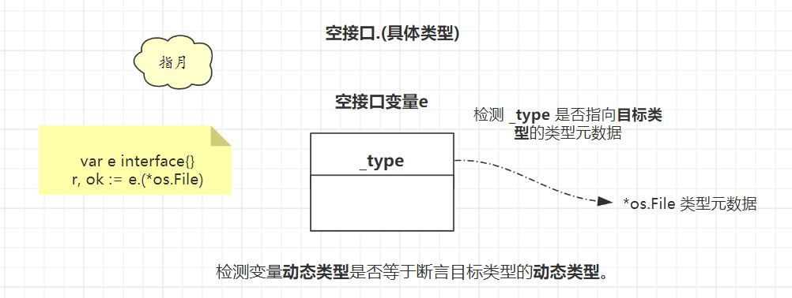
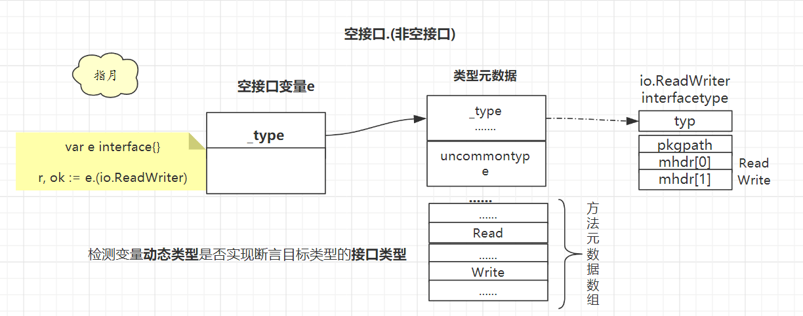
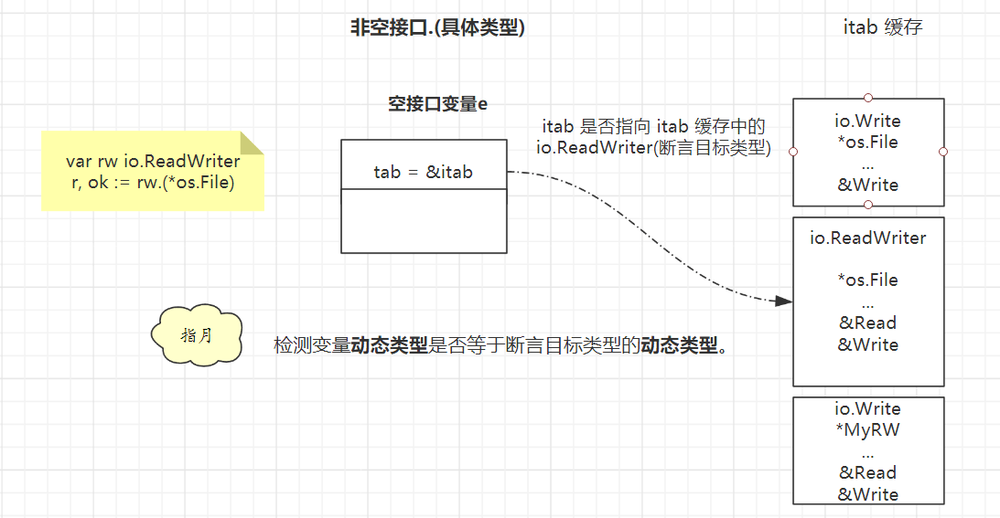

# Go 类型断言

## 1. 概述

类型分类：

* 抽象类型：空接口、非空接口
* 具体类型：int、string、slice、map ....

断言表达式：

* 类型断言作用在接口值之上，可以是空接口或非空接口；
* 而断言的目标类型可以是具体类型或非空接口类型。

这样一共就有4种断言组合。


## 2. 具体分析

### 1. 空接口.(具体类型)

**空接口只有动态类型，所以只要动态类型相同就能断言成功**。




```go
var e interface{}
r,ok := e.(*os.File)
```

这里只需要判定 e 的 _type 是否执行 *os.File 的类型元数据即可。

>  Go 语言里面每种类型的类型元数据都是唯一的，如果类型元数据相同那就是同一种类型。

如果这样赋值就能断言成功, ok 为 true，r 被赋值为 e 的动态值 f。

```go
func eface2Specific() {
	var e interface{}
	f, _ := os.Open("17x.txt")
	e = f
	r, ok := e.(*os.File)
	if ok {
		fmt.Println(r)
	}
}
```

反之则不行，ok 为 false，**r 被赋值为 *os.File 类型(断言的目标类型)的零值 nil**。

```go
func main() {
	var e interface{}
	f, _ := os.Open("17x.txt")
	e = "17x"
	r, ok := e.(*os.File)
	if ok {
		fmt.Println(r)
	}
}
```


### 2. 非空接口.(具体类型)

**这里需要判断非空接口的动态类型是否等于断言目标类型**。



下面的断言，要求 rw 接口类型为 io.ReadWriter，动态类型为*os.File。

```go
var rw io.ReadWriter
r, ok := rw.(*os.File)
```

只需要判定非空接口的 itab 是否指向 io.ReadWriter 的 itab 结构体即可。

这样赋值就能断言成功：

```go
func main() {
	var rw io.ReadWriter
	f, _ := os.Open("17x.txt")
	rw = f
	r, ok := rw.(*os.File)
	if ok {
		fmt.Println(r)
	}
}
```

这样则不行,接口类型对上了，但是 rw 的动态类型是  *MyRW，不是断言目标类型 *os.File。

```go
func main() {
	var rw io.ReadWriter
	rw = &MyRW{}
	r, ok := rw.(*os.File)
	if ok {
		fmt.Println(r)
	}
}

type MyRW struct {
}

func (rw *MyRW) Read(p []byte) (n int, err error)  { return 0, err }
func (rw *MyRW) Write(p []byte) (n int, err error) { return 0, err }
```


### 3. 空接口.(非空接口)

**这里需要判断空接口的动态类型是否实现了非空接口**。




```go
var e interface{}
r, ok := e.(io.ReadWriter)
```


* 1）先去 itab 缓存中找 **<断言目标值接口类型，空接口动态类型>** 这个 Key 对应的 itab 结构体；
* 2）如果存在则再次判断 itab.fun[0] 是否等于0
  * 等于 0 则断言失败
  * 不等于 0则断言成功
* 3）如果不存在则通过 _type 找到方法元数据，校验是否实现了接口类型，且把 itab 添加到哈希表，方便下次断言是比对。
  * 如果没有实现该接口类型还要把  itab.fun[0] 置为0

**为什么需要判断  itab.fun[0] 是否等于0？**

因为 Go 语言会把断言失败的类型组合也存到哈希表，同时把  itab.fun[0] 置为0，用以标识这里的动态类型并没有实现对应的接口。

**这样下次断言的时候找到 itab 发现  itab.fun[0]=0，就直接返回断言失败**。

### 4. 非空接口.(非空接口)

**这里同样是判断非空接口的动态类型是否实现了非空接口**。


```go
func iface2iface() {
   var w io.Writer
   f, _ := os.Open("17x.txt")
   w = f
   r, ok := w.(io.ReadWriter)
   if ok {
      fmt.Println(r)
   }
}
```

## 3. 小结

* 1）空接口.(具体类型)：动态类型等于目标类型的动态类型。
* 2）非空接口.(具体类型)：动态类型等于目标类型的动态类型。
* 3）空接口.(非空接口)：动态类型是否实现了非空接口的接口类型。
* 4）非空接口.(非空接口)：动态类型是否实现了非空接口的接口类型。

一句话总结：

**断言为具体类型则看动态类型是否相同，断言为非空接口则看是否实现了非空接口的接口类型。**


**类型断言的关键是明确接口的动态类型以及对应的类型实现了哪些方法**，明确这些的关键就是`类型元数据`以及空接口与非空接口的`数据结构`。