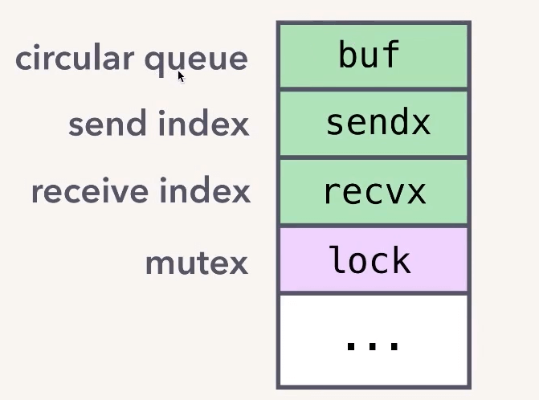
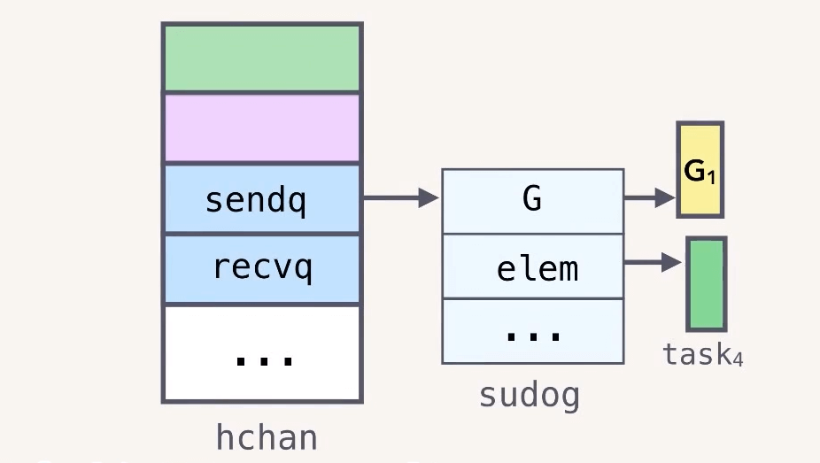
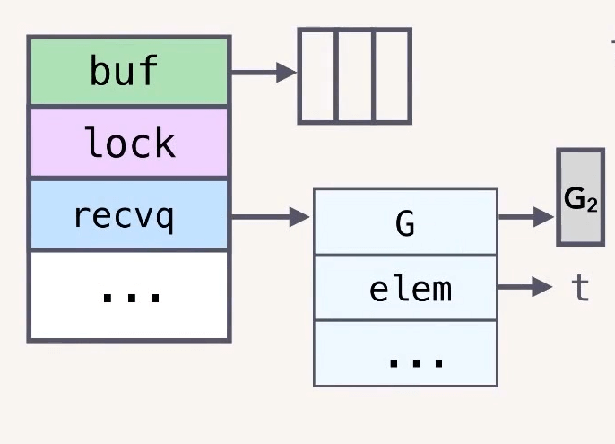

# Chan

> 本文中的源码分析基于 Go1.17.5

## 1. 概述

Chan 是 Go 里面的一种数据结构，具有以下特性：

- goroutine-safe，多个 goroutine 可以同时访问一个 channel 而不会出现并发问题
- 可以用于在 goroutine 之间存储和传递值
- 其语义是先入先出（FIFO）
- 可以导致 goroutine 的 block 和 unblock


### 内部结构

chan 内部结构如下图：



主要包含以下几个部分：

* 1）circular queue：循环队列，用于存储数据
* 2）send index 记录发送的位置
* 3）receive index 记录接收的位置
* 4）mutex 锁，用于实现 goroutine safe。

buf 的具体实现很简单，就是一个环形队列，使用 sendx 和 recvx 分别用来记录发送、接收的 offset，然后用一个 lock 互斥锁来确保不会出现数据竞争。

具体实现在 [runtime/chan.go](https://github.com/golang/go/blob/c6d9b38dd82fea8775f1dff9a4a70a017463035d/src/runtime/chan.go#L33-L52),完整结构如下：

```go
type hchan struct {
	qcount   uint           // total data in the queue
	dataqsiz uint           // size of the circular queue
	buf      unsafe.Pointer // points to an array of dataqsiz elements
	elemsize uint16
	closed   uint32
	elemtype *_type // element type
	sendx    uint   // send index
	recvx    uint   // receive index
	recvq    waitq  // list of recv waiters
	sendq    waitq  // list of send waiters

	// lock protects all fields in hchan, as well as several
	// fields in sudogs blocked on this channel.
	//
	// Do not change another G's status while holding this lock
	// (in particular, do not ready a G), as this can deadlock
	// with stack shrinking.
	lock mutex
}
```


### 创建 chan

chan 使用 make 进行初始化，第二个参数用于指定 chan 的缓冲区大小。

```go
ch := make(chan string, 3)
```

上述代码中 make 返回的 ch 实际上是一个指向 heap 中真正的 chan 对象的指针。

**chan（即 hchan 结构体） 默认会被分配在堆上，make 返回的只是一个指向该对象的指针**。

> 这也是为什么我们可以在函数之间传递 chan，而不是 chan 的指针。


### 发送和接收


```go
func main() {
    ch := make(chan Task, 3)
    for _,task := range hellaTasks {
    	taskCh <- task // 发送
    }
}

func worker(ch) {
    for {
        task:= <-taskCh // 接收
        process(task)
    }
}
```

main goroutine 发送 task 到 chan

worker goroutine 从 chan 中接收 task


具体**发送过程**如下：

* 1）acquire 加锁
* 2）enqueue
  * 将 task 对象**拷贝**到数组里
  * 如果发送的是指针，拷贝成本就是 8 字节，是值就是浅拷贝。
* 3）release 释放锁


**接收过程**：

* 1）acquire 加锁
* 2）dequeue
  * 将 task 对象从 数组 中 **拷贝**出来赋值给用户用于接收的对象
  * ` task:= <-taskCh`,比如这里就是拷贝出来赋值给 task
* 3）release 释放锁


整个过程中没有任何共享内存，数据都是通过 copy 进行传递,这遵循了 Go 并发设计中很核心的一个理念：

> Do not communicate by sharing memory; instead, share memory by communicating.


### 阻塞与唤醒

hchan 中的 buf 数组大小就是 make chan 时指定的大小。

当 buf 满之后再往 chan 中发送值就会阻塞。

> 复习一下 goroutine 调度：G 阻塞之后并不会阻塞 M。M 会先把这个 G 暂停(gopark)，然后把执行栈切换到 g0，g0 会执行 schedule() 函数，从当前 M 绑定的 P 中查找有没有可以执行的G，有就捞出来继续执行。


#### 先发后收

假设 chan 中已经有 3 个 task 了,然后我们再试着往里面发送一个

```go
 taskCh <- task 
```

runtime 会调用 gopark 将这个 goroutine(姑且称作G1) 切换到 wait 状态。

*什么时候会被唤醒呢？*

hchan 结构体中还有 sendq、recvq 两个列表，分别记录了等待发送或者接收的 goroutine，如下图所示：

```go
type hchan struct {
	recvq    waitq  // list of recv waiters
	sendq    waitq  // list of send waiters
}
type waitq struct {
	first *sudog
	last  *sudog
}
```

> 比如前面被阻塞的 G1 就会存入 sendq




假设此时 G2 从 chan 中取走一个消息

```go
 task:= <-taskCh 
```

G2 取走一个消息后就会找到 sendq 中的第一个对象，把待发送的 elem 直接写入 buf 数组。然后 调用 goready 把对应的 goroutine  G1 设置为 runnable 状态。


#### 先收后发

之前是先发送，后接收。现在看一下先接收后发送的情况。

```go
 task:= <-taskCh 
```

G2 直接从空的 chan 中取消息，同样会被阻塞,然后被写入到 hchan 的 recqv 中。

> 注意：elem 这里的 t 存的是 G2 栈里的地址。



然后 G1 往 chan 中发送一条消息。

```go
 taskCh <- task 
```

按照上面的逻辑应该是，将 task 写入 buf 数组后，，再把 recvq 中的第一个 goroutine G2 唤醒。

但是 Go 官方这里进行了优化，可以说是一个骚操作。因为 recvq 里的 elem 对象 t 存的就是**接收者的内存地址**。

所以我们可以直接把 G1 发送来的 task 写入 elem 对应的 t 里，即在 G1 里修改 G2 的栈对象。

> 因为这个时候 G2 还是 gopark，处于 waiting 状态，所以不会出问题。

> 正常情况下因为不知道两个线程谁先谁后，这样改肯定会出问题。但是在 go runtime 这里，肯定是 G2 先执行，满足 happen-before 所以不存在问题。

通过这样一个骚操作省去了发送和接收时的两次加解锁和内存拷贝。


### 特性实现原理

到此我们应该明白了 chan 的这些特性的实现原理

* **goroutine-safe**.
  * hchan **mutex**，通过加锁来避免数据竞争。
* 可以用于在 goroutine 之间存储和传递值，以及先入先出（FIFO）语义。
  * copying into and out of hchan **buffer**
* 可以导致 goroutine 的 block 和 unblock
  * 通过 **sudog queues** 来记录阻塞的 goroutine。
  * 通过 **runtime scheduler**(gopark, goready)来实现阻塞与唤醒。


## 2. 源码分析

chan 的所有相关代码都在`runtime/chan.go`中，还是比较好找的。


### 内部结构

```go
type hchan struct {
	qcount   uint           // total data in the queue
	dataqsiz uint           // size of the circular queue
	buf      unsafe.Pointer // points to an array of dataqsiz elements
	elemsize uint16
	closed   uint32
	elemtype *_type // element type
	sendx    uint   // send index
	recvx    uint   // receive index
	recvq    waitq  // list of recv waiters
	sendq    waitq  // list of send waiters

	// lock protects all fields in hchan, as well as several
	// fields in sudogs blocked on this channel.
	//
	// Do not change another G's status while holding this lock
	// (in particular, do not ready a G), as this can deadlock
	// with stack shrinking.
	lock mutex
}

type waitq struct {
	first *sudog
	last  *sudog
}
```


### 创建

在源码中通道的创建由 makechan 方法实现：

```go
func makechan(t *chantype, size int) *hchan {}
```

然后还有两个包装方法：

```go
//go:linkname reflect_makechan reflect.makechan
func reflect_makechan(t *chantype, size int) *hchan {
	return makechan(t, size)
}

func makechan64(t *chantype, size int64) *hchan {
	if int64(int(size)) != size {
		panic(plainError("makechan: size out of range"))
	}

	return makechan(t, int(size))
}
```

内部都是调用的 makechan 方法。

```go
func makechan(t *chantype, size int) *hchan {
	elem := t.elem

	// 编译器检查 typesize 和 align
	if elem.size >= 1<<16 {
		throw("makechan: invalid channel element type")
	}
	if hchanSize%maxAlign != 0 || elem.align > maxAlign {
		throw("makechan: bad alignment")
	}
	// 计算存放数据元素的内存大小以及是否溢出
	mem, overflow := math.MulUintptr(elem.size, uintptr(size))
	if overflow || mem > maxAlloc-hchanSize || size < 0 {
		panic(plainError("makechan: size out of range"))
	}

	var c *hchan
	switch {
	case mem == 0:
        // chan的size为0，或者每个元素占用的大小为0（比如struct{}大小就是0，不占空间）
        // 这种情况就不需要单独为buf分配空间
		c = (*hchan)(mallocgc(hchanSize, nil, true))
		c.buf = c.raceaddr()
	case elem.ptrdata == 0:
		// 如果队列中不存在指针，那么每个元素都需要被存储并占用空间，占用大小为前面乘法算出来的mem
        // 同时还要加上hchan本身占用的空间大小，加起来就是整个hchan占用的空间大小
		c = (*hchan)(mallocgc(hchanSize+mem, nil, true))
        // 把buf指针指向空的hchan占用空间大小的末尾
		c.buf = add(unsafe.Pointer(c), hchanSize)
	default:
		 // 如果chan中的元素是指针类型的数据，为buf单独开辟mem大小的空间，用来保存所有的数据
		c = new(hchan)
		c.buf = mallocgc(mem, elem, true)
	}
     // 元素大小、类型以及缓冲区大小赋值
	c.elemsize = uint16(elem.size)
	c.elemtype = elem
	c.dataqsiz = uint(size)
     // 初始化锁
	lockInit(&c.lock, lockRankHchan)

	return c
}

```

具体流程如下：

* 1）首先是编译器检查，包括通道元素类型的size以及通道和元素的对齐，然后计算存放数据元素的内存大小以及是否溢出

* 2）然后根据不同条件进行内存分配
  * 总体的原则是：总内存大小 = hchan需要的内存大小 + 元素需要的内存大小
  * 队列为空或元素大小为0：只需要开辟的内存空间为hchan本身的大小
  * 元素不是指针类型：需要开辟的内存空间=hchan本身大小+每个元素的大小*申请的队列长度
  * 元素是指针类型：这种情况下buf需要单独开辟空间，buf占用内存大小为每个元素的大小*申请的队列长度

3）最后则对chan的其他字段赋值


### 发送

发送数据到channel时，直观的理解是将数据放到chan的环形队列中，不过go做了一些优化：

* 先判断是否有等待接收数据的groutine，如果有，直接将数据发给Groutine，唤醒groutine，就不放入队列中了。
  * 这样省去了两次内存拷贝和加锁的开销
* 当然还有另外一种情况就是：队列如果满了，那就只能放到队列中等待，直到有数据被取走才能发送。

#### 调用链

chan 的发送逻辑涉及到5个方法：

```go
func selectnbsend(c *hchan, elem unsafe.Pointer) (selected bool) {}
func chansend1(c *hchan, elem unsafe.Pointer) {…}
func chansend(c *hchan, ep unsafe.Pointer, block bool, callerpc uintptr) bool {…}
func send(c *hchan, sg *sudog, ep unsafe.Pointer, unlockf func(), skip int) {…}
func sendDirect(t *_type, sg *sudog, src unsafe.Pointer) {…}
```

chansend1 方法是 go编译代码中`c <- x`这种写法的入口点，即当我们编写代码` c <- x`其实就是调用此方法。
这四个方法的调用关系：`chansend1 -> chansend -> send -> sendDirect`

具体发送逻辑在`chansend`这个方法里，然后真正使用的方法其实是对该方法的一层包装。

```go
func chansend1(c *hchan, elem unsafe.Pointer) {
	chansend(c, elem, true, getcallerpc())
}

func selectnbsend(c *hchan, elem unsafe.Pointer) (selected bool) {
	return chansend(c, elem, false, getcallerpc())
}
```


#### chansend 

```go
func chansend(c *hchan, ep unsafe.Pointer, block bool, callerpc uintptr) bool {
    // 判断 channel 是否为 nil
	if c == nil {
		if !block {// 如果非阻塞，直接返回 false
			return false
		}
        // 当向 nil channel 发送数据时，会调用 gopark
		// 而 gopark 会将当前的 goroutine 休眠，并用过第一个参数的 unlockf 来回调唤醒
		// 但此处传递的参数为 nil，因此向 channel 发送数据的 goroutine 和接收数据的 goroutine 都会阻塞，进而死锁
		gopark(nil, nil, waitReasonChanSendNilChan, traceEvGoStop, 2)
		throw("unreachable")
	}

	if raceenabled {
		racereadpc(c.raceaddr(), callerpc, funcPC(chansend))
	}

	// 对于不阻塞的 send，快速检测失败场景
	// 如果 channel 未关闭且 channel 没有多余的缓冲空间。这可能是：
	// 1. channel 是非缓冲型的，且等待接收队列里没有 goroutine
	// 2. channel 是缓冲型的，但循环数组已经装满了元素
	// 主要用于 select 语句中，涉及到指令重排队+可观测性
	if !block && c.closed == 0 && full(c) {
		return false
	}

	var t0 int64
	if blockprofilerate > 0 {
		t0 = cputicks()
	}
	// 加锁,避免竞争
	lock(&c.lock)
	// 检查 channel 是否已关闭，不允许向关闭的 channel 发送数据
	if c.closed != 0 {
		unlock(&c.lock)
		panic(plainError("send on closed channel")) // 直接panic
	}
	// 从 recvq 队首取出一个接收者，如果存在接收者，就绕过环形队列（buf）直接把 ep 拷贝给 sg，并释放锁
    // 这就是前面提到的，官方做的一个优化，如果有goroutine在等待就直接把数据给该goroutine，没必要在写到buf，然后接收者又从buf中拷贝出来
	if sg := c.recvq.dequeue(); sg != nil {
		send(c, sg, ep, func() { unlock(&c.lock) }, 3)
		return true
	}
    // 到这里说明当前没有等待状态的接收者
	// 如果环形队列还未满
	if c.qcount < c.dataqsiz {
        // 拿到 sendx 索引的位置
		qp := chanbuf(c, c.sendx)
		if raceenabled {
			racenotify(c, c.sendx, nil)
		}
        // 直接把数据从 qp 拷贝到 qp，就是把数据拷贝到环形队列中
		typedmemmove(c.elemtype, qp, ep)
        // 维护 snedx 的值，因为是环形队列，所以到最大值时就重置为0
		c.sendx++
		if c.sendx == c.dataqsiz {
			c.sendx = 0
		}
        //qcount即当前chan中的元素个数
		c.qcount++
		unlock(&c.lock)
		return true
	}
    // 到这里说明环形队列已经满了
	// 如果还是要非阻塞的方式发送，就只能返回错误了
	if !block {
		unlock(&c.lock)
		return false
	}
	// 到这里说明缓存队列满了，然后调用法指定是阻塞方式进行发送
	// channel 满了，发送方会被阻塞。接下来会构造一个 sudog
	gp := getg()	// 获取当前 goroutine
	mysg := acquireSudog()// 从对象池获取 sudog
	mysg.releasetime = 0
	if t0 != 0 {
		mysg.releasetime = -1
	}
    // 把发送的数据(ep)、当前g(gp)、已经当前这个chan(c)都存到sudog中
	mysg.elem = ep
	mysg.waitlink = nil
	mysg.g = gp
	mysg.isSelect = false
	mysg.c = c
    // 保存当前 sudog，下面要用到做校验
	gp.waiting = mysg
	gp.param = nil
     // 把这个sudog存入sendq队列
	c.sendq.enqueue(mysg)
	atomic.Store8(&gp.parkingOnChan, 1)
    // 调用gopark，挂起当前的 g，将当前的 g 移出调度器的队列
	gopark(chanparkcommit, unsafe.Pointer(&c.lock), waitReasonChanSend, traceEvGoBlockSend, 2)
    // 等到有接收者从chan中取值的时候，这个发送的g又会被重新调度，然后从这里开始继续执行
	KeepAlive(ep)

	// 检验是否为当前的 sudog
	if mysg != gp.waiting {
		throw("G waiting list is corrupted")
	}
	gp.waiting = nil
	gp.activeStackChans = false
    // 这里sudog中的success表示的是当前这个通道上是否进行过通信
    // 为 true 则说明是真正的唤醒，chan上有活动（有数据写进来，或者有数据被读取出去）
    // 为 false 则说明是假的唤醒，即当前唤醒是否关闭chan导致的
    // 这里主要根据这个值判断chan是否被关闭了
	closed := !mysg.success
	gp.param = nil
	if mysg.releasetime > 0 {
		blockevent(mysg.releasetime-t0, 2)
	}
	mysg.c = nil
    // 将 sudog 放回对象池
	releaseSudog(mysg)
	if closed {
        // 如果chan被关闭了也是直接panic
		if c.closed == 0 {
			throw("chansend: spurious wakeup")
		}
		panic(plainError("send on closed channel"))
	}
	return true
}

```

核心逻辑

* 如果recvq不为空，从recvq中取出一个等待接收数据的Groutine，直接将数据发送给该Groutine
* 如果recvq为空，才将数据放入buf中
* 如果buf已满，则将要发送的数据和当前的Groutine打包成Sudog对象放入sendq，并将groutine置为等待状态
* 等goroutine再次被调度时程序继续执行

#### send 

然后追踪一下 send 方法：

```go
func send(c *hchan, sg *sudog, ep unsafe.Pointer, unlockf func(), skip int) {
	// 忽略 race 检查..
	if sg.elem != nil {
        // 直接拷贝到接受者内存，使用写屏障
		sendDirect(c.elemtype, sg, ep)
		sg.elem = nil
	}
	gp := sg.g // 取出sudog中记录的g，这里的g就是被阻塞接收者
	unlockf()
	gp.param = unsafe.Pointer(sg) // 更新接收者g的param字段，在recv方法中会用到
	sg.success = true
	if sg.releasetime != 0 {
		sg.releasetime = cputicks()
	}
    // 最后把被阻塞的接收者g唤醒
	goready(gp, skip+1)
}
```

#### sendDirect

继续看sendDirect 方法：

```go
func sendDirect(t *_type, sg *sudog, src unsafe.Pointer) {
	// src 在当前 goroutine 的栈上，dst 是另一个 goroutine 的栈
    // 直接进行内存"搬迁"
	// 如果目标地址的栈发生了栈收缩，当我们读出了 sg.elem 后
	// 就不能修改真正的 dst 位置的值了
	// 因此需要在读和写之前加上一个屏障
	dst := sg.elem
	typeBitsBulkBarrier(t, uintptr(dst), uintptr(src), t.size)
 	// 拷贝内存
	memmove(dst, src, t.size)
}
```

这里涉及到一个 goroutine 直接写另一个 goroutine 栈的操作，一般而言，不同 goroutine 的栈是各自独有的。而这也违反了 GC 的一些假设。为了不出问题，写的过程中增加了写屏障，保证正确地完成写操作。这样做的好处是减少了一次内存 copy：不用先拷贝到 channel 的 buf，直接由发送者到接收者，没有中间商赚差价，效率得以提高，完美。


### 接收

从channel读取数据的流程和发送的类似，基本是发送操作的逆操作。

这里同样存在和send一样的优化：从channel读取数据时，不是直接去环形队列中去数据，而是先判断是否有等待发送数据的groutine。如果有，直接将groutine出队列，取出数据返回，并唤醒groutine。如果没有等待发送数据的groutine，再从环形队列中取数据。


#### 调用链

chan的接收涉及到7个方法：

```go
func reflect_chanrecv(c *hchan, nb bool, elem unsafe.Pointer) (selected bool, received bool) {}
func selectnbrecv(elem unsafe.Pointer, c *hchan) (selected, received bool) {}
func chanrecv1(c *hchan, elem unsafe.Pointer) {…}，
func chanrecv2(c *hchan, elem unsafe.Pointer) (received bool) {…}
func chanrecv(c *hchan, ep unsafe.Pointer, block bool) (selected, received bool) {…}
func recv(c *hchan, sg *sudog, ep unsafe.Pointer, unlockf func(), skip int) {…}
func recvDirect(t *_type, sg *sudog, dst unsafe.Pointer) {…}
```

按照发送时的套路可知，只有 chanrecv 是具体逻辑，上面几个都是包装方法：

```go
//go:linkname reflect_chanrecv reflect.chanrecv
func reflect_chanrecv(c *hchan, nb bool, elem unsafe.Pointer) (selected bool, received bool) {
	return chanrecv(c, elem, !nb)
}
func selectnbrecv(elem unsafe.Pointer, c *hchan) (selected, received bool) {
	return chanrecv(c, elem, false)
}
//go:nosplit
func chanrecv1(c *hchan, elem unsafe.Pointer) {
	chanrecv(c, elem, true)
}

//go:nosplit
func chanrecv2(c *hchan, elem unsafe.Pointer) (received bool) {
	_, received = chanrecv(c, elem, true)
	return
}
```

接收操作有两种写法，一种带 “ok”，反应 channel 是否关闭；

一种不带 “ok”，这种写法，当接收到相应类型的零值时无法知道是真实的发送者发送过来的值，还是 channel 被关闭后，返回给接收者的默认类型的零值。

两种写法，都有各自的应用场景。

经过编译器的处理后，这两种写法最后对应源码里的就是不带`ok`的`chanrecv1`和带`ok`的`chanrecv2`这两个函数。


#### chanrecv

```go
// chanrecv 函数接收 channel c 的元素并将其写入 ep 所指向的内存地址。
// 如果 ep 是 nil，说明忽略了接收值。比如 <-ch 这样，没有接收取到的值
// 如果 block == false，即非阻塞型接收，在没有数据可接收的情况下，返回 (false, false)
// 否则，如果 c 处于关闭状态，将 ep 指向的地址清零，返回 (true, false)
// 否则，用返回值填充 ep 指向的内存地址。返回 (true, true)
// 如果 ep 非空，则应该指向堆或者函数调用者的栈
func chanrecv(c *hchan, ep unsafe.Pointer, block bool) (selected, received bool) {
	// 如果是一个 nil 的 channel	
	if c == nil {
        // 如果不阻塞，直接返回 (false, false)
		if !block {
			return
		}
        // 否则，接收一个 nil 的 channel，调用gopark将goroutine 挂起
		gopark(nil, nil, waitReasonChanReceiveNilChan, traceEvGoStop, 2)
		throw("unreachable") // 被挂起之后不会执行到这一句
	}
	// 这块主要用在 select 语句中，先大概了解下，比较难懂。。。
	// 快速路径: 在不需要锁的情况下检查失败的非阻塞操作
	// 注意到 channel 不能由已关闭转换为未关闭，则失败的条件是：
	// 1. channel 是非缓冲型的，recvq 队列为空
	// 2. channel 是缓冲型的，buf 为空
	if !block && empty(c) {
		// 此处的 c.closed 必须在条件判断之后进行验证，
        // 因为指令重排后，如果先判断 c.closed，得出 channel 未关闭，无法判断失败条件中channel 是已关闭还是未关闭（从而需要 atomic 操作）
		if atomic.Load(&c.closed) == 0 {
			return
		}
		// 再次检查 channel 是否为空
		if empty(c) {
			// 接收者不为 nil 时返回该类型的零值
			if ep != nil {
				// typedmemclr 逻辑是根据类型清理相应地址的内存
				typedmemclr(c.elemtype, ep)
			}
            // 返回（true,fasle）
            // 返回值1--true：表示被 select case 选中，
            // 返回值2--fasle 表示是否正常收到数据
			return true, false
		}
	}

	var t0 int64
	if blockprofilerate > 0 {
		t0 = cputicks()
	}
	// 加锁，保证并发安全
	lock(&c.lock)
	// channel 已关闭，并且循环数组 buf 里没有元素
	// 这里可以处理非缓冲型关闭 和 缓冲型关闭但 buf 无元素的情况
	// 也就是说即使是关闭状态，但在缓冲型的 channel，
	// buf 里有元素的情况下还能接收到元素
	if c.closed != 0 && c.qcount == 0 {
		unlock(&c.lock)
		if ep != nil {
			typedmemclr(c.elemtype, ep)
		}
		return true, false
	}
	// 等待发送队列里有 goroutine 存在，说明 buf 是满的
	// 这有可能是：
	// 1. 非缓冲型的 channel
	// 2. 缓冲型的 channel，但 buf 满了
	// 针对 1，直接进行内存拷贝（从 sender goroutine -> receiver goroutine）
	// 针对 2，接收到循环数组头部的元素，并将发送者的元素放到循环数组尾部
	if sg := c.sendq.dequeue(); sg != nil {
		recv(c, sg, ep, func() { unlock(&c.lock) }, 3)
		return true, true
	}
	// chan的buf 里有元素，可以正常接收
	if c.qcount > 0 {
		// 直接从循环数组里找到要接收的元素
		qp := chanbuf(c, c.recvx)
        // ep != nil表示代码里，没有忽略要接收的值
        // 即接收的代码不是 "<- ch"，而是 "val <- ch"这种，ep 指向 val
		if ep != nil {
			typedmemmove(c.elemtype, ep, qp)
		}
        // 清理掉循环数组里相应位置的值
		typedmemclr(c.elemtype, qp)
        // 维护接收游标
		c.recvx++
		if c.recvx == c.dataqsiz {
			c.recvx = 0
		}
        // buf 数组里的元素个数减 1
		c.qcount--
        // 处理完成，解锁返回
		unlock(&c.lock)
		return true, true
	}
   
	// 到这里说明chan的buf里没有数据了，如果是非阻塞接收就直接返回了
	if !block {
		unlock(&c.lock)
		return false, false
	}

	// 接下来就是要被阻塞的情况了
    // 和发送类似的，构造一个 sudog
	gp := getg()
	mysg := acquireSudog()
	mysg.releasetime = 0
	if t0 != 0 {
		mysg.releasetime = -1
	}
    // 这里需要注意一下，ep就是我们用来接收值得对象
    // 这里把ep直接存到sudog.elem字段上
	mysg.elem = ep 
	mysg.waitlink = nil
	gp.waiting = mysg // 这个waiting同样是用来唤醒后做校验的
	mysg.g = gp
	mysg.isSelect = false
	mysg.c = c
	gp.param = nil
    // 加入到chan的recvq队列里
	c.recvq.enqueue(mysg)
	atomic.Store8(&gp.parkingOnChan, 1)
    // 将当前 goroutine 挂起
	gopark(chanparkcommit, unsafe.Pointer(&c.lock), waitReasonChanReceive, traceEvGoBlockRecv, 2)

	// 唤醒后，继续往下执行
    
    // 同样是进行数据校验
	if mysg != gp.waiting {
		throw("G waiting list is corrupted")
	}
	gp.waiting = nil
	gp.activeStackChans = false
	if mysg.releasetime > 0 {
		blockevent(mysg.releasetime-t0, 2)
	}
    // 又是mysg.success，如果chan活动过就是true，否则是false
	success := mysg.success
	gp.param = nil
	mysg.c = nil
	releaseSudog(mysg)// 将 sudog 放回对象池
    // 到这里如果goroutine被正常唤醒肯定是可以取到数据的
    // 因为recvq的数据是由发送的时候直接copy过来了
	return true, success
}

```

#### recv 

继续追踪一下 recv 方法

```go
func recv(c *hchan, sg *sudog, ep unsafe.Pointer, unlockf func(), skip int) {
    // 非缓冲型的 channel
	if c.dataqsiz == 0 {
        // 并且需要接收值
		if ep != nil {
			// 直接进行内存拷贝
			recvDirect(c.elemtype, sg, ep)
		}
	} else {
        // 需要注意：进入recv方法说明sendq队列里是有值的
		// 那么对缓冲型的 channel来说，sendq有值就意味着buf满了
        // 也就是 recvx和sendx重合了都
        // 这里要做的就是先从buf中读一个数据出来，然后再把发送者发送的数据写入buf
		qp := chanbuf(c, c.recvx)
		// 将接收游标处的数据拷贝给接收者
		if ep != nil {
			typedmemmove(c.elemtype, ep, qp)
		}
		// 从发送者把数据写入 recvx
		typedmemmove(c.elemtype, qp, sg.elem)
        // 然后修改 recvx和sendx 的位置
		c.recvx++
		if c.recvx == c.dataqsiz {
			c.recvx = 0
		}
		c.sendx = c.recvx // c.sendx = (c.sendx+1) % c.dataqsiz
	}
	sg.elem = nil
	gp := sg.g
    // 解锁
	unlockf()
	gp.param = unsafe.Pointer(sg)
	sg.success = true
	if sg.releasetime != 0 {
		sg.releasetime = cputicks()
	}
    // 最后唤醒发送的 goroutine
	goready(gp, skip+1)
}
```


#### recvDirect

再看一下 recvDirect：

```go
func recvDirect(t *_type, sg *sudog, dst unsafe.Pointer) {
	// 如果是非缓冲型的，就直接从发送者的栈拷贝到接收者的栈。
    // 和sendDirect一样的需要加内存屏障
	src := sg.elem
	typeBitsBulkBarrier(t, uintptr(dst), uintptr(src), t.size)
	memmove(dst, src, t.size)
}
```


#### 小结

看了接收部分代码后，整个流程就更新清晰了。

根据前面的发送逻辑可以知道，不管是接收还是发送只要被阻塞了，加入到了 sendq 或者recvq 之后，那么后续的发送或者接收都是由对方进行处理了。

比如接收被阻塞了，当前g构成成一个sudog然后加入到recvq，接着调用了 gopark就已经阻塞了，啥也干不了了。

只能等到有发送者来的时候直接从recvq里把这个sudog取出来，并且直接把要他发送的值拷贝到这个sudog.elem字段上，也就是调用chan接收方法是传进来的哪个值.
最后发送方再调用goready把这个g给唤醒，这样再把剩下的逻辑走完，这个被阻塞了一会的接收者就可以拿着数据返回了。


核心逻辑：

* 1）如果有等待发送数据的groutine，从sendq中取出一个等待发送数据的Groutine，取出数据
* 2）如果没有等待的groutine，且环形队列中有数据，从队列中取出数据
* 3）如果没有等待的groutine，且环形队列中也没有数据，则阻塞该Groutine，并将groutine打包为sudogo加入到recevq等待队列中


### 3. 关闭

#### 调用链

close 就比较简单了，相关方法就两个：

```go
//go:linkname reflect_chanclose reflect.chanclose
func reflect_chanclose(c *hchan) {
	closechan(c)
}
func closechan(c *hchan){}
```

其中一个还是包装方法，真正逻辑就在 clsoechan 里。

> 每个逻辑都有一个 reflect_xxx 的方法，根据名字猜测是反射的时候用的。


#### closechan

```go
func closechan(c *hchan) {
    // 关闭一个nil的chan直接panic
	if c == nil {
		panic(plainError("close of nil channel"))
	}
	// 同样是先加锁
	lock(&c.lock)
    // 判断一下是否被关闭过了，关闭一个已经关闭的chan也是直接panic
	if c.closed != 0 {
		unlock(&c.lock)
		panic(plainError("close of closed channel"))
	}
	// 修改closed标记为，表示chan已经被关闭了
	c.closed = 1
	// gList 是通过 g.schedlink 链接 G 的列表，一个 G 只能是一次在一个 gQueue 或 gList 上
	// gList 模拟的是栈操作（FILO）
	// gQueue 模拟的是队列操作（FIFO）
	var glist gList

	// 释放所有的接收者
	for {
		sg := c.recvq.dequeue()
        // sg == nil，表示接收队列已为空，跳出循环
		if sg == nil {
			break
		}
        // 如果 elem 不为空说明未忽略接收值，赋值为该类型的零值
		if sg.elem != nil {
			typedmemclr(c.elemtype, sg.elem)
			sg.elem = nil
		}
		if sg.releasetime != 0 {
			sg.releasetime = cputicks()
		}
		gp := sg.g
		gp.param = unsafe.Pointer(sg)
		sg.success = false
		if raceenabled {
			raceacquireg(gp, c.raceaddr())
		}
		glist.push(gp)
	}

	// 释放所有的发送者
	for {
		sg := c.sendq.dequeue()
		if sg == nil {
			break
		}
		sg.elem = nil
		if sg.releasetime != 0 {
			sg.releasetime = cputicks()
		}
		gp := sg.g
		gp.param = unsafe.Pointer(sg)
		sg.success = false
		if raceenabled {
			raceacquireg(gp, c.raceaddr())
		}
		glist.push(gp)
	}
	unlock(&c.lock)

	// 循环读取 glist 里面的数据，挨个唤醒
	for !glist.empty() {
		gp := glist.pop()
		gp.schedlink = 0
		goready(gp, 3)
	}
}

```


核心流程：

- 设置关闭状态
- 唤醒所有等待读取chanel的协程
- 所有等待写入channel的协程，抛出异常


## 3. 小结

**存储实现**

chan 内部使用一个环形队列实现存储，使用 sendx或recvx进行发送或读取。、

**并发安全**

使用 mutex 实现并发安全。

**调度**

使用 sendq 和 recvq来暂存由于发送或接收而被阻塞的goroutine。

send/recv的时候都会判断recvq/sendq是否有goroutine正在等待，有则优先处理。

**发送**的时候发现recvq有goroutine正在等待，说明此时chan的buf是空的，或者chan是个非缓存chan，根本没有buf。

对于发送来说，不管是buf为空还是chan没有buf都是一样的处理逻辑。

此时会直接从recvq中取出第一个g，然后把本次要发送的数据直接写给这个接收者g，并调用goready把这个g唤醒。

**接收**

如果接收的时候发现sendq有goroutine正在等待，说明buf满了，或者chan是个非缓存chan，根本没有buf。

对于接收来说buf满了或者chan没有buf二者的处理逻辑就不太一样了。

> 因为需要保证顺序,buf满了就不能直接去读sender的数据了，只能从buf中去。

如果是buf满了：那么会先从buf中读一个值出来(腾一个位置出来)，然后把sender发送的值写入buf，并唤醒这个sender g。

如果是没有buf的无缓存chan：那就直接把sender要发送的数据取出来，作为本次取到的数据，然后唤醒sender g。


通过研究底层的源码实现才发现，chan 其实没有那么复杂，底层实现逻辑很清晰。

> 如果有调度基础的话，看起来就比较简单。

本文通过图文并茂的方式整理了底层的逻辑，包括创建channel，发送数据，接收数据等。当然，里面还涉及到调度等知识，后面专门再整理一篇文章加以分析。


## 4. 参考

[understanding-channels-kavya-joshi](https://about.sourcegraph.com/go/understanding-channels-kavya-joshi/)

[图解Golang channel源码](https://juejin.cn/post/6875325172249788429)

[Go夜读-第 56 期 channel & select 源码分析](https://github.com/talkgo/night/issues/450)

[Go源码阅读 | channel 设计与实现](https://maratrix.cn/post/2020/08/25/go-channel-source-read/)
