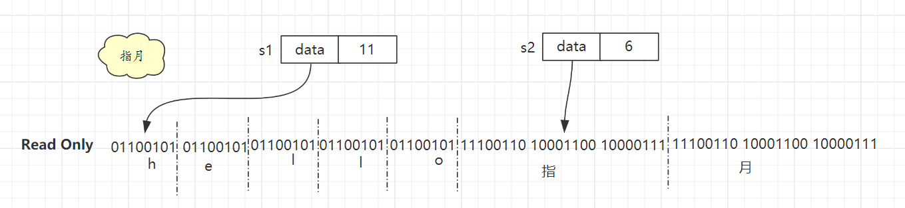

# String

## 1. 概述

> 以下分析基于 Go1.14 版本。

String 具体实现如下

```go
// reflect/value.go 1954行
type StringHeader struct {
	Data uintptr
	Len  int
}
```

* Data：指向 真正存储字符串内容的地址
* Len：字符串的长度（字节）

通过起始地址换个字符串长度就可以准确定位整个字符串了。

> Go 语言没有用 C 语言中的`\0`标志表示字符串结束，而是为 String 增加了 Len 字段。


## 2. 注意事项

### 1. 不可变

**Go 语言中认为字符串是不可变的，所以分配在只读内存段。**

虽然可以通过如下方式读取，但是不可修改

```go
func main() {
	str := "hello指月"
	fmt.Printf("%c \n", str[1]) // e
}
```

要修改可以直接给变量赋新值，这样 string 中的 str 字段就会指向新的地址。

不过也可以通过强转为 byte slice 的方式进行修改。同样会重新分配一段内存，并拷贝原来的内容。

> 使用 unsafe 包中的方法可以让 slice 依旧使用原来的这段内存，避免内存拷贝。不过这样转换类型后也无法修改这段只读内存的内容。

```go
func main() {
	str := "hello指月"
	bs:=[]byte(str)
	bs[1]='z'
	fmt.Printf("%c \n", bs[1]) // z
}
```


### 2. 共享内存

不同字符串可以共享同一个字符串内容，如果其中一个字符串修改了底层字符串内容，这样的影响是不可预测的。



比如图中的 s1（hello指月） 和 s2（指月）就共享了底层的字符串内容。

如果其中一个修改后都会导致，其他字符串类容被修改。

> 所以字符串才被设定为不可修改，分配在只读内存段上。


## 3. 与 bytes 互转

```go
func String2Bytes(str string) []byte {
	sh := (*reflect.SliceHeader)(unsafe.Pointer(&str))
	// slice 比 string 多一个 cap 属性 这里给 cap 单独赋值
	sh.Cap = sh.Len
	return *(*[]byte)(unsafe.Pointer(sh))
}

func Bytes2String(buf []byte) string {
	return *(*string)(unsafe.Pointer(&buf))
}
```

Go 语言标准库中 strings.Builder 就使用到了 unsafe.Pointer 来提升效率。

```go
// strings/builder.go 47 行
func (b *Builder) String() string {
	return *(*string)(unsafe.Pointer(&b.buf))
}
```


性能测试

```go
Benchmark_NormalBytes2String-6          33555104                36.7 ns/op            64 B/op          1 allocs/op
Benchmark_UnsafeByte2String-6           1000000000               0.268 ns/op           0 B/op          0 allocs/op
Benchmark_NormalString2Bytes-6          1000000000               0.271 ns/op           0 B/op          0 allocs/op
Benchmark_UnsafeString2Bytes-6          1000000000               0.268 ns/op           0 B/op          0 allocs/op
```

Byte2String 的时候 unsafe 包会有明显的优势，String2Bytes的时候二者基本一致。

[]byte(string)的实现

```go
// runtime/string.go 155行
// The constant is known to the compiler.
// There is no fundamental theory behind this number.
const tmpStringBufSize = 32

type tmpBuf [tmpStringBufSize]byte

func stringtoslicebyte(buf *tmpBuf, s string) []byte {
    var b []byte
    if buf != nil && len(s) <= len(buf) {
        *buf = tmpBuf{}
        b = buf[:len(s)]
    } else {
        b = rawbyteslice(len(s))
    }
    copy(b, s)
    return b
}

// rawbyteslice allocates a new byte slice. The byte slice is not zeroed.
func rawbyteslice(size int) (b []byte) {
    cap := roundupsize(uintptr(size))
    p := mallocgc(cap, nil, false)
    if cap != uintptr(size) {
        memclrNoHeapPointers(add(p, uintptr(size)), cap-uintptr(size))
    }

    *(*slice)(unsafe.Pointer(&b)) = slice{p, size, int(cap)}
    return
}
```

长度超过 32 的时候就需要通过 mallocgc() 分配一块新内存，然后使用 copy() 复制数据了。

string([]byte)的实现

```go
// runtime/string.go 75行
// Buf is a fixed-size buffer for the result,
// it is not nil if the result does not escape.
func slicebytetostring(buf *tmpBuf, b []byte) (str string) {
    l := len(b)
    if l == 0 {
        // Turns out to be a relatively common case.
        // Consider that you want to parse out data between parens in "foo()bar",
        // you find the indices and convert the subslice to string.
        return ""
    }
  // 如果开启了竞态检测 -race
    if raceenabled {
        racereadrangepc(unsafe.Pointer(&b[0]),
            uintptr(l),
            getcallerpc(),
            funcPC(slicebytetostring))
    }
  // 如果开启了memory sanitizer -msan
    if msanenabled {
        msanread(unsafe.Pointer(&b[0]), uintptr(l))
    }
    if l == 1 {
        stringStructOf(&str).str = unsafe.Pointer(&staticbytes[b[0]])
        stringStructOf(&str).len = 1
        return
    }

    var p unsafe.Pointer
    if buf != nil && len(b) <= len(buf) {
        p = unsafe.Pointer(buf)
    } else {
        p = mallocgc(uintptr(len(b)), nil, false)
    }
    stringStructOf(&str).str = p
    stringStructOf(&str).len = len(b)
  // 拷贝字节数组至字符串
    memmove(p, (*(*slice)(unsafe.Pointer(&b))).array, uintptr(len(b)))
    return
}

// 实例stringStruct对象
func stringStructOf(sp *string) *stringStruct {
    return (*stringStruct)(unsafe.Pointer(sp))
}
```

同样的，当数组长度超过32时，同样需要调用 mallocgc() 分配一块新内存。最后通过 memmove() 完成拷贝。


**小结**

Go 语言也是在安全和性能之间选择了安全，不过这点性能损失也非常小。

当不确定会不会出现安全问题的时候就用标准的转换方式。

在对性能有极高要求，且没有安全隐患（即确定数据是只读的，后续不会有修改操作），就可以使用 unsafe 包。


## 4. 字符串拼接

字符串拼接有多种方式：

* 1）直接相加
* 2）fmt.Sprintf()
* 3）strings.Builder
* 4）bytes.Buffer


测试结果如下：

```sh
# 2次
BenchmarkSprintf-6               5544774               214 ns/op              32 B/op          3 allocs/op
BenchmarkStringBuilder-6        40105342                30.9 ns/op             8 B/op          1 allocs/op
BenchmarkBytesBuf-6             24064540                51.1 ns/op            64 B/op          1 allocs/op
BenchmarkStringAdd-6            30062755                40.6 ns/op             2 B/op          1 allocs/op
# 100次
BenchmarkSprintf-6                 66108             16317 ns/op           12178 B/op        297 allocs/op
BenchmarkStringBuilder-6         1471501               828 ns/op             504 B/op          6 allocs/op
BenchmarkBytesBuf-6              1000000              1122 ns/op             688 B/op          4 allocs/op
BenchmarkStringAdd-6              240511              5032 ns/op            9776 B/op         99 allocs/op


# 1000次
BenchmarkSprintf-6                  3081            367700 ns/op         1518878 B/op       2998 allocs/op
BenchmarkStringBuilder-6           44805             26449 ns/op           13376 B/op        912 allocs/op
BenchmarkBytesBuf-6                41952             28877 ns/op           15344 B/op        908 allocs/op
BenchmarkStringAdd-6                4620            237020 ns/op         1496941 B/op       1899 allocs/op

```

 Sprintf 和直接相加 因为每次都生成一个新字符串，所以有大量的内存分配，而 strings.Builder 和 bytes.Buffer 都有缓存,省去了内存分配的开销，所以效率比较高。

> 不过如果字符串比较少的时候推荐直接相加，毕竟 new 一个 strings.Builder 对象也是有消耗的。

结论：**字符串少推荐直接相加，多则使用 strings.Builder。**


## 5. 参考

`https://draveness.me/golang/docs/part2-foundation/ch03-datastructure/golang-string/`

`https://www.bilibili.com/video/BV1hv411x7we`

`https://www.mdeditor.tw/pl/pDSl`