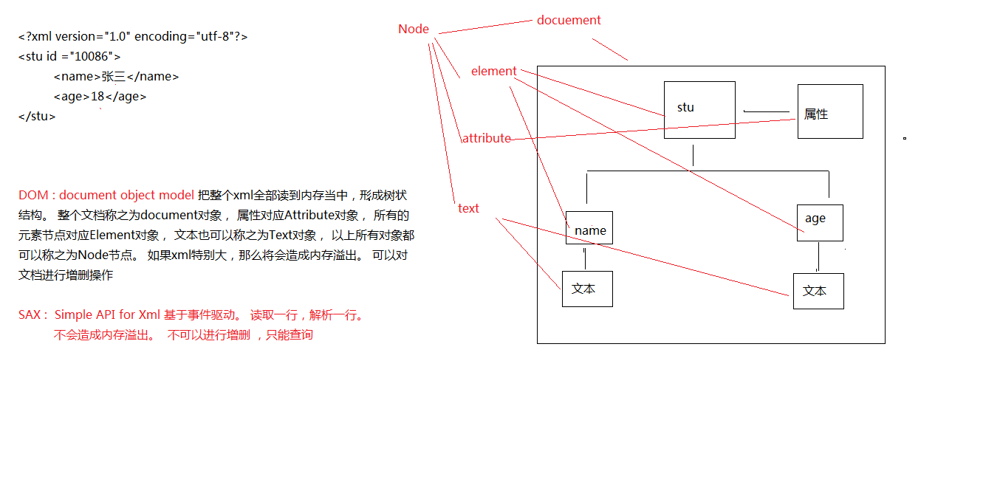

# Xml & Tomcat

## Xml

>eXtendsible  markup language  可扩展的标记语言

### XML 有什么用?

1. 可以用来保存数据

2. 可以用来做配置文件

3. 数据传输载体

###  文档声明

```xml
		<?xml version="1.0" encoding="gbk" standalone="no" ?>
	version : 解析这个xml的时候，使用什么版本的解析器解析
	encoding : 解析xml中的文字的时候，使用什么编码来翻译
	standalone  : no - 该文档会依赖关联其他文档 ，  yes-- 这是一个独立的文档
```

### encoding详解

> 在解析这个xml的时候，使用什么编码去解析。   ---解码。 

> 默认文件保存的时候，使用的是GBK的编码保存。 

所以要想让我们的xml能够正常的显示中文，有两种解决办法

1. 让encoding也是GBK 或者 gb2312 . 

2. 如果encoding是 utf-8 ， 那么保存文件的时候也必须使用utf-8

3. 保存的时候见到的ANSI 对应的其实是我们的本地编码 GBK。

为了通用，建议使用UTF-8编码保存，以及encoding 都是 utf-8

### 元素定义（标签）

1.  其实就是里面的标签， <> 括起来的都叫元素 。 成对出现。  如下： 

    	<stu> </stu>

2.  文档声明下来的第一个元素叫做根元素 (根标签)

3.  标签里面可以嵌套标签

4. 空标签

   	既是开始也是结束。 一般配合属性来用。
   	<age/>

5. 标签可以自定义。 

   XML 命名规则
   	XML 元素必须遵循以下命名规则：

   	名称可以含字母、数字以及其他的字符 
   	名称不能以数字或者标点符号开始 
   	名称不能以字符 “xml”（或者 XML、Xml）开始 
   	名称不能包含空格 

**简单元素  & 复杂元素**

* 简单元素 

> 元素里面包含了普通的文字

* 复杂元素

> 元素里面还可以嵌套其他的元素

### 属性的定义

```java
定义在元素里面， <元素名称  属性名称="属性的值"></元素名称>
	<stus>
		<stu id="10086">
			<name>张三</name>
			<age>18</age>
		</stu>
		<stu id="10087">
			<name>李四</name>
			<age>28</age>
		</stu>
	</stus>
```


### xml注释：

> 与html的注释一样。 

	<!-- --> 
	如： 
	
		<?xml version="1.0" encoding="UTF-8"?>
		<!-- 
			//这里有两个学生
			//一个学生，名字叫张三， 年龄18岁， 学号：10086
			//另外一个学生叫李四  。。。
		 -->

> xml的注释，不允许放置在文档的第一行。 必须在文档声明的下面。

### CDATA区

* 非法字符

  严格地讲，在 XML 中仅有字符 "<"和"&" 是非法的。省略号、引号和大于号是合法的，但是把它们替换为实体引用是个好的习惯。 

  <   &lt;
  &   &amp;

如果某段字符串里面有过多的字符， 并且里面包含了类似标签或者关键字的这种文字，不想让xml的解析器去解析。 那么可以使用CDATA来包装。  不过这个CDATA 一般比较少看到。 通常在服务器给客户端返回数据的时候。

```xml
<des><![CDATA[<a href="http://www.baidu.com">CDATA</a>]]></des>
```

## XML 解析

> 其实就是获取元素里面的字符数据或者属性数据。

### XML解析方式(面试常问)

> 有很多种，但是常用的有两种。

* DOM 把整个xml加载到内存中,形成树状结构,如果xml特别大,将会造成内存溢出,可以对文档进行增删操作

* SAX 基于事件驱动 读取一行 解析一行,但不能对文档进行增删操作



###针对这两种解析方式的API

> 一些组织或者公司， 针对以上两种解析方式， 给出的解决方案有哪些？

		jaxp  sun公司。 比较繁琐
	
		jdom
		dom4j  使用比较广泛

### Dom4j 基本用法

		element.element("stu") : 返回该元素下的第一个stu元素
		element.elements(); 返回该元素下的所有子元素。 

1. 创建SaxReader对象

2. 指定解析的xml

3. 获取根元素。

4. 根据根元素获取子元素或者下面的子孙元素


```java
	try {
		//1. 创建sax读取对象
		SAXReader reader = new SAXReader(); //jdbc -- classloader
		//2. 指定解析的xml源
		Document  document  = reader.read(new File("src/xml/stus.xml"));
		
		//3. 得到元素、
		//得到根元素
		Element rootElement= document.getRootElement();
		
		//获取根元素下面的子元素 age
	//rootElement.element("age") 
		//System.out.println(rootElement.element("stu").element("age").getText());
				//获取根元素下面的所有子元素 。 stu元素
		List<Element> elements = rootElement.elements();
		//遍历所有的stu元素
		for (Element element : elements) {
			//获取stu元素下面的name元素
			String name = element.element("name").getText();
			String age = element.element("age").getText();
			String address = element.element("address").getText();
			System.out.println("name="+name+"==age+"+age+"==address="+address);
		}
		
	} catch (Exception e) {
		e.printStackTrace();
	}
```

### Dom4j 的 Xpath使用

>  dom4j里面支持Xpath的写法。 xpath其实是xml的路径语言，支持我们在解析xml的时候，能够快速的定位到具体的某一个元素。

1. 添加jar包依赖 

   jaxen-1.1-beta-6.jar

2. 在查找指定节点的时候，根据XPath语法规则来查找

3. 后续的代码与以前的解析代码一样。

```java
		//要想使用Xpath， 还得添加支持的jar 获取的是第一个 只返回一个。 
		Element nameElement = (Element) rootElement.selectSingleNode("//name");
		System.out.println(nameElement.getText());
				System.out.println("----------------");

		//获取文档里面的所有name元素 
		List<Element> list = rootElement.selectNodes("//name");
		for (Element element : list) {
			System.out.println(element.getText());
		}
```

XML 约束【了解】

如下的文档， 属性的ID值是一样的。 这在生活中是不可能出现的。 并且第二个学生的姓名有好几个。 一般也很少。那么怎么规定ID的值唯一， 或者是元素只能出现一次，不能出现多次？ 甚至是规定里面只能出现具体的元素名字。 

		<stus>
			<stu id="10086">
				<name>张三</name>
				<age>18</age>
				<address>深圳</address>
			</stu>
			<stu id="10086">
				<name>李四</name>
				<name>李五</name>
				<name>李六</name>
				<age>28</age>
				<address>北京</address>
			</stu>
		</stus>

###DTD

	语法自成一派， 早起就出现的。 可读性比较差。 

1. 引入网络上的DTD

   	<!-- 引入dtd 来约束这个xml -->

   	<!--    文档类型  根标签名字 网络上的dtd   dtd的名称   dtd的路径
   	<!DOCTYPE stus PUBLIC "//UNKNOWN/" "unknown.dtd"> -->

   2. 引入本地的DTD

      <!-- 引入本地的DTD  ： 根标签名字 引入本地的DTD  dtd的位置 -->
      <!-- <!DOCTYPE stus SYSTEM "stus.dtd"> -->

2. 直接在XML里面嵌入DTD的约束规则

   	<!-- xml文档里面直接嵌入DTD的约束法则 -->
   	<!DOCTYPE stus [
   		<!ELEMENT stus (stu)>
   		<!ELEMENT stu (name,age)>
   		<!ELEMENT name (#PCDATA)>
   		<!ELEMENT age (#PCDATA)>
   	]>
   	
   	<stus>
   		<stu>
   			<name>张三</name>
   			<age>18</age>
   		</stu>
   	</stus>


		<!ELEMENT stus (stu)>  : stus 下面有一个元素 stu  ， 但是只有一个
		<!ELEMENT stu (name , age)>  stu下面有两个元素 name  ,age  顺序必须name-age
		<!ELEMENT name (#PCDATA)> 
		<!ELEMENT age (#PCDATA)>
		<!ATTLIST stu id CDATA #IMPLIED> stu有一个属性 文本类型， 该属性可有可无


		元素的个数：
	
			＋　一个或多个
			*  零个或多个
			? 零个或一个
	
		属性的类型定义 
	
			CDATA : 属性是普通文字
			ID : 属性的值必须唯一


		<!ELEMENT stu (name , age)>		按照顺序来 
	
		<!ELEMENT stu (name | age)>   两个中只能包含一个子元素
###Schema

	其实就是一个xml ， 使用xml的语法规则， xml解析器解析起来比较方便 ， 是为了替代DTD 。
	但是Schema 约束文本内容比DTD的内容还要多。 所以目前也没有真正意义上的替代DTD


	约束文档：
		<!-- xmlns  :  xml namespace : 名称空间 /  命名空间
		targetNamespace :  目标名称空间 。 下面定义的那些元素都与这个名称空间绑定上。 
		elementFormDefault ： 元素的格式化情况。  -->
		<schema xmlns="http://www.w3.org/2001/XMLSchema" 
			targetNamespace="http://www.itheima.com/teacher" 
			elementFormDefault="qualified">
			
			<element name="teachers">
				<complexType>
					<sequence maxOccurs="unbounded">
						<!-- 这是一个复杂元素 -->
						<element name="teacher">
							<complexType>
								<sequence>
									<!-- 以下两个是简单元素 -->
									<element name="name" type="string"></element>
									<element name="age" type="int"></element>
								</sequence>
							</complexType>
						</element>
					</sequence>
				</complexType>
			</element>
		</schema>
	
	实例文档：
		<?xml version="1.0" encoding="UTF-8"?>
		<!-- xmlns:xsi : 这里必须是这样的写法，也就是这个值已经固定了。
		xmlns : 这里是名称空间，也固定了，写的是schema里面的顶部目标名称空间
		xsi:schemaLocation : 有两段： 前半段是名称空间，也是目标空间的值 ， 后面是约束文档的路径。
		 -->
		<teachers
			xmlns:xsi="http://www.w3.org/2001/XMLSchema-instance"
			xmlns="http://www.itheima.com/teacher"
			xsi:schemaLocation="http://www.itheima.com/teacher teacher.xsd"
		>
			<teacher>
				<name>zhangsan</name>
				<age>19</age>
			</teacher>
			<teacher>
				<name>lisi</name>
				<age>29</age>
			</teacher>
			<teacher>
				<name>lisi</name>
				<age>29</age>
			</teacher>
		</teachers>

##名称空间的作用

一个xml如果想指定它的约束规则， 假设使用的是DTD ，那么这个xml只能指定一个DTD  ，  不能指定多个DTD 。 但是如果一个xml的约束是定义在schema里面，并且是多个schema，那么是可以的。简单的说： 一个xml 可以引用多个schema约束。 但是只能引用一个DTD约束。

名称空间的作用就是在 写元素的时候，可以指定该元素使用的是哪一套约束规则。  默认情况下 ，如果只有一套规则，那么都可以这么写

	<name>张三</name>
	
	<aa:name></aa:name>
	<bb:name></bb:name>


###程序架构

网页游戏


* C/S(client/server)

> QQ 微信 LOL

优点：

	有一部分代码写在客户端， 用户体验比较好。 

缺点： 

	服务器更新，客户端也要随着更新。 占用资源大。 


* B/S(browser/server)

> 网页游戏 ， WebQQ ...

优点： 

	客户端只要有浏览器就可以了。 	占用资源小， 不用更新。 

缺点：

	用户体验不佳。 

###服务器

> 其实服务器就是一台电脑。 配置比一般的要好。


###Web服务器软件 

> 客户端在浏览器的地址栏上输入地址 ，然后web服务器软件，接收请求，然后响应消息。 
> 处理客户端的请求， 返回资源 | 信息

 Web应用  需要服务器支撑。 index.html

	Tomcat  apache
	
	WebLogic BEA
	Websphere IBM  
	
	IIS   微软


###Tomcat安装

1. 直接解压 ，然后找到bin/startup.bat

2. 可以安装

启动之后，如果能够正常看到黑窗口，表明已经成功安装。 为了确保万无一失， 最好在浏览器的地址栏上输入 ： http://localhost:8080 , 如果有看到内容 就表明成功了。

3. 如果双击了startup.bat,  看到一闪而过的情形，一般都是 JDK的环境变量没有配置。 


###Tomcat目录介绍

bin##

		> 包含了一些jar ,  bat文件 。  startup.bat

conf##
​	
		tomcat的配置 	server.xml  web.xml

lib 

	  	tomcat运行所需的jar文件

logs

		运行的日志文件
temp

		临时文件

webapps##

		发布到tomcat服务器上的项目，就存放在这个目录。	

work(目前不用管)

		jsp翻译成class文件存放地
​	


##如何把一个项目发布到tomcat中

> 需求： 如何能让其他的电脑访问我这台电脑上的资源 。 stu.xml

	localhost : 本机地址

###1.  拷贝这个文件到webapps/ROOT底下， 在浏览器里面访问：

		http://localhost:8080/stu.xml
	
	* 在webaps下面新建一个文件夹xml  , 然后拷贝文件放置到这个文件夹中

​	
		http://localhost:8080/xml/stu.xml

		http://localhost:8080 ： 其实对应的是到webapps/root
		http://localhost:8080/xml/ : 对应是 webapps/xml
	
		使用IP地址访问：
	
		http://192.168.37.48:8080/xml/stu.xml

###2. 配置虚拟路径


使用localhost：8080 打开tomcat首页， 在左侧找到tomcat的文档入口， 点击进去后， 在左侧接着找到 Context入口，点击进入。

	http://localhost:8080/docs/config/context.html

1. 在conf/server.xml 找到host元素节点。

2. 加入以下内容。


   		<!-- docBase ：  项目的路径地址 如： D:\xml02\person.xml
   		path : 对应的虚拟路径 一定要以/打头。
   		对应的访问方式为： http://localhost:8080/a/person.xml -->
   		<Context docBase="D:\xml02" path="/a"></Context>

3. 在浏览器地址栏上输入： http://localhost:8080/a/person.xml


###3. 配置虚拟路径

1. 在tomcat/conf/catalina/localhost/ 文件夹下新建一个xml文件，名字可以自己定义。 person.xml

2. 在这个文件里面写入以下内容

   	<?xml version='1.0' encoding='utf-8'?>
   	<Context docBase="D:\xml02"></Context>

3. 在浏览器上面访问

   http://localhost:8080/person/xml的名字即可

###给Eclipse配置Tomcat


1. 在server里面 右键新建一个服务器， 选择到apache分类， 找到对应的tomcat版本， 接着一步一步配置即可。
2. 配置完毕后， 在server 里面， 右键刚才的服务器，然后open  ， 找到上面的Server Location , 选择中间的 Use Tomcat installation...

3. 创建web工程， 在WebContent下定义html文件， 右键工程， run as server 


##总结：

	xml
	
		1. 会定义xml
	
		2. 会解析xml
	
			dom4j  基本解析
	
			Xpath手法


	tomcat
	
		1. 会安装 ，会启动 ， 会访问。
	
		2. 会设置虚拟路径
	
		3. 给eclipse配置tomcat


​	