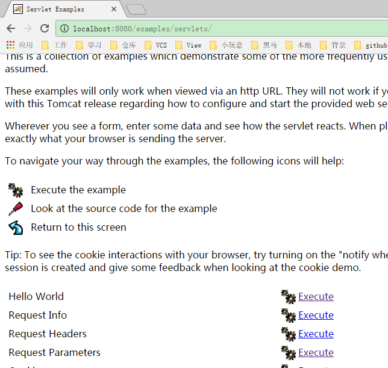
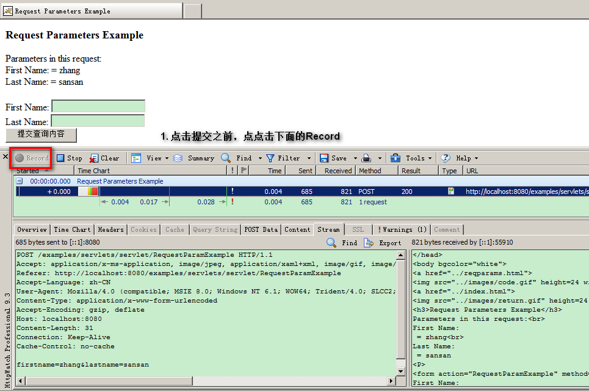
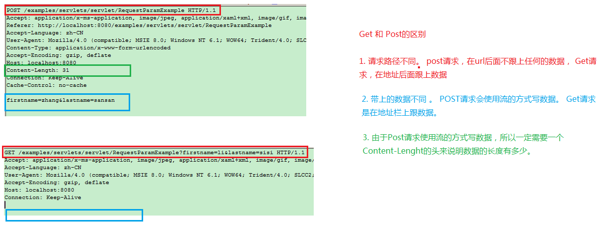
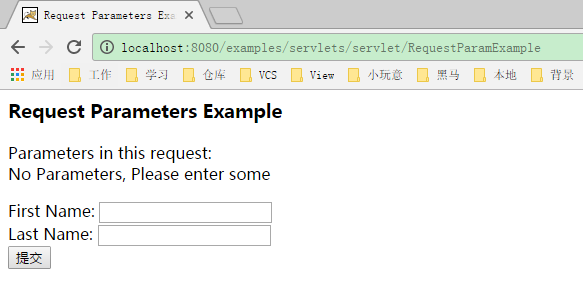
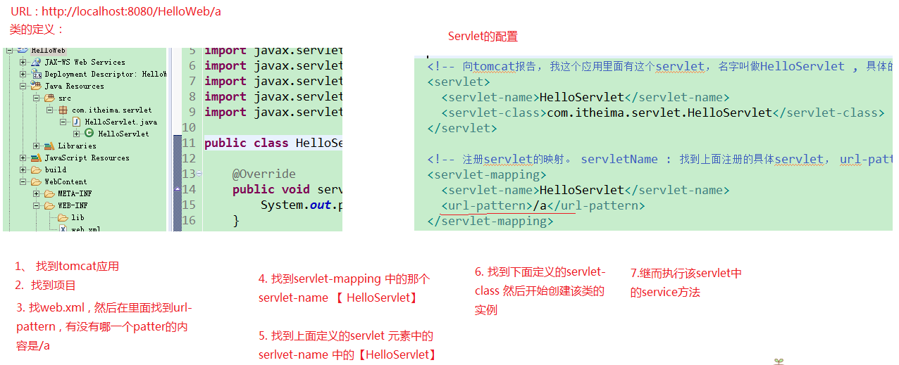

#Listener  & Filter

##Listener

> 监听器

* 能做什么事？

> 监听某一个事件的发生。 状态的改变。

* 监听器的内部机制

> 其实就是接口回调. 

####接口回调

* 需求：

> A在执行循环，当循环到5的时候， 通知B。

> 事先先把一个对象传递给 A ， 当A 执行到5的时候，通过这个对象，来调用B中的方法。 但是注意，不是直接传递B的实例，而是传递一个接口的实例过去。

###Web监听器

> 总共有8个 划分成三种类型

1. 定义一个类，实现接口

2. 注册 | 配置监听器

### 监听三个作用域创建和销毁

 	request  ---httpServletRequest
	session  ---httpSession
	aapplication  --- ServletContext

	1. ServletContextListener

		servletcontext创建：

			1. 启动服务器的时候

		servletContext销毁：

			2. 关闭服务器. 从服务器移除项目
			

	2. ServletRequestListener

		request创建:

			访问服务器上的任意资源都会有请求出现。

			访问 html： 会
			访问 jsp:	会
			访问 servlet : 会 
			

		request销毁：

			服务器已经对这次请求作出了响应。

			public class MyRequestListener implements ServletRequestListener {
					@Override
					public void requestDestroyed(ServletRequestEvent sre) {
						System.out.println("servletrequest 销毁了");
					}
				
					@Override
					public void requestInitialized(ServletRequestEvent sre) {
						System.out.println("servletrequest 初始化了");
					}
				}

			  
			  <listener>
			  	<listener-class>com.itheima.listener.MyRequestListener</listener-class>
			  </listener>

			

	3. HttpSessionListener

		session的创建
			只要调用getSession

			html:		不会
			jsp:		会	  getSession();
			servlet: 	会

		session的销毁
			超时  30分钟
			
			非正常关闭 销毁

			正常关闭服务器(序列化)

			public class MySessionListener implements HttpSessionListener {

				@Override
				public void sessionCreated(HttpSessionEvent se) {
					System.out.println("创建session了");
				}
			
				@Override
				public void sessionDestroyed(HttpSessionEvent se) {
					System.out.println("销毁session了");
				}
			}

作用：
	
	ServletContextListener

		利用它来，在servletcontext创建的时候， 
			1. 完成自己想要的初始化工作

			2. 执行自定义任务调度。 执行某一个任务。 Timer  

	HttpSessionListener

		统计在线人数.

### 监听三个作用域属性状态变更

> 可以监听在作用域中值 添加  | 替换  | 移除的动作。 

* servletContext --- ServletContextAttributeListener

* request --- ServletRequestAttributeListener

* session --- HttpSessionAttributeListener

### 监听httpSession里面存值的状态变更

> 这一类监听器不用注册。

* HttpSessionBindingListener

> 监听对象与session 绑定和解除绑定 的动作

	1. 让javaBean 实现该接口即可

			@Override
			public void valueBound(HttpSessionBindingEvent event) {
				System.out.println("对象被绑定进来了");
			}
		
			@Override
			public void valueUnbound(HttpSessionBindingEvent event) {
				System.out.println("对象被解除绑定");
			}

* HttpSessionActivationListener

> 用于监听现在session的值 是 钝化 （序列化）还是活化 （反序列化）的动作

* 钝化 （序列化） 

> 把内存中的数据 存储到硬盘上

* 活化 （反序列化）

> 把硬盘中的数据读取到内存中。

* session的钝化活化的用意何在

>  session中的值可能会很多， 并且我们有很长一段时间不使用这个内存中的值， 那么可以考虑把session的值可以存储到硬盘上【钝化】，等下一次在使用的时候，在从硬盘上提取出来。 【活化】

* 如何让session的在一定时间内钝化. 

> 做配置即可

	1. 在tomcat里面 conf/context.xml 里面配置

			对所有的运行在这个服务器的项目生效  

	2. 在conf/Catalina/localhost/context.xml 配置

			对 localhost生效。  localhost:8080

	3. 在自己的web工程项目中的 META-INF/context.xml

			只对当前的工程生效。

		maxIdleSwap ： 1分钟不用就钝化
		directory ：  钝化后的那个文件存放的目录位置。 

			D:\tomcat\apache-tomcat-7.0.52\work\Catalina\localhost\ListenerDemo\itheima

		<Context>
			<Manager className="org.apache.catalina.session.PersistentManager" maxIdleSwap="1">
				<Store className="org.apache.catalina.session.FileStore" directory="itheima"/>
			</Manager>
		</Context>

##Filter

> 过滤器 ， 其实就是对客户端发出来的请求进行过滤。 浏览器发出， 然后服务器派servlet处理。  在中间就可以过滤， 其实过滤器起到的是拦截的作用。

* 作用
	
	1. 对一些敏感词汇进行过滤
	2. 统一设置编码
	3. 自动登录
	
	...

###如何使用Filter

1. 定义一个类， 实现Filter

		public class FilterDemo implements Filter {

			public void destroy() {
			}
		
			public void doFilter(ServletRequest request, ServletResponse response, FilterChain chain) throws IOException, ServletException {
				System.out.println("来到过虑器了。。。");
				chain.doFilter(request, response);
			}
		
			public void init(FilterConfig fConfig) throws ServletException {
			}
		
		}

2. 注册过滤器

> 在web.xml里面注册，注册的手法与servlet基本一样。

		  	<filter>
		    <display-name>FilterDemo</display-name>
		    <filter-name>FilterDemo</filter-name>
		    <filter-class>com.itheima.filter.FilterDemo</filter-class>
		  </filter>
		  <filter-mapping>
		    <filter-name>FilterDemo</filter-name>
		    <url-pattern>/*</url-pattern>
		  </filter-mapping>

###Filter的生命周期

* 创建

> 在服务器启动的时候就创建。 

* 销毁

> 服务器停止的时候。

###Filter执行顺序

1. 客户端发出请求，先经过过滤器， 如果过滤器放行，那么才能到servlet

2. 如果有多个过滤器， 那么他们会按照注册的映射顺序 来 排队。 只要有一个过滤器， 不放行，那么后面排队的过滤器以及咱们的servlet都不会收到请求。

##Filter细节：

1. init方法的参数 FilterConfig , 可以用于获取filter在注册的名字 以及初始化参数。  其实这里的设计的初衷与ServletConfig是一样的。

2. 如果想放行，那么在doFilter 方法里面操作，使用参数 chain

		chain.doFilter(request, response); 放行， 让请求到达下一个目标。

3.  <url-pattern>/*</url-pattern> 写法格式与servlet一样。

	1. 全路径匹配  以 /  开始 

			/LoginServlet

	2. 以目录匹配 以 / 开始  以 * 结束

		/demo01/*  

	3. 以后缀名匹配  以 * 开始 以后缀名结束

		*.jsp  *.html *.do 

4. 针对 dispatcher 设置

		REQUEST ： 只要是请求过来，都拦截，默认就是REQUEST 
		FORWARD : 只要是转发都拦截。 
		ERROR ： 页面出错发生跳转 
		INCLUDE ： 包含页面的时候就拦截。
		

###自动登录

* 需求分析

			

####1. 搭建环境

1. 搭建数据库

2. 搭建页面

###登录servlet代码

		protected void doGet(HttpServletRequest request, HttpServletResponse response) throws ServletException, IOException {

		try {
			String userName = request.getParameter("username");
			String password = request.getParameter("password");
			String autoLogin = request.getParameter("auto_login");
			UserBean user = new UserBean();
			user.setUsername(userName);
			user.setPassword(password);
			
			UserDao dao = new UserDaoImpl();
			UserBean userBean = dao.login(user);
			
			if(userBean != null){
				//成功了，进入首页
				request.getSession().setAttribute("userBean", userBean);
				response.sendRedirect("index.jsp");
			}else{
				//不成功...
				request.getRequestDispatcher("login.jsp").forward(request, response);
			}
			
		} catch (SQLException e) {
			e.printStackTrace();
		}
	}

##过滤器代码

>  过滤器的核心不是完成拦截不给 ， 还是放行显示。 它的核心是在放行之前，帮用户完成登录的功能。 

* 实现思路

1. 先判断session是否有效， 如果有效，就不用取cookie了，直接放行。

2. 如果session失效了，那么就取 cookie。

	1. 没有cookie  放行 

	2. 有cookie 

			1. 取出来cookie的值，然后完成登录
			2. 把这个用户的值存储到session中

			3. 放行。

			/**
			 * @see Filter#doFilter(ServletRequest, ServletResponse, FilterChain)
			 */
			public void doFilter(ServletRequest req, ServletResponse response, FilterChain chain) throws IOException, ServletException {
	
			try {
				HttpServletRequest request = (HttpServletRequest) req;
				
				//先判断，现在session中还有没有那个userBean.
				UserBean userBean = (UserBean) request.getSession().getAttribute("userBean");
				//还有，有效。
				if(userBean != null){
					chain.doFilter(request, response);
				}else{
					//代表session失效了。
					
					//2. 看cookie。
					
					//1. 来请求的时候，先从请求里面取出cookie , 但是cookie有很多的key-value
					Cookie[] cookies = request.getCookies();
					//2. 从一堆的cookie里面找出我们以前给浏览器发的那个cookie
					Cookie cookie = CookieUtil.findCookie(cookies, "auto_login");
					
					//第一次来
					if(cookie  == null){
						chain.doFilter(request, response);
					}else{
						
						//不是第一次。
						
						String value = cookie.getValue();
						String username = value.split("#itheima#")[0];
						String password = value.split("#itheima#")[1];
	
						//完成登录
						UserBean user = new UserBean();
						user.setUsername(username);
						user.setPassword(password);
	
						UserDao dao = new UserDaoImpl();
						userBean = dao.login(user);
						
						//使用session存这个值到域中，方便下一次未过期前还可以用。
						request.getSession().setAttribute("userBean", userBean);
						
						chain.doFilter(request, response);
					}
					
				}
				
				} catch (Exception e) {
					e.printStackTrace();
					chain.doFilter(req, response);
				}
				}

###BeanUtils的使用

> BeanUtils.populate(bean, map);	

			//注册自己的日期转换器
			ConvertUtils.register(new MyDateConverter(), Date.class);
			
			
			//转化数据
			Map map = request.getParameterMap();
			UserBean bean = new UserBean();

			转化map中的数据，放置到bean对象身上
			BeanUtils.populate(bean, map);	

#总结

##Listener

	8个 

	三种类型  
		针对三个作用域的创建和销毁
		针对三个作用域的值改变 【添加 | 替换 | 移除】
		针对session中的值 【钝化 活化】 ， 【绑定  解绑】

	钝化 ( 序列化 ) 
		内存中的对象存储到硬盘 

		超时失效。 session销毁了。 
	
	非正常关闭服务器， 钝化  。 正常关闭服务器 销毁

	设置了session，多久时间。 context.xml
	

	活化 (反序列化)
		从硬盘里面读取到内存

ServletContextListner  ： 应用被部署的时候， 服务器加载这个项目的时候，做一些初始化工作， 任务调度。
HttpSessionListener	： 统计在线人数
HttpSessionActivationListener  ： 钝化活化处理

	

	
##Filter 

> 使用频率更高

* 如果要写一个过滤器。

> 1. 定义一个类，实现接口 Filter

> 2. 注册 . web.xml . 与servlet相似。

* 过滤器放行。 

> chain.doFilter(request, response);

* 过滤器生命周期

	创建： 服务器加载这个项目的时候创建实例
 
	销毁： 关闭服务器或者从服务器中移除项目的时候。