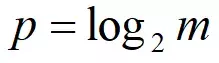

# HyperLogLog

## 1. 概述

`HyperLogLog`，下面简称为`HLL`，它是 `LogLog` 算法的升级版，作用是能够提供不精确的去重计数。存在以下的特点：

- 代码实现较难。
- 能够使用极少的内存来统计巨量的数据，在 `Redis` 中实现的 `HyperLogLog`，只需要`12K`内存就能统计`2^64`个数据。
- 计数存在一定的误差，误差率整体较低。标准误差为 0.81% 。
- 误差可以被设置`辅助计算因子`进行降低。


## 2. 伯努利实验

要想了解HyperLogLog ，必须先要了解伯努利实验

抛硬币不管进行抛掷次数多少次，只要出现一个正面，就称之为为一次伯努利实验。
 对于这`n`次伯努利试验中，必然会有一个最大的抛掷次数`k`，
 `k_max` 表示在所有次伯努利实验中，它是抛掷次数最高的。

 最终结合极大似然估算的方法，发现在`n`和`k_max`中存在估算关联：`n = 2^(k_max)`

结论：可以通过伯努利实验中最大抛掷次数来估算总伯努利实验次数


## 3. 比特串

`hash(id) = 比特串`
不同的数据，必然拥有不同的比特串。每一个比特串，也必然会至少出现一次 1 的位置，我们类比每一个比特串为一次伯努利试验。

### 分桶

现在要分轮，也就是分桶。

>  分桶数组是为了消减因偶然性带来的误差，提高预估的准确性
>  分桶平均的基本原理是将统计数据划分为m个桶，每个桶分别统计各自的k_max，并能得到各自的基数预估值 n  ，最终对这些 n  求平均（调和平均数）得到整体的基数估计值。

所以我们可以设定，每个比特串的前多少位转为10进制后，其值就对应于所在桶的标号。

假设比特串的`低两位`用来计算桶下标志，此时有一个数据的比特串是：`1001011000011`。它的所在桶下标为：`11(2) = 1*2^1 + 1*2^0 = 3`，处于第3个桶，即第3轮中。

上面例子中，计算出桶号后，剩下的比特串是：`10010110000`，从低位到高位看，第一次出现 1 的位置是 5 。也就是说，此时第3个桶，第3轮的试验中，k_max = 5。5 对应的二进制是：101。

又因为每个桶有 p 个比特位。当 p>=3 时，便可以将 101 存进去,所以存储时只占用很小的空间。


模仿上面的流程，多个不同的数据，就被分散到不同的桶中去了，且每个桶有其 k_max。然后当要统计出总数据量的时候，就是一次估算。最终结合所有桶中的 k_max，代入估算公式，便能得出估算值。


## 4. 小结

### 基础

1.将数据进行hash得到的一个比特串，假设为`001010101`

2.找到第一个出现的`1`的下标(从高到低或者从低到高都行 顺序没要求),假设从高到低,那么这里第一个`1`出现的下标就是3(第三位),即`k_max`=3，转成二进制就是`11`,存储的时候只需要2bit即可。

3.最后根据估算公式`n = 2^(k_max)`,即可求出总的数据条数`n`

### 进阶

前面基础版本这样误差太大了，按照前面的例子算出来n=8 但是现在就存了一个数进去，对算法进行优化，添加了分桶的操作。

* 1.将数据进行hash得到的一个比特串，假设为`001010101`
* 2.分桶 假设把比特串的前XX为作为依据，将数据分到不同的桶里。假设为前3位吧，即`001`，转成10进制为1，表示这个数据要存到第一个桶，然后剩下的步骤和前面基础算法一下，比特串减去前三位后剩下的`010101`中找第一个`1`出现的问题，这里是2，转成二进制即`10`，则在第一个桶里面存入`10`
* 3.最终结合所有桶中的 k_max，代入估算公式，便能得出估算值n (具体估算方式不同实现可能会有所不同)。


## 5. Redis中的实现

redis实现中设置了 16384 个桶，即：`2^14 = 16384`，每个桶有 6 位，每个桶可以表达的最大数字是：25+24+...+1 = 63 ，二进制为： `111 111` 。

对于命令：`pfadd key value`

在存入时，value 会被 hash 成 `64` 位，即 64 bit 的比特字符串，前 `14` 位用来分桶。

> 之所以选 `14位` 来表达桶编号是因为，分了 16384 个桶，而 2^14 = 16384，刚好地，最大的时候可以把桶利用完，不造成浪费。

因为 fpadd 的 key 可以设置多个 value。例如下面的例子：

```redis
pfadd lan golang
pfadd lan java
```

根据上面的做法，不同的 value，会被设置到不同桶中去，如果出现了在同一个桶的，即前 14 位值是一样的，但是后面出现 1 的位置不一样。那么比较原来的 index 是否比新 index 大。是，则替换。否，则不变。

最终地，一个 key 所对应的 16384 个桶都设置了很多的 value 了，每个桶有一个`k_max`。此时调用 pfcount 时，按照前面介绍的估算方式，便可以计算出 key 的设置了多少次 value，也就是统计值。

value 被转为 64 位的比特串，最终被按照上面的做法记录到每个桶中去。64 位转为十进制就是：2^64，`HyperLogLog` 仅用了：`16384 * 6 /8 / 1024=12 K` 存储空间就能统计多达 2^64 个数。

在估算的计算公式中，`constant` 变量不是一个定值，它会根据实际情况而被分支设置，例如下面的样子。

假设：m为分桶数，p是m的以2为底的对数。



```golang
// m 为桶数
switch (p) {
   case 4:
       constant = 0.673 * m * m;
   case 5:
       constant = 0.697 * m * m;
   case 6:
       constant = 0.709 * m * m;
   default:
       constant = (0.7213 / (1 + 1.079 / m)) * m * m;
}
```


## 6. 参考

`https://www.cnblogs.com/linguanh/p/10460421.html`

`https://www.jianshu.com/p/f008ae58336a`

`https://www.jianshu.com/p/55defda6dcd2`

`仿真软件http://content.research.neustar.biz/blog/hll.html`

`论文 http://algo.inria.fr/flajolet/Publications/FlFuGaMe07.pdf`