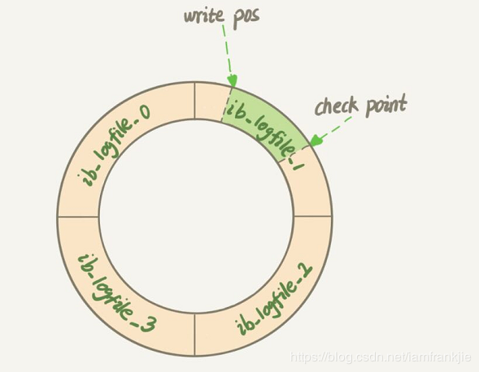

# binlog、redo log、undo log详解

## 1. 概述

MySQL中有六种日志文件，分别是：

* 重做日志(redo log)
* 回滚日志(undo log)
* 二进制日志(binlog)
* 错误日志(errorlog)
* 慢查询日志(slow query log)
* 一般查询日志(general log)
* 中继日志(relay log)

其中`重做日志`和`回滚日志`与事务操作息息相关，`二进制日志`也与事务操作有一定的关系，这三种日志，对理解MySQL中的事务操作有着重要的意义。


## 2. 重做日志(redo log)

### 1. 作用

**确保事务的持久性**

**防止在发生故障的时间点，尚有脏页未写入磁盘，在重启mysql服务的时候，根据redo log进行重做，从而达到事务的持久性这一特性。**


### 2. 内容

**物理格式的日志，记录的是物理数据页面的修改的信息**，其redo log是顺序写入redo log file的物理文件中去的。

当更新一条数据时，InnoDB会找到要更新的行数据，把做了什么修改记录写到redolog中，并把这行数据更新到内存中，整个过程就算完成了。

redolog是固定大小的（如下图），所以它只能循环记录做了什么修改，`write pos`为当前记录的位置，`checkpoint`为当前可以擦除的位置，代表更新的行已经完成数据库的磁盘更改,可以覆盖掉了。



如果此时宕机了， 内存中更改后的行数据已经不再了， 但是redolog还是存在的，是可以恢复，这也就是mysql的crash-safe特性。


### 3. 其他

#### 1. 什么时候产生？

事务开始之后就产生redo log，redo log的落盘并不是随着事务的提交才写入的，而是在事务的执行过程中，便开始写入redo log文件中。

#### 2. 什么时候释放？

当对应事务的脏页写入到磁盘之后，redo log的使命也就完成了，重做日志占用的空间就可以重用（被覆盖）。

#### 3. 对应的物理文件

默认情况下，对应的物理文件位于数据库的data目录下的ib_logfile1&ib_logfile2
`innodb_log_group_home_dir`指定日志文件组所在的路径，默认./ ，表示在数据库的数据目录下。
`innodb_log_files_in_group` 指定重做日志文件组中文件的数量，默认2
关于文件的大小和数量，由一下两个参数配置
innodb_log_file_size 重做日志文件的大小。
innodb_mirrored_log_groups 指定了日志镜像文件组的数量，默认1


### 4. 什么时候刷新到磁盘

对于写入重做日志文件的操作不是直接写，而是先写入一个重做日志缓冲（redo log buffer）中，然后根据按照一定的条件写入日志文件。


上面提到了从日志缓冲写入磁盘上的重做日志文件是按一定条件的，那这些条件有哪些呢？

在主线程中每秒会将重做日志缓冲写入磁盘的重做日志文件中，不论事务是否已经提交。

另一个触发这个过程是由参数`innodb_flush_log_at_trx_commit`控制，表示在提交（commit）操作时，处理重做日志的方式。

参数`innodb_flush_log_at_trx_commit`可设的值有0、1、2。

* `0`代表当提交事务时，并不将事务的重做日志写入磁盘上的日志文件，而是等待主线程每秒的刷新。

* `1`是在commit时将重做日志缓冲同步写到磁盘；

* `2`是重做日志异步写到磁盘，即不能完全保证commit时肯定会写入重做日志文件，只是有这个动作。

**为了保证实物的持久性必须将`innodb_flush_log_at_trx_commit`的值设置为1，即每当事务提交时就必须保证事务都已经写入重做日志文件。**

设置为其他值都可能出现事务的丢失。


## 3. 回滚日志(undo log)

### 1. 作用

保存了事务发生之前的数据的一个版本，可以用于回滚，同时可以提供多版本并发控制下的读（MVCC），也即非锁定读。

### 2. 内容

**逻辑格式的日志，在执行undo的时候，仅仅是将数据从逻辑上恢复至事务之前的状态，而不是从物理页面上操作实现的，这一点是不同于redo log的。**


### 3. 其他

### 1.什么时候产生？

事务开始之前，将当前是的版本生成undo log，undo 也会产生 redo 来保证undo log的可靠性。

### 2.什么时候释放

当事务提交之后，undo log并不能立马被删除，
而是放入待清理的链表，由purge线程判断是否由其他事务在使用undo段中表的上一个事务之前的版本信息，决定是否可以清理undo log的日志空间。

### 3. 对应的物理文件

默认情况下undo文件是保持在共享表空间的，也即ibdatafile文件中，当数据库中发生一些大的事务性操作的时候，要生成大量的undo信息，全部保存在共享表空间中的。
因此共享表空间可能会变的很大，默认情况下，也就是undo 日志使用共享表空间的时候，被“撑大”的共享表空间是不会也不能自动收缩的。
因此，mysql5.7之后的“独立undo 表空间”的配置就显得很有必要了。

关于MySQL5.7之后的独立undo 表空间配置参数如下

```sh
innodb_undo_directory = /data/undospace/ –undo独立表空间的存放目录
innodb_undo_logs = 128 –回滚段为128KB
innodb_undo_tablespaces = 4 –指定有4个undo log文件
```

如果undo使用的共享表空间，这个共享表空间中又不仅仅是存储了undo的信息，共享表空间的默认为与MySQL的数据目录下面，其属性由参数innodb_data_file_path配置。


## 4. 二进制日志(binlog)


### 1. 作用

* 1.用于复制，在主从复制中，从库利用主库上的binlog进行重播，实现主从同步。
* 2.用于数据库的基于时间点的还原。

### 2. 内容

**逻辑格式的日志，可以简单认为就是执行过的事务中的sql语句。**
但又不完全是sql语句这么简单，而是包括了执行的**sql语句(增删改)反向信息**。
也就意味着

delete对应着delete本身和其反向的insert；

update对应着update执行前后的版本的信息；

insert对应着delete和insert本身的信息。

> 在使用mysqlbinlog解析binlog之后一些都会真相大白。

因此可以基于binlog做到类似于oracle的闪回功能，其实都是依赖于binlog中的日志记录。

### 3. 其他

#### 1. 什么时候产生

**事务提交的时候，一次性将事务中的sql语句（一个事物可能对应多个sql语句）按照一定的格式记录到binlog中。**

这里与redo log很明显的差异就是redo log并不一定是在事务提交的时候刷新到磁盘，**redo log**是在`事务开始`之后就开始**逐步写入**磁盘。
因此对于事务的提交，即便是较大的事务，提交（commit）都是很快的。

但是在开启了bin_log的情况下，对于较大事务的提交，可能会变得比较慢一些，这是因为**binlog**是在`事务提交`的时候**一次性写入**的造成的。


#### 2. 什么时候释放

binlog的默认是保持时间由参数expire_logs_days配置，也就是说对于非活动的日志文件，在**生成时间超过expire_logs_days配置的天数之后，会被自动删除。**

#### 3. 对应的物理文件

配置文件的路径为log_bin_basename，binlog日志文件按照指定大小，**当日志文件达到指定的最大的大小之后，进行滚动更新，生成新的日志文件。
对于每个binlog日志文件，通过一个统一的index文件来组织。**


### 4. 与redolog区别

二进制日志的作用之一是还原数据库的，这与redo log很类似，很多人混淆过，但是两者有本质的不同

**1.作用不同**

redo log是保证事务的持久性的，是`事务层面`的，作为异常宕机或者介质故障后的数据恢复使用。binlog作为还原的功能，是`数据库层面`的（当然也可以精确到事务层面的），可以作为恢复数据使用，主从复制搭建，虽然都有还原的意思，但是其保护数据的层次是不一样的。

redo log是InnoDB引擎特有的；binlog是MySQL的Server层实现的，所有引擎都可以使用。

**2.内容不同**

redo log是物理日志，是数据页面的修改之后的物理记录，binlog是逻辑日志，可以简单认为记录的就是sql语句。

**3.时机不同**

两者日志产生的时间，可以释放的时间，在可释放的情况下清理机制都是完全不同的。

**4.效率不同**

恢复数据时候的效率，基于物理日志的redo log恢复数据的效率要高于语句逻辑日志的binlog。

**5.文件大小**

redo log是循环写，日志空间大小固定；binlog是追加写，一份写到一定大小的时候会更换下一个文件，不会覆盖。


## 5. binlog和redo log的一致性问题

binlog和redo log都是在事务提交阶段记录的，那是先写binlog还是先写redo log的呢？

**假设一：先写redo log再写binlog**

想象一下，如果数据库系统在写完一个事务的redo log时发生crash，而此时这个事务的binlog还没有持久化。在数据库恢复后，主库会根据redo log中去完成此事务的重做，主库中就有可这个事务的数据。但是，由于此事务并没有产生binlog，即使主库恢复后，关于此事务的数据修改也不会同步到从库上，这样就产生了主从不一致的错误。

**假设二：先写binlog再写redo log**

想象一下，如果数据库系统在写完一个事务的binlog时发生crash，而此时这个事务的redo log还没有持久化，或者说此事务的redo log还没记录完（至少没有记录commit log）。在数据库恢复后，从库会根据主库中记录的binlog去回放此事务的数据修改。但是，由于此事务并没有产生完整提交的redo log，主库在恢复后会回滚该事务，这样也会产生主从不一致的错误。

通过上面的假设和分析，我们可以看出，**不管是先写redo log还是先写binlog，都有可能会产生主从不一致的错误**，那么MySQL又是怎么做到binlog和redo log的一致性的呢？

### MySQL的内部XA（两阶段提交）

XA是由X/Open组织提出的分布式事务的规范。XA规范主要定义了(全局)事务管理器(TM: Transaction Manager)和(局部)资源管理器(RM: Resource Manager)之间的接口。XA为了实现分布式事务，将事务的提交分成了两个阶段：也就是**2PC (tow phase commit)，XA协议就是通过将事务的提交分为两个阶段来实现分布式事务。**


**prepare 阶段**：**第一阶段，事务管理器向所有涉及到的数据库服务器发出prepare`准备提交`请求，数据库收到请求后执行数据修改和日志记录等处理，处理完成后只是把事务的状态改成`可以提交`**,然后把结果返回给事务管理器.

**commit 阶段**：事务管理器收到回应后进入第二阶段，**如果在第一阶段内有任何一个数据库的操作发生了错误，或者事务管理器收不到某个数据库的回应，则认为事务失败，回撤所有数据库的事务**。数据库服务器收不到第二阶段的确认提交请求，也会把"可以提交"的事务回撤。

如果第一阶段中所有数据库都提交成功，那么事务管理器向数据库服务器发出"确认提交"请求，数据库服务器把事务的"可以提交"状态改为"提交完成"状态，然后返回应答。

MySQL中的XA实现分为：`外部XA`和`内部XA`。前者是指我们通常意义上的分布式事务实现；后者是指单台MySQL服务器中，Server层作为TM(事务协调者)，而服务器中的多个数据库实例作为RM，而进行的一种分布式事务，也就是MySQL跨库事务；也就是一个事务涉及到同一条MySQL服务器中的两个innodb数据库(因为其它引擎不支持XA)。

### MySQL的两阶段提交

```mysql
update tbl_name set c=c+1 where id = 2
```

执行过程如下图


> 图片来源：https://www.cnblogs.com/binyang/p/11260126.html

在MySQL内部，在事务提交时利用两阶段提交(内部XA的两阶段提交)很好地解决了上面提到的binlog和redo log的一致性问题：

第一阶段： **InnoDB Prepare阶段。此时SQL已经成功执行，并生成事务ID(xid)信息及redo和undo的内存日志。此阶段InnoDB会写事务的redo log。**

但要注意的是，此时redo log只是记录了事务的所有操作日志，**并没有记录提交（commit）日志**，因此事务此时的状态为Prepare。此阶段对binlog不会有任何操作。
第二阶段：commit 阶段，这个阶段又分成两个步骤。**第一步写binlog（先调用write()将binlog内存日志数据写入文件系统缓存，再调用fsync()将binlog文件系统缓存日志数据永久写入磁盘）,第二步完成事务的提交（commit），此时在redo log中记录此事务的提交日志（增加commit 标签）。**

可以看出，此过程中是先写redo log再写binlog的。但需要注意的是，**在第一阶段并没有记录完整的redo log（不包含事务的commit标签），而是在第二阶段记录完binlog后再写入redo log的commit 标签。**

还要注意的是，**在这个过程中是以第二阶段中binlog的写入与否作为事务是否成功提交的标志。**

**顺序是：prepare阶段（写redo log），commit阶段（写binlog，如果成功，写redo log）**

通过上述MySQL内部XA的两阶段提交就可以解决binlog和redo log的一致性问题。数据库在上述任何阶段crash，主从库都不会产生不一致的错误。

###  崩溃恢复过程

如果数据库在记录此事务的binlog之前和过程中发生crash。（即prepare阶段和commit的写binlog阶段）数据库在恢复后认为此事务并没有成功提交，则会回滚此事务的操作。与此同时，因为在binlog中也没有此事务的记录，所以从库也不会有此事务的数据修改。


如果数据库在记录此事务的binlog之后发生crash。此时，即使是redo log中还没有记录此事务的commit 标签，数据库在恢复后也会认为此事务提交成功（因为在上述两阶段过程中，binlog写入成功就认为事务成功提交了）。

它会扫描最后一个binlog文件，并提取其中的事务ID（xid），InnoDB会将那些状态为Prepare的事务（redo log没有记录commit 标签）的xid和Binlog中提取的xid做比较，如果在Binlog中存在，则提交该事务，否则回滚该事务。

这也就是说，**binlog中记录的事务，在恢复时都会被认为是已提交事务，会在redo log中重新写入commit标志，并完成此事务的重做（主库中有此事务的数据修改）**。与此同时，因为在binlog中已经有了此事务的记录，所有从库也会有此事务的数据修改。


原文`https://blog.csdn.net/xushiyu1996818/article/details/104210732`

