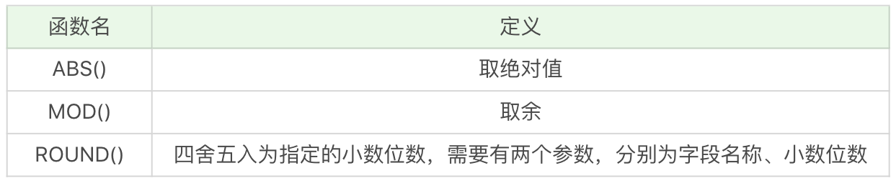
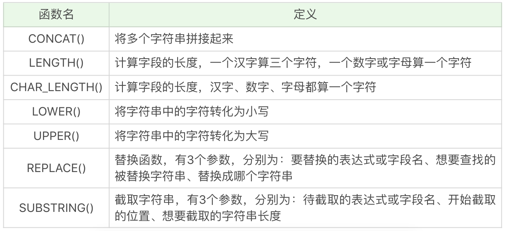

# SQL 函数


## 1. 什么是SQL函数

SQL中的函数一般是在数据上执行的，可以很方便地转换和处理数据。一般来说，当我们从数据表中检索出数据之后，就可以进一步对这些数据进行操作，得到更有意义的结果，比如返回指定条件的函数，或者求某个字段的平均值等。

**SQL 函数会导致查询不走索引，直接全表遍历，导致慢查询。一般是禁止WHERE 条件出现函数。**

## 2. 常用的SQL函数

SQL提供了一些常用的内置函数，当然你也可以自己定义SQL函数。

我们可以把内置函数分成四类：

* 1）算术函数
* 2）字符串函数
* 3）日期函数
* 4）转换函数


### 1. 算术函数



对数值类型的字段进行算术运算。

```mysql
#运行结果为2。
SELECT ABS(-2) 
#运行结果2。
SELECT MOD(101,3) 
#运行结果37.3。
SELECT ROUND(37.25,1) 
```


### 2. 字符串函数



常用的字符串函数操作包括了字符串拼接，大小写转换，求长度以及字符串替换和截取等。

```mysql
#运行结果为abc123。
SELECT CONCAT('abc', 123) 
#运行结果为6。
SELECT LENGTH('你好') 
#运行结果为2。
SELECT CHAR_LENGTH('你好')
#运行结果为abc。
SELECT LOWER('ABC')
#运行结果ABC。
SELECT UPPER('abc')
# 运行结果为f123d。
SELECT REPLACE('fabcd', 'abc', 123)
# 运行结果为fab。
SELECT SUBSTRING('fabcd', 1,3)
```


### 3. 日期函数

日期函数是对数据表中的日期进行处理


```mysql
#运行结果为2020-06-17
SELECT CURRENT_DATE()
#运行结果为03:59:23
SELECT CURRENT_TIME()
#运行结果为2020-06-17 03:59:33
SELECT CURRENT_TIMESTAMP()
#运行结果为2020
SELECT EXTRACT(YEAR FROM '2020-06-17')
#运行结果为2020-06-17
SELECT DATE('2020-06-17 03:59:33')
```


### 4. 转换函数

转换函数可以转换数据之间的类型。


```mysql
#运行结果会报错
SELECT CAST(123.123 AS INT)
#运行结果为123.12
SELECT CAST(123.123 AS DECIMAL(8,2))
#运行结果为1
SELECT COALESCE(null,1,2)
```

**CAST函数在转换数据类型的时候，不会四舍五入，如果原数值有小数，那么转换为整数类型的时候就会报错，不过你可以指定转化的小数类型。**在MySQL和SQL Server中，你可以用`DECIMAL(a,b)`来指定，其中a代表整数部分和小数部分加起来最大的位数，b代表小数位数，比如`DECIMAL(8,2)`代表的是精度为8位（整数加小数位数最多为8位），小数位数为2位的数据类型。所以`SELECT CAST(123.123 AS DECIMAL(8,2))`的转换结果为123.12。
