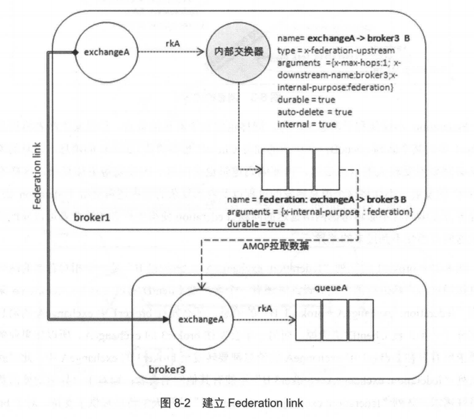
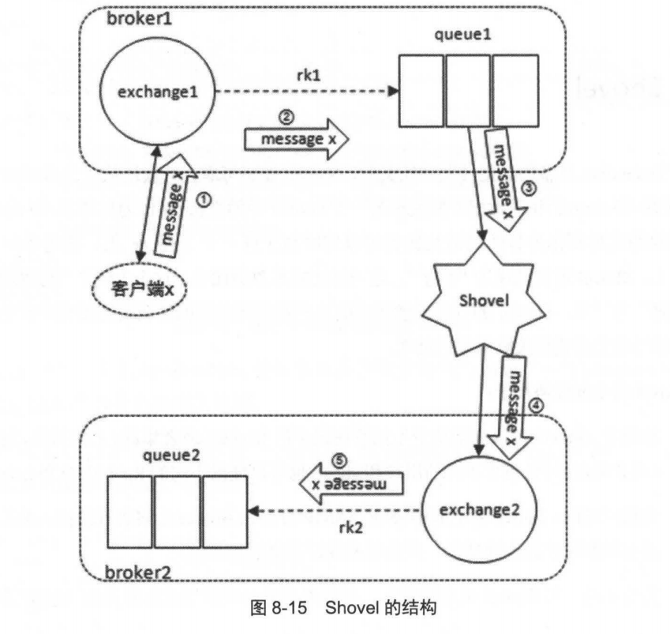

# 跨越集群的界限

## 1. 概述

RabbitMQ可以通过三种方式实现分布式部署：集群、Federation和Shovel。

这三种方式并不是互斥的，可以根据需求选择一种或者几种方式的组合来达到分布式部署的目的。

## 2. Federation  

Federation 插件的目标是使 RabbitMQ 在不同的 Broker 节点之间进行消息传递而无须建立集群，该功能在很多场景下都非常有用：

- Federation 插件能够在不同管理域（可能设置了不同的用户和 vhost ，也可能运行在不同版本的 RabbitMQ 和Erlang 上）中的Broker 或者集群之间传递消息。
- Federation 插件基于AMQP 0-9-1 协议在不同的Broker 之间进行通信，并设计成能够容忍不稳定的网络连接情况。
- 一个Broker 节点中可以同时存在联邦交换器(或队列)或者本地交换器(或队列)，只需要对特定的交换器(或队列)创建Federation 连接CFederation link ) 。
- Federation 不需要在 N 个Broker 节点之间创建O(N2)个连接(尽管这是最简单的使用方式) ，这也就意味着Federation 在使用时更容易扩展。

一个联邦交换器（federated exchange）或者一个联邦队列（federated queue） 接收上游（upstream) 的消息，这里的上游是指位于其他 Broker 上的交换器或者队列。联邦交换器能够将原本发送给上游交换器（upstream exchange）的消息路由到本地的某个队列中；联邦队列则允许一个本地消费者接收到来自上游
 队列C（upstream queue）的消息。

假设交换器A在部署在北京机房，交换器B部署在广州机房。此时部署在北京机房的ClientA因为业务需要可能会往交换器B发送消息，由于离得比较远所以延迟肯定特别大，尤其是开启了publisher confirm机制或事务机制那必然造成性能严重降低。

此时Federation插件的作用就提现出来了，在交换器A和交换器B之间通过QMQP协议建立一条Federation Link。 客户端直接向交换器A发送消息，然后就会自动转到交换器B。

## 3. Shovel

与 Federation 具备的数据转发功能类似， Shovel 能够可靠、持续地从一个Broker 中的队列（作为源端，即source ）拉取数据并转发至另一个Broker 中的交换器（作为目的端，即destination ）。
 作为源端的队列和作为目的端的交换器可以同时位于同一个 Broker 上，也可以位于不同的 Broker 上。

### 消息积压治理

当队列中积压消息过多时可能会出现一些严重问题，但是如果是一些比较重要的消息又不能丢弃。

Shlove刚好可以解决这个问题。

比例Cluster1中的队列queue1积压的大量消息，那么就可以通过Shovel将消息暂时转发到Cluster2中的queue2里存放着，等queue1这边消耗得差不多了再转回来。

