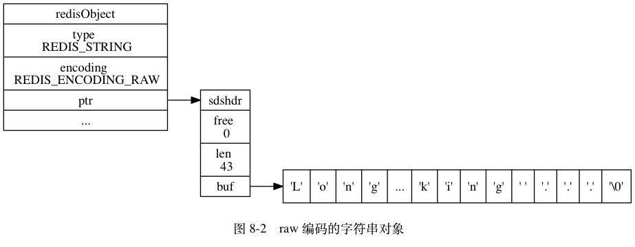
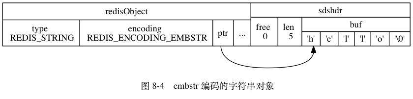
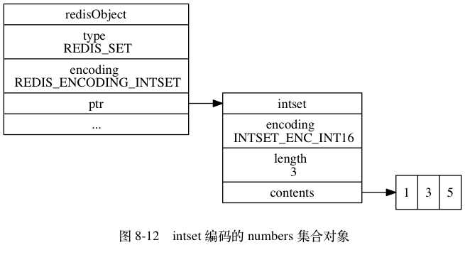
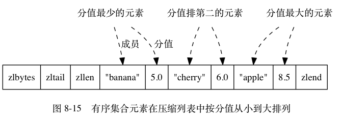

# Redis 数据类型底层实现


## 1. String

在Redis内部String对象的编码可以是 `int` 、 `raw` 或者 `embstr`

### 1. int

如果一个字符串对象保存的是整数值， 并且这个整数值可以用 `long` 类型来表示， 那么字符串对象会将整数值保存在字符串对象结构的 `ptr`属性里面（将 `void*` 转换成 `long` ）， 并将字符串对象的编码设置为 `int` 。


### 2. raw

如果字符串对象保存的是一个字符串值， 并且这个字符串值的长度大于 `39` 字节， 那么字符串对象将使用一个简单动态字符串（SDS）来保存这个字符串值， 并将对象的编码设置为 `raw` 。




### 3. embstr

如果字符串对象保存的是一个字符串值， 并且这个字符串值的长度小于等于 `39` 字节， 那么字符串对象将使用 `embstr` 编码的方式来保存这个字符串值。

`embstr` 编码是专门用于保存短字符串的一种优化编码方式， 这种编码和 `raw` 编码一样， 都使用 `redisObject` 结构和 `sdshdr` 结构来表示字符串对象， 但 `raw` 编码会调用两次内存分配函数来分别创建 `redisObject` 结构和 `sdshdr` 结构， 而 `embstr` 编码则通过调用一次内存分配函数来分配一块连续的空间， 空间中依次包含 `redisObject` 和 `sdshdr` 两个结构，



最后要说的是， 可以用 `long double` 类型表示的浮点数在 Redis 中也是作为字符串值来保存的： 如果我们要保存一个浮点数到字符串对象里面， 那么程序会先将这个浮点数转换成字符串值， 然后再保存起转换所得的字符串值。

### 4. 编码转换

`int` 编码的字符串对象和 `embstr` 编码的字符串对象在条件满足的情况下， 会被转换为 `raw` 编码的字符串对象。

对于 `int` 编码的字符串对象来说， 如果我们向对象执行了一些命令， 使得这个对象保存的不再是整数值， 而是一个字符串值， 那么字符串对象的编码将从 `int` 变为 `raw` 。

对于`embstr`来说，由于**Redis 没有为 `embstr` 编码的字符串对象编写任何相应的修改程序** ,所以 `embstr` 编码的字符串对象实际上是只读的： 当我们对 `embstr` 编码的字符串对象执行任何修改命令时， 程序会**先将对象的编码从 `embstr` 转换成 `raw` ， 然后再执行修改命令**； 因为这个原因， `embstr` 编码的字符串对象在执行修改命令之后， 总会变成一个 `raw` 编码的字符串对象。

同时`embstr`编码长度超过`39字节`后会自动转换到`raw`编码。

**为什么是39字节？**

embstr是一块连续的内存区域，由redisObject和sdshdr组成。其中redisObject占16个字节，当buf内的字符串长度是39时，sdshdr的大小为8+8+39+1=56，那一个字节是'\0'。加起来刚好64。

从2.4版本开始，redis开始使用jemalloc内存分配器。这个比glibc的malloc要好不少，还省内存。在这里可以简单理解，jemalloc会分配8，16，32，64等字节的内存。embstr最小为16+8+8+1=33，所以最小分配64字节。当字符数小于39时，都会分配64字节。
这个默认39就是这样来的

## 2. Hash

在Redis内部Hash对象的编码可以是 `ziplist(压缩列表)`和`hashtable(字典)`

数据量小的时候使用ziplist节省空间，数据量大的时候用hashtable降低操作复杂度。

### 1. ziplist

`ziplist` 编码的哈希对象使用压缩列表作为底层实现， 每当有新的键值对要加入到哈希对象时， 程序会先将保存了键的压缩列表节点推入到压缩列表表尾， 然后再将保存了值的压缩列表节点推入到压缩列表表尾， 因此：

- 保存了同一键值对的两个节点总是紧挨在一起， 保存键的节点在前， 保存值的节点在后；
- 先添加到哈希对象中的键值对会被放在压缩列表的表头方向， 而后来添加到哈希对象中的键值对会被放在压缩列表的表尾方向。


### 2. hashtable

`hashtable` 编码的哈希对象使用字典作为底层实现， 哈希对象中的每个键值对都使用一个字典键值对来保存：

- 字典的每个键都是一个字符串对象， 对象中保存了键值对的键；
- 字典的每个值都是一个字符串对象， 对象中保存了键值对的值。


### 3. 编码转换

当哈希对象可以同时满足以下两个条件时， 哈希对象使用 `ziplist` 编码：

1. 哈希对象保存的所有键值对的键和值的字符串长度都小于 `64` 字节；
2. 哈希对象保存的键值对数量小于 `512` 个；

不能满足这两个条件的哈希对象需要使用 `hashtable` 编码。


>  注意:这两个条件的上限值是可以修改的， 具体请看配置文件中关于 `hash-max-ziplist-value` 选项和 `hash-max-ziplist-entries` 选项的说明。

对于使用 `ziplist` 编码的列表对象来说， 当使用 `ziplist` 编码所需的两个条件的任意一个不能被满足时， 对象的编码转换操作就会被执行： 原本保存在压缩列表里的所有键值对都会被转移并保存到字典里面， 对象的编码也会从 `ziplist` 变为 `hashtable` 。


## 3. List

在Redis内部List对象的编码可以是`ziplist(压缩列表)`和`linkedlist(链表)`。

数据量小的时候使用ziplist节省空间，数据量大的时候用linkedlist降低操作复杂度。

### 1. ziplist

`ziplist` 编码的列表对象使用压缩列表作为底层实现， 每个压缩列表节点（entry）保存了一个列表元素。


### 2. linkedlist

 `linkedlist` 编码的列表对象使用双端链表作为底层实现， 每个双端链表节点（node）都保存了一个字符串对象， 而每个字符串对象都保存了一个列表元素。


### 3. 编码转换

当列表对象可以同时满足以下两个条件时， 列表对象使用 `ziplist` 编码：

1. 列表对象保存的所有字符串元素的长度都小于 `64` 字节；
2. 列表对象保存的元素数量小于 `512` 个；

不能满足这两个条件的列表对象需要使用 `linkedlist` 编码。


> 注意:以上两个条件的上限值是可以修改的， 具体请看配置文件中关于 `list-max-ziplist-value` 选项和 `list-max-ziplist-entries` 选项的说明。

对于使用 `ziplist` 编码的列表对象来说， 当使用 `ziplist` 编码所需的两个条件的任意一个不能被满足时， 对象的编码转换操作就会被执行： 原本保存在压缩列表里的所有列表元素都会被转移并保存到双端链表里面， 对象的编码也会从 `ziplist` 变为 `linkedlist` 。


## 4. Set

在Redis内部Set对象的编码可以是`intset(整数集合)`和`hashtable(字典)`。

### 1. intset

`intset` 编码的集合对象使用整数集合作为底层实现， 集合对象包含的所有元素都被保存在整数集合里面。




### 2. hashtable

`hashtable` 编码的集合对象使用字典作为底层实现， 字典的每个键都是一个字符串对象， 每个字符串对象包含了一个集合元素， 而字典的值则全部被设置为 `NULL`


### 3. 编码转换

当集合对象可以同时满足以下两个条件时， 对象使用 `intset` 编码：

1. 集合对象保存的所有元素都是整数值；
2. 集合对象保存的元素数量不超过 `512` 个；

不能满足这两个条件的集合对象需要使用 `hashtable` 编码。


>注意:第二个条件的上限值是可以修改的， 具体请看配置文件中关于 `set-max-intset-entries` 选项的说明。

对于使用 `intset` 编码的集合对象来说， 当使用 `intset` 编码所需的两个条件的任意一个不能被满足时， 对象的编码转换操作就会被执行： 原本保存在整数集合中的所有元素都会被转移并保存到字典里面， 并且对象的编码也会从 `intset` 变为 `hashtable` 。

## 5. ZSet

在Redis内部Set对象的编码可以是`ziplist(压缩列表)`、`skiplist(跳跃表)`。

其中`skiplist`编码由`skiplist`和`hashtable`一起实现。

### 1. ziplist

`ziplist` 编码的有序集合对象使用压缩列表作为底层实现， 每个集合元素使用两个紧挨在一起的压缩列表节点来保存， 第一个节点保存元素的成员（member）， 而第二个元素则保存元素的分值（score）。

压缩列表内的集合元素按分值从小到大进行排序， 分值较小的元素被放置在靠近表头的方向， 而分值较大的元素则被放置在靠近表尾的方向。




### 2. skiplist

`skiplist` 编码的有序集合对象使用 `zset` 结构作为底层实现， 一个 `zset` 结构同时包含一个字典和一个跳跃表

```c
typedef struct zset {

    zskiplist *zsl;

    dict *dict;

} zset;
```

`zset` 结构中的 `zsl` 跳跃表按分值从小到大保存了所有集合元素， 每个跳跃表节点都保存了一个集合元素： 跳跃表节点的 `object` 属性保存了元素的成员， 而跳跃表节点的 `score` 属性则保存了元素的分值。

**通过这个跳跃表， 程序可以对有序集合进行范围型操作**， 比如 ZRANK 、ZRANGE 等命令就是基于跳跃表 API 来实现的。

除此之外， `zset` 结构中的 `dict` 字典为有序集合创建了一个从成员到分值的映射， 字典中的每个键值对都保存了一个集合元素： 字典的键保存了元素的成员， 而字典的值则保存了元素的分值。

 **通过这个字典， 程序可以用 O(1) 复杂度查找给定成员的分值**， ZSCORE 命令就是根据这一特性实现的

两种数据结构都会通过指针来共享相同元素的成员和分值， 所以同时使用跳跃表和字典来保存集合元素不会产生任何重复成员或者分值， 也不会因此而浪费额外的内存。

 `skiplist` 编码的有序集合对象会是下图(8-16)所示的样子


 而对象所使用的 `zset` 结构将会是图 8-17 所示的样子。


**为什么要用两种数据结构来实现?**

虽然只用字典或者跳跃表也可以实现，但是会丢失掉另一个数据结构的特性。

假设只有字典,那么只需范围操作时需要对数据进行排序处理，至少需要O(NlogN)复杂度和O(N)的空间。

如果只有跳跃表则根据key获取score这一操作复杂度将从O(1)提升到O(logN)。

所以最终选择了字典和跳跃表一起实现。


### 3. 编码转换

当有序集合对象可以同时满足以下两个条件时， 对象使用 `ziplist` 编码：

1. 有序集合保存的元素数量小于 `128` 个；
2. 有序集合保存的所有元素成员的长度都小于 `64` 字节；

不能满足以上两个条件的有序集合对象将使用 `skiplist` 编码。


> 注意:以上两个条件的上限值是可以修改的， 具体请看配置文件中关于 `zset-max-ziplist-entries` 选项和 `zset-max-ziplist-value` 选项的说明。

对于使用 `ziplist` 编码的有序集合对象来说， 当使用 `ziplist` 编码所需的两个条件中的任意一个不能被满足时， 程序就会执行编码转换操作， 将原本储存在压缩列表里面的所有集合元素转移到 `zset` 结构里面， 并将对象的编码从 `ziplist` 改为 `skiplist` 。