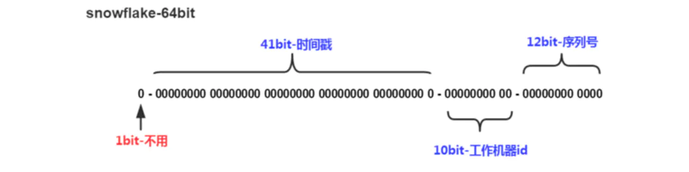

# 分布式唯一 ID 方案

## 1. 概述

ID是数据的唯一标识，传统的做法是利用UUID和数据库的自增ID。

> 在互联网企业中，大部分公司使用的都是Mysql，并且因为需要事务支持，所以通常会使用Innodb存储引擎，UUID太长以及无序，所以并不适合在Innodb中来作为主键，自增ID比较合适。

**那为什么需要分布式 ID 呢？**

随着公司的业务发展，数据量将越来越大，需要对数据进行分库分表，而**分库分表后数据库的自增ID显然不能满足需求**，很有可能出现ID冲突。

这时就需要一个单独的机制来负责生成唯一ID，生成出来的ID也可以叫做**分布式ID**，或**全局ID**。下面来分析各个生成分布式ID的机制。


## 2. UUID

UUID是通用唯一识别码（Universally Unique Identifier)的缩写，开放软件基金会(OSF)规范定义了包括网卡MAC地址、时间戳、名字空间（Namespace）、随机或伪随机数、时序等元素。利用这些元素来生成UUID。


UUID的优点:

* 通过本地生成，没有经过网络I/O，性能较快
* 无序，无法预测他的生成顺序。(当然这个也是他的缺点之一)

UUID的缺点:

* 128位二进制一般转换成36位的16进制，太长了只能用String存储，空间占用较多。
* 不能生成递增有序的数字

适用场景:UUID的适用场景可以为不需要担心过多的空间占用，以及不需要生成有递增趋势的数字。


## 3. 数据库主键自增

大家对于唯一标识最容易想到的就是主键自增，这个也是我们最常用的方法。例如我们有个订单服务，那么把订单id设置为主键自增即可。

优点:

- 简单方便，有序递增，方便排序和分页

缺点:

- 分库分表会带来问题，需要进行改造。
- 并发性能不高，受限于数据库的性能。
- 简单递增容易被其他人猜测利用，比如你有一个用户服务用的递增，那么其他人可以根据分析注册的用户ID来得到当天你的服务有多少人注册，从而就能猜测出你这个服务当前的一个大概状况。
- 数据库宕机服务不可用。

适用场景: 根据上面可以总结出来，当数据量不多，并发性能不高的时候这个很适合，比如一些to B的业务，商家注册这些，商家注册和用户注册不是一个数量级的，所以可以数据库主键递增。如果对顺序递增强依赖，那么也可以使用数据库主键自增。


## 4. Redis

Redis中有两个命令Incr，IncrBy,因为Redis是单线程的所以能保证原子性。

优点：

- 性能比数据库好，能满足有序递增。

缺点：

- 由于redis是内存的KV数据库，即使有AOF和RDB，但是依然会存在数据丢失，有可能会造成ID重复。
- 依赖于redis，redis要是不稳定，会影响ID生成。

适用：由于其性能比数据库好，但是有可能会出现ID重复和不稳定，这一块如果可以接受那么就可以使用。也适用于到了某个时间，比如每天都刷新ID，那么这个ID就需要重置，通过(Incr Today)，每天都会从0开始加。


## 5. 雪花算法-Snowflake

Snowflake是Twitter提出来的一个算法，其目的是生成一个64bit的整数:

```go
+--------------------------------------------------------------------------+
| 1 Bit Unused | 41 Bit Timestamp |  10 Bit NodeID  |   12 Bit Sequence ID |
+--------------------------------------------------------------------------+
```





* `1位`，不用。二进制中最高位为1的都是负数，但是我们生成的id一般都使用整数，所以这个最高位固定是0
* `41位`，用来记录时间戳（毫秒）。
  - 41位可以表示`2^41-1`个数字，
  - 如果只用来表示正整数（计算机中正数包含0），可以表示的数值范围是：0 至 2^41-1 ，减1是因为可表示的数值范围是从0开始算的，而不是1。
  - 也就是说 41 位可以表示 2^41-1个毫秒的值，转化成单位年则是 69 年
* `10位`，用来记录工作机器id。
  - 可以部署在 2^10 个节点，包括`5位datacenterId`和`5位workerId`
  - `5位（bit）`可以表示的最大正整数是，即可以用0、1、2、3、....31这32个数字，来表示不同的datecenterId 或 workerId
* `12位`，序列号，用来记录同毫秒内产生的不同id。
  - `12位（bit）`可以表示的最大正整数是 2^12-1，即可以用 0~4095 共 4096 个数字，来表示同一机器同一时间戳（毫秒)内产生的 4096 个ID序号


SnowFlake可以保证：

- 所有生成的id按时间趋势递增
- 整个分布式系统内不会产生重复id（因为有 datacenterId 和 workerId 来做区分）


适用场景:当我们需要无序不能被猜测的ID，并且需要一定高性能，且需要long型，那么就可以使用我们雪花算法。比如常见的订单ID，用雪花算法别人就无法猜测你每天的订单量是多少。


> golang 实现`https://github.com/bwmarrin/snowflake`


原文`https://juejin.im/post/5bb0217ef265da0ac2567b42`