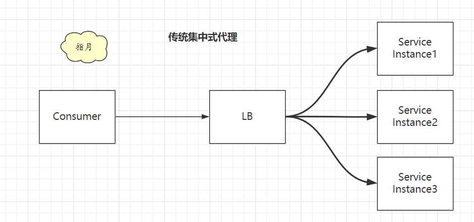
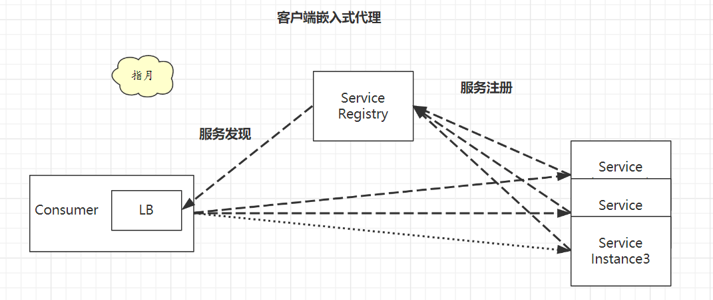
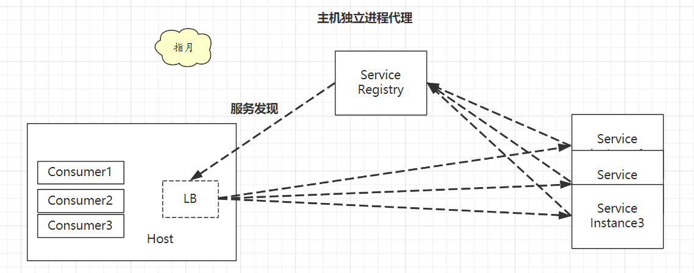

# 微服务架构

## 1. 定义

基于`有界上下文`的，`松散耦合`的面向服务的架构。

> Loosely coupled service oriented architecture with bounded context

有如下特点：

* 1）⼀种架构风格，将单体应用划分成`⼀组小的服务`，服务之间相互协作，实现业务功能
* 2）每个服务运⾏在`独立的进程`中，服务间采⽤`轻量级的通信机制`协作（通常是HTTP/JSON） 
* 3）每个服务`围绕业务能⼒进⾏构建`，并且能够通过⾃动化机制`独立地部署`
* 4）`很少有集中式的服务管理`，每个服务可以使⽤不同的语⾔开发，使用不同的存储技术

## 2. 利弊

利

* 1）强化模块边界
* 2）可独立部署
* 3）技术多样性

弊

* 1）分布式系统复杂性
* 2）最终一致性
* 3）运维复杂性
* 4）测试复杂性

## 康威法则

设计系统的组织，其产⽣的架构设计等价于组织间的沟通结构。

> Organizations which design systems … are constrained to produce designs which are copies of the communication structures of these organizations

简单来说就是，最初是一个单体应用，由一个团队维护，团队与服务都是1个，符合康威法则。随着业务发展单体应用现在变成了3个团队在维护了，这样团队是3个，服务还是一个，违背了康威法则，所以此时需要将单体应用拆分为3个服务。

## 微服务架构与团队

**什么时候用微服务**

对于大部分企业，项目之初都应该使用单体架构。单体模式在项目之初复杂度较低，开发效率高。

随着业务发展，项目变得复杂，单独架构开发起来就比较慢了，此时就可以选择微服务架构。

> 项目初复杂度低，单体架构简单，开发效率高。后续项目复杂度提升，单体架构开发效率逐渐降低，甚至远低于微服务架构。此时就可以使用微服务架构。

**什么团队更适合微服务**

普通团队一般按职能分，比如分为产品、设计、研发、测试、运维等多个团队。这样的组织架构下一个产品问题可能需要跨越多个团队沟通，效率较低。

按照亚马逊的`两个披萨`原则，每个微服务团队人数应该保持在两个披萨就可以喂饱的程度（一般不超过20人）。

这样一个团队中应该包括从产品到设计、研发、测试等等职能人员。这样产品问题只需要在单个团队内沟通，可以极大提高效率。

同时亚马逊还提倡，Who build it，Who run it. 即谁写的代码就由谁来维护,这样大家在编码的时候就会考虑得更长远。

## 服务注册发现

常见的服务发现模式有3种。

**1）传统集中式代理**

这是最简单和传统做法，在服务消费者和生产者之间，代理作为独立一层集中部署，由独立团队(一般是运维或框架)负责治理和运维。常用的集中式代理有硬件负载均衡器(如F5)，或者软件负载均衡器(如Nginx)，F5(4层负载)+Nginx(7层负载)这种软硬结合两层代理也是业内常见做法，兼顾配置的灵活性(Nginx比F5易于配置)。

**2）客户端嵌入式代理**

这是很多互联网公司比较流行的一种做法，代理(包括服务发现和负载均衡逻辑)以客户库的形式嵌入在应用程序中。这种模式一般需要独立的服务注册中心组件配合，服务启动时自动注册到注册中心并定期报心跳，客户端代理则发现服务并做负载均衡。

**3）主机独立进程代理**

这种做法是上面两种模式的一个折中，代理既不是独立集中部署，也不嵌入在客户应用程序中，而是作为独立进程部署在每一个主机上，一个主机上的多个消费者应用可以共用这个代理，实现服务发现和负载均衡，如下图所示。这个模式一般也需要独立的服务注册中心组件配合，作用同模式二。

各个模式对比：

| 模式             | 优点                         | 缺点                                       | 适用场景               |
| ---------------- | ---------------------------- | ------------------------------------------ | ---------------------- |
| 集中式代理       | 运维简单、集中治理、语言无关 | 配置麻烦、有单点问题、多一层访问的性能开销 | 比较通用、一定运维能力 |
| 客户端嵌入式代理 | 无单点、性能好               | 客户端复制、多语言麻烦、治理松散           | 语言栈统一             |
| 主机独立进程代理 | 折中方案                     | 运维部署复杂                               | 运维能力强             |

> 所谓的ServiceMesh，其实本质上就是上面提到的模式三。

## 服务网关

网关一般包括如下功能：

* 1）反向路由
* 2）认证安全
* 3）限流熔断
* 4）日志监控

网关一般使用 Filter 或者 Middleware 方式增加功能。

路由前Filter、路由Filter、路由后Filter，分别对应请求执行的前中后三个时间点。

## 配置中心

以配置文件方式保存配置与微服务架构明显不搭，于是引入了配置中心的概念。

配置文件存在在配置中心，由配置中心推送给各个服务，或者各个服务定时拉取。

## 通信方式

* 1）同步
  * REST
  * RPC
* 2）异步
  * MQ

对比

| 项目       | RPC                                          | REST                                 |
| ---------- | -------------------------------------------- | ------------------------------------ |
| 耦合性     | 强耦合                                       | 松散耦合                             |
| 消息协议   | 二进制（thrift、protobuf）                   | 文本(JSON、XML)                      |
| 通讯协议   | TCP(HTTP2)                                   | HTTP/HTTP2                           |
| 性能       | 高                                           | 一般低于RPC                          |
| IDL        | Thrift、Protobuf                             | OpenAPI                              |
| 客户端     | 强类型客户端、一般自动生成，可支持多语言     | 一般 HTTP Client 即可                |
| 案例       | gRPC、Thrift、Dubbo                          | SpringMVC、SpringBoot                |
| 开发者友好 | 客户端自动生成比较方便，但是二进制消息不可读 | 浏览器就可直接访问，文本消息可读性好 |
| 对外开放   | 一般要转换成 REST                            | 可以直接对外开放                     |

## 服务框架与治理

相关技术

配置中心、服务注册发现、软负载、日志、Metrics、链路追踪、限流熔断、安全&访问控制、REST/RPC、序列化XML/JSON/二进制、底层通讯TCP/HTTP

统一异常处理、文档等等。

## 监控体系

分层

* 1）端用户体验监控：性能，返回码、城市、地区、运营商、版本、系统等)
* 2）业务监控：核心指标监控，登录注册，下单，支付等
* 3）应用层监控：url, service, sql, cache可用率，响应时间，qps等
* 4）系统层监控（物理机，虚拟机，OS)：cpu, memory, network, disk等
* 5）基础设施监控(网络，交换机)：网络流量，丢包，错包，连接数等

5个大类

* 1）日志
* 2）调用链
* 3）Metrics
* 4）监控检查
* 5）告警系统

## Go语言常用组件

网关：Kong

日志：ELK

调用链 Jaeger、Zipkin

Metric：Prometheus Grafana

注册中心：etcd

配置中心：etcd

熔断：Hystrix

云环境：Kubernetes

CI、CD：Git Jenkins Docker

