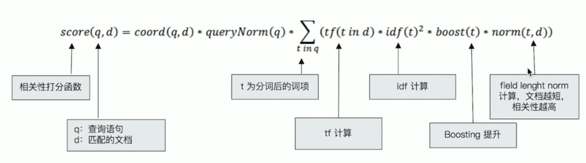
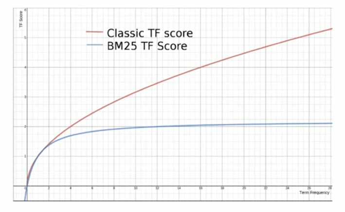
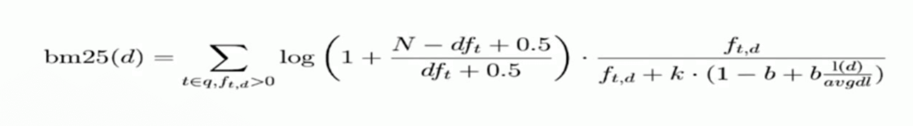

# 相关性算分

## 1. 相关性 - Relevance

搜索的相关性算分，描述了一个**文档**和**查询语句**的匹配程度。

ES 5 之前，默认的相关性算分采用 TF-IDF，现在采用 BM 25。


## 2. 词频 TF

Term Frequency - 检索词在一篇文章中出现的频率

* 检索词出现的次数 / 文档总字数

* 度量一条查询的结果文档相关性的简单方法 - 简单搜索中每一个词的 TF 进行相加 --- TF1 + TF2 + ...+ TFn=
* Stop Word --- 比如`的`字会出现很多次，但是对相关度几乎没有用处，所以应该过滤这种词

## 3. 逆文档词频 IDF

*  DF - 检索词在所有文档中出现的频率
* IDF - Inverse Document Frequency
  * 简单来说 = log(总文档数 / 检索词出现过的文档总数)
* TF-IDF 本质上就是将 TF 求和变成了加权求和

例如

搜索语句为`区块链的应用`

分词为 区块链、的、应用

假设分布如下

| 分词   | 出现的文档数 | 总文档数 | IDF           |
| ------ | ------------ | -------- | ------------- |
| 区块链 | 200 万       | 10 亿    | log(500)=8.96 |
| 的     | 10 亿        | 10 亿    | log(1) = 0    |
| 应用   | 5 亿         | 10 亿    | log(2) = 1    |

结果为

```shell
TF(区块链)*IDF(区块链) + TF(的)*IDF(的) + TF(应用)*IDF(应用)
```

## 4. ES 相关性算法

### TF-IDF 概念

* TF-IDF 被公认为是信息检索领域最重要的发明
* 现代搜索引擎，对 TF-IDF 进行了大量细微的优化


Lucene 中 的 TF-IDF



> 具体可以查看 [lucene官网](https://lucene.apache.org/core/5_5_0/core/org/apache/lucene/search/similarities/TFIDFSimilarity.html)

**其中的 Boost 可以用于人为提升分数**，不需要了解太深，知道 TF、IDF、Boost 就行了。


### BM 25

* ES 5 开始，默认算法改为了 BM 25

* 和经典的 TF-IDF 相比，当 TF 无限增加时，BM 25 算分会趋近于一个数值。



具体公式如下



### Boosting Relevance

* Boosting 是控制相关度的一种手段
  * 索引，字段，或查询子条件
* 参数 boost 的含义
  * 当 boost > 1 时，打分的相关度相对性提升
  * 当 0 <boost<1 时，打分的权重相对性降低
  * 当 boost <0 时，贡献负分

```shell
POST testscore/_search
{
    "query": {
        "boosting" : {
            "positive" : {
                "term" : {
                    "content" : "elasticsearch"
                }
            },
            "negative" : {
                 "term" : {
                     "content" : "like"
                }
            },
            "negative_boost" : 0.2
        }
    }
}
```

