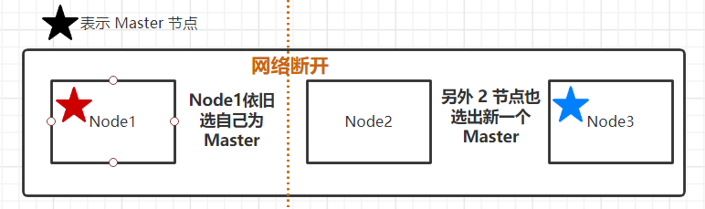

# 分布式模型及选主与脑裂问题

## 1. 节点类型

* Data Node
  * 负责保存分片数据，在数据扩展上起到了至关重要的作用
* CoordinatingNode
  * 负责接受 Client 的请求
  * 将请求路由到合适的节点，最终把结果汇集到一起
  * 每个节点都默认起到了 Coordinating Node 的职责

* Master Node
  * 负责创建，删除索引等请求，负责索引的创建与删除
  * 决定分片被分配到哪个节点
  * Master 节点非常重要，部署上需要考虑解决单点问题
  * 为每个集群设置多个 Master 节点
  * 每个节点只承担 Master 的单一角色

## 2. 集群状态

* 集群状态信息（Cluster State），维护了一个集群中，必要的信息
  * 所有的节点信息
  * 所有的索引和其相关的 Mapping 与 Setting 信息
  * 分片的路由信息
* 在每个节点上都保持了集群的状态信息
* 但是只有 Master 节点才能修改集群状态信息，并负责同步给其他节点
  * 如果任意节点都能修改，则会导致 Cluster State 信息不一致

## 3. 选主流程

* 一个集群，支持配置多个 Master Eligible 节点。这些节点可以在必要时（如 Master 节点出现故障，网络故障时）参与选主流程，从中选出 Master 节点
* 每个节点启动后，默认就是一个 Master eligible 节点
  * 可以设置 node.master:fasle 禁止
* 当集群内第一个 Master eligible 节点启动时，它会将自己选举成为 Master 节点

Master Eligible Nodes 选主具体流程

* 1）互相 Ping 对方，Node Id 小的会成为被选举的节点
* 2）其他节点会加入集群，但是不承担 Master 节点的角色。一旦发现被选中的主节点丢失，就会选举出新的 Master 节点

## 4. 脑裂问题

Split-Brain，分布式系统的经典网络问题，当网络出现问题，一个节点与其他节点无法连接

* Node 2 与 Node 3 会重新选举 Master
* Node1 自己还是作为 Master，组成一个集群，同时更新 Cluster State
* 这样就出现了两个 Master，维护着不同的 cluster State，当网络恢复后，数据无法正确恢复

如何避免

* 限定一个选举条件，设置 quorum（仲裁），只有在 Master eligible 节点数大于等于 quorum 时才进行选举
  * Quorum =（master 候选节点总数 / 2）+1
  * 当 3 个Master eligible 节点时，设置 discovery.zen.minimum_master_nodes 为 2,即可避免脑裂，这样设置后，集群分成 1节点和 2节点两个集群，1节点的集群就无法进行选主操作
* 从 7.0 开始，移除了这个配置（因为并不是所有人都能把这个值设置对）
  * 移除 minimum_master_nodes 参数，让 elasticsearch 自己选择可以形成仲裁的节点
  * 典型的主节点选举现在只需要很短的时间就可以完成，集群的伸缩变得更安全、更容易，并且可能造成丢失数据的系统配置选项更少了。
  * 节点更清楚地记录它们的状态，有助于诊断为什么它们不能加入集群或为什么无法选举出主节点