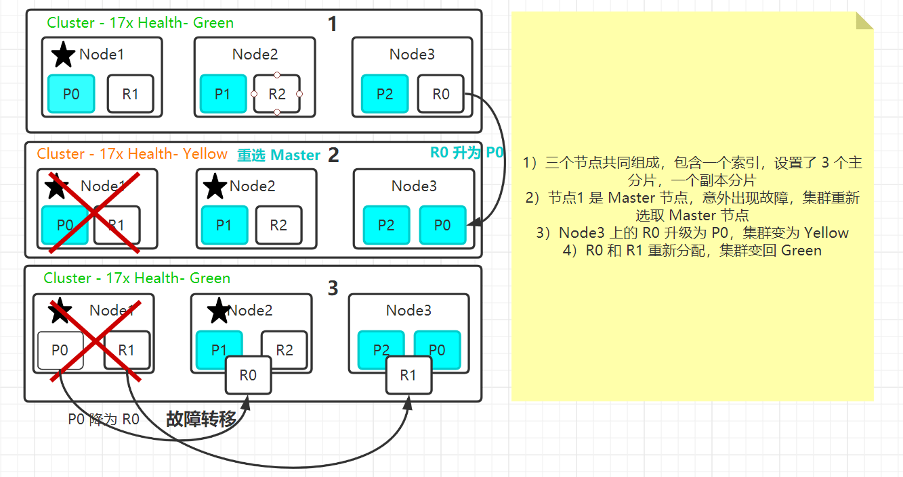

# elasticsearch 分片与集群故障转移

## 1. Replica Shard

* 提高数据可用性
  * 通过引入副本分片（Replica Shard），一旦主分片丢失，副本分片可以 Promote 成主分片。副本分片数可以动态调整。每个节点上都有完备的数据。
  * 如果没设置副本分片，一旦出现节点硬件故障，就可能造成数据丢失。
* 提升系统的读取性能
  * 副本分片由主分片（Primary Shard）同步。通过支持增加 Replica 个数，一定程度可以提高读取的吞吐量。


## 2. 分片数的设定

如何规划一个索引的主分片数和副本分片数？
* 主分片数过小 - 例如设定为 1个
  * 如果该索引增长过快，集群无法通过增加节点实现对这个索引的数据扩展
* 主分片数过大 - 导致单个 Shard 容量很小，引发一个节点上有过多分片，影响性能
* 副本分片数设置过多，会降低集群整体的写入性能

> 需要注意的是 假设副本分片设置为1是会为每一个主分片增加一个副本分片，而不是一共就一个副本分片。


## 3. 集群健康状态

```shell
GET _cluster/health
```

* Green - 主分片与副本都正常分配

* Yellow - 主分片全部正常分片，有副本分片未能正常分配

* Red - 有主分片未能分配
  * 例如。在服务器的磁盘容量超过 85% 时，去创建了一个新的索引

## 4. 故障转移流程

具体流程如下图：

