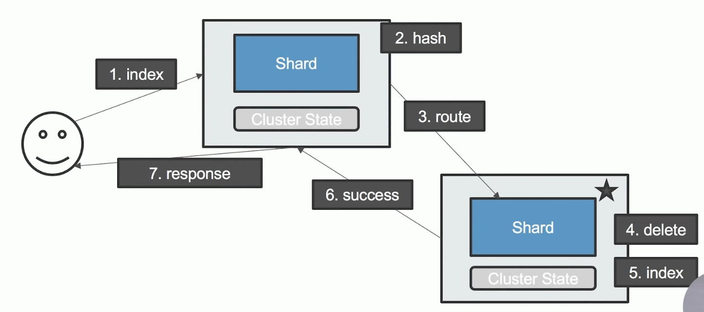
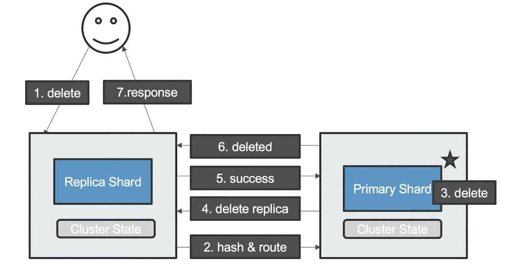

# 文档分布式存储

## 1. 概述

文档会存储在具体的某个主分片和副本分片上。

文档到分片的映射算法：
* 确保文档能均匀分布在所有分片上，充分利用硬件资源，避免部分机器空闲，部分机器繁忙
* 潜在的算法
  * 随机 / Round Robin - 当查询文档时，若分片很多，需要多次查询才能随机到正确的分片上查到文档
  * 维护文档到分片的映射关系，当文档数据量大的时候，维护成本高
  * 实时计算，通过文档自动算出，需要去哪个分片上获取文档。


## 2. 路由算法

具体公式如下：

```shell
shard = hash(_routing) % number_of_primary_shards
```

* Hash 算法确保文档均匀分散到分片中
* 默认的 _routing 值是文档 id（可自定义）
* 可以自行定制 routing 数值，例如 用相同国家的商品，都分配到指定的 shard
* 设置 Index Settings 后，**Primary 数不能随意修改就是因为这里用到了**

**自定义 routing**

> 不使用默认的文档id而是自定义字段来做路由。

```shell
# 自定义 routing
PUT posts/_doc/100?routing=bigdata
{
	"title": "Mastering Elasticsearch",
	"body": "Let's Rock"
}
```


## 3. 文档操作流程

### 1. Index

假设要 Index 一个文档。  

首先请求会随便发到某个节点（假设这里是A），然后根据 hash 算法，找出具体的分片及其所在节点（假设为B），把请求转发给节点B。

节点B 处理完成后，在把结果返回给节点A，最后由节点A把结果返回给用户。




### 2. delete

删除流程也差不多,唯一区别是，主节点删除后会把告诉副本分片所在节点把副本分片中的数据也删掉。

