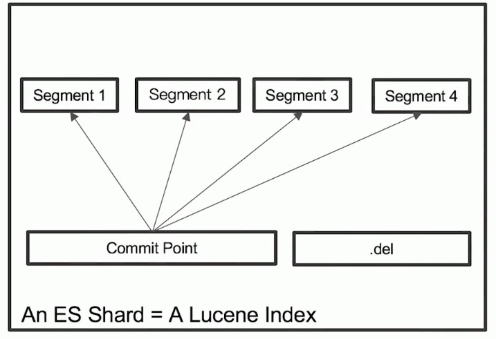
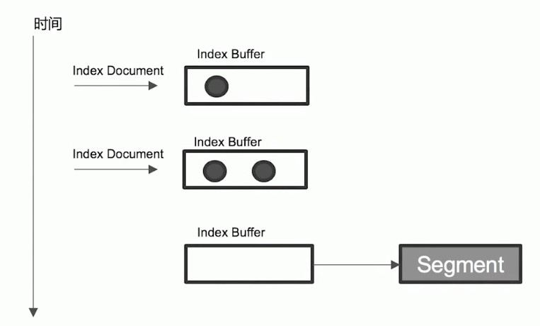
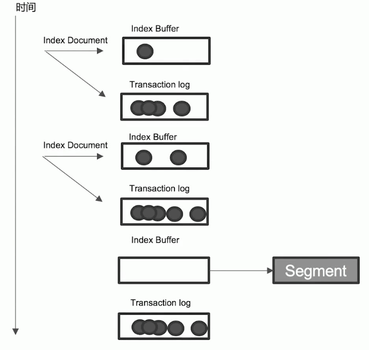

# 分片及其生命周期

## 1. 分片的内部原理

什么是 ES 的分片？
* ES 中最小的工作单元
* 是一个 Lucene 的 Index

一些问题：
* 为什么 ES 的搜索是近实时的（1 秒后才会被搜到）
* ES 如何保证在断电时数据也不会丢失
* 为什么删除文档，并不会立刻释放空间

## 2. 倒排索引不可变性

* 倒排索引采用 Immutable Design，一旦生成，不可更改
* 不可变性带来的好处
  * 无需考虑并发写文件的问题，避免了锁机制带来的性能问题
  * 一旦读入内核的文件系统缓存，便留在哪里。只要文件系统存有足够的空间，大部分请求就会直接请求内存，不会命中磁盘，提升了很大的性能
  * 缓存容易生成和维护 / 数据可以被压缩
* 不可变性带来的挑战
  * 如果需要让一个新的文档可以被搜索，需要重建整个索引

## 3. Lucene Index

* 在 Lucene 中，单个倒排索引文件被称为 **Segment**。Segment 是自包含的，**不可变更**的。多个 Segment 汇总在一起，称为 Lucene 的 Index，其对应的就是 ES 中的 Shard。
* 当有新文档写入时，会生成新的 Segment，查询时会同时查询所有的 Segments，并对结果汇总。 Lucene 中有一个文件，用来记录所有 Segments 信息，叫做 Commit Point
* 删除的文档信息，保存在`.del`文件中

## 4. Refresh

往 ES 中新增数据时，会先写入 `Index buffer`，每过一段时间再把 `Index buffer`刷新到 Segment。

* 将 Index buffer 写入 Segment 的过程叫做 Refresh。Refresh 不执行 fsync 操作
* Refresh 频率 ：默认 1 秒发生一次，可通过 `index.refresh.interval` 配置。Refresh 后，数据就可以被搜索到了，这也就是为什么 Elasticsearch 被称为近实时搜索。
* 如果系统有大量的数据写入，那就会产生很多的 Segment。
* Index Buffer 被占满时，也会触发 Refresh，Index Buffer 默认大小是 JVM 的 10%

## 5. Transaction Log

> 感觉就是 write ahead log（WAL），MySQL 中的 redo log 也是用到了这个技术
>

* Segment 写入磁盘的过程相对耗时，借助文件系统缓存，Refresh 时，先将Segment 写入缓存以开放查询
* 为了保证数据不会丢失，会在 Index 文档时，同时写 Transaction Log，高版本开始，Transaction Log 默认落盘，每个分片有一个 Transaction Log。
* 在 ES Refresh 时，Index Buffer 被清空，Transaction Log 不会清空。
* 当断电重启后，ES 就可以从 Transaction Log 中 recover 数据。

具体过程如下

## 6.  Flush

ES Flush 就等于是 Lucene Commit

1. 调用 Refresh， 清空 Index Buffer 并将内容写入到 Segments
2. 调用 fsync，将缓存中的 Segments 写入磁盘
3. 清空（删除）Transaction Log

触发时机：

* 默认 30 分钟调用一次
* Transaction Log 写满时也会调用（默认 512MB）

## 7. Merge

Merge 操作主要做两件事：

1. 合并 Segment ，以减少 Segments 数量
2. 删除已经删除的文档（以前删除只是标记删除，这里才是真的删除了）

ES 和 Lucene 会自动进行 Merge 操作也可以手动调用API`POST my_index/_forcemerge`