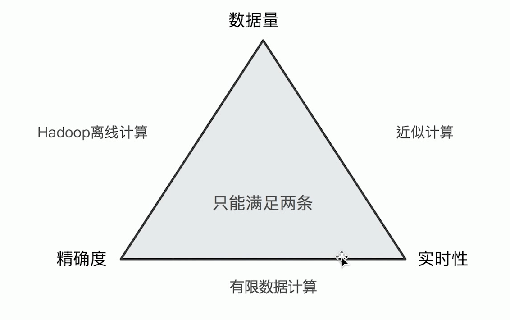
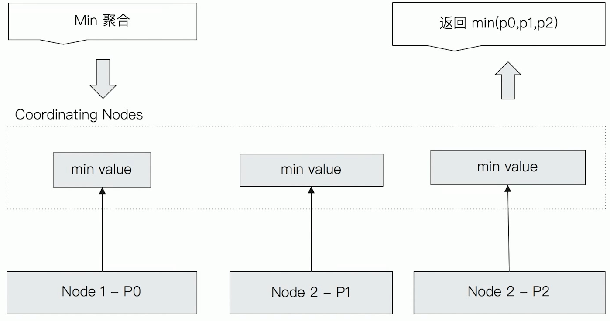
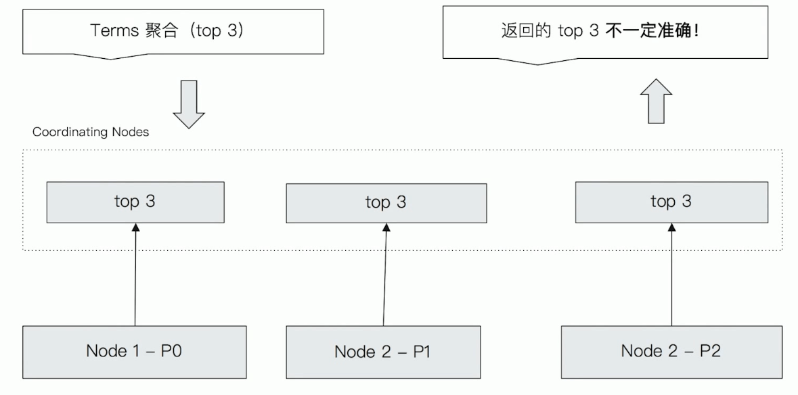
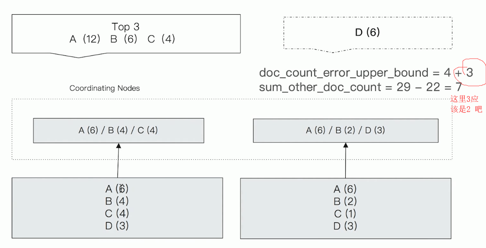

# 聚合分析原理及精度问题

## 1. 分布式系统的近似统计算法

类似 CAP 定理，在统计算法中的 数据量、实时性、精确度也只能满足其中两条。

在 ES 中

* 数据量不大时- 可以满足精确度和实时性
* 数据量大时 - 由于会分布在不同分片上，为了保证实时性，所以 ES 会采取近似计算的方式，损失一定的精确度。




## 2. ES 聚合原理

假设执行的是 Min 聚合分析。

数据会分散到各个分片，Coordinating Node 会向所有分片发起请求，获取到每个分片上的 最小值，然后再把这些最小值里找出最最小的值并返回。




## 3. Terms 聚合的返回值

* 在 Terms Aggregation 的返回值中有两个特殊的数值
  * `doc_count_error_upper_bound`：被遗漏的 term 分桶，包含的文档，有可能的最大值
  * `sum_other_doc_count`：除了返回结果 Bucket 的 terms 之外，其他 terms 的文档总数（总文档数-返回的文档数）

Terms 聚合流程



**为什么说 Terms 返回的结果不一定准确呢？**

> 最开始表示很疑惑，每个分片都返回了最大值，那最后汇总在取出的最大值，肯定就是最大值了呀，感觉没问题呀。


> 后续才发现了问题，由于主分片可能有多个，满足同一条件的文档可能会被分在不同的分片里，下例中的文档A，一共 12 个，分片1 分片2分片存了 6个，在各自的分片上都排在了第一，如果 任意一个分片中有 7 个文档的出现，那么A 肯定就不是第一了，及时A 的总数为12。

**文档分散在各个分片后，值也被分散了，每个分片的排序不代表真实的排序**



这里再解释一下那两个参数的意义

* `doc_count_error_upper_bound`：可能被遗漏的最大值。
  * 在上例中，节点1返回的 3个值为（6,4,4）那么没有被返回的文档中最大值就是4，节点2被遗漏的最大值可能就是2，4+2 就是6
  * 就是每个节点返回的 term 排在最后的那个值加起来
* `sum_other_doc_count`：索引文档总数 - 返回的文档总数。
  * 这里一共29个文档，返回了一共 22个，所以 29-22 =7

> 官方文档`https://www.elastic.co/guide/en/elasticsearch/reference/6.4/search-aggregations-bucket-terms-aggregation.html#search-aggregations-bucket-terms-aggregation-approximate-counts`


## 4. 如何解决 Terms 不准的问题

提升 shard_size 的参数

* Terms 聚合分析不准的原因，数据分散在多个分片上，Coordinating Node 无法获取数据全貌
* 方案1：当数据量不大时，设置 primary Shard 为1，实现准确性
* 方案2：在分布式数据上，设置 shard_size 参数，提高精确度
  * 原理：每次从 Shard 上额外多获取数据，提升准确率（极致就是把每个分片上的所有数据都获取回来进行汇总肯定不会出问题）

```shell
{
	"size":0,
	"aggs":{
		"gender":{
			"terms":{
				"field":"someKeyword",
				"size":3,
				# 从每个分片返回来汇总的数据条数
				"shard_size":4,
			}
		}
	}
}
```

打开`show_term_doc_count_error`，查看聚合结果是否精确

```shell
POST my_flights/_search
{
	"size":0,
	"aggs":{
		"weather":{
			"terms":{
				"field":"OriginWeather",
				"size":1,
				"show_term_doc_count_error":true
			}
		}
	}
}
```


### shard_size 设定

* 调整 shard_size  大小，降低了`doc_count_error_upper_bound` 来提升准确度
  * 增加整体计算量，提高了准确度，但会降低相应时间
* Shard Size 默认大小设定
  * shard size = size * 1.5 + 10


练习

需要在 kibana 导入默认的 航班数据

```shell
DELETE my_flights
# 创建 index my_flights
PUT my_flights
{
  "settings": {
    "number_of_shards": 20
  },
  "mappings" : {
      "properties" : {
        "AvgTicketPrice" : {
          "type" : "float"
        },
        "Cancelled" : {
          "type" : "boolean"
        },
        "Carrier" : {
          "type" : "keyword"
        },
        "Dest" : {
          "type" : "keyword"
        },
        "DestAirportID" : {
          "type" : "keyword"
        },
        "DestCityName" : {
          "type" : "keyword"
        },
        "DestCountry" : {
          "type" : "keyword"
        },
        "DestLocation" : {
          "type" : "geo_point"
        },
        "DestRegion" : {
          "type" : "keyword"
        },
        "DestWeather" : {
          "type" : "keyword"
        },
        "DistanceKilometers" : {
          "type" : "float"
        },
        "DistanceMiles" : {
          "type" : "float"
        },
        "FlightDelay" : {
          "type" : "boolean"
        },
        "FlightDelayMin" : {
          "type" : "integer"
        },
        "FlightDelayType" : {
          "type" : "keyword"
        },
        "FlightNum" : {
          "type" : "keyword"
        },
        "FlightTimeHour" : {
          "type" : "keyword"
        },
        "FlightTimeMin" : {
          "type" : "float"
        },
        "Origin" : {
          "type" : "keyword"
        },
        "OriginAirportID" : {
          "type" : "keyword"
        },
        "OriginCityName" : {
          "type" : "keyword"
        },
        "OriginCountry" : {
          "type" : "keyword"
        },
        "OriginLocation" : {
          "type" : "geo_point"
        },
        "OriginRegion" : {
          "type" : "keyword"
        },
        "OriginWeather" : {
          "type" : "keyword"
        },
        "dayOfWeek" : {
          "type" : "integer"
        },
        "timestamp" : {
          "type" : "date"
        }
      }
    }
}

# 把 默认的航班数据导入到 自己新建的 index 中
POST _reindex
{
  "source": {
    "index": "kibana_sample_data_flights"
  },
  "dest": {
    "index": "my_flights"
  }
}
# 导入成功后这里查看两个索引 文档数应该是一致的
GET kibana_sample_data_flights/_count
GET my_flights/_count

get kibana_sample_data_flights/_search


GET kibana_sample_data_flights/_search
{
  "size": 0,
  "aggs": {
    "weather": {
      "terms": {
        "field":"OriginWeather",
        "size":5,
        "show_term_doc_count_error":true
      }
    }
  }
}

# 这里修改 shard_size 可以看到 doc_count_error_upper_bound 的变化
GET my_flights/_search
{
  "size": 0,
  "aggs": {
    "weather": {
      "terms": {
        "field":"OriginWeather",
        "size":1,
        "shard_size":1,
        "show_term_doc_count_error":true
      }
    }
  }
}

```


