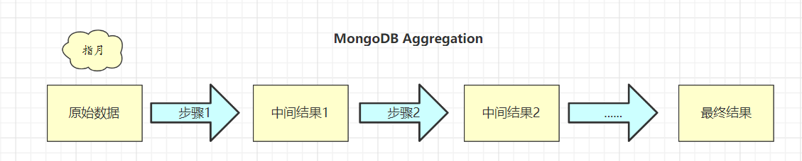
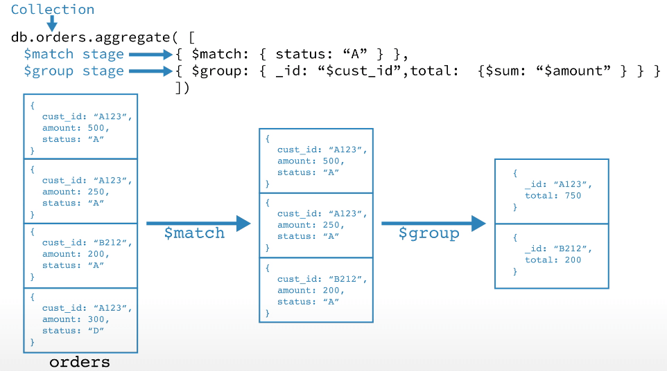

# MongoDB 聚合操作

## 1. 概述

> [MongoDB官方文档](https://docs.mongodb.com/manual/aggregation/)

MongoDB 中的聚合操作，类似于 Linux 中的管道。

MongoDB Aggregation Framework 它是数据聚合的一个新框架，其概念类似于数据处理的管道。 每个文档通过一个由多个节点组成的管道，每个节点有自己特殊的功能（分组、过滤等），文档经过管道处理后，最后输出相应的结果。

管道基本的功能有两个：

* 一是对文档进行**过滤**，也就是筛选出符合条件的文档;

* 二是对文档进行**变换**，也就是改变文档的输出形式。

其他的一些功能还包括按照某个指定的字段分组和排序等。而且在每个阶段还可以使用表达式操作符计算平均值和拼接字符串等相关操作。


## 2. 管道操作符

管道是由一个个功能节点组成的，这些节点用管道操作符来进行表示。聚合管道以一个集合中的所有文档作为开始，然后这些文档从一个操作节点 流向下一个节点 ，每个操作节点对文档做相应的操作。这些操作可能会创建新的文档或者过滤掉一些不符合条件的文档，在管道中可以对文档进行重复操作。




语法

```sh
pipeline = [$stage1, $stage2, ...$stageN];
db.<COLLECTION>.aggregate(pipeline, { options } );
```

示例




### 常用操作符

**管道操作符**

| 操作符         | 作用     | SQL等价运算符   |
| -------------- | -------- | --------------- |
| $math          | 过滤     | WHERE           |
| $project       | 投影     | AS              |
| $sort          | 排序     | ORDER BY        |
| $group         | 分组     | GROUP BY        |
| $skip/$limit   | 结果限制 | SKIP / LIMIT    |
| $lookup        | 左外连接 | LEFT OUTER JOIN |
| $unwind        | 展开数组 | N/A             |
| $graphLookup   | 图搜索   | N/A             |
| $facet/$bucket | 分桶搜索 | N/A             |

**表达式操作符**

| 常用表达式 | 含义                                                         |
| ---------- | ------------------------------------------------------------ |
| $sum       | 计算总和，{&dollar;sum: 1}表示返回总和×1的值(即总和的数量),使用{&dollar;sum: '&dollar;制定字段'}也能直接获取制定字段的值的总和 |
| $avg       | 求平均值                                                     |
| $min       | 求min值                                                      |
| $max       | 求max值                                                      |
| $push      | 将结果文档中插入值到一个数组中                               |
| $first     | 根据文档的排序获取第一个文档数据                             |
| $last      | 同理，获取最后一个数据                                       |

### MQL 常用步骤与 SQL 对比

```mysql
#SQL
SELECT
	FIRST_NAME AS `名`,
	LAST_NAME AS `姓`
FROM Users
WHERE GENDER = '男'
SKIP 100
LIMIT 20
#MQL
db.users.aggregate([
{
    $match: {gender: ’’男”}}, 
    {$skip: 100}, 
    {$limit: 20}, 
    {$project: {'名': '$first_name', '姓': '$last_name'
}}
]);
```


```mysql
#SQL
SELECT DEPARTMENT,
COUNT(NULL) AS EMP_QTY
FROM Users
WHERE GENDER = '女'
GROUP BY DEPARTMENT HAVING
COUNT(*) < 10
#MQL
db.users.aggregate([
{
    $match: {gender: '女'}}, 
    {$group: { 
    	_id: '$DEPARTMENT’,
		emp_qty: {$sum: 1}
    }, 
    {$match: {emp_qty: {$lt: 10}}}
]);
```


### $unwind

```sql
> db.students.findOne()
{
	name:'张三',
	score:[ 
        {subject:'语文',score:84}, 
        {subject:'数学',score:90}, 
        {subject:'外语',score:69} 
    ] 
}
# 将数组展开 分别生成多个文档
> db.students.aggregate([{$unwind: '$score'}])
{name: '张三', score: {subject: '语文', score: 84}}
{name: '张三', score: {subject: '数学', score: 90}}
{name: '张三', score: {subject: '外语', score: 69}}
```


### $bucket

分桶，类似于 Elasticsearch 中的  bucket。

```sql
# 根据价格 0~10、10~20...分组，统计各个价格区间的个数。
db.products.aggregate([{
	$bucket:{
		groupBy: "$price",
		boundaries: [0,10,20,30,40],
		default: "Other",
		output:{"count":{$sum:1}}
} }])
```

### $facet

$facet 把 多个  $bucket 操作放在一起执行。

```sql
db.products.aggregate([{
	$facet:{
		price:{
			$bucket:{…} 
              },
		year:{
			$bucket:{…} 
              } 
           } 
}])
```


## 3. 注意事项

### 1. 减少文档数

**在不影响结果的情况下，尽可能的把 $math、$limit 等操作符提前。**

由于管道操作中前一个步骤的结果都会作为后一个步骤的输入。所以把 $math、$limit 提前可以减少后续步骤要处理的文档数。

除此之外，**$match尽量放到聚合的第一个阶段**，如果这样的话$match相当于一个按条件查询的语句，这样的话可以使用索引，加快查询效率

### 2. 减少字段数

**尽早的使用$project投影，设置需要使用的字段，去掉不用的字段**，

去掉不用的字段，以减少每个文档的大小，最终达到降低查询过程中的内存使用。

### 3. 聚合操作的限制

#### 1.类型限制

在管道内不能操作 Symbol, MinKey, MaxKey, DBRef, Code, CodeWScope类型的数据( 2.4版本解除了对二进制数据的限制).

#### 2.结果大小限制

管道的输出结果不能超过BSON 文档的大小限制（16M),如果超出的话会产生错误.

#### 3.内存限制

如果一个管道操作符在执行的过程中所占有的内存超过系统内存容量的 10% 的时候，会产生一个错误。

当 $sort 和 $group 操作符执行的时候，整个输入都会被加载到内存中，如果这些占有内存超过系统内存的 5% 的时候，会将一个warning记录到日志文件，超过10%的时候，则会产生一个错误。


