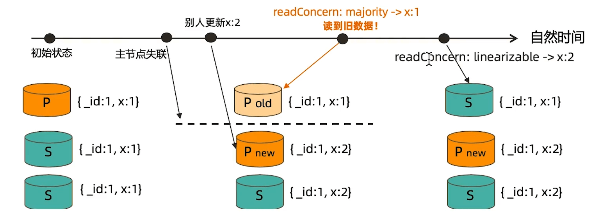

# MongoDB事务

MongoDB从4.0开始已经可以支持完整的ACID（多文档）事务了。

| 事务属性           | 支持程度                                                     |
| ------------------ | ------------------------------------------------------------ |
| Atomocity 原子性   | 单表单文档 1.x就支持；复制集多表多行：4.0复制集；分片集群多表多行：4.2版本 |
| Consistency 一致性 | WriteConcern，readConcern（3.2版本）                         |
| Isolation 隔离性   | readConcern（3.2版本）                                       |
| Durability 持久性  | Journal And Replication                                      |

虽然支持多文档事务了，但是建议少用，性能相比单文档差很多。

> 一般可以通过良好的模型设计将多文档事务改成单文档。


## 1. 写操作事务

为了保证数据能安全写入，MongoDB提供了 WriteConcern 参数。

### 1. w

writeConcern(w)决定一个写操作落到多少个节点上才算成功（**默认值为1**）。writeConcern的取值包括:

* 0：发起写操作，不关心是否成功;
* 1~集群最大数据节点数：写操作需要被复制到指定节点数才算成功;
* majority：写操作需要被复制到**超过半数节点**上才算成功。
* all：写操作需要被复制到**全部节点**上才算成功。

发起写操作的程序将阻塞到写操作到达指定的节点数为止。

推荐设置为 majority，如果指定节点数也必须超过半数才能保证安全性。

**默认值**

writeConcern 参数默认为1，这个情况下时候存在丢数据风险。

数据写入主节点后即想Client返回写入完成。此时MongoDB会在后台异步的把这条数据同步给其他节点。

如果在同步之前主节点Crash掉，从其他节点选取一个新主节点出来就会丢失这条数据。

> 实际上并没有丢失，MongoDB会将该数据存储在之前的主节点的一个备份文件中，但是新选出的主节点确实没有这条数据，看起来就像是丢失了。

**majority**

majority 则需要大多数节点都写入后才会像Client返回成功。

此时主节点Crash掉，其他从节点上也会有最新的数据，所以不会出现丢失的情况。


**all**

全部节点确认模式，写操作需要被复制到**全部节点**上才算成功。

问题：如果其中某个节点出现问题，无法写入。会导致整个集群都无法写入。


### 2. journal

writeConcern（w）可以决定写操作到达多少个节点才算成功，journal 则定义如何才算成功。取值包括:

* 1）true：写操作落到journal文件中才算成功;
* 2）false：写操作到达内存即算作成功。

journal文件就是MongoDB的日志文件，用于宕机恢复。


### 3. Demo

具体写法如下：

```sh
db.test.insert({count:1},{writeConcern:{w:3}})
```

该参数并不是设置在数据库上，而是每次请求可以单独指定。


### 4. 小结

* 1）虽然多于半数的writeConcern都是安全的，但**通常只会设置majority**, 因为这是等待写入延迟时间最短的选择;
* 2）**不要设置writeConcern等于总节点数**，因为- -旦有一个节点故障，所有写操作都将失败;
* 3）writeConcern虽然会增加写操作延迟时间，但并不会显著增加集群压力，因此无论是否等待，写操作最终都会复制到所有节点上。设置writeConcern只是让写操作等待复制后再返回而已;
* 4）**应对重要数据应用{w: "majority" }, 普通数据可以应用{W: 1}以确保最佳性能**。


## 2. 读操作事务

在读取数据的过程中我们需要关注以下两个问题:

* 1）从哪里读?关注数据节点位置
  * 由readPreference来解决
* 2）什么样的数据可以读?关注数据的隔离性
  * 由readConcern来解决


### readPreference

readPreference决定使用哪一个节点来满足正在发起的读请求。可选值包括:

* primary: 只选择主节点;
* primaryPreferred：优先选择主节点，如果不可用则选择从节点;
* secondary: 只选择从节点;
* secondaryPreferred：优先选择从节点,如果从节点不可用则选择主节点;
* nearest：选择最近的节点;


**场景举例**

* 用户下订单后马.上将用户转到订单详情页---primary/primaryPreferred。
  *  因为此时从节点可能还没复制到新订单;
* 用户查询自己下过的订单---secondary/secondaryPreferred。 
  * 查询历史订单对时效性通常没有太高要求;
* 生成报表---secondary。 
  * 报表对时效性要求不高，但资源需求大，可以在从节点单独处理,避免对线上用户造成影响;
* 将用户上传的图片分发到全世界，让各地用户能够就近读取---nearest。 
  * 每个地区的应用选择最近的节点读取数据。


#### Tag

readPreference只能控制使用一类节点。Tag则可以将节点选择控制到一个或几个节点。考虑以下场景：

* 一个5个节点的复制集;
* 3个节点硬件较好，专用于服务线上客户;
* 2个节点硬件较差，专用于生成报表;

可以使用Tag来达到这样的控制目的:

* 为3个较好的节点打.上{purpose: "online"};
* 为2个较差的节点打上{purpose: "analyse"};
* 在线应用读取时指定online,报表读取时指定reporting。


#### Demo

建立连接时通过MongoDB的连接串参数指定：

```sh
mongodb://host1:27107,host2:27107,host3:27017/?replicaSet=rs&readPreference=secondary
```

在代码中通过MongoDB驱动程序API指定:

```sh
MongoCollection.withReadPreference(ReadPreference readPref)
```

或者Mongo Shell中通过参数指定:

```sh
db.collection.find({).readPref( "secondary" )
```


#### 小结

* 指定readPreference时也应注意高可用问题。例如将readPreference指定primary, 则发生故障转移不存在primary期间将没有节点可读。如果业务允许，则应选择primaryPreferred;
* 使用Tag时也会遇到同样的问题,如果只有一个节点拥有一一个特定Tag,则在这个节点失效时将无节点可读。这在有时候是期望的结果,有时候不是。例如:
  * 如果报表使用的节点失效,即使不生成报表,通常也不希望将报表负载转移到其他节点上，此时只有一个节点有报表Tag是合理的选择;
  * 如果线上节点失效，通常希望有替代节点,所以应该保持多个节点有同样的Tag;
* Tag有时需要与优先级、选举权综合考虑。例如做报表的节点通常不会希望它成为主节点，则优先级应为0。


### readConcern

在readPreference选择了指定的节点后，readConcern 决定这个节点上的数据哪些是可读的，类似于关系数据库的隔离级别。可选值包括:

* available: 读取所有可用的数据;
* local: 读取所有可用且属于当前分片的数据;
  * 在复制集上和available没有区别，在分片集上才有区别。
* majority: 读取在大多数节点上提交完成的数据;
  * 需要Server开启enableMajorityReadConcern参数
* linearizable: 可线性化读取文档;
* snapshot:读取最近快照中的数据;
  * 差不多可以达到关系型数据库中的Serializable级别


#### local 与available 

从主节点读取数据时默认readConcern是local,从从节点读取数据时默认
readConcern是available (向前兼容原因)。


#### majority 与脏读

MongoDB中的回滚:

* 写操作到达大多数节点之前都是不安全的，一旦主节点崩溃，而从节还没复制到该次操作，刚才的写操作就丢失了;
* 把一次写操作视为一一个事务，从事务的角度，可以认为事务被回滚了。

所以从分布式系统的角度来看，事务的提交被提升到了分布式集群的多个节点级别的“提交”，而不再是单个节点上的“提交”。

在可能发生回滚的前提下考虑脏读问题:

* 如果在一次写操作到达大多数节点前读取了这个写操作，然后因为系统故障该操作回滚了，则发生了脏读问题;

使用{readConcern:“ majority" }可以有效避免脏读


**如何实现安全的读写分离?**

向主节点写入一条数据，立即从从节点读取这条数据。如何保证能够读取到刚刚写入的数据？

写时用writeConcern:{w:majority}，读取时也指定 readConcern("majority")。


#### linearizable

只读取大多数节点确认过的数据。和majority最大差别是保证绝对的操作线性顺序。
在写操作自然时间后面的发生的读，一定可以读到之前的写。

* 只对读取单个文档时有效;
* 可能导致非常慢的读，因此总是建议配合使用maxTimeMS;


主节点出现网络分区后，选出了新的主节点，并且其他线程还更新了新主节点上的数据，此时如果在旧主节点上读取数据就会拿到旧数据，如果使用linearizable就会发现这不是最新的数据，从而去其他节点获取最新数据并返回给client。




#### snapshot

{readConcern: "snapshot" }只在多文档事务中生效。将一个事务的readConcern设置为snapshot,将保证在事务中的读:

* 不出现脏读;
* 不出现不可重复读;
* 不出现幻读。

因为所有的读都将使用同一个快照，直到事务提交为止该快照才被释放。


## 3. 多文档事务

MongoDB虽然已经在4.2开始全面支持了多文档事务,但并不代表大家应该毫无节制地使用它。相反，对事务的使用原则应该是:能不用尽量不用。

通过合理地设计文档模型，可以规避绝大部分使用事务的必要性。

为什么?事务=锁，节点协调，额外开销,性能影响。

| 事务属性           | 支持程度                                                     |
| ------------------ | ------------------------------------------------------------ |
| Atomocity 原子性   | 单表单文档 1.x就支持；复制集多表多行：4.0复制集；分片集群多表多行：4.2版本 |
| Consistency 一致性 | WriteConcern，readConcern（3.2版本）                         |
| Isolation 隔离性   | readConcern（3.2版本）                                       |
| Durability 持久性  | Journal And Replication                                      |


### Demo

MongoDB多文档事务的使用方式与关系数据库非常相似:

```java
try (ClientSession clientSession = client.startSession() ) {
    cl ientSession. startTransaction() ;
    collection. insertOne (clientSession, docOne) ;
    collection. insertOne (clientSession，docTwo) ;
    cl ientSessi on. commitTransaction () ;
}
```

如果第一条写入成功，第二条写入失败MongoDB会自动回滚。

Go版本驱动简单使用

> https://github.com/mongodb/mongo-go-driver

```go
type t struct {
	coll *mongo.Collection
}

func (t *t) GetColl() *mongo.Collection {
	if ui.coll == nil {
		ui.coll = mongodb.GetTestCollection(new(model.UserInfo))
	}
	return ui.coll
}

func (ui *userInfo) Transaction() error {
	var (
		ctx = context.TODO()
	)
	err := mongodb.TestClient.UseSession(ctx, func(sctx mongo.SessionContext) error {
		err := sctx.StartTransaction(options.Transaction().
			SetReadConcern(readconcern.Snapshot()).
			SetWriteConcern(writeconcern.New(writeconcern.WMajority())),
		)
		if err != nil {
			return err
		}
		doc1 := bson.M{"Hello": "World"}
		t.GetColl().InsertOne(ctx, doc1)
		doc2 := bson.M{"Hello": "MongoDB"}
		t.GetColl().InsertOne(ctx, doc2)
		// sctx.AbortTransaction(ctx) // 手动回滚，放弃之前的改动
		err = sctx.CommitTransaction(ctx)
		if err != nil {
			return err
		}
		return nil
	})

	return err
}
```


### 事务的隔离级别

* 事务完成前，**事务外的操作**对该事务所做的修改不可访问
* 如果事务内使用{readConcern:“snapshot" }，则可以达到可重复读
  Repeatable Read。


MongoDB的事务错误处理机制不同于关系数据库:

* 当一个事务开始后,如果事务要修改的文档在事务外部被修改过,则事务修改这个文档时会触发Abort错误，因为此时的修改冲突了;
* 这种情况下，只需要简单地重做事务就可以了;
* 如果一个事务已经开始修改一一个文档，在事务以外尝试修改同- -个文档,则事务以外的修改会等待事务完成才能继续进行。

简单说就是产生冲突后，如果外部先修改就重做事务，如果事务先修改则外部操作只能等待。


### 小结

* 可以实现和关系型数据库类似的事务场景;
* 必须使用与MongoDB 4.2兼容的驱动;
* 事务默认必须在60秒(可调)内完成，否则将被取消;
* 涉及事务的分片不能使用仲裁节点;事务会影响chunk迁移效率。正在迁移的chunk也可能造成事务提交失败(重试即可) ;
* 多文档事务中的读操作必须使用主节点读;
* readConcern只应该在事务级别设置，不能设置在每次读写操作上。