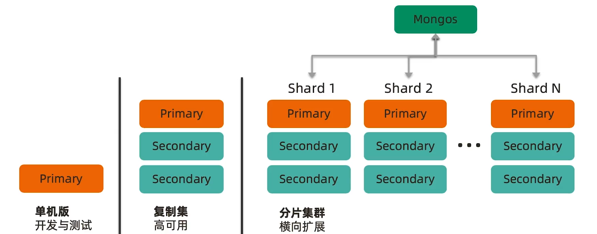
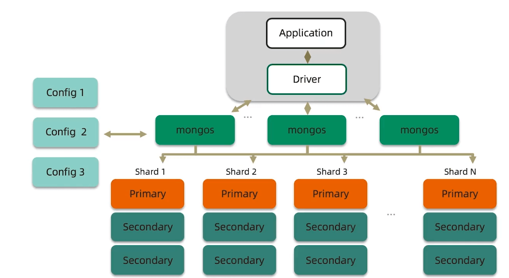

# MongoDB分片集群

## 1. 概述

MongoDB常见部署架构如下：

* 一般测试时采用单机版（20%比例）

* 绝大多数会采用复制集（70%比例）

* 当数据量比较大时会采用分片集（10%比例）

为什么要使用分片集群?

* 数据容量日益增大，访问性能日渐降低，怎么破？
* 新品上线异常火爆，如何支撑更多的并发用户?
* 单库已有10TB数据，恢复需要1-2天，如何加速?
* 地理分布数据

## 2. 分片集群

分片即将数据拆分为多个部分，分别放到多个物理MongoDB中。

一个完整的分片集群架构如下：

### 1. 路由节点 mongos

其中绿色的 mongos 为路由节点，具体功能如下：

* 1）提供集群单一入口
* 2）转发客户端请求，选择合适数据节点进行读写
* 3）合并多个数据节点的返回

为了高可用，一般会部署多个路由节点。

> 和Elasticsearch的Coordinator节点很像。

### 2. 配置节点 mongod

左边浅绿色的 config 1 2 3其实就是3个普通的mongodb节点（普通的复制集架构）。

主要功能如下：

* 1）提供集群元数据存储
* 2）分片数据分布的映射

分片集中具体某一条数据究竟存储在哪个节点上就是存储在配置节点的 对照表中的。

对照表大致如下：

| Lower | Upper | Shard  |
| ----- | ----- | ------ |
| 0     | 1000  | Shard0 |
| 1001  | 2000  | Shard1 |

启动时会将对照表中的数据load到内存，以便于快速比对。

> redis cluster 中先使用hash算法将具体 key 映射到slot,然后从对照表中根据slot找到对应的节点。

### 3. 数据节点 mongod

数据节点就是普通的复制集。以复制集为单位，可以进行横向扩展，最大支持1024分片。

分片之间数据不重复，所有分片在一起才可以完整工作。

## 3.分片集群说明

MongoDB分片集群特点：

* 应用全透明，无特殊处理
* 数据自动均衡
* 动态扩容，无须下线
* 提供三种分片方式
  * 基于范围
  * 基于Hash
  * 基于zone / tag

### 基于范围

选取一个或多个字段，将字段的取值分为多个范围，每个范围对应一个分片。

> 比如x取值为0~100 则没20为一个范围进行分片，0~20存入分片1,20~40写入分片2,以此类推。

* 范围查询性能好，优化读。
  * 同意范围都在一个分片上，方便查询
* 数据分布可能不均匀，容易有热点。
  * 如果数据不是均匀分布的，就会导致各个分片上数据量不均匀

### 基于哈希

按某个字段值计算一个哈希值，根据该哈希值来确定写入哪个分片。

* 数据分布均匀，写优化
* 范围查询效率低
* 适用于日志，物联网等高并发写场景

### 自定义Zone

对分片打Tag，以实现自定义zone。

根据字段内容确定这是哪个地区的数据，然后根据tag写入到对应地区的shard。

> 比如countryCode：86 很明显这是中国的数据，所以将该数据写入到tag为中国的shard。

将全球化读写转为本地化读写。

## 小结

* 分片集群可以有效解决性能瓶颈及系统扩容问题
* 分片额外消耗较多，管理复杂，尽量不要分片

## 4. 分片集群设计

合理的架构

* 是否需要分片？
* 需要多少分片？
* 数据的分布规则

正确的姿势

* 选择需要分片的表
* 选择正确的片键
* 使用合适的均衡策略

足够的资源

* CPU
* RAM
* 存储

### 合理的架构

#### 分片大小

分片的基本标准:

* 关于数据: 数据量不超过3TB，尽可能保持在2TB一个片;
* 关于索引: 常用索引必须容纳进内存;

按照以上标准初步确定分片后,还需要考虑业务压力，随着压力增大，CPU、RAM、磁盘中的任何一项出现瓶颈时，都可以通过添加更多分片来解决。

#### 分片个数

分片数量= max(A, B, C)。

* A=所需存储总量/单服务器可挂载容量
* B=工作集大小/单服务器内存容量
  * 工作集=索引数据+热数据
  * 单服务器内存容量=物理内存*60%（MongoDB默认只使用60%物理内存）
* C=并发量总数/ (单服务器并发量*0.7)
  * 剩余0.3用于额外开销

#### 其他需求

考虑分片的分布

* 是否需要跨机房分布分片?
* 是否需要容灾?
* 高可用的要求如何?

### 正确的姿势

各种概念由小到大:

* 片键shard key: 文档中的一个字段或多个字段
  * 用于确定数据分布
* 文档doc:包含shardkey的一行数据
* 块Chunk :包含n个文档
  * 通常为64M大小
* 分片Shard:包含n个chunk
* 集群Cluster:包含n个分片

#### 选择合适片键

影响片键效率的主要因素:

* 取值基数(Cardinality) 
  * 基数即集群中不重复的值的个数
  * 取值基数要大
* 取值分布
  * 取值分布要均匀，否则会造成数据分布不均匀
* 分散写，集中读
  * 对主要查询要具有定向能力
  * 即根据片键可以确定数据在具体某个分片
  * 如果没有片键，那么路由节点会把查询转发到所有分片，只有所有分片都返回响应后，路由节点才会将数据返回给客户端
  * 如果有分片则只会将请求转发到具体的某个节点
* 被尽可能多的业务场景用到
* 避免单调递增或递减的片键
  * 这样的片键写入时都会写入第一或倒数第一个分片，然后等分片快写满时会被移动到其他分片去
  * 这样相当与无形中多了一次写入

小结：最好满足这3点：基数大、数据分布均匀、定向查询。

### 足够的资源

mongos与config通常消耗很少的资源，可以选择低规格虚拟机;

资源的重点在于shard服务器:

* 需要足以容纳热数据索引的内存;
* 正确创建索引后CPU通常不会成为瓶颈，除非涉及非常多的计算;
* 磁盘尽量选用SSD。

最后，实际测试是最好的检验，来看你的资源配置是否完备。

建议监控各项资源使用情况，无论哪一项达到 60%以上，则开始考虑扩展，因为:

* 扩展需要新的资源，申请新资源需要时间;
* 扩展后数据需要均衡，均衡需要时间。应保证新数据入库速度慢于均衡速度.
* 均衡需要资源，如果资源即将或已经耗尽，均衡也是会很低效的。

