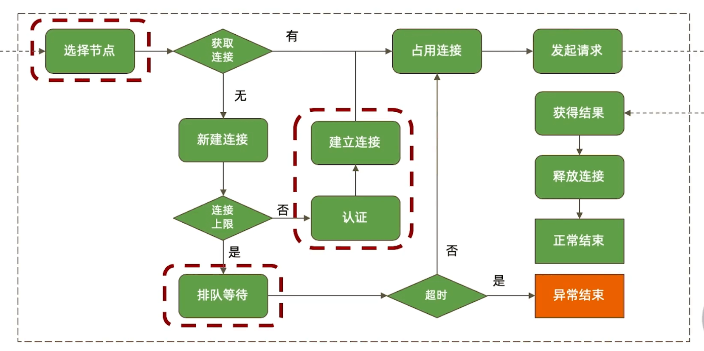
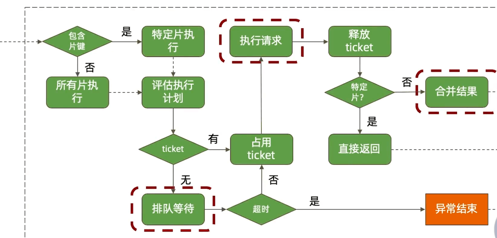
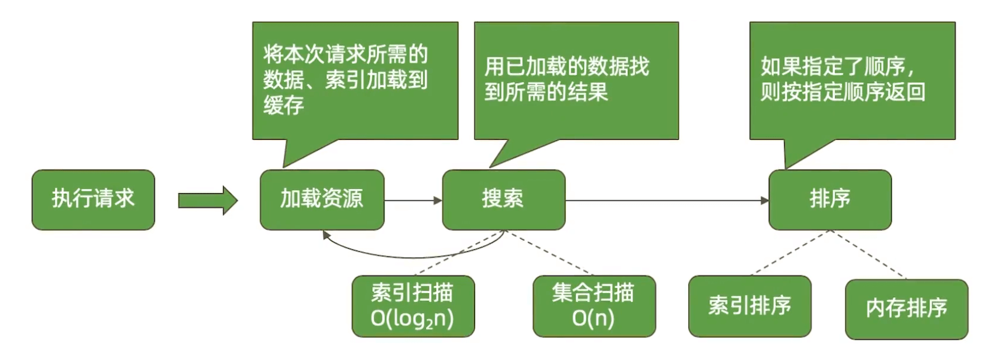
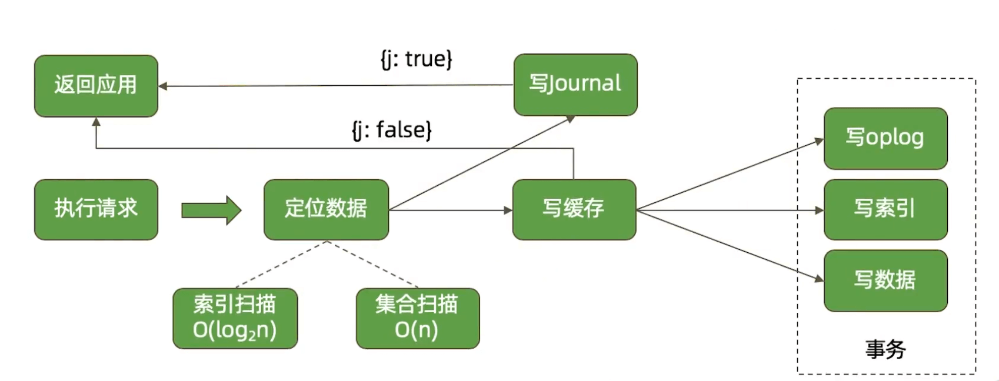
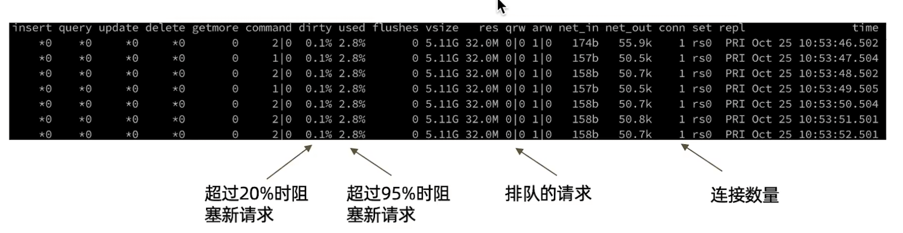
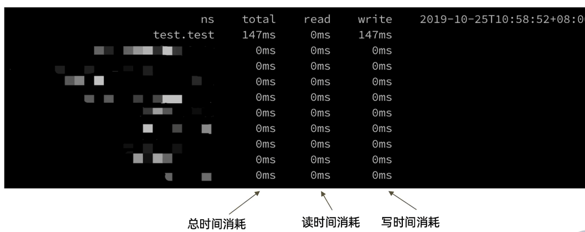

# MongoDB读写机制

MongoDB读写的具体流程


## 应用端流程




### 1. 选择节点

对于复制集读操作，选择哪个节点是由
readPreference决定的:

*  primary/ primaryPreferred
* secondary/ secondaryPreferred
*   nearest

  如果不希望一个远距离节点被选择,应做到以下之一：

* 将它设置为隐藏节点;
*  通过标签(Tag)控制可选的节点;
* 使用nearest方式;

  

### 2.排队等待

排队等待连接是如何发生的?

* 总连接数大于允许的最大连接数maxPoolSize;

如何解决这个问题?

*   加大最大连接数(不一定有用) ;
*   优化查询性能;

### 3. 连接与认证

如果一个请求需要等待创建新连接和进行认证，相比直接从连接池获取连接，它将耗费更长时间。
可能解决方案:

* 设置minPoolSize ( 最小连接数) 一次性创建足够的连接; 
* 避免突发的大量请求;


## 数据库端





### 1. 排队等待

由ticket不足引起的排队等待，问题往往不在ticket本身，而在于为什么正在执行的操作会长时间占用ticket。

可能解决方案:

* 优化CRUD性能可以减少ticket占用时间;
* zlib压缩方式也可能引起ticket不足，因为zlib算法本身在进行压缩、解压时需要的时间比较长，从而造成长时间的ticket 占用;


### 2. 执行请求(读)



不能命中索引的搜索和内存排序是导致性能问题的最主要原因。


### 3. 执行请求(写)




数据是先写入内存，然后在刷盘的，如果磁盘写入速度对MongoDB写入速度有较大影响。


### 4. 合并结果

如果数据分布存储在多个分片，则需要进行结果合并。

* 1）从多个分片中查询出满足条件的结果
* 2）由 mongos 将多个结果集进行合并
* 3）返回给应用程序

如果顺序不重要则不要排序
尽可能使用带片键的查询条件以减少参与查询的分片数


## 3. 性能瓶颈总结

| 应用端             | 服务端          | 网络               |
| ------------------ | --------------- | ------------------ |
| 选择访问入口节点   | 排队等待 ticket | 应用/驱动到 mongos |
| 等待数据库连接     | 执行请求        | mongos 到具体分片  |
| 创建连接和完成认证 | 合并执行结果    |                    |


## 4. 性能诊断

### 1. mongostat




* dirty
  * 表示内存中还未刷盘的数据
  * 正常在5%一下，由wiredTiger存储引擎后台每分钟进行刷盘
  * 超过5%后MongoDB则会分配更多性能来刷盘
  * 超过20%后甚至会阻塞新的请求，以加快刷盘速度
* used
  * 系统分配给MongoDB的内存的使用量
  * 80%以下都算正常
  * 超过80%则会使用LRU算法进行清理


### 2. mongotop




### 3. 慢日志

慢日志中会记录执行超过 100ms(默认值) 的查询及其执行计划。

**开启慢日志**

 ```sh
# 为所有数据库开启慢查询记录
db.setProfilingLevel(2)
# 指定数据库，并指定阈值慢查询 ，超过20毫秒的查询被记录
use xxxdb
db.setProfilingLevel(1, { slowms: 20 })
#  随机采集慢查询的百分比值，sampleRate 值默认为1，表示都采集，0.42 表示采集42%的内容。
db.setProfilingLevel(1, { sampleRate: 0.42 })
 ```

**查询慢日志**

 ```sh
# 查询最近的10个慢查询日志
db.system.profile.find().limit(10).sort( { ts : -1 } ).pretty()
# 查询除命令类型为 ‘command’ 的日志
db.system.profile.find( { op: { $ne : 'command' } } ).pretty()
# 查询数据库为 mydb 集合为 test 的 日志
db.system.profile.find( { ns : 'mydb.test' } ).pretty()
# 查询 低于 5毫秒的日志
db.system.profile.find( { millis : { $gt : 5 } } ).pretty()
 ```


### 4. mtools

一个分析 mongod 日志的工具。

安装: pip install mtools
常用指令:

* mplotqueries日志文件:将所有慢查询通过图表形式展现;
* mloginfo --queries日志文件:总结出所有慢查询的模式和出现次数、消耗时间等;


