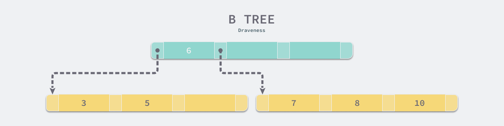

# MySQL为什么使用B+树

## 1. 概述

首先需要澄清的一点是，MySQL 跟 B+ 树没有直接的关系，真正与 B+ 树有关系的是 MySQL 的默认存储引擎 InnoDB。

两个原因：

- InnoDB 需要支持的场景和功能需要在特定查询上拥有较强的性能；
- CPU 将磁盘上的数据加载到内存中需要花费大量的时间，这使得 B+ 树成为了非常好的选择

## 2. 对比

假设现在有 3 个候选人：哈希、B 树、B+ 树。

访问或者修改一条数据：

使用哈希却有可能达到 `O(1)` 的时间复杂度；

B 树、B+ 树则是`O(log n)`

如果是范围查询操作：

使用哈希则只能全表扫描来判断是否满足条件；

B 树和 B+ 树都是顺序排列的，它们都可以按照某些顺序对索引中的内容进行遍历，对于排序和范围查询等操作。

与 B 树和 B+ 树相比，哈希作为底层的数据结构的表能够以 `O(1)` 的速度处理单个数据行的增删改查，但是面对范围查询或者排序时就会导致全表扫描的结果，而 B 树和 B+ 树虽然在单数据行的增删查改上需要 `O(log n)` 的时间，但是它会将索引列相近的数据按顺序存储，所以能够避免全表扫描。

所以排除哈希，还剩下B 树、B+ 树。

当我们需要在数据库中查询数据时，CPU 会发现当前数据位于磁盘而不是内存中，这时就会触发 I/O 操作将数据加载到内存中进行访问，数据的加载都是以页的维度进行加载的，然而将数据从磁盘读取到内存中所需要的成本是非常大的，普通磁盘（非 SSD）加载数据需要经过队列、寻道、旋转以及传输的这些过程，大概要花费 `10ms` 左右的时间。

B 树与 B+ 树的最大区别就是，B 树可以在非叶结点中存储数据，但是 B+ 树的所有数据其实都存储在叶子节点中。

设我们需要访问所有『大于 4，并且小于 9 的数据』

如果不考虑任何优化，在上面的简单 B 树中我们需要进行 4 次磁盘的随机 I/O 才能找到所有满足条件的数据行：

* 1) 加载根节点所在的页，发现根节点的第一个元素是 6，大于 4；
* 2) 通过根节点的指针加载左子节点所在的页，遍历页面中的数据，找到 5；
* 3) 重新加载根节点所在的页，发现根节点不包含第二个元素；
* 4) 通过根节点的指针加载右子节点所在的页，遍历页面中的数据，找到 7 和 8；

由于所有的节点都可能包含目标数据，**我们总是要从根节点向下遍历子树查找满足条件的数据行**，这个特点带来了大量的随机 I/O，也是 B 树最大的性能问题。

> 需要查询多次叶子节点和根节点

B+ 树中就不存在这个问题了，因为所有的数据行都存储在叶节点中，而这些叶节点可以**通过『指针』依次按顺序连接**，当我们在如下所示的 B+ 树遍历数据时可以直接在多个子节点之间进行跳转，这样能够节省大量的磁盘 I/O 时间，也不需要在不同层级的节点之间对数据进行拼接和排序

> 同时由于只有叶子节点才存放数据了，所以 B+ 树高度相比 B 树会有所降低

## 3. 小结

我们在这里重新回顾一下 MySQL 默认的存储引擎选择 B+ 树而不是哈希或者 B 树的原因：

- 哈希虽然能够提供 `O(1)` 的单数据行操作性能，但是对于范围查询和排序却无法很好地支持，最终导致全表扫描；
- `B 树`能够在非叶节点中存储数据，但是这也导致在查询连续数据时可能会带来`更多的随机 I/O`，而 `B+ 树`的所有叶节点可以`通过指针相互连接`，能够减少顺序遍历时产生的额外随机 I/O；

原文：`https://draveness.me/whys-the-design-mysql-b-plus-tree/`