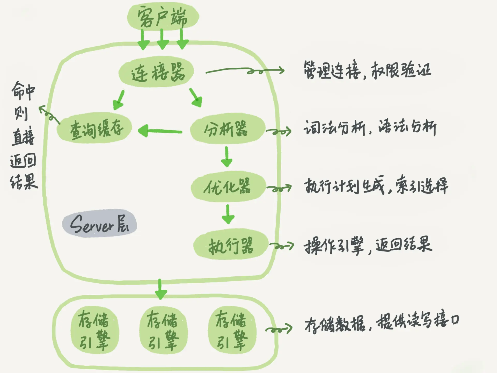

# 查询语句执行流程

## 1. 概述

MySQL 的基本架构如下图所示：



大体来说，MySQL 可以分为 Server 层和存储引擎层两部分。

> 从图中可以看出，不同的存储引擎共用一个 Server 层。

Server 层包括连接器、查询缓存、分析器、优化器、执行器等，涵盖 MySQL 的大多数核心服务功能，以及所有的内置函数（如日期、时间、数学和加密函数等），所有跨存储引擎的功能都在这一层实现，比如存储过程、触发器、视图等。

而存储引擎层负责数据的存储和提取。其架构模式是插件式的，支持 InnoDB、MyISAM、Memory 等多个存储引擎。

> 现在最常用的存储引擎是 InnoDB，它从 MySQL 5.5.5 版本开始成为了默认存储引擎。


## 2. 各组件分析

### 2.1 连接器

首先需要连接数据库,连接器负责跟客户端建立连接、获取权限、维持和管理连接。

```sh
mysql -h$ip -P$port -u$user -p
```

* 如果用户名或密码不对，你就会收到一个"Access denied for user"的错误，然后客户端程序结束执行。
* 如果用户名密码认证通过，**连接器会到权限表里面查出你拥有的权限**。之后，这个连接里面的权限判断逻辑，都将依赖于此时读到的权限。

这就意味着，一个用户成功建立连接后，**即使你用管理员账号对这个用户的权限做了修改，也不会影响已经存在连接的权限。**修改完成后，只有再新建的连接才会使用新的权限设置。

可以使用`show processlist `命令查看当前的连接情况。

客户端如果太长时间没动静，连接器就会自动将它断开。这个时间是由参数 `wait_timeout` 控制的，默认值是 8 小时。


* 长连接：连接成功后，如果客户端持续有请求，则一直使用同一个连接
* 短连接：每次执行完很少的几次查询就断开连接，下次查询再重新建立一个

短连接每次都需要建立连接，开销大，但是长连接也可能出现内存溢出的情况。

MySQL 在执行过程中临时使用的内存是管理在连接对象里面的。这些资源会在连接断开的时候才释放。所以如果长连接累积下来，可能导致内存占用太。

解决方案：

* 定期断开长连接。使用一段时间，或者程序里面判断执行过一个占用内存的大查询后，断开连接，之后要查询再重连。
* 如果你用的是 MySQL 5.7 或更新版本，可以在每次执行一个比较大的操作后，通过执行 `mysql_reset_connection` 来重新初始化连接资源。这个过程不需要重连和重新做权限验证，但是会将连接恢复到刚刚创建完时的状态。


### 2.2 查询缓存

> 由于需要先分析SQL，只有是select语句才会走缓存，所以可以认为查询缓存包含在分析器内。

MySQL 之前执行过的语句及其结果可能会以 key-value 对的形式，被直接缓存在内存中。

MySQL 拿到一个查询请求后，会先到查询缓存看看，如果有结果就直接从缓存中获取结果并返回了。

执行更新请求后该表对应的所有缓存都会失效，所以**不建议使用查询缓存**。

> 缓存失效频繁，得不偿失，除非是很久才更新一次的表才推荐使用，比如系统配置表。

可以通过`query_cache_type`参数指定是否使用查询缓存。

* DEMAND：不使用查询缓存
* SQL_CACHE：使用查询缓存

例如下列语句就指定要使用查询缓存：

```sh
select SQL_CACHE * from T where ID=10；
```


### 2.3 分析器

分析器先会做`词法分析`。你输入的是由多个字符串和空格组成的一条 SQL 语句，MySQL 需要识别出里面的字符串分别是什么，代表什么。

比如从你输入的SQL语句中把"select"这个关键字识别出来，这是一个查询语句。它也要把字符串“T”识别成“表名 T”，把字符串“ID”识别成“列 ID”。

做完了这些识别以后，就要做`语法分析`。根据词法分析的结果，语法分析器会根据语法规则，判断你输入的这个 SQL 语句是否满足 MySQL 语法。


### 2.4 优化器

化器是在表里面有多个索引的时候，决定使用哪个索引；或者在一个语句有多表关联（join）的时候，决定各个表的连接顺序。


### 2.5 执行器

开始执行的时候，要先判断一下你对这个表 T 有没有执行查询的权限，如果没有，就会返回没有权限的错误，如下所示 (在工程实现上，如果命中查询缓存，会在查询缓存返回结果的时候，做权限验证。查询也会在优化器之前调用 precheck 验证权限)。


## 3. 小结

**执行流程**

* 1）连接器，建立连接，权限校验
* 2）缓存区，看缓存区是否有结果
* 3）词法分析器，进行词法分析、语法分析
* 4）优化器，生成执行计划、索引选择等


**权限校验**

一共会在连接器、分析器、执行器这 3 个地方进行权限校验，因为不同场景需要校验的权限不一样。

* 连接器：用户身份校验
* 分析器：在词法分析、语法分析之后，也就是知道了该语句要“干什么”之后，也会先做一次权限验证，叫做precheck。
  * 会校验对应表或者列这些是否存在
* 执行器：分析器 的precheck 是无法对运行时涉及到的表进行权限验证的，比如使用了触发器的情况。因此在执行器这里也要做一次执行时的权限验证。

