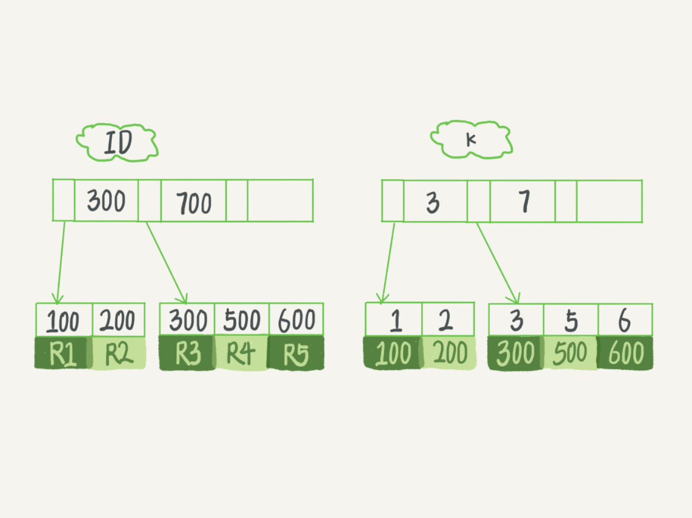
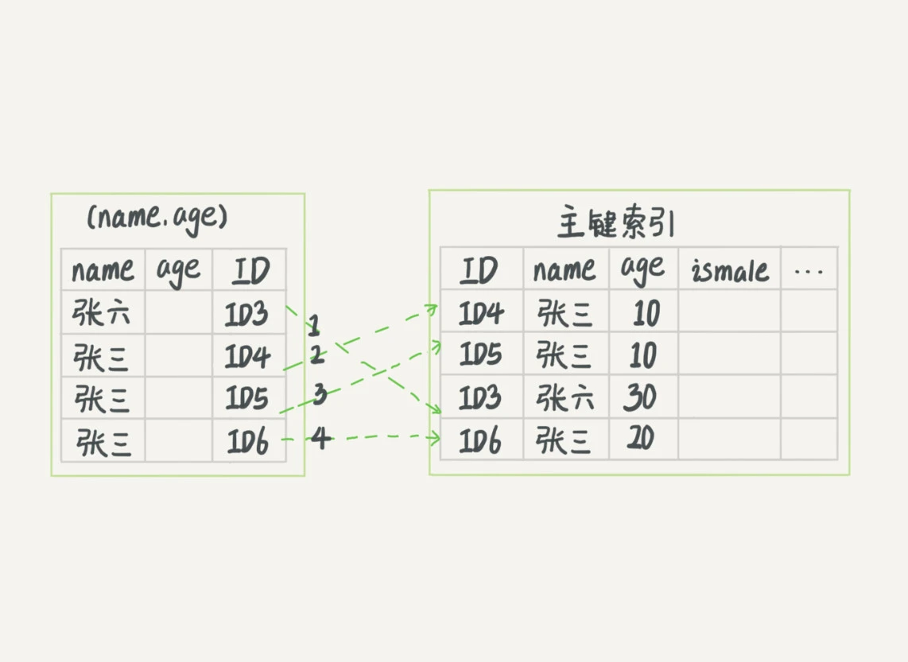
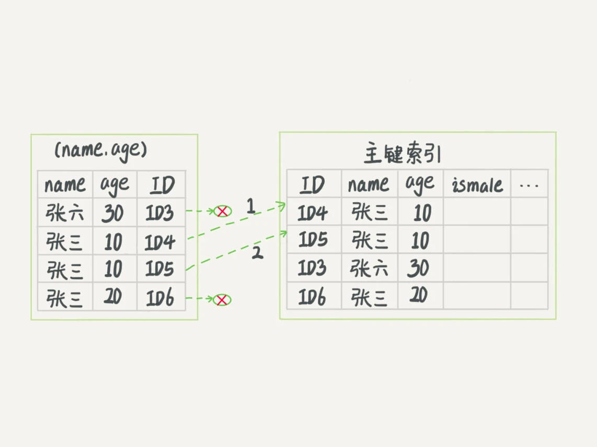

# 索引

## 1. 概述

索引的出现其实就是为了提高数据查询的效率，就像书的目录一样，索引的本质就是排好序的数据结构。

> 索引 就是 数据结构。


常见数据结构

* Hash：哈希表这种结构**范围查询效率很低**，因此适用于只有等值查询的场景
* 有序数组：有序数组有序数组在等值查询和范围查询场景中的性能就都非常优秀，但是**增删数据时开销很大**，因此只适用于静态存储引擎。
* 搜索树：一种经典的数据结构，它**既有链表的快速插入与删除操作的特点，又有数组快速查找的优势**。


`N 叉树`由于在读写上的性能优点，以及适配磁盘的访问模式，已经被广泛应用在数据库引擎中了。

> 不管是哈希还是有序数组，或者 N 叉树，它们都是不断迭代、不断优化的产物或者解决方案。

数据库技术发展到今天，跳表、LSM 树等数据结构也被用于引擎设计中。


## 2. InnoDB 的索引模型

**InnoDB 使用了 B+ 树索引模型**，所以数据都是存储在 B+ 树中的。每一个索引在 InnoDB 里面对应一棵 B+ 树。

根据叶子节点的内容，索引类型分为主键索引和非主键索引。

* **主键索引**的叶子节点存的是整行数据。在 InnoDB 里，主键索引也被称为聚簇索引（clustered index）。
* **非主键索引**的叶子节点内容是主键的值。在 InnoDB 里，非主键索引也被称为二级索引（secondary index）。


*主键索引和非主键索引的区别*

* 如果语句是 select * from T where ID=500，即主键查询方式，则只需要搜索 ID 这棵 B+ 树；
* 如果语句是 select * from T where k=5，即普通索引查询方式，则需要**先搜索 k 索引树**，得到 ID 的值为 500，**再到 ID 索引树搜索一次**。这个过程称为**回表**。

也就是说，**基于非主键索引的查询需要多扫描一棵索引树。因此，我们在应用中应该尽量使用主键查询。**


### 索引维护

B+ 树为了维护索引有序性，在插入新值的时候需要做必要的维护。

假设，我们有一个主键列为 ID 的表，表中有字段 k，并且在 k 上有索引。

```mysql
mysql> create table T(
id int primary key, 
k int not null, 
name varchar(16),
index (k))engine=InnoDB;
```

表中 R1~R5 的 (ID,k) 值分别为 (100,1)、(200,2)、(300,3)、(500,5) 和 (600,6)，两棵树的示例示意图如下。



如果插入新的行 ID 值为 700，则只需要在 R5 的记录后面插入一个新记录。如果新插入的 ID 值为 400，就相对麻烦了，需要逻辑上挪动后面的数据，空出位置。

#### 页分裂

如果 R5 所在的数据页已经满了，根据 B+ 树的算法，这时候需要申请一个新的数据页，然后挪动部分数据过去。这个过程称为**页分裂**。在这种情况下，性能自然会受影响。

除了性能外，页分裂操作还影响数据页的利用率。原本放在一个页的数据，现在分到两个页中，**整体空间利用率降低大约 50%**。

#### 页合并

当相邻两个页由于删除了数据，利用率很低之后，会将数据页做**合并**。合并的过程，可以认为是分裂过程的逆过程。


### 自增主键

自增主键是指自增列上定义的主键，在建表语句中一般是这么定义的： `NOT NULL PRIMARY KEY AUTO_INCREMENT`。

插入新记录的时候可以不指定 ID 的值，系统会获取当前 ID 最大值加 1 作为下一条记录的 ID 值。

*为什么需要推荐自增主键?*

**性能角度**

自增主键的插入数据模式，正符合了我们前面提到的递增插入的场景。每次插入一条新记录，都是追加操作，都不涉及到挪动其他记录，也不会触发叶子节点的分裂。

**空间角度**

假设你的表中确实有一个唯一字段，比如字符串类型的身份证号，那应该用身份证号做主键，还是用自增字段做主键呢？

由于每个非主键索引的叶子节点上都是主键的值。如果用身份证号做主键，那么每个二级索引的叶子节点占用约 20 个字节，而如果用整型做主键，则只要 4 个字节，如果是长整型（bigint）则是 8 个字节。

**显然，主键长度越小，普通索引的叶子节点就越小，普通索引占用的空间也就越小。**

所以，从性能和存储空间方面考量，**自增主键往往是更合理的选择。**

*那么，有没有什么场景适合用业务字段直接做主键的呢？*

有，典型的 KV 场景。

由于没有其他索引，所以也就不用考虑其他索引的叶子节点大小的问题。这时候我们就要优先考虑上一段提到的`尽量使用主键查询`原则，直接将这个索引设置为主键，可以避免每次查询需要搜索两棵树。


## 3. 索引覆盖

如果执行的语句是 select ID from T where k between 3 and 5，这时只需要查 ID 的值，而 ID 的值已经在 k 索引树上了，因此可以直接提供查询结果，不需要回表。也就是说，**在这个查询里面，索引 k 已经“覆盖了”我们的查询需求，我们称为覆盖索引**。

**由于覆盖索引可以减少树的搜索次数，显著提升查询性能，所以使用覆盖索引是一个常用的性能优化手段。**


## 4. 最左前缀原则

**B+ 树这种索引结构，可以利用索引的“最左前缀”，来定位记录。**

不只是索引的全部定义，只要满足最左前缀，就可以利用索引来加速检索。这个最左前缀可以是联合索引的最左 N 个字段，也可以是字符串索引的最左 M 个字符。

*在建立联合索引的时候，如何安排索引内的字段顺序？*

这里我们的评估标准是，**索引的复用能力**。因为可以支持最左前缀，所以当已经有了 (a,b) 这个联合索引后，一般就不需要单独在 a 上建立索引了。**因此，第一原则是，如果通过调整顺序，可以少维护一个索引，那么这个顺序往往就是需要优先考虑采用的。**

那么，如果既有联合查询，又有基于 a、b 各自的查询呢？查询条件里面只有 b 的语句，是无法使用 (a,b) 这个联合索引的，这时候你不得不维护另外一个索引，也就是说你需要同时维护 (a,b)、(b) 这两个索引。

这时候，我们要**考虑的原则就是空间**了。比如上面这个市民表的情况，name 字段是比 age 字段大的 ，那我就建议你创建一个（name,age) 的联合索引和一个 (age) 的单字段索引。


## 5. 索引下推

我们还是以市民表的联合索引（name, age）为例。如果现在有一个需求：检索出表中“名字第一个字是张，而且年龄是 10 岁的所有男孩”。那么，SQL 语句是这么写的：

```mysql
mysql> select * from tuser where name like '张%' and age=10 and ismale=1;
```

根据最左前缀原则，所以这个语句在搜索索引树的时候，只能用 “张”，找到第一个满足条件的记录 ID3

接下来当然是判断其他条件是否满足。

* 在 MySQL 5.6 之前，只能从 ID3 开始一个个回表。到主键索引上找出数据行，再对比字段值。
* 而 MySQL 5.6 引入的索引下推优化（index condition pushdown)， 可以**在索引遍历过程中，对索引中包含的字段先做判断，直接过滤掉不满足条件的记录，减少回表次数**。

具体执行过程如下图：





**相比之下索引下推可以过滤掉很多无意义的回表。**

