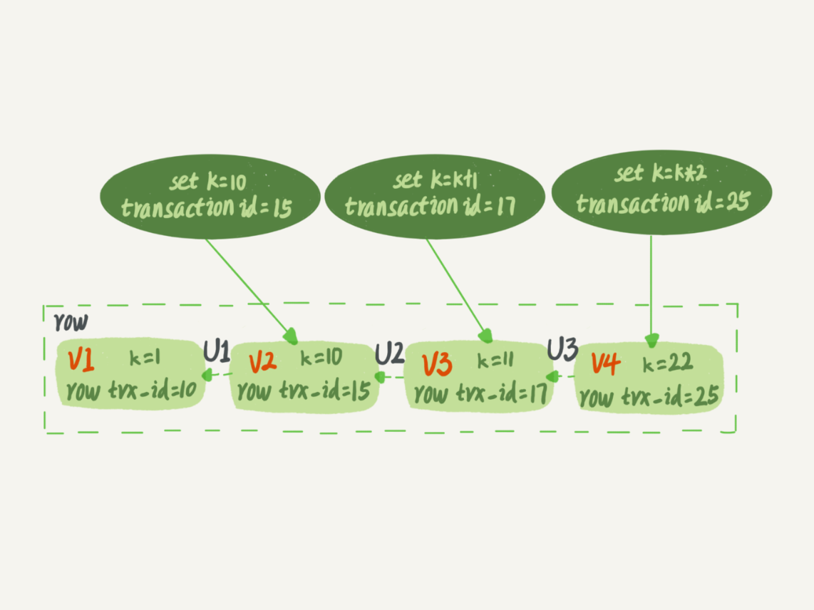
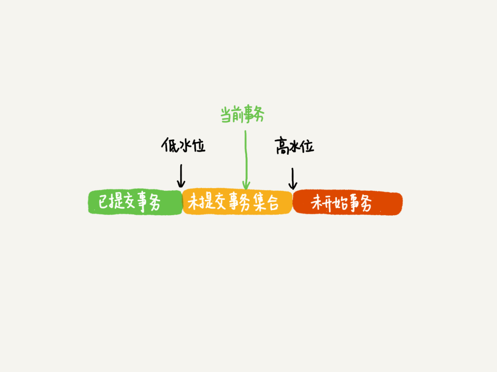
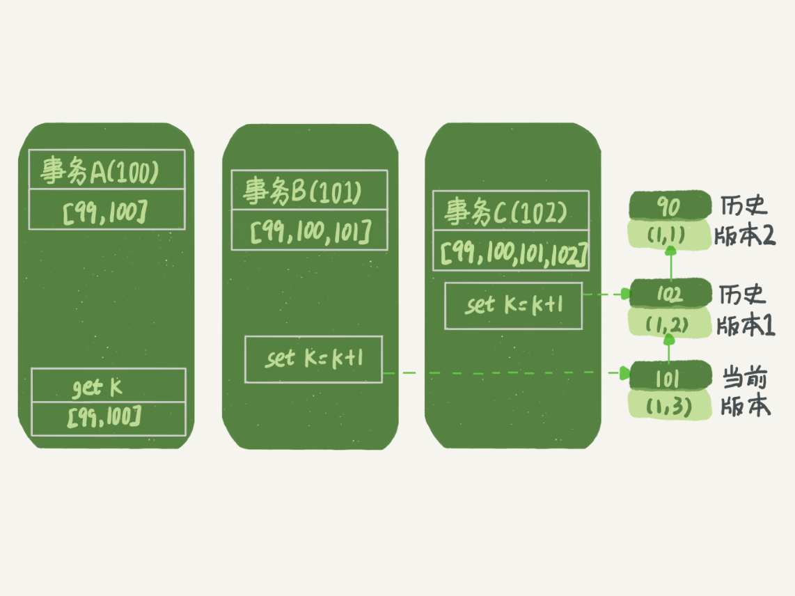
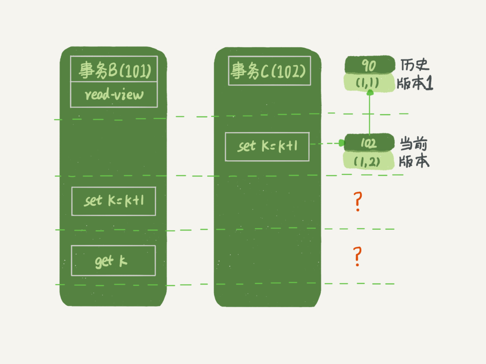
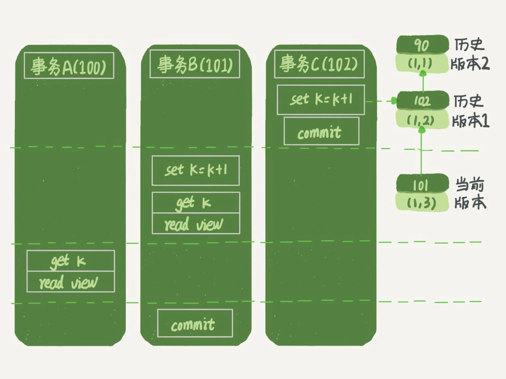

# 事务到底是隔离的还是不隔离的？

本文主要详细分析了 read view 来解释了 MVCC 的实现原理。

## 1. 概述

例子

建表语句：

```mysql

mysql> CREATE TABLE `t` (
  `id` int(11) NOT NULL,
  `k` int(11) DEFAULT NULL,
  PRIMARY KEY (`id`)
) ENGINE=InnoDB;
insert into t(id, k) values(1,1),(2,2);
```

执行逻辑

> begin/start transaction 命令并不是一个事务的起点，在执行到它们之后的第一个操作 InnoDB 表的语句，事务才真正启动。如果你想要马上启动一个事务，可以使用 start transaction with consistent snapshot 这个命令。

| 事务A                                        | 事务B                                                        | 事务C                          |
| -------------------------------------------- | ------------------------------------------------------------ | ------------------------------ |
| start transaction with consistent snapshot； |                                                              |                                |
|                                              | start transaction with consistent snapshot;                  |                                |
|                                              |                                                              | update t set k=k+1 where id=1; |
|                                              | update t set k=k+1 where id=1;<br/>select k from t where id =1; |                                |
| select k from t where id =1;<br/>commit;     |                                                              |                                |
|                                              | commit;                                                      |                                |

问题：事务A和事务B查到的K值分别是什么？

果我告诉你事务 B 查到的 k 的值是 3，而事务 A 查到的 k 的值是 1，是不是会觉得很奇怪？

希望后面的描述能解决你的疑惑。


## 2. 快照机制

在可重复读隔离级别下，事务在启动的时候就“拍了个快照”。

> 注意，这个快照是基于整库的,同时快照的实现也不是直接拷贝了一份数据，而是基于版本号机制。

InnoDB 里面每个事务有一个唯一的事务 ID，叫作 transaction id。它是在事务开始的时候向 InnoDB 的事务系统申请的，是按申请顺序严格递增的。

而每行数据也都是有多个版本的。每次事务更新数据的时候，都会生成一个新的数据版本，并且把 transaction id 赋值给这个数据版本的事务 ID，记为 row trx_id。同时，旧的数据版本要保留，并且在新的数据版本中，能够有信息可以直接拿到它。

也就是说，数据表中的一行记录，其实可能有多个版本 (row)，每个版本有自己的 row trx_id。

如下图所示，就是一个记录被多个事务连续更新后的状态。



图中虚线框里是同一行数据的 4 个版本，当前最新版本是 V4，k 的值是 22，它是被 transaction id 为 25 的事务更新的，因此它的 row trx_id 也是 25。

**实际上，图中的三个虚线箭头，就是 undo log**；而 V1、V2、V3 并不是物理上真实存在的，而是每次需要的时候根据当前版本和 undo log 计算出来的。比如，需要 V2 的时候，就是通过 V4 依次执行 U3、U2 算出来。

> 并不是存储了多份，而是根据 undo log 计算出来的多版本数据。


## 3. read view

根据以版本号机制实现的 MVCC 再加上数据版本的可见性规则，就可以实现一致性视图了。

按照可重复读的定义，一个事务启动的时候，能够看到所有已经提交的事务结果。但是之后，这个事务执行期间，其他事务的更新对它不可见。

> 即：一个事务只需要在启动的时候声明说，“以我启动的时刻为准，如果一个数据版本是在我启动之前生成的，就认；如果是我启动以后才生成的，我就不认，我必须要找到它的上一个版本”。

当然，如果“上一个版本”也不可见，那就得继续往前找。还有，如果是这个事务自己更新的数据，它自己还是要认的。

**具体实现**

在实现上， InnoDB 为每个事务构造了一个数组，用来保存这个事务启动瞬间，当前正在`活跃`的所有事务 ID。

> “活跃”指的就是，启动了但还没提交。

数组里面事务 ID 的最小值记为低水位，当前系统里面已经创建过的事务 ID 的最大值加 1 记为高水位。

> 事务ID是严格递增的，所以根据ID大小可以大致上判断视图的可见状态。

这个视图数组和高水位，就组成了当前事务的一致性视图（read-view）。而数据版本的可见性规则，就是基于数据的 row trx_id 和这个一致性视图的对比结果得到的。

具体规则如下：



这样，对于当前事务的启动瞬间来说，一个数据版本的 row trx_id，有以下几种可能：

* 1）如果落在绿色部分，表示这个版本是已提交的事务或者是当前事务自己生成的，这个数据是可见的；
* 2）如果落在红色部分，表示这个版本是由将来启动的事务生成的，是肯定不可见的；
* 3）如果落在黄色部分，那就包括两种情况
  * 若 row trx_id 在数组中，表示这个版本是由还没提交的事务生成的，不可见；
  * 若 row trx_id 不在数组中，表示这个版本是已经提交了的事务生成的，可见。

解释：

首先事务ID是递增的，其次数组中记录的是启动当前事务时还在活跃的事务。

* 如果指定数据版本的提交事务ID 小于 当前活跃事务数组中的最小事务ID，那说明这个事务肯定是已提交的，对当前事务来说这个版本的数据就是可见的，即图中的绿色区域。
* 如果指定数据版本的提交事务ID比当前活跃事务数组中的最大事务ID还大，那说明这个数据是在当前事务启动后提交，对当前事务来说是不可见的，即图中的红色区域
* 图中的黄色区域比较麻烦，因为事务ID是启动事务时分配的，然后每个事务的执行时间不同，所以事务ID较大的事务会比ID小的事务先提交也是有可能的，于是需要分情况
  * 在活跃数组中，说明这个事务没提交，自然就不可见了
  * 不在数组中，说明这个事务肯定提交了，即可见。


例子：

加入当前活跃数组中，最大ID为9，最小ID为4，那么ID为10的事务肯定是不可见的。ID为3的事务肯定是可见的。

4~9中间的事务就不能直接分辨了，虽然现在4号事务还在活跃，但是并不代表5号事务也还活跃。可能5号事务启动得晚，但是很快就执行完并提交了。所以4~9范围内的事务需要通过事务ID是否在活跃数组中来区分是否提交。


**InnoDB 利用了“所有数据都有多个版本”的这个特性，实现了“秒级创建快照”的能力。**

接下来，我们继续看一下Demo中的三个事务，分析下事务 A 的语句返回的结果，为什么是 k=1。

这里，我们不妨做如下假设：

* 1）事务 A 开始前，系统里面只有一个活跃事务 ID 是 99；
* 2）事务 A、B、C 的版本号分别是 100、101、102，且当前系统里只有这四个事务；
* 三个事务开始前，(1,1）这一行数据的 row trx_id 是 90。

这样，事务 A 的视图数组就是[99,100], 事务 B 的视图数组是[99,100,101], 事务 C 的视图数组是[99,100,101,102]。

具体如下：

>  为了简化分析，去掉了其他干扰语句。




从图中可以看到，第一个有效更新是事务 C，把数据从 (1,1) 改成了 (1,2)。这时候，这个数据的最新版本的 row trx_id 是 102，而 90 这个版本已经成为了历史版本。

第二个有效更新是事务 B，把数据从 (1,2) 改成了 (1,3)。这时候，这个数据的最新版本（即 row trx_id）是 101，而 102 又成为了历史版本。

> 当然了，事务B没有提交，那么这个版本对事务 A 必须是不可见的，否则就变成脏读了。

好，现在事务 A 要来读数据了，它的视图数组是[99,100]。当然了，读数据都是从当前版本读起的。所以，事务 A 查询语句的读数据流程是这样的：

* 找到 (1,3) 的时候，判断出 row trx_id=101，比高水位大，处于红色区域，不可见；
* 接着，找到上一个历史版本，一看 row trx_id=102，比高水位大，处于红色区域，不可见；
* 再往前找，终于找到了（1,1)，它的 row trx_id=90，比低水位小，处于绿色区域，可见。

这样执行下来，虽然期间这一行数据被修改过，但是事务 A 不论在什么时候查询，看到这行数据的结果都是一致的，所以我们称之为一致性读。

一个数据版本，对于一个事务视图来说，除了自己的更新总是可见以外，有三种情况：

* 1）版本未提交，不可见；
* 2）版本已提交，但是是在视图创建后提交的，不可见；
* 3）版本已提交，而且是在视图创建前提交的，可见。

现在，我们用这个规则来判断图 4 中的查询结果，事务 A 的查询语句的视图数组是在事务 A 启动的时候生成的，这时候：

* (1,3) 还没提交，属于情况 1，不可见；
* (1,2) 虽然提交了，但是是在视图数组创建之后提交的，属于情况 2，不可见；
* (1,1) 是在视图数组创建之前提交的，可见。


简单说来就是在可重复读隔离级别下每个事务都**只能看到在当前事务创建前就提交的数据**。


## 4. 当前读

问题：*事务 B 的 update 语句，如果按照一致性读，好像结果不对哦？*

事务 B 的视图数组是先生成的，之后事务 C 才提交，不是应该看不见 (1,2) 吗，怎么能算出 (1,3) 来？



是的，如果事务 B 在更新之前查询一次数据，这个查询返回的 k 的值确实是 1。

但是，当它要去更新数据的时候，就不能再在历史版本上更新了，否则事务 C 的更新就丢失了。因此，事务 B 此时的 set k=k+1 是在（1,2）的基础上进行的操作。


所以，这里就用到了这样一条规则：**更新数据都是先读后写的，而这个读，只能读当前的值，称为“当前读”（current read）**。

因此，在更新的时候，当前读拿到的数据是 (1,2)，更新后生成了新版本的数据 (1,3)，这个新版本的 row trx_id 是 101。

所以，在执行事务 B 查询语句的时候，一看自己的版本号是 101，最新数据的版本号也是 101，是自己的更新，可以直接使用，所以查询得到的 k 的值是 3。


这里我们提到了一个概念，叫作当前读。其实，除了 update 语句外，select 语句如果加锁，也是当前读。

所以，如果把事务 A 的查询语句 select * from t where id=1 修改一下，加上 lock in share mode 或 for update，也都可以读到版本号是 101 的数据，返回的 k 的值是 3。


下面这两个 select 语句，就是分别加了读锁（S 锁，共享锁）和写锁（X 锁，排他锁）。

```mysql
mysql> select k from t where id=1 lock in share mode;
mysql> select k from t where id=1 for update;
```


再往前一步，假设事务 C 不是马上提交的，而是变成了下面的事务 C’，会怎么样呢？

> 

| 事务A                                        | 事务B                                                        | 事务C                                                        |
| -------------------------------------------- | ------------------------------------------------------------ | ------------------------------------------------------------ |
| start transaction with consistent snapshot； |                                                              |                                                              |
|                                              | start transaction with consistent snapshot;                  |                                                              |
|                                              |                                                              | start transaction with consistent snapshot;<br/>update t set k=k+1 where id=1; |
|                                              | update t set k=k+1 where id=1;<br/>select k from t where id =1; |                                                              |
| select k from t where id =1;<br/>commit;     |                                                              | commit;                                                      |
|                                              | commit;                                                      |                                                              |


这次事务C更新后并没有马上提交，在它提交前，事务 B 的更新语句先发起了。前面说过了，虽然事务 C’还没提交，但是 (1,2) 这个版本也已经生成了，并且是当前的最新版本。那么，事务 B 的更新语句会怎么处理呢？

根据“两阶段锁协议”可以知道，事务 C’没提交，也就是说 (1,2) 这个版本上的写锁还没释放。而事务 B 是当前读，必须要读最新版本，而且必须加锁，因此就被锁住了，必须等到事务 C’释放这个锁，才能继续它的当前读。

到这里，我们把一致性读、当前读和行锁就串起来了。


## 5.事务的可重复读的能力是怎么实现的？

可重复读的核心就是一致性读（consistent read）；而事务更新数据的时候，只能用当前读。如果当前的记录的行锁被其他事务占用的话，就需要进入锁等待。

而读提交的逻辑和可重复读的逻辑类似，它们最主要的区别是：

* 在可重复读隔离级别下，只需要在事务开始的时候创建一致性视图，之后事务里的其他查询都共用这个一致性视图；
* 在读提交隔离级别下，每一个语句执行前都会重新算出一个新的视图。

那么，我们再看一下，在读提交隔离级别下，事务 A 和事务 B 的查询语句查到的 k，分别应该是多少呢？

> 这里需要说明一下，“start transaction with consistent snapshot; ”的意思是从这个语句开始，创建一个持续整个事务的一致性快照。所以，在读提交隔离级别下，这个用法就没意义了，等效于普通的 start transaction。



这时，事务 A 的查询语句的视图数组是在执行这个语句的时候创建的，时序上 (1,2)、(1,3) 的生成时间都在创建这个视图数组的时刻之前。但是，在这个时刻：

* (1,3) 还没提交，属于情况 1，不可见；
* (1,2) 提交了，属于情况 3，可见。

所以，这时候事务 A 查询语句返回的是 k=2。显然地，事务 B 查询结果 k=3。


## 6. 小结

InnoDB 的行数据有多个版本，每个数据版本有自己的 row trx_id，每个事务或者语句有自己的一致性视图。普通查询语句是一致性读，一致性读会根据 row trx_id 和一致性视图确定数据版本的可见性。

* 对于**可重复读**，查询只承认在**事务启动前**就已经提交完成的数据；
* 对于**读提交**，查询只承认在**语句启动前**就已经提交完成的数据；

而当前读，总是读取已经提交完成的最新版本。


MySQL 的隔离性主要依赖于 MySQL "保留"了多个版本数据，通过 undo log 就可以计算出多个版本的数据。

在这个基础上在根据 read view 来实现一个数据版本可见性规则，就完美的实现了 隔离性。

可重复读和读提交两个隔离级别其实就是 read view 的生成上有一点差异。

