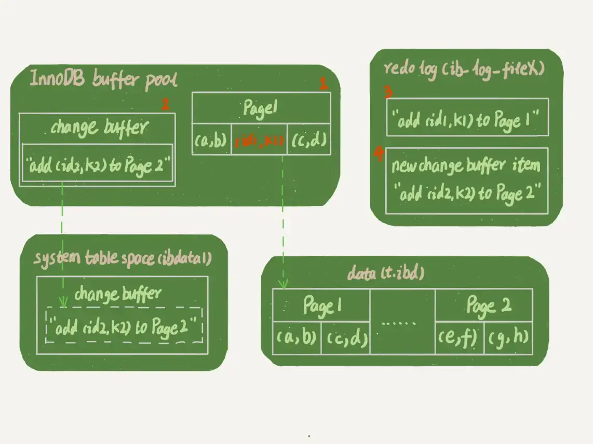

# 普通索引和唯一索引

## 1. 查询过程

假设，执行查询的语句是 select id from T where k=5。这个查询语句在索引树上查找的过程，先是通过 B+ 树从树根开始，按层搜索到叶子节点，也就是图中右下角的这个数据页，然后可以认为数据页内部通过二分法来定位记录。

* 对于普通索引来说，查找到满足条件的第一个记录 (5,500) 后，需要查找下一个记录，直到碰到第一个不满足 k=5 条件的记录。
* 对于唯一索引来说，由于索引定义了唯一性，查找到第一个满足条件的记录后，就会停止继续检索。

这个差异带来的性能问题微乎其微，基本可以忽略不计，因为 InnoDB 的数据是按数据页为单位来读写的。

### 数据页

**InnoDB 的数据是按数据页为单位来读写的**。也就是说，当需要读一条记录的时候，并不是将这个记录本身从磁盘读出来，而是以页为单位，将其整体读入内存。

> 在 InnoDB 中，每个数据页的大小默认是 16KB。

因为引擎是按页读写的，所以说，当找到 k=5 的记录的时候，它所在的数据页就都在内存里了。那么，对于普通索引来说，要多做的那一次“查找和判断下一条记录”的操作，就只需要一次指针寻找和一次计算。

> 当然，如果 k=5 这个记录刚好是这个数据页的最后一个记录，那么要取下一个记录，必须读取下一个数据页，这个操作会稍微复杂一些。
>
> 不过对于整型字段，一个数据页可以放近千个 key，因此出现这种情况的概率会很低，这种情况带来的CPU压力依旧可以忽略。


## 2. 更新过程

### change buffer

当需要更新一个数据页时，如果数据页在内存中就直接更新，而如果这个数据页还没有在内存中的话，**在不影响数据一致性的前提下，InnoDB 会将这些更新操作缓存在 change buffer 中，这样就不需要从磁盘中读入这个数据页了。在下次查询需要访问这个数据页的时候，将数据页读入内存，然后执行 change buffer 中与这个页有关的操作**。通过这种方式就能保证这个数据逻辑的正确性。

虽然叫做 change buffer，实际上它是可以持久化的数据。也就是说，change buffer 在内存中有拷贝，也会被写入到磁盘上。

将 change buffer 中的操作应用到原数据页，得到最新结果的过程称为 merge。merge 触发条件：

* 1）除了访问这个数据页会触发 merge 外，
* 2）系统有后台线程会定期 merge；
* 3）在数据库正常关闭（shutdown）的过程中，也会执行 merge 操作。

*merge 的过程是否会把数据直接写回磁盘？*

* 1）从磁盘读入数据页到内存（老版本的数据页）；
* 2）从 change buffer 里找出这个数据页的 change buffer 记录 (可能有多个），依次应用，得到新版数据页；
* 3）写 redo log。这个 redo log 包含了数据的变更和 change buffer 的变更。

到这里 merge 过程就结束了。这时候，数据页和内存中 change buffer 对应的磁盘位置都还没有修改，属于脏页，之后各自刷回自己的物理数据，就是另外一个过程了。

显然，如果能够将更新操作先记录在 change buffer，减少读磁盘，语句的执行速度会得到明显的提升。而且，数据读入内存是需要占用 buffer pool 的，所以这种方式还能够避免占用内存，提高内存利用率。

### change buffer 使用场景

*什么条件下可以使用 change buffer 呢？*

对于唯一索引来说，所有的更新操作都要先判断这个操作是否违反唯一性约束。

> 比如，要插入 (4,400) 这个记录，就要先判断现在表中是否已经存在 k=4 的记录，而这必须要将数据页读入内存才能判断。

如果都已经读入到内存了，那直接更新内存会更快，就没必要使用 change buffer 了。

因此，唯一索引的更新就不能使用 change buffer，所以只有 普通索引可以使用。

change buffer 通过减少随机 IO 以达到提升性能的目的，因此对于每次更新都需要将数据载入内存的唯一索引则无法使用 change buffer。

*那么普通索引的所有场景，使用 change buffer 都可以起到加速作用吗？*

因为 merge 的时候是真正进行数据更新的时刻，而 change buffer 的主要目的就是将记录的变更动作缓存下来，所以在一个数据页做 merge 之前，change buffer 记录的变更越多（也就是这个页面上要更新的次数越多），收益就越大。

**因此，对于写多读少的业务来说，页面在写完以后马上被访问到的概率比较小，此时 change buffer 的使用效果最好**。这种业务模型常见的就是账单类、日志类的系统。

> 反过来，假设一个业务的更新模式是写入之后马上会做查询，那么即使满足了条件，将更新先记录在 change buffer，但之后由于马上要访问这个数据页，会立即触发 merge 过程。这样随机访问 IO 的次数不会减少，反而增加了 change buffer 的维护代价。

change buffer 用的是 buffer pool 里的内存，因此不能无限增大。change buffer 的大小，可以通过参数 innodb_change_buffer_max_size 来动态设置。这个参数设置为 50 的时候，表示 change buffer 的大小最多只能占用 buffer pool 的 50%。


### 具体更新流程

**如果要在这张表中插入一个新记录 (4,400) 的话，InnoDB 的处理流程是怎样的。**

第一种情况是，**这个记录要更新的目标页在内存中**。这时，InnoDB 的处理流程如下：

* 对于唯一索引来说，找到 3 和 5 之间的位置，判断到没有冲突，插入这个值，语句执行结束；
* 对于普通索引来说，找到 3 和 5 之间的位置，插入这个值，语句执行结束。

这样看来，普通索引和唯一索引对更新语句性能影响的差别，只是一个判断，只会耗费微小的 CPU 时间。


第二种情况是，**这个记录要更新的目标页不在内存中**。这时，InnoDB 的处理流程如下：

* 对于唯一索引来说，需要将数据页读入内存，判断到没有冲突，插入这个值，语句执行结束；
* 对于普通索引来说，则是将更新记录在 change buffer，语句执行就结束了。

将数据从磁盘读入内存涉及随机 IO 的访问，是数据库里面成本最高的操作之一。change buffer 因为减少了随机磁盘访问，所以对更新性能的提升是会很明显的。


## 3. change buffer 和 redo log

二者都是 MySQL 中的性能优化手段，也都和磁盘IO有关，不过还是有一些差异的。

**redo log 主要节省的是随机写磁盘的 IO 消耗（转成顺序写），而 change buffer 主要节省的则是随机读磁盘的 IO 消耗。**

> 而且 redo log 也是为了保证数据一致性，就算写了 change buffer 也会写 redo log，防止 crash 后丢失数据。

现在，我们要在表上执行这个插入语句：

```mysql
mysql> insert into t(id,k) values(id1,k1),(id2,k2);
```

> 这里，我们假设当前 k 索引树的状态，查找到位置后，k1 所在的数据页在内存 (InnoDB buffer pool) 中，k2 所在的数据页不在内存中。如图所示是带 change buffer 的更新状态图。



分析这条更新语句，你会发现它涉及了四个部分：内存、redo log（ib_log_fileX）、 数据表空间（t.ibd）、系统表空间（ibdata1）。

这条更新语句做了如下的操作（按照图中的数字顺序）：

* 1）Page 1 在内存中，直接更新内存；
* 2）Page 2 没有在内存中，就在内存的 change buffer 区域，记录下“我要往 Page 2 插入一行”这个信息
* 3）将上述两个动作记入 redo log 中（图中 3 和 4）。

做完上面这些，事务就可以完成了。所以，你会看到，执行这条更新语句的成本很低，就是写了两处内存，然后写了一处磁盘（两次操作合在一起写了一次磁盘），而且还是顺序写的。

假设后续又来了一个读请求：

```mysql
mysql> select * from t where k in (k1, k2);
```


* 1）读 Page 1 的时候，直接从内存返回，虽然磁盘上还是之前的数据，但是这里直接从内存返回结果，结果是正确的。
* 2）要读 Page 2 的时候，需要把 Page 2 从磁盘读入内存中，然后应用 change buffer 里面的操作日志，生成一个正确的版本并返回结果。

可以看到，直到需要读 Page 2 的时候，这个数据页才会被读入内存。


## 4. 小结

1）普通索引和唯一索引的区别于选择

* 读操作：唯一索引取到一条数据就会直接返回，而普通索引需要一直扫描到不满足条件的数据后才会返回，看似唯一索引会快一些，实际上这个差距可以忽略不计
* 写操作：唯一索引需要检测唯一性，每次都要把数据写读到内存，判断唯一性后再写；普通索引则可以利用change buffer 机制，减少IO操作；
* 小结：普通索引和唯一索引，在查询能力上是没差别的，主要考虑的是对更新性能的影响。所以，建议**尽量选择普通索引**。
  * 在写多读少的场景下，普通索引+change buffer 会有很大的提升，所以建议使用唯一索引；

2）change buffer 的机制以及应用场景

* 将更新操作缓存在内存中，以减少磁盘IO提升性能
* 适合于普通索引+写多读少的场景。
* 如果所有的更新后面，都马上伴随着对这个记录的查询，那么你应该关闭 change buffer。而在其他情况下，change buffer 都能提升更新性能。

3）更新和查询过程

* 查询过程
  * 1）首先将数据从磁盘中读取到内存
  * 2）执行 change buffer 中的更新得到最新数据
  * 3）如果数据页本来就在内存中则省去第一步
* 更新过程
  * 1）首先将数据从磁盘中读取到内存
  * 2）在内存中执行更新操作
  * 3）将更新后的数据写会磁盘


可以看到 change buffer 就是减少了更新过程中的第一步读取数据。

而 唯一索引由于需要判断唯一约束，导致每次必须读取数据到内存，所以用不了 change buffer 机制。


由于唯一索引用不上 change buffer 的优化机制，因此如果业务可以接受，从性能角度出发我建议你优先考虑非唯一索引。