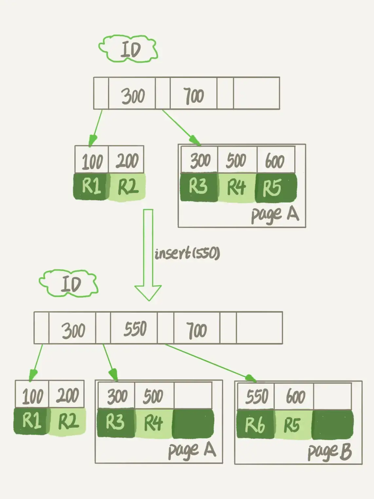

# 为什么表数据删掉一半，表文件大小不变？

## 1. 问题

我的数据库占用空间太大，我把一个最大的表删掉了一半的数据，怎么表文件的大小还是没变？

因为 InnoDB 使用的是标记删除，数据删除后对应空间被标记为可复用，并不会直接回收，所以表文件大小不会变化。

想要减小表文件大小，则需要使用 alter table 命令重建表才行。


## 2.  存储文件

一个 InnoDB 表包含两部分，即：表结构定义和数据。在 MySQL 8.0 版本以前，表结构是存在以.frm 为后缀的文件里。而 MySQL 8.0 版本，则已经允许把表结构定义放在系统数据表中了。

> 因为表结构定义占用的空间很小，所以我们今天主要讨论的是表数据。


表数据既可以存在共享表空间里，也可以是单独的文件。这个行为是由参数 `innodb_file_per_table` 控制的：

* 这个参数设置为 OFF 表示的是，表的数据放在系统共享表空间，也就是跟数据字典放在一起；
* 这个参数设置为 ON 表示的是，每个 InnoDB 表数据存储在一个以 .ibd 为后缀的文件中。

> 从 MySQL 5.6.6 版本开始，它的默认值就是 ON 了。

**不管哪个版本都建议设置为 ON**。因为，一个表单独存储为一个文件更容易管理，而且在你不需要这个表的时候，通过 drop table 命令，系统就会直接删除这个文件。而如果是放在共享表空间中，即使表删掉了，空间也是不会回收的。


## 3. 数据删除流程

### 标记删除

InnoDB 的数据是按页存储的,如果我们要删除某一条数据，InnoDB 只会将该数据**标记删除**。此时这个位置就可以复用了，同样的，如果我们把整个数据页上的所有记录，那么这个数据页也可以被复用了。

不过，**数据页的复用跟记录的复用是不同的**。

* **记录的复用，只限于符合范围条件的数据**。因为是按照顺序排列的。
  * 比如一个数据页上有3条数据，100 200 300，此时把200删除后，该位置就只能被 100~300 这范围内的数据复用。
* **而当整个页从 B+ 树里面摘掉以后，可以复用到任何位置。**


进一步地，如果我们用 delete 命令把整个表的数据删除呢？结果就是，所有的数据页都会被标记为可复用。但是磁盘上，文件不会变小。

### 空洞

回答开篇的问题，**delete 命令其实只是把记录的位置，或者数据页标记为了“可复用”，但磁盘文件的大小是不会变的**。

这些可以复用，而没有被使用的空间，看起来就像是“空洞”。

插入数据可能会导致**页分裂**，也会造成空洞。



可以看到，由于 page A 满了，再插入一个 ID 是 550 的数据时，就不得不再申请一个新的页面 page B 来保存数据了。页分裂完成后，page A 的末尾就留下了空洞（注意：实际上，可能不止 1 个记录的位置是空洞）。

另外，更新索引上的值，可以理解为删除一个旧的值，再插入一个新值。不难理解，这也是会造成空洞的。

> 这里变化的是二级索引，主键是不会有这个问题的。

也就是说，经过大量增删改的表，都是可能是存在空洞的。所以，如果能够把这些空洞去掉，就能达到收缩表空间的目的。而重建表，就可以达到这样的目的。


## 4.消除空洞-重建表

基本思路：

你可以新建一个与表 A 结构相同的表 B，然后按照主键 ID 递增的顺序，把数据一行一行地从表 A 里读出来再插入到表 B 中。由于表 B 是新建的表，所以表 A 主键索引上的空洞，在表 B 中就都不存在了。

> 如果我们把表 B 作为临时表，数据从表 A 导入表 B 的操作完成后，用表 B 替换 A，从效果上看，就起到了收缩表 A 空间的作用。

### 阻塞 DDL

当然了你可以直接使用 `alter table A engine=InnoDB` 命令来重建表。在 MySQL 5.5 版本之前，这个命令的执行流程跟我们前面描述的差不多，区别只是这个临时表 B 不需要你自己创建，MySQL 会自动完成转存数据、交换表名、删除旧表的操作。


显然，重建过程中花时间最多的步骤是往临时表插入数据的过程，如果在这个过程中，有新的数据要写入到表 A 的话，就会造成数据丢失。因此，**在整个 DDL 过程中，表 A 中不能有更新**。也就是说，这个 DDL 不是 Online 的。

### Online DDL

而在 **MySQL 5.6 版本开始引入的 Online DDL，对这个操作流程做了优化**。

优化后的重建表流程：

* 1）建立一个临时文件，扫描表 A 主键的所有数据页；
* 2）用数据页中表 A 的记录生成 B+ 树，存储到临时文件中；
* 3）生成临时文件的过程中，将所有对 A 的操作记录在一个日志文件（row log）中，对应的是图中 state2 的状态；
* 4）临时文件生成后，将日志文件中的操作应用到临时文件，得到一个逻辑数据上与表 A 相同的数据文件，对应的就是图中 state3 的状态；
* 5）用临时文件替换表 A 的数据文件。


可以看到，不同之处在于，**由于日志文件记录和重放操作这个功能的存在，这个方案在重建表的过程中，允许对表 A 做增删改操作**。这也就是 Online DDL 名字的来源。

> 注意：上述的这些重建方法都会扫描原表数据和构建临时文件。对于很大的表来说，这个操作是很消耗 IO 和 CPU 资源的。因此，如果是线上服务，你要很小心地控制操作时间。如果想要比较安全的操作的话，我推荐你使用 GitHub 开源的 gh-ost 来做。


**alter 语句在启动的时候需要获取 MDL 写锁，但是这个写锁在真正拷贝数据之前就退化成读锁了**。

*为什么要退化呢？*

为了实现 Online，MDL 读锁不会阻塞增删改操作。

*那为什么不干脆直接解锁呢？*

为了保护自己，禁止其他线程对这个表同时做 DDL。

> 一直持有读锁，下一个 DDL 来会因为获取不到写锁而失败。

而对于一个大表来说，Online DDL 最耗时的过程就是拷贝数据到临时表的过程，这个步骤的执行期间可以接受增删改操作。所以，相对于整个 DDL 过程来说，锁的时间非常短。对业务来说，就可以认为是 Online 的。


### inplace 和 copy

我们重建表的这个语句 alter table t engine=InnoDB，其实隐含的意思是：

```mysql
alter table t engine=innodb,ALGORITHM=inplace;
```

根据表 A 重建出来的数据是放在“tmp_file”里的，这个临时文件是 InnoDB 在内部创建出来的。整个 DDL 过程都在 InnoDB 内部完成。对于 server 层来说，没有把数据挪动到临时表，是一个“原地”操作，这就是“inplace”名称的来源。

跟 inplace 对应的就是拷贝表的方式了，用法是：

```mysql
alter table t engine=innodb,ALGORITHM=copy;
```

当你使用 ALGORITHM=copy 的时候，表示的是强制拷贝表，对应的流程就是MySQL 5.5 之前的操作过程。


需要注意的是 Online 之所以叫 Online 是应为对 MDL 锁的持有时间很短，基本不影响线上业务。

inplace 和 copy 只是代表的具体操作方式，和 Online 是没有任何关联的。

### 3种重建表方式的区别

optimize table、analyze table 和 alter table 这三种方式重建表的区别：

* 从 MySQL 5.6 版本开始，alter table t engine = InnoDB（也就是 recreate）默认的就是 Online 的流程了；
* analyze table t 其实不是重建表，只是对表的索引信息做重新统计，没有修改数据，这个过程中加了 MDL 读锁；
* optimize table t 等于 recreate + analyze。


## 5. 小结

删除数据后，InnoDB 只是**标记删除**，对应空间可复用了，并不会正在的腾出空间。

> 这部分能复用但是还没有用的空间也称作**空洞**。

想要减小表文件，还需要使用 alter table 命令重建表，清理掉这部分空洞。

MySQL 5.5 及之前的版本，重建表会阻塞 MDL，需要特别消息。

MySQL 5.6 开始就提供了Online DDL 的方式，不会阻塞 MDL，是可以考虑在业务低峰期使用的。


