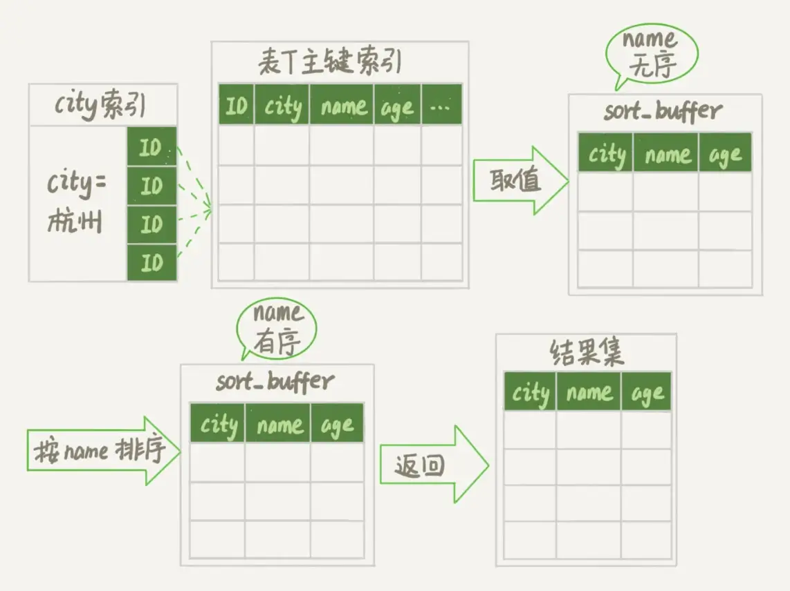
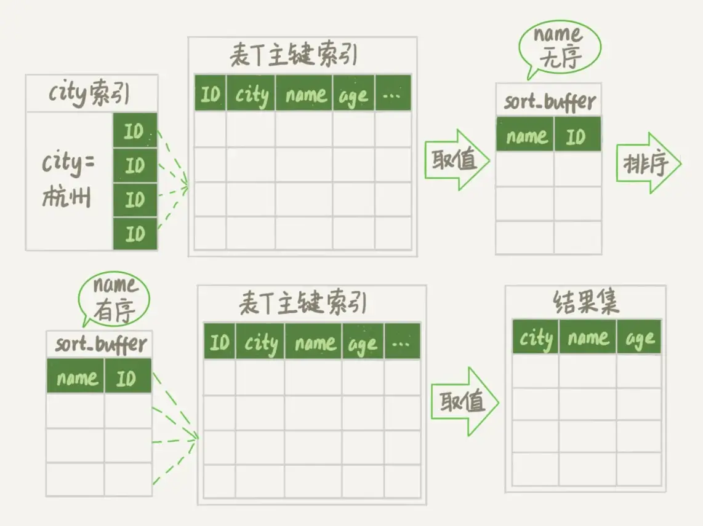
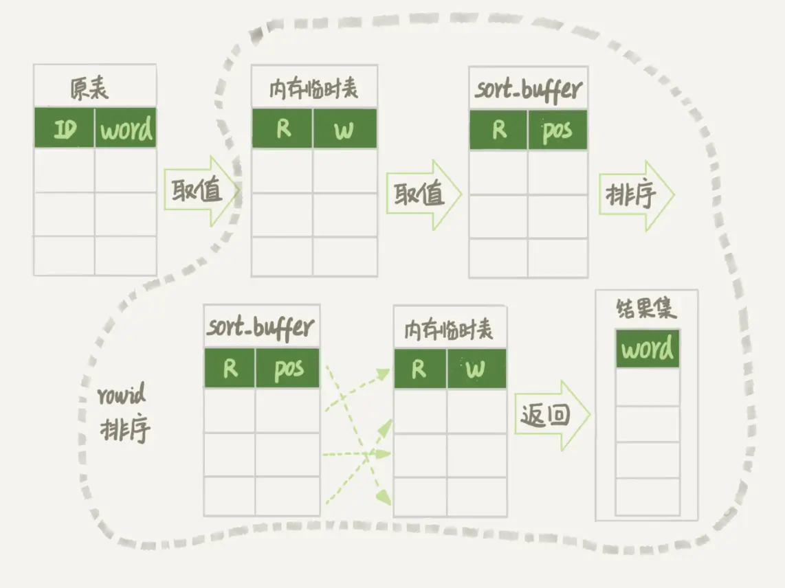
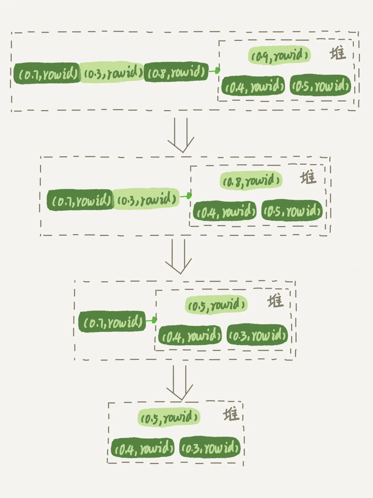

# 临时表排序

## 1. 例子

英语学习 App 首页有一个随机显示单词的功能，也就是根据每个用户的级别有一个单词表，然后这个用户每次访问首页的时候，都会随机滚动显示三个单词。随着单词表变大，选单词这个逻辑变得越来越慢，甚至影响到了首页的打开速度。

```mysql
# 建表语句
mysql> CREATE TABLE `words` (
  `id` int(11) NOT NULL AUTO_INCREMENT,
  `word` varchar(64) DEFAULT NULL,
  PRIMARY KEY (`id`)
) ENGINE=InnoDB;

#插入数据的存储过程
delimiter ;;
create procedure idata()
begin
  declare i int;
  set i=0;
  start transaction;
  while i<10000 do
    insert into words(word) values(concat(char(97+(i div 1000)), char(97+(i % 1000 div 100)), char(97+(i % 100 div 10)), char(97+(i % 10))));
    set i=i+1;
  end while;
end;;
delimiter ;

call idata();
```

首先，你会想到用 order by rand() 来实现这个逻辑。

```mysql
mysql> select word from words order by rand() limit 3;
```

这个语句的意思很直白，随机排序取前 3 个。虽然这个 SQL 语句写法很简单，但执行流程却有点复杂的。


## 2. 内存临时表

我们先用 explain 命令来看看这个语句的执行情况。

```mysql
mysql> explain select word from words order by rand() limit 3;
+----+-------------+-------+------------+------+---------------+------+---------+------+------+----------+---------------------------------+
| id | select_type | table | partitions | type | possible_keys | key  | key_len | ref  | rows | filtered | Extra                           |
+----+-------------+-------+------------+------+---------------+------+---------+------+------+----------+---------------------------------+
|  1 | SIMPLE      | words | NULL       | ALL  | NULL          | NULL | NULL    | NULL | 9980 |   100.00 | Using temporary; Using filesort |
+----+-------------+-------+------------+------+---------------+------+---------+------+------+----------+---------------------------------+
1 row in set, 1 warning (0.00 sec)

```

Extra 字段显示 Using temporary，表示的是需要使用临时表；Using filesort，表示的是需要执行排序操作。

因此这个 Extra 的意思就是，需要临时表，并且需要在临时表上排序。


上一章 order by 原理中讲了有全字段排序和rowid 排序两种算法，具体过程如下：





> 可以看到两种算法都是直接将数据从表中读取到 sort-buffer 然后再进行排序。

对于 InnoDB 表来说，执行全字段排序会减少磁盘访问，因此会被优先选择。

对于内存表，回表过程只是简单地根据数据行的位置，直接访问内存得到数据，根本不会导致多访问磁盘。优化器没有了这一层顾虑，那么它会优先考虑的，就是用于排序的行越小越好了，所以，MySQL 这时就会选择 rowid 排序。

这条语句的执行流程是这样的：

* 1）创建一个临时表。这个临时表使用的是 memory 引擎，表里有两个字段，第一个字段是 double 类型，为了后面描述方便，记为字段 R，第二个字段是 varchar(64) 类型，记为字段 W。并且，这个表没有建索引。
* 2）从 words 表中，按主键顺序取出所有的 word 值。对于每一个 word 值，调用 rand() 函数生成一个大于 0 小于 1 的随机小数，并把这个随机小数和 word 分别存入临时表的 R 和 W 字段中，到此，扫描行数是 10000。
* 3）现在临时表有 10000 行数据了，接下来你要在这个没有索引的内存临时表上，按照字段 R 排序。
* 4）初始化 sort_buffer。sort_buffer 中有两个字段，一个是 double 类型，另一个是整型。
* 5）从内存临时表中一行一行地取出 R 值和位置信息（我后面会和你解释这里为什么是“位置信息”），分别存入 sort_buffer 中的两个字段里。这个过程要对内存临时表做全表扫描，此时扫描行数增加 10000，变成了 20000。
* 6）在 sort_buffer 中根据 R 的值进行排序。注意，这个过程没有涉及到表操作，所以不会增加扫描行数。
* 7）排序完成后，取出前三个结果的位置信息，依次到内存临时表中取出 word 值，返回给客户端。这个过程中，访问了表的三行数据，总扫描行数变成了 20003。



图中的 POS 就是位置信息，实际上它表示的是：每个引擎用来唯一标识数据行的信息：

* 对于有主键的 InnoDB 表来说，这个 rowid 就是主键 ID；
* 对于没有主键的 InnoDB 表来说，这个 rowid 就是由系统生成的；
* MEMORY 引擎不是索引组织表。在这个例子里面，你可以认为它就是一个数组。因此，这个 rowid 其实就是数组的下标。

到这里，我来稍微小结一下：**order by rand() 使用了内存临时表，内存临时表排序的时候使用了 rowid 排序方法**。


## 3. 磁盘临时表

然而，并不是所有的临时表都是内存表。

tmp_table_size 这个配置限制了内存临时表的大小，默认值是 16M。如果临时表大小超过了 tmp_table_size，那么内存临时表就会转成磁盘临时表。

> 磁盘临时表使用的引擎默认是 InnoDB，是由参数 internal_tmp_disk_storage_engine 控制的。

当使用磁盘临时表的时候，对应的就是一个没有显式索引的 InnoDB 表的排序过程。


MySQL 5.6 版本引入的一个新的排序算法，即：**优先队列排序算法**。

> 我们现在的 SQL 语句，只需要取 R 值最小的 3 个 rowid。但是，如果使用归并排序算法的话，虽然最终也能得到前 3 个值，但是这个算法结束后，已经将 10000 行数据都排好序了。相当于是浪费了很多计算量。

而优先队列算法，就可以精确地只得到三个最小值，执行流程如下：

* 1）对于这 10000 个准备排序的 (R,rowid)，先取前三行，构造成一个堆；
* 2）取下一个行 (R’,rowid’)，跟当前堆里面最大的 R 比较，如果 R’小于 R，把这个 (R,rowid) 从堆中去掉，换成 (R’,rowid’)；
* 3）重复第 2 步，直到第 10000 个 (R’,rowid’) 完成比较。



上图是模拟 6 个 (R,rowid) 行，通过优先队列排序找到最小的三个 R 值的行的过程。整个排序过程中，为了最快地拿到当前堆的最大值，总是保持最大值在堆顶，因此这是一个最大堆。


## 4. 随机排序方法

再回到我们文章开头的问题，怎么正确地随机排序呢？

我们先把问题简化一下，如果只随机选择 1 个 word 值，可以怎么做呢？思路上是这样的：

* 1）取得这个表的主键 id 的最大值 M 和最小值 N;
* 2）用随机函数生成一个最大值到最小值之间的数 X = (M-N)*rand() + N;
* 3）取不小于 X 的第一个 ID 的行。

```mysql
mysql> select max(id),min(id) into @M,@N from words ;
set @X= floor((@M-@N+1)*rand() + @N);
select * from words where id >= @X limit 1;
```

这个方法暂时叫做随机算法1，效率很高，因为取 max(id) 和 min(id) 都是不需要扫描索引的，而第三步的 select 也可以用索引快速定位，可以认为就只扫描了 3 行。

> 但实际上，这个算法本身并不严格满足题目的随机要求，因为 ID 中间可能有空洞，因此选择不同行的概率不一样，不是真正的随机。

所以，为了得到严格随机的结果，你可以用下面这个流程:

* 1）取得整个表的行数，并记为 C。
* 2）取得 Y = floor(C * rand())。 floor 函数在这里的作用，就是取整数部分。
* 3）再用 limit Y,1 取得一行。

```mysql
mysql> select count(*) into @C from words;
set @Y = floor(@C * rand());
set @sql = concat("select * from words limit ", @Y, ",1");
prepare stmt from @sql;
execute stmt;
DEALLOCATE prepare stmt;
```

这个随机算法 2，解决了算法 1 里面明显的概率不均匀问题。

现在，我们再看看，如果我们按照随机算法 2 的思路，要随机取 3 个 word 值呢？你可以这么做：

* 1）取得整个表的行数，记为 C；
* 2）根据相同的随机方法得到 Y1、Y2、Y3；
* 3）再执行三个 limit Y, 1 语句得到三行数据。

```mysql
mysql> select count(*) into @C from t;
set @Y1 = floor(@C * rand());
set @Y2 = floor(@C * rand());
set @Y3 = floor(@C * rand());
# 注意:需要在应用代码里面取Y1、Y2、Y3值，拼出SQL后执行
select * from t limit @Y1，1;
select * from t limit @Y2，1;
select * from t limit @Y3，1;

# 直接执行需要像下面这样定义，比较麻烦
mysql> select count(*) into @C from words;
set @Y1 = floor(@C * rand());
set @Y2 = floor(@C * rand());
set @Y3 = floor(@C * rand());
set @sql1 = concat("select * from words limit ", @Y1, ",1");
set @sql2 = concat("select * from words limit ", @Y2, ",1");
set @sql3 = concat("select * from words limit ", @Y3, ",1");
prepare stmt1 from @sql1;
prepare stmt2 from @sql2;
prepare stmt3 from @sql3;
execute stmt1;
execute stmt2;
execute stmt3;
DEALLOCATE prepare stmt1;
DEALLOCATE prepare stmt2;
DEALLOCATE prepare stmt3;
```


## 5. 小结

如果你直接使用 order by rand()，这个语句需要 Using temporary 和 Using filesort，查询的执行代价往往是比较大的。所以，在设计的时候你要尽量避开这种写法。

今天的例子里面，我们不是仅仅在数据库内部解决问题，还会让应用代码配合拼接 SQL 语句。在实际应用的过程中，比较规范的用法就是：尽量将业务逻辑写在业务代码中，让数据库只做“读写数据”的事情。因此，这类方法的应用还是比较广泛的。
