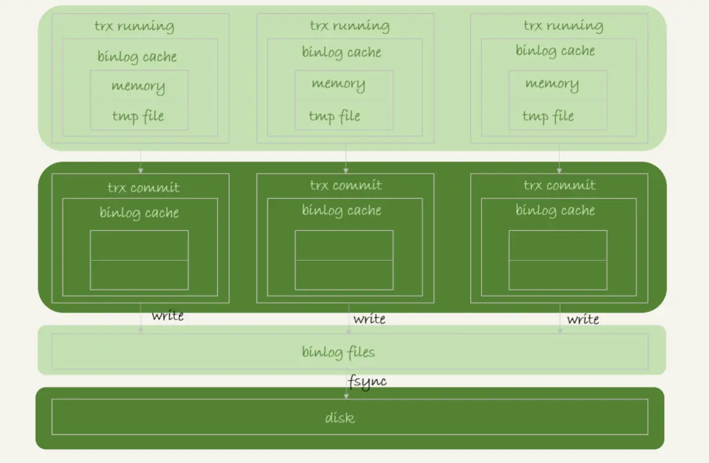
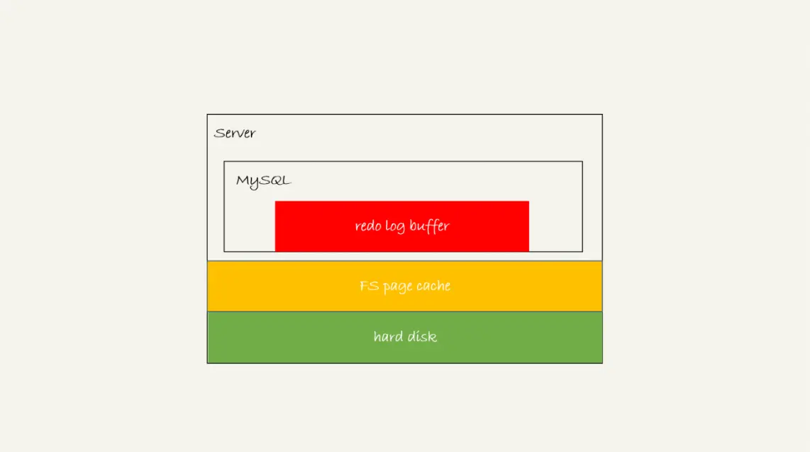
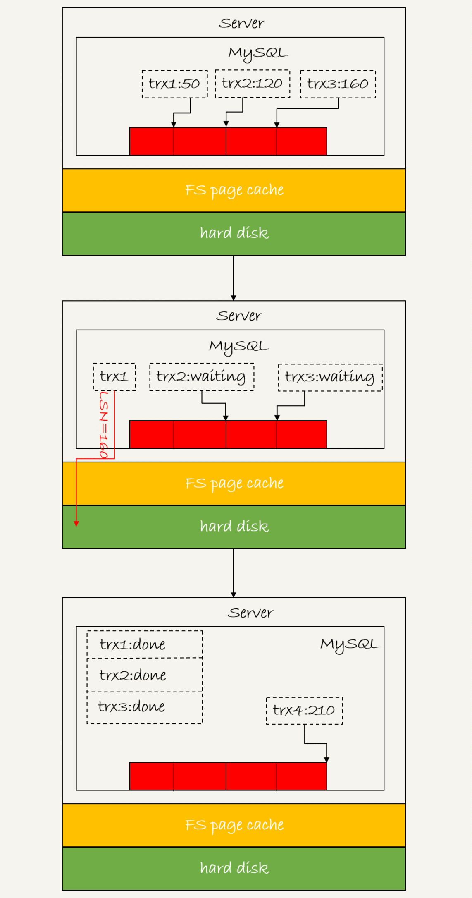
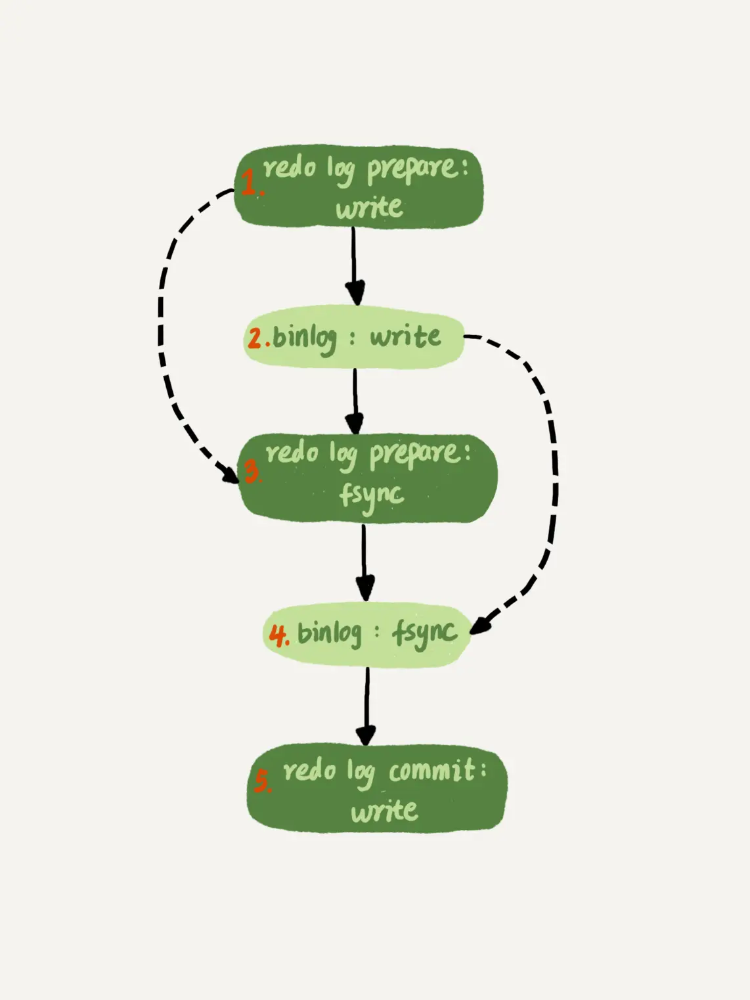

# MySQL 是如何保证数据不丢失的?

根据之前的文章，我们知道 只要 redo log 和 binlog 保证持久化到磁盘，就能确保 MySQL 异常重启后，数据可以恢复。

本章主要对 redo log 和 binlog 写入流程进行分析。

## 1. binlog 写入机制

### 写入流程

binlog 的写入逻辑比较简单：**事务执行过程中，先把日志写到 binlog cache，事务提交的时候，再把 binlog cache 写到 binlog 文件中**。

系统给 binlog cache 分配了一片内存，每个线程一个，参数 binlog_cache_size 用于控制单个线程内 binlog cache 所占内存的大小。

> 一个事务的 binlog 是不能被拆开的，因此不论这个事务多大，也要确保一次性写入。

所以如果超过了这个参数规定的大小，就要暂存到磁盘。

可以看到，每个线程有自己 binlog cache，但是共用同一份 binlog 文件：

* 图中的 write，指的就是指把日志写入到文件系统的 page cache，并没有把数据持久化到磁盘，所以速度比较快。
* 图中的 fsync，才是将数据持久化到磁盘的操作。一般情况下，我们认为 fsync 才占磁盘的 IOPS。

### sync_binlog 

write 和 fsync 的时机，是由参数 sync_binlog 控制的：

* 1）sync_binlog=0 的时候，表示每次提交事务都只 write，不 fsync；
* 2）sync_binlog=1 的时候，表示每次提交事务都会执行 fsync；
* 3）sync_binlog=N(N>1) 的时候，表示每次提交事务都 write，但累积 N 个事务后才 fsync。

> 因此，在出现 IO 瓶颈的场景里，将 sync_binlog 设置成一个比较大的值，可以提升性能。

在实际的业务场景中，考虑到丢失日志量的可控性，一般不建议将这个参数设成 0，比较常见的是将其设置为 100~1000 中的某个数值。 但是，将 sync_binlog 设置为 N，对应的风险是：如果主机发生异常重启，会丢失最近 N 个事务的 binlog 日志。

## 2. redo log 的写入机制

### 写入流程

事务在执行过程中，生成的 redo log 是要先写到 redo log buffer 的，然后随着事务提交将其写入文件系统缓存，最后 fsync 持久化到磁盘。

> 具体时机也和配置有关。

所以 redo log 也有 3 中状态：

* 1）存在 redo log buffer 中，物理上是在 MySQL 进程内存中，就是图中的红色部分；
* 2）写到磁盘 (write)，但是没有持久化（fsync)，物理上是在文件系统的 page cache 里面，也就是图中的黄色部分；
* 3）持久化到磁盘，对应的是 hard disk，也就是图中的绿色部分。

### innodb_flush_log_at_trx_commit

日志写到 redo log buffer 是很快的，wirte 到 page cache 也差不多，但是持久化到磁盘的速度就慢多了。

为了控制 redo log 的写入策略，InnoDB 提供了 innodb_flush_log_at_trx_commit 参数，它有三种可能取值：

* 1）设置为 0 的时候，表示每次事务提交时都只是把 redo log 留在 redo log buffer 中 ;
* 2）设置为 1 的时候，表示每次事务提交时都将 redo log 直接持久化到磁盘；
* 3）设置为 2 的时候，表示每次事务提交时都只是把 redo log 写到 page cache。

### 其他情况

除了事务提交时会持久化 redo log 之外，还有几个特殊情况也会持久化 redo log。

InnoDB 有一个后台线程，每隔 1 秒，就会把 redo log buffer 中的日志，调用 write 写到文件系统的 page cache，然后调用 fsync 持久化到磁盘。

> 注意，事务执行中间过程的 redo log 也是直接写在 redo log buffer 中的，这些 redo log 也会被后台线程一起持久化到磁盘。也就是说，一个没有提交的事务的 redo log，也是可能已经持久化到磁盘的。

实际上，除了后台线程每秒一次的轮询操作外，还有两种场景会让一个没有提交的事务的 redo log 写入到磁盘中。

* **一种是，redo log buffer 占用的空间即将达到 innodb_log_buffer_size 一半的时候，后台线程会主动写盘**。注意，由于这个事务并没有提交，所以这个写盘动作只是 write，而没有调用 fsync，也就是只留在了文件系统的 page cache。

* **另一种是，并行的事务提交的时候，顺带将这个事务的 redo log buffer 持久化到磁盘**。假设一个事务 A 执行到一半，已经写了一些 redo log 到 buffer 中，这时候有另外一个线程的事务 B 提交，如果 innodb_flush_log_at_trx_commit 设置的是 1，那么按照这个参数的逻辑，事务 B 要把 redo log buffer 里的日志全部持久化到磁盘。这时候，就会带上事务 A 在 redo log buffer 里的日志一起持久化到磁盘。

我们介绍两阶段提交的时候说过，时序上 redo log 先 prepare， 再写 binlog，最后再把 redo log commit。

每秒一次后台轮询刷盘，再加上崩溃恢复这个逻辑，InnoDB 就认为 redo log 在 commit 的时候就不需要 fsync 了，只会 write 到文件系统的 page cache 中就够了,这样可以省下来一个 fsync。

> 因为崩溃恢复时 prepare 状态的 redo log + 完整的 binlog 就可以满足恢复条件了，所以 redo log commit 时只 write 不 fsync，就算最后redo log 的 commit 丢失了没关系。

## 3. 组提交（group commit）

### LSN

需要先和你介绍日志逻辑序列号（log sequence number，LSN）的概念。LSN 是单调递增的，用来对应 redo log 的一个个写入点。每次写入长度为 length 的 redo log， LSN 的值就会加上 length。

LSN 也会写到 InnoDB 的数据页中，来确保数据页不会被多次执行重复的 redo log。

如下图所示，是三个并发事务 (trx1, trx2, trx3) 在 prepare 阶段，都写完 redo log buffer，持久化到磁盘的过程，对应的 LSN 分别是 50、120 和 160。

从图中可以看到：

* 1）trx1 是第一个到达的，会被选为这组的 leader；
* 2）等 trx1 要开始写盘的时候，这个组里面已经有了三个事务，这时候 LSN 也变成了 160；
* 3）trx1 去写盘的时候，带的就是 LSN=160，因此等 trx1 返回时，所有 LSN 小于等于 160 的 redo log，都已经被持久化到磁盘；
* 4）这时候 trx2 和 trx3 就可以直接返回了。

> 所以，一次组提交里面，组员越多，节约磁盘 IOPS 的效果越好

### 优化

在并发更新场景下，第一个事务写完 redo log buffer 以后，接下来这个 fsync 越晚调用，组员可能越多，节约 IOPS 的效果就越好。

为了让一次 fsync 带的组员更多，MySQL 有一个很有趣的优化：**拖时间**。

MySQL 为了让组提交的效果更好，把 redo log 做 fsync 的时间拖到了步骤 1 之后,如下图所示：

这么一来，binlog 也可以组提交了。在执行图 5 中第 4 步把 binlog fsync 到磁盘时，如果有多个事务的 binlog 已经写完了，也是一起持久化的，这样也可以减少 IOPS 的消耗。

> 不过通常情况下第 3 步执行得会很快，所以 binlog 的 write 和 fsync 间的间隔时间短，导致能集合到一起持久化的 binlog 比较少，因此 binlog 的组提交的效果通常不如 redo log 的效果那么好。

如果你想提升 binlog 组提交的效果，可以通过设置 binlog_group_commit_sync_delay 和 binlog_group_commit_sync_no_delay_count 来实现。

* binlog_group_commit_sync_delay 参数，表示延迟多少微秒后才调用 fsync;
* binlog_group_commit_sync_no_delay_count 参数，表示累积多少次以后才调用 fsync。

这两个条件是或的关系，也就是说只要有一个满足条件就会调用 fsync。

## 4. 其他

### WAL 机制

WAL 机制主要得益于两个方面：

* 1）redo log 和 binlog 都是顺序写，磁盘的顺序写比随机写速度要快；
* 2）组提交机制，可以大幅度降低磁盘的 IOPS 消耗。

### IO瓶颈优化

如果你的 MySQL 现在出现了性能瓶颈，而且瓶颈在 IO 上，可以考虑以下三种方法：

* 1）设置 binlog_group_commit_sync_delay 和 binlog_group_commit_sync_no_delay_count 参数，减少 binlog 的写盘次数。这个方法是基于“额外的故意等待”来实现的，因此可能会增加语句的响应时间，但没有丢失数据的风险。
* 2）将 sync_binlog 设置为大于 1 的值（比较常见是 100~1000）。这样做的风险是，主机掉电时会丢 binlog 日志。
* 3）将 innodb_flush_log_at_trx_commit 设置为 2。这样做的风险是，主机掉电的时候会丢数据。

**不建议你把 innodb_flush_log_at_trx_commit 设置成 0，建议设置为 2**。因为把这个参数设置成 0，表示 redo log 只保存在内存中，这样的话 MySQL 本身异常重启也会丢数据，风险太大。而 redo log 写到文件系统的 page cache 的速度也是很快的，所以将这个参数设置成 2 跟设置成 0 其实性能差不多，但这样做 MySQL 异常重启时就不会丢数据了，相比之下风险会更小。

### 双1配置

通常我们说 MySQL 的“双 1”配置，指的就是 sync_binlog 和 innodb_flush_log_at_trx_commit 都设置成 1。也就是说，一个事务完整提交前，需要等待两次刷盘，一次是 redo log（prepare 阶段），一次是 binlog。

设置非双一的情况：

* 1.业务高峰期
* 2.备库延迟，为了让备库尽快赶上主库
* 3.备份恢复主库的副本，应用 binlog 的过程，这个跟上一种场景类似。
* 4.批量导入数据的时候。

一般情况下，把生产库改成“非双 1”配置时建议设置 innodb_flush_logs_at_trx_commit=2、sync_binlog=1000。

