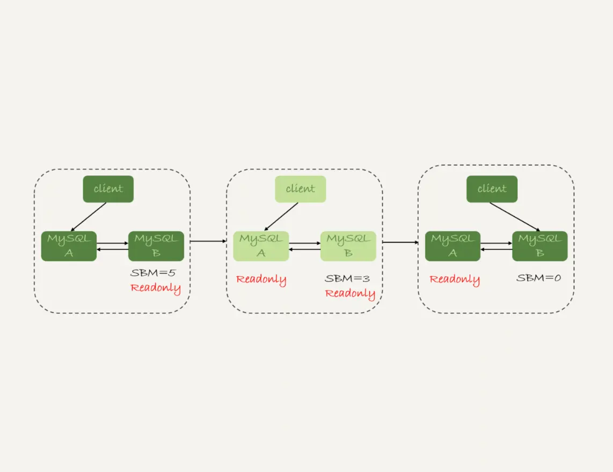
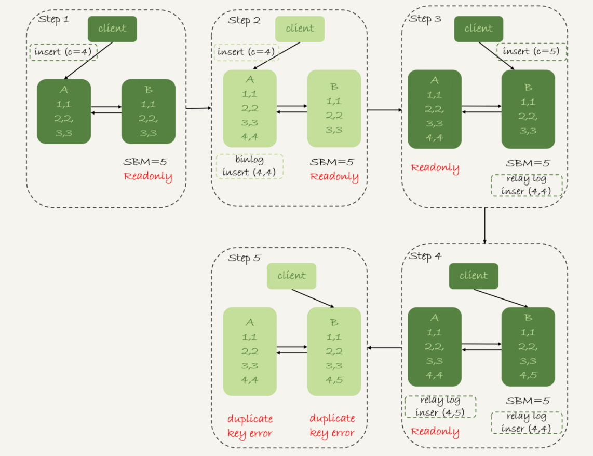

# MySQL是怎么保证高可用的？

## 1. 主备延迟

主备同步需要一个过程，所以肯定会出现延迟，即“同步延迟”。与数据同步有关的时间点主要包括以下三个：

* 1）主库 A 执行完成一个事务，写入 binlog，我们把这个时刻记为 T1;
* 2）之后传给备库 B，我们把备库 B 接收完这个 binlog 的时刻记为 T2;
* 3）备库 B 执行完成这个事务，我们把这个时刻记为 T3。

**所谓主备延迟，就是同一个事务，在备库执行完成的时间和主库执行完成的时间之间的差值**，也就是 T3-T1。

你可以在备库上执行 `show slave status` 命令，它的返回结果里面会显示 `seconds_behind_master`，用于表示当前备库延迟了多少秒。

seconds_behind_master 的计算方法是这样的：

* 1）每个事务的 binlog 里面都有一个时间字段，用于记录主库上写入的时间；
* 备库取出当前正在执行的事务的时间字段的值，计算它与当前系统时间的差值，得到 seconds_behind_master。

> 可以看到，其实 seconds_behind_master 这个参数计算的就是 T3-T1。所以，我们可以用 seconds_behind_master 来作为主备延迟的值，这个值的时间精度是秒。

*如果主备库机器的系统时间设置不一致，会不会导致主备延迟的值不准？*

其实不会的。因为，备库连接到主库的时候，会通过执行 SELECT UNIX_TIMESTAMP() 函数来获得当前主库的系统时间。如果这时候发现主库的系统时间与自己不一致，备库在执行 seconds_behind_master 计算的时候会自动扣掉这个差值。

在网络正常的时候，日志从主库传给备库所需的时间是很短的，即 T2-T1 的值是非常小的。也就是说，网络正常情况下，主备延迟的主要来源是备库接收完 binlog 和执行完这个事务之间的时间差。

所以说，**主备延迟最直接的表现是，备库消费中转日志（relay log）的速度，比主库生产 binlog 的速度要慢**。


## 2. 主备延迟的来源

**首先，有些部署条件下，备库所在机器的性能要比主库所在的机器性能差。**

更新请求对 IOPS 的压力，在主库和备库上是无差别的。所以，做这种部署时，一般都会将备库设置为“非双 1”的模式。

> 设置为非双1，减少刷盘次数，牺牲可靠性来提升性能

解决方案：

主备库选用相同规格的机器，并且做**对称部署**，这也是比较常见的情况。因为主备可能发生切换，备库随时可能变成主库


**第二种常见的可能了，即备库的压力大。**

一些运营后台需要的分析语句，不能影响正常业务，所以只能在备库上跑。

由于主库直接影响业务，大家使用起来会比较克制，反而忽视了备库的压力控制。结果就是，备库上的查询耗费了大量的 CPU 资源，影响了同步速度，造成主备延迟。

这种情况，我们一般可以这么处理：

* 1）**一主多从**。除了备库外，可以多接几个从库，让这些从库来分担读的压力。
* 2）**通过 binlog 输出到外部系统**，比如 Hadoop 这类系统，让外部系统提供统计类查询的能力。

其中，一主多从的方式大都会被采用。因为作为数据库系统，还必须保证有定期全量备份的能力。而从库，就很适合用来做备份。


**第三种可能：大事务。**

大事务这种情况很好理解。因为**主库上必须等事务执行完成才会写入 binlog，再传给备库**。所以，如果一个主库上的语句执行 10 分钟，那这个事务很可能就会导致从库延迟 10 分钟。

DBA 常说的**不要一次性地用 delete 语句删除太多数据**。其实，这就是一个典型的大事务场景。

**另一种典型的大事务场景，就是大表 DDL**

> DDL 一般比较耗时，会增加主备延迟。


## 3. 主备切换策略

由于主备延迟的存在，所以在主备切换的时候，就相应的有不同的策略。


### 可靠性优先策略

双 M 结构下，从状态 1 到状态 2 切换的详细过程是这样的：

* 1）判断备库 B 现在的 seconds_behind_master，如果小于某个值（比如 5 秒）继续下一步，否则持续重试这一步；
* 2）把主库 A 改成只读状态，即把 readonly 设置为 true；
* 3）判断备库 B 的 seconds_behind_master 的值，直到这个值变成 0 为止；
* 4）把备库 B 改成可读写状态，也就是把 readonly 设置为 false；
* 5）把业务请求切到备库 B。



> 图中的 SBM，是 seconds_behind_master 参数的简写。

可以看到，**这个切换流程中是有不可用时间的**。因为在步骤 2 之后，主库 A 和备库 B 都处于 readonly 状态，也就是说这时系统处于不可写状态，直到步骤 5 完成后才能恢复。

> 在这个不可用状态中，比较耗费时间的是步骤 3，可能需要耗费好几秒的时间。这也是为什么需要在步骤 1 先做判断，确保 seconds_behind_master 的值足够小。


### 可用性优先策略

如果我强行把步骤 4、5 调整到最开始执行，也就是说不等主备数据同步，直接把连接切到备库 B，并且让备库 B 可以读写，那么系统几乎就没有不可用时间了。

我们把这个切换流程，暂时称作**可用性优先流程**。这个切换流程的代价，就是**可能出现数据不一致**的情况。

#### 数据不一致案例

下面是一个可用性优先流程产生数据不一致的例子。

假设有一个表 t：

```mysql
mysql> CREATE TABLE `t` (
  `id` int(11) unsigned NOT NULL AUTO_INCREMENT,
  `c` int(11) unsigned DEFAULT NULL,
  PRIMARY KEY (`id`)
) ENGINE=InnoDB;

insert into t(c) values(1),(2),(3);
```

接下来，业务人员要继续在表 t 上执行两条插入语句的命令，依次是：

```mysql
insert into t(c) values(4);
insert into t(c) values(5);
```

假设，现在主库上其他的数据表有大量的更新，导致主备延迟达到 5 秒。在插入 c=4 这条语句后，发起了主备切换。

> 此时 c=5 还未执行

下图是**可用性优先策略，且 binlog_format=mixed **时的切换流程和数据结果。


现在，我们一起分析下这个切换流程：

* 1）步骤 2 中，主库 A 执行完 insert 语句，插入了一行数据（4,4），之后开始进行主备切换。
* 2）步骤 3 中，由于主备之间有 5 秒的延迟，所以备库 B 还没来得及应用“插入 c=4”这个中转日志，就开始接收客户端“插入 c=5”的命令。
* 3）步骤 4 中，备库 B 插入了一行数据（4,5），并且把这个 binlog 发给主库 A。
* 4）步骤 5 中，备库 B 执行“插入 c=4”这个中转日志，插入了一行数据（5,4）。而直接在备库 B 执行的“插入 c=5”这个语句，传到主库 A，就插入了一行新数据（5,5）。

最后的结果就是，主库 A 和备库 B 上出现了两行不一致的数据。可以看到，这个数据不一致，是由可用性优先流程导致的。

那么，如果我还是用**可用性优先策略，但设置 binlog_format=row**，情况又会怎样呢？

> 因为 row 格式在记录 binlog 的时候，会记录新插入的行的所有字段值。
>
> 所以最后只会有一行不一致。而且，两边的主备同步的应用线程会报错 duplicate key error 并停止。

也就是说，这种情况下，备库 B 的 (5,4) 和主库 A 的 (5,5) 这两行数据，都不会被对方执行。



结论：

* **使用 row 格式的 binlog 时，数据不一致的问题更容易被发现**。而使用 mixed 或者 statement 格式的 binlog 时，数据很可能悄悄地就不一致了。如果你过了很久才发现数据不一致的问题，很可能这时的数据不一致已经不可查，或者连带造成了更多的数据逻辑不一致。
* **主备切换的可用性优先策略会导致数据不一致**。因此，**大多数情况下，都建议使用可靠性优先策略**。毕竟对数据服务来说的话，数据的可靠性一般还是要优于可用性的。


## 4. 小结

**在满足数据可靠性的前提下，MySQL 高可用系统的可用性，是依赖于主备延迟的**。延迟的时间越小，在主库故障的时候，服务恢复需要的时间就越短，可用性就越高。

主备延迟：就是同一个事务，在备库执行完成的时间和主库执行完成的时间之间的差值。

主备延迟原因：

* 1）备库性能比主库差
* 2）备库压力大
* 3）主库执行大事务


主备切换策略：

* 1）可靠性优先
* 2）可用性优先

**在实际的应用中，更建议使用可靠性优先的策略**。毕竟保证数据准确，应该是数据库服务的底线。在这个基础上，通过减少主备延迟，提升系统的可用性。

