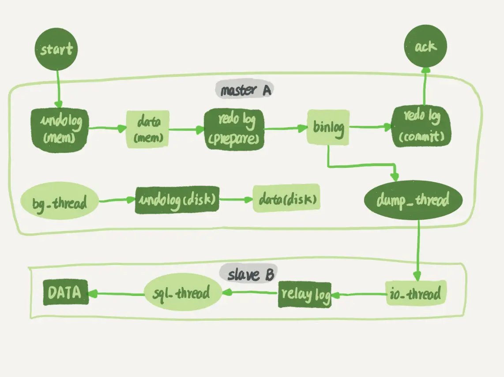
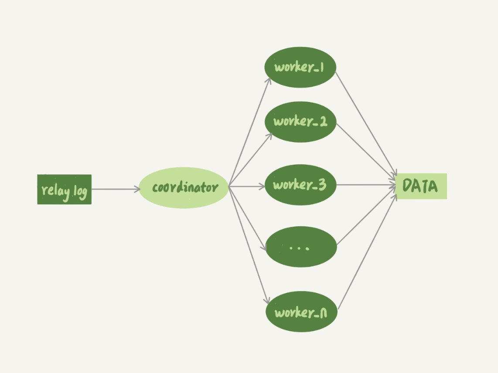
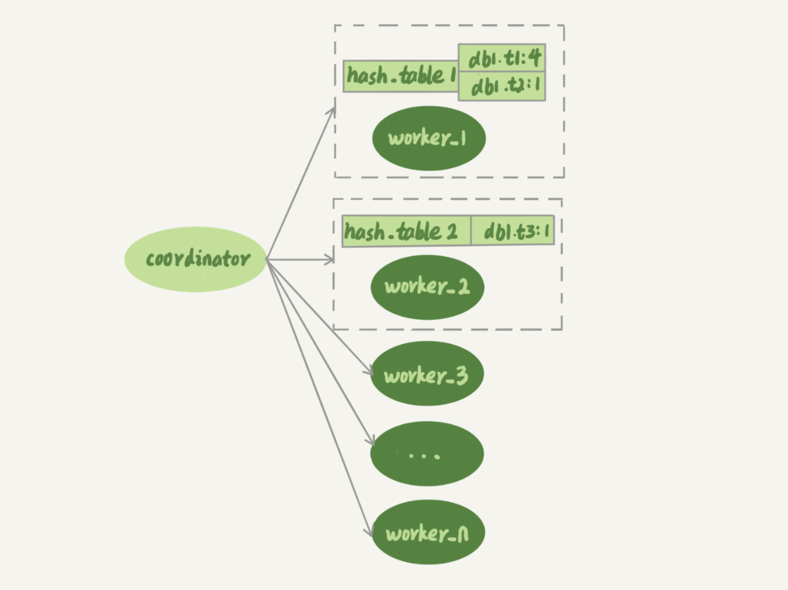

# MySQL 主备-备库并行复制能力

## 1. 概述



谈到主备的并行复制能力，我们要关注的是图中黑色的两个箭头。一个箭头代表了客户端写入主库，另一箭头代表的是备库上 sql_thread 执行中转日志（relay log）。

如果用箭头的粗细来代表并行度的话，那么真实情况就如图所示，第一个箭头要明显粗于第二个箭头。

在主库上，影响并发度的原因就是各种锁了。

> 由于 InnoDB 引擎支持行锁，除了所有并发事务都在更新同一行（热点行）这种极端场景外，它对业务并发度的支持还是很友好的。

而日志在备库上的执行，就是图中备库上 sql_thread 更新数据 (DATA) 的逻辑。如果是用单线程的话，就会导致备库应用日志不够快，造成主备延迟。

在官方的 5.6 版本之前，MySQL 只支持单线程复制，由此在主库并发高、TPS 高时就会出现严重的主备延迟问题。


## 2. 并行复制-基本要求

其实说到底，所有的多线程复制机制，都是要把只有一个线程的 sql_thread，拆成多个线程，也就是都符合下面的这个模型：



图 2 中，coordinator 就是原来的 sql_thread, 不过现在它不再直接更新数据了，只负责读取中转日志和分发事务。真正更新日志的，变成了 worker 线程。而 work 线程的个数，就是由参数 slave_parallel_workers 决定的。

> 根据我的经验，把这个值设置为 8~16 之间最好（32 核物理机的情况），毕竟备库还有可能要提供读查询，不能把 CPU 都吃光了。


接下来，你需要先思考一个问题：*事务能不能按照轮询的方式分发给各个 worker，也就是第一个事务分给 worker_1，第二个事务发给 worker_2 呢？*

其实是不行的。因为，事务被分发给 worker 以后，不同的 worker 就独立执行了。但是，由于 CPU 的调度策略，很可能第二个事务最终比第一个事务先执行。而如果这时候刚好这两个事务更新的是同一行，也就意味着，同一行上的两个事务，在主库和备库上的执行顺序相反，会导致主备不一致的问题。

接下来，请你再设想一下另外一个问题：*同一个事务的多个更新语句，能不能分给不同的 worker 来执行呢？*

答案是，也不行。举个例子，一个事务更新了表 t1 和表 t2 中的各一行，如果这两条更新语句被分到不同 worker 的话，虽然最终的结果是主备一致的，但如果表 t1 执行完成的瞬间，备库上有一个查询，就会看到这个事务“更新了一半的结果”，破坏了事务逻辑的隔离性。

所以，**coordinator 在分发的时候，需要满足以下这两个基本要求**：

* 1）不能造成更新覆盖。这就要求更新同一行的两个事务，必须被分发到同一个 worker 中。
* 2）同一个事务不能被拆开，必须放到同一个 worker 中。


## 3. MySQL 5.5-民间版本

官方 MySQL 5.5 版本是不支持并行复制的，专栏作者自己实现了两个版本的并行策略。

**按表分发策略**和**按行分发策略**，了解这两个策略可以帮助你理解 MySQL 官方版本并行复制策略的迭代。

### 按表分发策略

**按表分发事务的基本思路是，如果两个事务更新不同的表，它们就可以并行**。

> 因为数据是存储在表里的，所以按表分发，可以保证两个 worker 不会更新同一行。



可以看到，每个 worker 线程对应一个 hash 表，用于保存当前正在这个 worker 的“执行队列”里的事务所涉及的表。hash 表的 key 是**库名. 表名**，value 是一个数字，表示队列中有多少个事务修改这个表。

在有事务分配给 worker 时，事务里面涉及的表会被加到对应的 hash 表中。worker 执行完成后，这个表会被从 hash 表中去掉。

假设在图中的情况下，coordinator 从中转日志中读入一个新事务 T，这个事务修改的行涉及到表 t1 和 t3。

现在我们用事务 T 的分配流程，来看一下分配规则。

* 1）由于事务 T 中涉及修改表 t1，而 worker_1 队列中有事务在修改表 t1，事务 T 和队列中的某个事务要修改同一个表的数据，这种情况我们说事务 T 和 worker_1 是冲突的。
* 2）按照这个逻辑，顺序判断事务 T 和每个 worker 队列的冲突关系，会发现事务 T 跟 worker_2 也冲突。
* 3）事务 T 跟多于一个 worker 冲突，coordinator 线程就进入等待。
  * 如果只和一个 worker 冲突，那直接把该事务分给这个 worker 就不冲突了
  * 多于两个 worker 冲突就只能等待了
* 4）每个 worker 继续执行，同时修改 hash_table。假设 hash_table_2 里面涉及到修改表 t3 的事务先执行完成，就会从 hash_table_2 中把 db1.t3 这一项去掉。
* 5）这样 coordinator 会发现跟事务 T 冲突的 worker 只有 worker_1 了，因此就把它分配给 worker_1。
* 6）coordinator 继续读下一个中转日志，继续分配事务。

也就是说，**每个事务在分发的时候，跟所有 worker 的冲突关系包括以下三种情况**：

* 1）如果跟所有 worker 都不冲突，coordinator 线程就会把这个事务分配给最空闲的 woker;
* 2）如果跟多于一个 worker 冲突，coordinator 线程就进入等待状态，直到和这个事务存在冲突关系的 worker 只剩下 1 个；
* 3）如果只跟一个 worker 冲突，coordinator 线程就会把这个事务分配给这个存在冲突关系的 worker。

这个按表分发的方案，在多个表负载均匀的场景里应用效果很好。但是，如果碰到热点表，比如所有的更新事务都会涉及到某一个表的时候，所有事务都会被分配到同一个 worker 中，就变成单线程复制了。


### 按行分发策略

要解决热点表的并行复制问题，就需要一个按行并行复制的方案。**按行复制的核心思路是：如果两个事务没有更新相同的行，它们在备库上可以并行执行。**显然，这个模式要求 binlog 格式必须是 row。

> 因为 statement 记录的是 SQL 语句，无法看出来该事务更新了哪几行，因此执行先后顺序可能会影响到最终结果。而 row 格式则记录了具体更新了哪几行。

这时候，我们判断一个事务 T 和 worker 是否冲突，用的就规则就不是“修改同一个表”，而是“修改同一行”。

按行复制和按表复制的数据结构差不多，也是为每个 worker，分配一个 hash 表。只是要实现按行分发，这时候的 key，就必须是**库名 + 表名 + 唯一键的值**。

但是，这个“唯一键”只有主键 id 还是不够的，我们还需要考虑下面这种场景，表 t1 中除了主键，还有唯一索引 a：

```mysql

CREATE TABLE `t1` (
  `id` int(11) NOT NULL,
  `a` int(11) DEFAULT NULL,
  `b` int(11) DEFAULT NULL,
  PRIMARY KEY (`id`),
  UNIQUE KEY `a` (`a`)
) ENGINE=InnoDB;

insert into t1 values(1,1,1),(2,2,2),(3,3,3),(4,4,4),(5,5,5);
```

假设，接下来我们要在主库执行这两个事务：

| SessionA                       | SessionB                       |
| ------------------------------ | ------------------------------ |
| update t1 set a=6 where id =1; |                                |
|                                | update t1 set a=1 where id =2; |

可以看到，这两个事务要更新的行的主键值不同，但是如果它们被分到不同的 worker，就有可能 session B 的语句先执行。这时候 id=1 的行的 a 的值还是 1，就会报唯一键冲突。

因此，基于行的策略，事务 hash 表中还需要考虑唯一键，即 key 应该是**库名 + 表名 + 索引 a 的名字 +a 的值**。

因此，coordinator 在解析这个语句的 binlog 的时候，这个事务的 hash 表就有三个项:

* 1）key=hash_func(db1+t1+“PRIMARY”+2), value=2; 这里 value=2 是因为修改前后的行 id 值不变，出现了两次。
* 2）key=hash_func(db1+t1+“a”+2), value=1，表示会影响到这个表 a=2 的行。
* 3）key=hash_func(db1+t1+“a”+1), value=1，表示会影响到这个表 a=1 的行。

**相比于按表并行分发策略，按行并行策略在决定线程分发的时候，需要消耗更多的计算资源**

你可能也发现了，这两个方案其实都有一些约束条件：

* 1）要能够从 binlog 里面解析出表名、主键值和唯一索引的值。也就是说，主库的 binlog 格式必须是 row；
* 2）表必须有主键；
* 3）不能有外键。表上如果有外键，级联更新的行不会记录在 binlog 中，这样冲突检测就不准确。

> 好在这三条约束规则，本来就是 DBA 之前要求业务开发人员必须遵守的线上使用规范，所以这两个并行复制策略在应用上也没有碰到什么麻烦。

对比按表分发和按行分发这两个方案的话，按行分发策略的并行度更高。不过，如果是要操作很多行的大事务的话，按行分发的策略有两个问题：

* 1）耗费内存。比如一个语句要删除 100 万行数据，这时候 hash 表就要记录 100 万个项。
* 2）耗费 CPU。解析 binlog，然后计算 hash 值，对于大事务，这个成本还是很高的。

所以，在这个策略中，单个事务如果超过设置的行数阈值（比如，如果单个事务更新的行数超过 10 万行），就暂时退化为单线程模式，退化过程的逻辑大概是这样的：

* 1）coordinator 暂时先 hold 住这个事务；
* 2）等待所有 worker 都执行完成，变成空队列；
* 3）coordinator 直接执行这个事务；
* 4）恢复并行模式。


## 4. MySQL 5.6-按库并行

官方 MySQL5.6 版本，支持了并行复制，只是支持的粒度是**按库并行**。

> 根据之前的内容可以知道，用于决定分发策略的 hash 表里，key 就是数据库名。

这个策略的并行效果，取决于压力模型。如果在主库上有多个 DB，并且各个 DB 的压力均衡，使用这个策略的效果会很好。

相比于按表和按行分发，这个策略有两个优势：

* 1）构造 hash 值的时候很快，只需要库名；而且一个实例上 DB 数也不会很多，不会出现需要构造 100 万个项这种情况。
* 2）不要求 binlog 的格式。因为 statement 格式的 binlog 也可以很容易拿到库名。

但是，如果你的主库上的表都放在同一个 DB 里面，这个策略就没有效果了；或者如果不同 DB 的热点不同，比如一个是业务逻辑库，一个是系统配置库，那也起不到并行的效果。


## 5. MariaDB-模拟主库

MariaDB 同样实现了一个 并行复制策略，而且还利用了redo log 组提交 (group commit) 优化的特性：

* 1）能够在同一组里提交的事务，一定不会修改同一行；
* 2）主库上可以并行执行的事务，备库上也一定是可以并行执行的。

在实现上，MariaDB 是这么做的：

* 1）在一组里面一起提交的事务，有一个相同的 commit_id，下一组就是 commit_id+1；
* 2）commit_id 直接写到 binlog 里面；
* 3）传到备库应用的时候，相同 commit_id 的事务分发到多个 worker 执行；
* 4）这一组全部执行完成后，coordinator 再去取下一批。

> 当时，这个策略出来的时候是相当惊艳的。因为，之前业界的思路都是在“分析 binlog，并拆分到 worker”上。而 MariaDB 的这个策略，目标是“模拟主库的并行模式”。

但是，这个策略有一个问题，它并没有实现“真正的模拟主库并发度”这个目标。在主库上，一组事务在 commit 的时候，下一组事务是同时处于“执行中”状态的。

而按照 MariaDB 的并行复制策略，在备库上执行的时候，要等第一组事务完全执行完成后，第二组事务才能开始执行，这样系统的吞吐量就不够。


## 6. MySQL 5.7-模拟主库

在 MariaDB 并行复制实现之后，官方的 MySQL5.7 版本也提供了类似的功能，由参数 slave-parallel-type 来控制并行复制策略：

* 配置为 DATABASE，表示使用 MySQL 5.6 版本的按库并行策略；
* 配置为 LOGICAL_CLOCK，表示的就是类似 MariaDB 的策略。不过，MySQL 5.7 这个策略，针对并行度做了优化。这个优化的思路也很有趣儿。

MySQL 5.7 并行复制策略的思想主要利用了事务的两阶段提交，具体如下：

* 1）同时处于 prepare 状态的事务，在备库执行时是可以并行的；
* 2）处于 prepare 状态的事务，与处于 commit 状态的事务之间，在备库执行时也是可以并行的。

binlog 的组提交的时候，有以下两个参数：

* 1）binlog_group_commit_sync_delay 参数，表示延迟多少微秒后才调用 fsync;
* 2）binlog_group_commit_sync_no_delay_count 参数，表示累积多少次以后才调用 fsync。

这两个参数是用于故意拉长 binlog 从 write 到 fsync 的时间，以此减少 binlog 的写盘次数。在 MySQL 5.7 的并行复制策略里，它们可以用来制造更多的“同时处于 prepare 阶段的事务”。这样就增加了备库复制的并行度。

> 也就是说，这两个参数，既可以“故意”让主库提交得慢些，又可以让备库执行得快些。在 MySQL 5.7 处理备库延迟的时候，可以考虑调整这两个参数值，来达到提升备库复制并发度的目的。


## 7. MySQL 5.7.22-WRITESET

在 2018 年 4 月份发布的 MySQL 5.7.22 版本里，MySQL 增加了一个新的并行复制策略，基于 WRITESET 的并行复制。

相应地，新增了一个参数 binlog-transaction-dependency-tracking，用来控制是否启用这个新策略。这个参数的可选值有以下三种:

* COMMIT_ORDER，表示的就是前面介绍的，根据同时进入 prepare 和 commit 来判断是否可以并行的策略。
* WRITESET，表示的是对于事务涉及更新的每一行，计算出这一行的 hash 值，组成集合 writeset。如果两个事务没有操作相同的行，也就是说它们的 writeset 没有交集，就可以并行。
* WRITESET_SESSION，是在 WRITESET 的基础上多了一个约束，即在主库上同一个线程先后执行的两个事务，在备库执行的时候，要保证相同的先后顺序。

当然为了唯一标识，这个 hash 值是通过“库名 + 表名 + 索引名 + 值”计算出来的。如果一个表上除了有主键索引外，还有其他唯一索引，那么对于每个唯一索引，insert 语句对应的 writeset 就要多增加一个 hash 值。

该策略和基于 MySQL 5.5 版本的按行分发的策略是差不多的。不过，MySQL 官方的这个实现还是有很大的优势：

* 1）writeset 是在主库生成后直接写入到 binlog 里面的，这样在备库执行的时候，不需要解析 binlog 内容（event 里的行数据），节省了很多计算量；
* 2）不需要把整个事务的 binlog 都扫一遍才能决定分发到哪个 worker，更省内存；
* 3）由于备库的分发策略不依赖于 binlog 内容，所以 binlog 是 statement 格式也是可以的。

因此，MySQL 5.7.22 的并行复制策略在通用性上还是有保证的。

> 当然，对于“表上没主键”和“外键约束”的场景，WRITESET 策略也是没法并行的，也会暂时退化为单线程模型。


## 8. 小结

*为什么要有多线程复制呢？*

这是因为单线程复制的能力全面低于多线程复制，对于更新压力较大的主库，备库是可能一直追不上主库的。从现象上看就是，备库上 seconds_behind_master 的值越来越大。

从这些分析中，你也会发现大事务不仅会影响到主库，也是造成备库复制延迟的主要原因之一。因此，在平时的开发工作中，我建议你尽量减少大事务操作，把大事务拆成小事务。

另外官方 MySQL5.7 版本新增的备库并行策略，修改了 binlog 的内容，也就是说 binlog 协议并不是向上兼容的，在主备切换、版本升级的时候需要把这个因素也考虑进去。