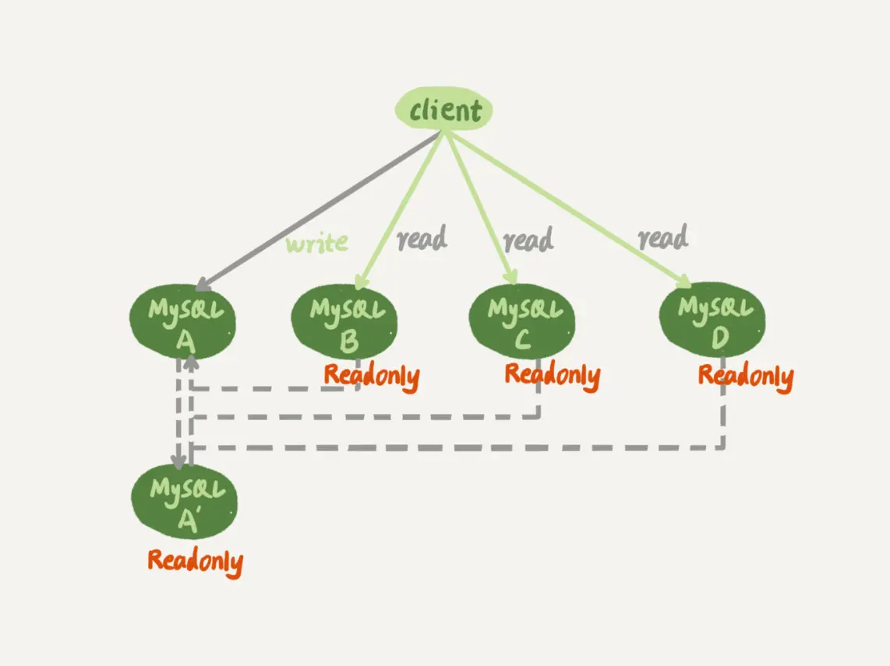
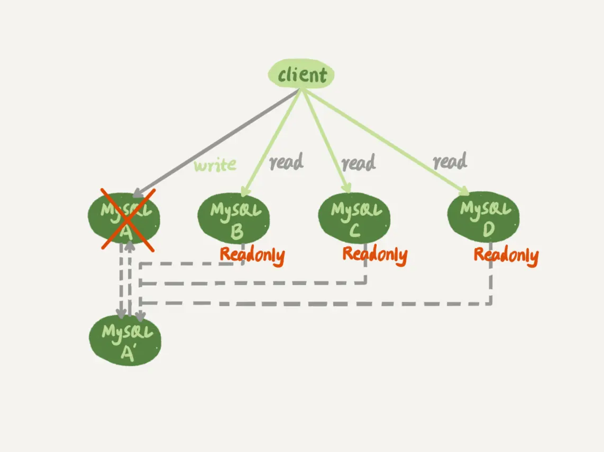

# 一主多从的切换正确性

大多数的互联网应用场景都是读多写少，因此在业务发展过程中很可能先会遇到读性能的问题。相应的 MySQL 一般也会使用**一主多从**架构。



图中，虚线箭头表示的是主备关系，也就是 A 和 A’互为主备， 从库 B、C、D 指向的是主库 A。一主多从的设置，一般用于读写分离，主库负责所有的写入和一部分读，其他的读请求则由从库分担。

一主多从架构下的主备切换如下所示：



相比于一主一备的切换流程，一主多从结构在切换完成后，A’会成为新的主库，从库 B、C、D 也要改接到 A’。正是由于多了从库 B、C、D 重新指向的这个过程，所以主备切换的复杂性也相应增加了。

接下来，我们再一起看看一个切换系统会怎么完成一主多从的主备切换过程。


## 1. 基于位点的主备切换

当我们把节点 B 设置成节点 A’的从库的时候，需要执行一条 change master 命令：

```mysql
CHANGE MASTER TO 
MASTER_HOST=$host_name 
MASTER_PORT=$port 
MASTER_USER=$user_name 
MASTER_PASSWORD=$password 
MASTER_LOG_FILE=$master_log_name 
MASTER_LOG_POS=$master_log_pos  
```

* MASTER_HOST、MASTER_PORT、MASTER_USER 和 MASTER_PASSWORD 四个参数，分别代表了主库 A’的 IP、端口、用户名和密码。 
* 最后两个参数 MASTER_LOG_FILE 和 MASTER_LOG_POS 表示，要从主库的 master_log_name 文件的 master_log_pos 这个位置的日志继续同步。而这个位置就是我们所说的**同步位点**，也就是**主库对应的文件名和日志偏移量**。

主备切换时，要将节点 B 要设置成 A’的从库，就要执行 change master 命令，就不可避免地要设置位点的这两个参数，那么该如何取值呢？

切换前节点 B 是 A 的从库，本地记录的也是 A 的位点。但是相同的日志，A 的位点和 A’的位点是不同的。因此，从库 B 要切换的时候，就需要先经过**找同步位点**这个逻辑。

考虑到切换过程中不能丢数据，所以我们找位点的时候，总是要找一个“稍微往前”的，然后再通过判断跳过那些在从库 B 上已经执行过的事务。

> 本质是重放binlog，所以如果点位太靠后可能会丢数据，找一个稍微往前点的，执行时如果发现是重复数据就跳过即可。


### 寻找同步为位点

一种取同步位点的方法是这样的：

* 1）等待新主库 A’把中转日志（relay log）全部同步完成；
* 2）在 A’上执行 show master status 命令，得到当前 A’上最新的 File 和 Position；
* 3）取原主库 A 故障的时刻 T；
* 4）用 mysqlbinlog 工具解析 A’的 File，得到 T 时刻的位点。
  * `mysqlbinlog File --stop-datetime=T --start-datetime=T`

4中解析出来的 `end_log_pos`表示的就是 A’这个实例，在 T 时刻写入新的 binlog 的位置，然后，我们就可以把 123 这个值作为 $master_log_pos ，用在节点 B 的 change master 命令里。


### 跳过错误

假设在 T 这个时刻，主库 A 已经执行完成了一个 insert 语句插入了一行数据 R，并且已经将 binlog 传给了 A’和 B，然后在传完的瞬间主库 A 的主机就掉电了。

* 1）在从库 B 上，由于同步了 binlog， R 这一行已经存在；
* 2）在新主库 A’上， R 这一行也已经存在，日志是写在 123 这个位置之后的；
* 3）我们在从库 B 上执行 change master 命令，指向 A’的 File 文件的 123 位置，就会把插入 R 这一行数据的 binlog 又同步到从库 B 去执行。

这时候，从库 B 的同步线程就会报告 Duplicate entry ‘id_of_R’ for key ‘PRIMARY’ 错误，提示出现了主键冲突，然后停止同步。

所以，**通常情况下，我们在切换任务的时候，要先主动跳过这些错误**。

有两种常用的方法。**一种做法是，主动跳过一个事务**。跳跳过命令的写法是：

```mysql
set global sql_slave_skip_counter=1;
start slave;
```

因为切换过程中，可能会不止重复执行一个事务，所以我们需要在从库 B 刚开始接到新主库 A’时，持续观察，每次碰到这些错误就停下来，执行一次跳过命令，直到不再出现停下来的情况，以此来跳过可能涉及的所有事务。

**另外一种方式是，通过设置 slave_skip_errors 参数，直接设置跳过指定的错误。**

在执行主备切换时，有这么两类错误，是经常会遇到的：

* 1062 错误是插入数据时唯一键冲突；
* 1032 错误是删除数据时找不到行。

因此，我们可以把 slave_skip_errors 设置为 “1032,1062”，这样中间碰到这两个错误时就直接跳过。

等到主备间的同步关系建立完成，并稳定执行一段时间之后，我们**还需要把这个参数设置为空**，以免之后真的出现了主从数据不一致，也跳过了。


## 2. GTID

通过 sql_slave_skip_counter 跳过事务和通过 slave_skip_errors 忽略错误的方法，虽然都最终可以建立从库 B 和新主库 A’的主备关系，但这两种操作都很复杂，而且容易出错。所以，**MySQL 5.6 版本引入了 GTID，彻底解决了这个困难**。

GTID 的全称是 Global Transaction Identifier，也就是全局事务 ID，是一个事务在提交的时候生成的，是这个事务的唯一标识。它由两部分组成，格式是：

```sh
GTID=server_uuid:gno
```

其中：

* server_uuid 是一个实例第一次启动时自动生成的，是一个全局唯一的值；
* gno 是一个整数，初始值是 1，每次提交事务的时候分配给这个事务，并加 1。

这里我需要和你说明一下，在 MySQL 的官方文档里，GTID 格式是这么定义的：

```sh
GTID=source_id:transaction_id
```

这里的 source_id 就是 server_uuid；而后面的这个 transaction_id，我觉得容易造成误导，所以我改成了 gno。

 MySQL 里面我们说 transaction_id 就是指事务 id，事务 id 是在事务执行过程中分配的，如果这个事务回滚了，事务 id 也会递增，而 gno 是在事务提交的时候才会分配。

GTID 模式的启动也很简单，我们只需要在**启动一个 MySQL 实例的时候，加上参数 gtid_mode=on 和 enforce_gtid_consistency=on 就可以了**。

在 GTID 模式下，每个事务都会跟一个 GTID 一一对应。这个 GTID 有两种生成方式，而使用哪种方式取决于 session 变量 gtid_next 的值。

* 1）如果 gtid_next=automatic，代表使用默认值。这时，MySQL 就会把 server_uuid:gno 分配给这个事务。
  * a）记录 binlog 的时候，先记录一行 SET @@SESSION.GTID_NEXT=‘server_uuid:gno’;
  * b）把这个 GTID 加入本实例的 GTID 集合。
* 2）如果 gtid_next 是一个指定的 GTID 的值，比如通过 set gtid_next='current_gtid’指定为 current_gtid，那么就有两种可能：
  * a）如果 current_gtid 已经存在于实例的 GTID 集合中，接下来执行的这个事务会直接被系统忽略；
  * b）如果 current_gtid 没有存在于实例的 GTID 集合中，就将这个 current_gtid 分配给接下来要执行的事务，也就是说系统不需要给这个事务生成新的 GTID，因此 gno 也不用加 1。

这样，每个 MySQL 实例都维护了一个 GTID 集合，用来对应“这个实例执行过的所有事务”。

> 由于 GTID 是递增的，所以将主从实例的 GTID 集合简单对比就能找到同步位点。


## 3. 基于 GTID 的主备切换

在 GTID 模式下，备库 B 要设置为新主库 A’的从库的语法如下：

```mysql

CHANGE MASTER TO 
MASTER_HOST=$host_name 
MASTER_PORT=$port 
MASTER_USER=$user_name 
MASTER_PASSWORD=$password 
master_auto_position=1 
```

其中，master_auto_position=1 就表示这个主备关系使用的是 GTID 协议。

> 可以看到，前面让我们头疼不已的 MASTER_LOG_FILE 和 MASTER_LOG_POS 参数，已经不需要指定了。

我们把现在这个时刻，实例 A’的 GTID 集合记为 set_a，实例 B 的 GTID 集合记为 set_b。接下来，我们就看看现在的主备切换逻辑。

我们在实例 B 上执行 start slave 命令，取 binlog 的逻辑是这样的：

* 1）实例 B 指定主库 A’，基于主备协议建立连接。
* 2）实例 B 把 set_b 发给主库 A’。
* 3）实例 A’算出 set_a 与 set_b 的差集，也就是所有存在于 set_a，但是不存在于 set_b 的 GTID 的集合，判断 A’本地是否包含了这个差集需要的所有 binlog 事务。
  * a）如果不包含，表示 A’已经把实例 B 需要的 binlog 给删掉了，直接返回错误；
  * b）如果确认全部包含，A’从自己的 binlog 文件里面，找出第一个不在 set_b 的事务，发给 B；
    * 因为 gtid 是递增的，所以第一个不在set_b 的事务就是实例b的第一个缺失的事务
* 4）之后就从这个事务开始，往后读文件，按顺序取 binlog 发给 B 去执行。

> 假设 set_a 为[1,2,3,..7,8,9] set_b为[1,2,3] ，差集就是 [4,5,6,7,8,9],然后实例a从自己的 binlog 里找到第一个不在 set_b 的事务就是 4 ，发给b，接着再将4之后的全部发给b。

其实，这个逻辑里面包含了一个设计思想：**在基于 GTID 的主备关系里，系统认为只要建立主备关系，就必须保证主库发给备库的日志是完整的**。因此，如果实例 B 需要的日志已经不存在，A’就拒绝把日志发给 B。

> 基于位点的协议，是由备库决定的，备库指定哪个位点，主库就发哪个位点，不做日志的完整性判断。

引入 GTID 后，一主多从的切换场景下,由于不需要找位点了，所以从库 B、C、D 只需要分别执行 change master 命令指向实例 A’即可。

> 严谨地说，主备切换不是不需要找位点了，而是找位点这个工作，在实例 A’内部就已经自动完成了。但由于这个工作是自动的，所以对 HA 系统的开发人员来说，非常友好。


## 4. 小结

一主多从的主备切换流程中，从库找新主库的位点是一个痛点。由此，MySQL 5.6 版本引入的 GTID 模式，解决该问题。

每个 MySQL 实例都维护了一个 GTID 集合，用来对应“这个实例执行过的所有事务”。

> 由于 GTID 是递增的，所以将主从实例的 GTID 集合简单对比就能找到同步位点。

在 GTID 模式下，找位点的工作在实例内部就自动完成了，一主多从切换就非常方便了。

因此，如果你使用的 MySQL 版本支持 GTID 的话，我都建议你尽量使用 GTID 模式来做一主多从的切换。