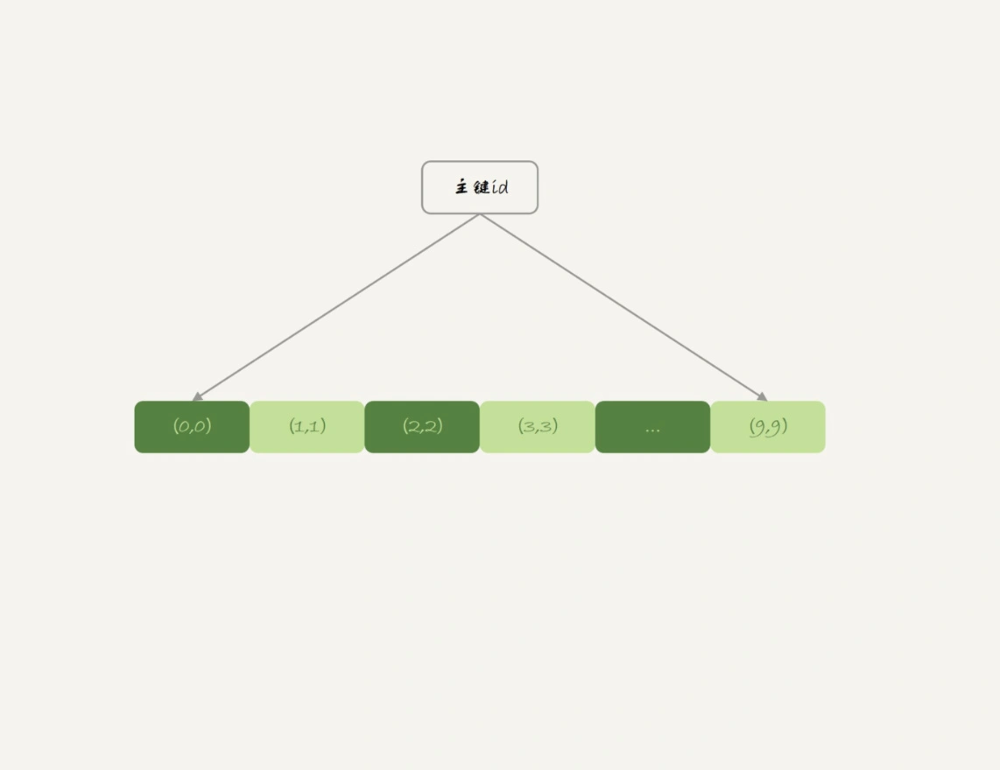
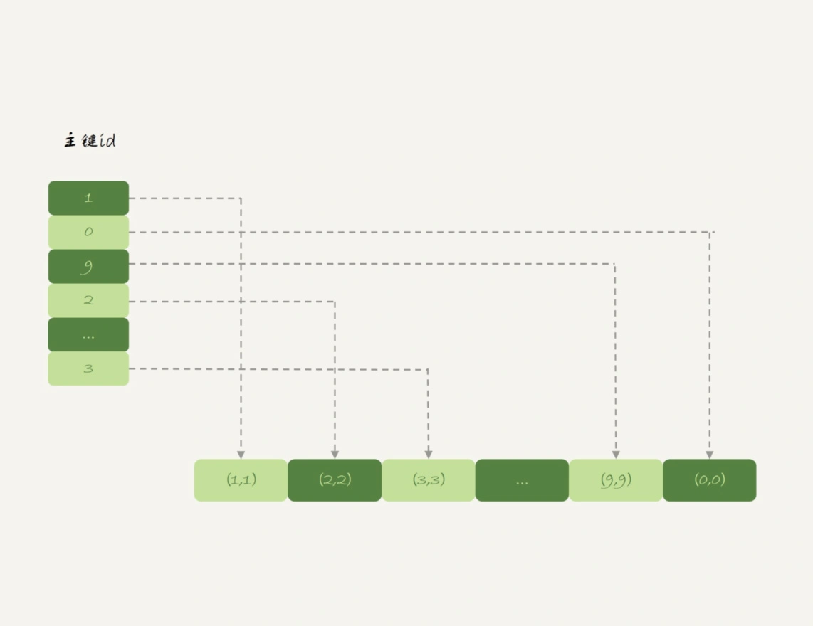
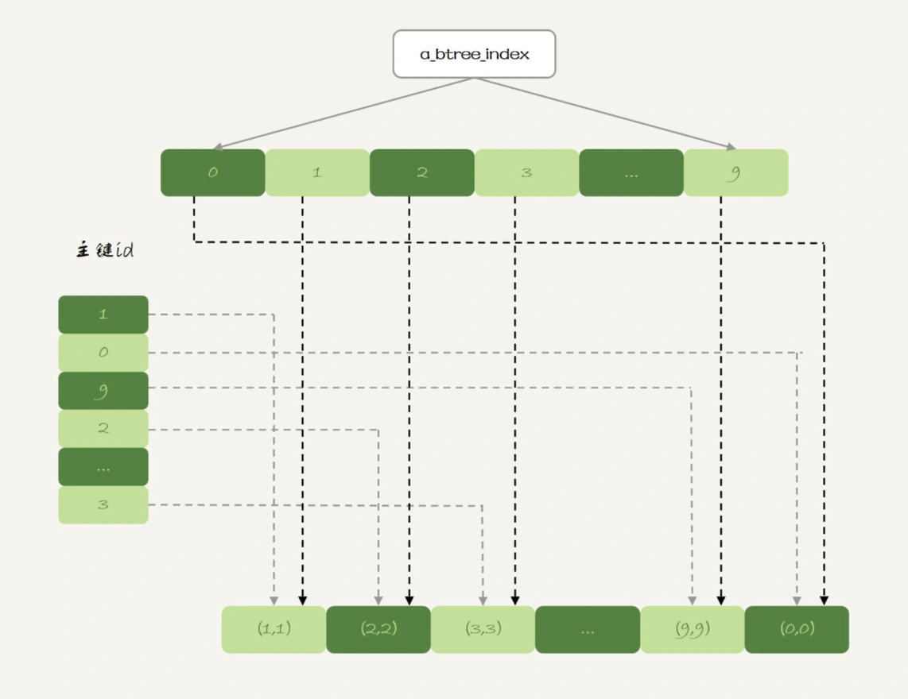

# 都说InnoDB好，那还要不要使用Memory引擎？


## 1. 内存表的数据组织结构

假设有以下的两张表 t1 和 t2，其中表 t1 使用 Memory 引擎， 表 t2 使用 InnoDB 引擎。

```mysql

create table t1(id int primary key, c int) engine=Memory;
create table t2(id int primary key, c int) engine=innodb;
insert into t1 values(1,1),(2,2),(3,3),(4,4),(5,5),(6,6),(7,7),(8,8),(9,9),(0,0);
insert into t2 values(1,1),(2,2),(3,3),(4,4),(5,5),(6,6),(7,7),(8,8),(9,9),(0,0);
```

然后，我分别执行 select * from t1 和 select * from t2。

发现看到，内存表 t1 的返回结果里面 0 在最后一行，而 InnoDB 表 t2 的返回结果里 0 在第一行。

出现这个区别的原因，要从这两个引擎的主键索引的组织方式说起。


表 t2 用的是 InnoDB 引擎，它的主键索引 id 的组织方式，你已经很熟悉了：InnoDB 表的数据就放在主键索引树上，主键索引是 B+ 树。所以表 t2 的数据组织方式如下图所示：



> 主键索引上的值是有序存储的。在执行 select * 的时候，就会按照叶子节点从左到右扫描，所以得到的结果里，0 就出现在第一行。

与 InnoDB 引擎不同，Memory 引擎的数据和索引是分开的。我们来看一下表 t1 中的数据内容。



可以看到，内存表的数据部分以数组的方式单独存放，而主键 id 索引里，存的是每个数据的位置。主键 id 是 hash 索引，可以看到索引上的 key 并不是有序的。

> 在内存表 t1 中，当我执行 select * 的时候，走的是全表扫描，也就是顺序扫描这个数组。因此，0 就是最后一个被读到，并放入结果集的数据。

可见，InnoDB 和 Memory 引擎的数据组织方式是不同的：

* InnoDB 引擎把数据放在主键索引上，其他索引上保存的是主键 id。这种方式，我们称之为**索引组织表**（Index Organizied Table）。
* 而 Memory 引擎采用的是把数据单独存放，索引上保存数据位置的数据组织形式，我们称之为**堆组织表**（Heap Organizied Table）。

从中我们可以看出，这两个引擎的一些典型不同：

* 1）InnoDB 表的数据总是有序存放的，而内存表的数据就是按照写入顺序存放的；
* 2）当数据文件有空洞的时候，InnoDB 表在插入新数据的时候，为了保证数据有序性，只能在固定的位置写入新值，而内存表找到空位就可以插入新值；
* 3）数据位置发生变化的时候，InnoDB 表只需要修改主键索引，而内存表需要修改所有索引；
* 4）InnoDB 表用主键索引查询时需要走一次索引查找，用普通索引查询的时候，需要走两次索引查找。而内存表没有这个区别，所有索引的“地位”都是相同的。
* 5）InnoDB 支持变长数据类型，不同记录的长度可能不同；内存表不支持 Blob 和 Text 字段，并且即使定义了 varchar(N)，实际也当作 char(N)，也就是固定长度字符串来存储，因此内存表的每行数据长度相同。

> 由于内存表的这些特性，每个数据行被删除以后，空出的这个位置都可以被接下来要插入的数据复用。


### hash 索引和 B-Tree 索引

实际上，内存表也是支持 B-Tree 索引的。在 id 列上创建一个 B-Tree 索引，SQL 语句可以这么写：

```mysql
alter table t1 add index a_btree_index using btree (id);
```

这时，表 t1 的数据组织形式就变成了这样：



新增的这个 B-Tree 索跟 InnoDB 的 b+ 树索引组织形式类似。

一般在我们的印象中，内存表的优势是速度快，除了**内存表的所有数据都保存在内存**之外还有一个原因就是 **Memory 引擎支持 hash 索引**。


## 2. 内存表的缺点

不建议在生产环境使用内存表，这里的原因主要包括两个方面：

* 1）锁粒度问题；
* 2）数据持久化问题。


### 内存表的锁

**内存表不支持行锁，只支持表锁**。因此，一张表只要有更新，就会堵住其他所有在这个表上的读写操作。

跟行锁比起来，表锁对并发访问的支持不够好。所以，内存表的锁粒度问题，决定了它在处理并发事务的时候，性能也不会太好。


### 数据持久性问题

数据放在内存中，是内存表的优势，但也是一个劣势。

> 因为，数据库重启的时候，所有的内存表都会被清空。

在高可用架构下，内存表的这个特点简直可以当做 bug 来看待了

 **M-S 架构下，使用内存表可能使得主备同步异常停止**：

我们来看一下下面这个时序：

* 1）业务正常访问主库；
* 2）备库硬件升级，备库重启，内存表 t1 内容被清空；
* 3）备库重启后，客户端发送一条 update 语句，修改表 t1 的数据行，这时备库应用线程就会报错“找不到要更新的行”。

这样就会导致主备同步停止。当然，如果这时候发生主备切换的话，客户端会看到，表 t1 的数据“丢失”了。

**双M架构则更离谱**：

在备库重启的时候，备库 binlog 里的 delete 语句就会传到主库，然后把主库内存表的内容删除。这样你在使用的时候就会发现，主库的内存表数据突然被清空了。

基于上面的分析，你可以看到，内存表并不适合在生产环境上作为普通数据表使用。


大部分情况下都可以，**用 InnoDB 表来代替普通内存表**：

* 1）如果你的表更新量大，那么并发度是一个很重要的参考指标，InnoDB 支持行锁，并发度比内存表好；能放到内存表的数据量都不大。
* 2）如果你考虑的是读的性能，一个读 QPS 很高并且数据量不大的表，即使是使用 InnoDB，数据也是都会缓存在 `InnoDB Buffer Pool` 里的。因此，使用 InnoDB 表的读性能也不会差。

不过也有特殊情况，在数据量可控，不会耗费过多内存的情况下，你可以考虑使用**内存临时表**。

内存临时表刚好可以无视内存表的两个不足，主要是下面的三个原因：

* 1）临时表不会被其他线程访问，没有并发性的问题；
* 2）临时表重启后也是需要删除的，清空数据这个问题不存在；
* 3）备库的临时表也不会影响主库的用户线程。


## 3. 小结

InnoDB 和 Memory 引擎的数据组织方式是不同的：

* InnoDB 引擎把数据放在主键索引上，其他索引上保存的是主键 id。这种方式，我们称之为**索引组织表**（Index Organizied Table）。
* 而 Memory 引擎采用的是把数据单独存放，索引上保存数据位置的数据组织形式，我们称之为**堆组织表**（Heap Organizied Table）。

内存表优点是速度快：

* 所有数据都保存在内存中
* 支持Hash索引，效率高

内存表的缺点：

* 内存表不支持行锁，只支持表锁
* 存在持久性问题

因此不建议生产环境使用内存表。

基于内存表的特性，适用场景就是**内存临时表**，临时表刚好可以避免内存表的大部分问题。而且速度快，因此对复杂查询的加速效果还是很不错的。

