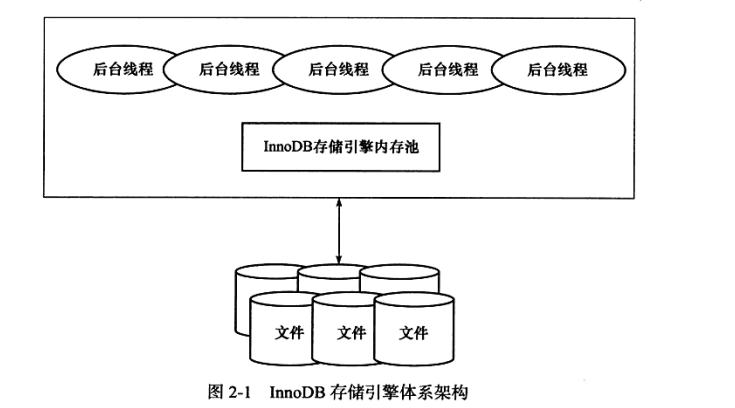

# InnoDB存储引擎

## 1. 概述

InnoDB存储引擎支持事务、行级锁、外键、非锁定读，是MySQL5.5.8之后的默认存储引擎。

通过多版本并发控制(MVCC)获取高并发性,并实现了SQL的4中隔离级别（默认repeatable）。同时使用next-key locking策略避免幻读产生。

另外还提供了插入缓冲、二次写、自适应哈希索引、预读等功能。

采用聚集方式存储数据，因此每张表的存储都是按主键的顺序进行存放。


## 2.体系架构

InnoDB存储引擎体系架构由：`后台线程`、`内存池`、和`数据库文件`组成。

**内存池**：维护所有进程/线程需要访问的多个内部数据结构；缓存磁盘上的数据，方便读取；重做日志缓冲……

**后台线程**：负责刷新内存池中的数据，保证缓冲池中的内存缓存是最近的数据；将已修改的数据文件刷新到磁盘文件，同时保证在数据库发生异常的情况下InnoDB能恢复到正常运行的状态下。



### 1. 后台线程

InnoBD是多线程模型，后台的不同线程负责处理不同任务。

**1.Master Thread**

核心后台线程，负责将缓冲池中的数据异步刷新到磁盘，保证数据的一致性。

**2.IO Thread**

主要负责IO回调处理，因为InnoDB存储引擎大量使用了AIO来处理IO请求，这样可以极大提高数据库性能。

**3.Purge Thread**

在事务提交后其所使用的undolog可能不在需要，因此需要PurgeThread来回收已经使用并分配的undo页。

**4.Page Cleaner Thread**

将脏页刷新操作放在单独的线程中执行。目的是为了减轻Master Thread的工作以及对于用户查询线程的阻塞。


### 2. 内存

#### 1.缓冲池

 InnoDB是基于磁盘存储的，将其中的记录按照页的方式进行管理。缓冲池用来弥补磁盘速度相对于内存慢对数据库性能的影响。

缓冲池中缓存的数据页：索引页、数据页、undo页、插入缓冲、自适应哈希索引、InnoDB存储的锁信息、数据字典信息等。

InnoDB内存数据对象：缓冲池（索引页、数据页、插入缓冲、自适应哈希索引、InnoDB存储的锁信息、数据字典信息等）、重做日志缓冲、额外内存池。

允许有多个缓冲池实例，每个页根据哈希值分配平均分配到不同缓冲池实例中，这样做减少了数据库内部的资源竞争，增加数据库并发处理能力。

#### 2.LRU List、Free List和Flush List

数据库中的缓冲池是通过LRU算法进行管理的。InnoDB缓冲池中的页默认16KB。InnoDB对LRU进行了优化，在LRU列表中加入了midpoint位置，读取最新的页是放在该位置，默认是LRU长度的5/8处。

#### 3. 重做日志缓冲

InnoDB首先将重做日志信息放到该缓冲，然后按照一定频率将其刷新到重做日志文件。默认8MB.

#### 4.额外的内存池

Innodb中不少数据结构：

Innodb_buffer_pool中的帧缓冲(frame buffer) 以及对应的 缓冲控制对象（buffer controll block，这些对象记录了一些诸如LRU、锁、等待等信息）

这些数据对象本身的内存进行分配时，需要从额外的内存池中进行申请，当该区域内存不够时，会从缓冲池中申请。

所以，如果我们设置了很大的InnoDB缓冲池时，也应考虑相应的增加额外内存池的大小。


## 3. CheckPoint技术

> CheckPoint主要是将缓存池中的脏页刷回磁盘


### 1. Write Ahead Log策略

- Write-Ahead Log (WAL 预写式日志)：**对数据文件的修改（它们是表和索引的载体）必须是只能发生在这些修改已经记录了日志之后**，也就是说，在描述这些变化的日志记录冲刷到永久存储器之后
- 这是事务ACID中D（Durability持久性）的要求

### 2. CheckPoint的目的

**1.缩短数据库的恢复时间**

当数据库宕机时，数据库不需要重做所有日志，因为CheckPoint之前的页都已经刷新回磁盘。只需对CheckPoint后的重做日志进行恢复，从而缩短恢复时间

**2.缓冲池不够用时，将脏页刷新到磁盘**

当缓存池不够用时，LRU算法会溢出最近最少使用的页，若此页为**脏页**，会**强制执行CheckPoint**，将该脏页刷回磁盘

**3.重做日志不可用时，刷新脏页**

不可用是因为对重做日志的设计是**循环使用**的。重做日志可以被重用的部分，是指当数据库进行恢复操作时不需要的部分。若此时这部分重做日志还有用，将**强制执行CheckPoint**，将缓冲池的页至少刷新到当前重做日志的位置

### 3. CheckPoint的种类

**1.Sharp CheckPoint**

发生在**数据库关闭**时，会将所有的脏页刷回磁盘

**2.Fuzzy CheckPoint**

为提高性能，数据库运行时使用Fuzzy CheckPoint进行页的刷新，即**只刷新一部分脏页**


Fuzzy CheckPoint的种类

**1.Master Thread CheckPoint**

* 差不多以**每秒或每十秒**的速度，从缓存池脏页列表中刷新**一定比例**的页，且此过程是**异步**的，因此不会阻塞其他操作

**2.FLUSH_LRU_LIST CheckPoint**

* 因为InnoDB需要保证LRU列表中有**一定数量的空闲页**可使用，倘若不满足该条件，则会将LRU列表尾端的页移除，若这些页中有脏页，则会进行CheckPoint
* 该检查被放在一个单独的**Page Cleaner线程**中进行
* 用户可以通过**innodb_lru_scan_depth**控制LRU列表的可用页数量，默认为1024

**3.Async/Sync Flush CheckPoint**

* 当**重做日志文件不可用**的情况下，会强制将一些页刷回磁盘

* Async/Sync Flush CheckPoint是为了重做日志的循环使用的可用性

* 简单来说，Async发生在要刷回磁盘的**脏页较少**的情况下，Sync发生在要刷回磁盘的**脏页很多**时。具体公式略过

* 这部分操作放入到了**Page Cleaner线程**中执行，不会阻塞用户操作

**4.Dirty Page too much CheckPoint**

* 是指当**脏页比例太多**，会导致InnoDB存储引擎强制执行CheckPoint
* 目的根本上还是为了保证缓冲池中有足够可用的页
* 比例可由参数**innodb_max_dirty_pages_pct**控制。若该值为75，表示当缓冲池中脏页占据75%时，强制CheckPoint


## 4. Master Thread工作方式

> Master Thread具有最高的线程优先级别。

其内部由多个循环组成:`主循环(loop)`、`后台循环(backgroup loop)`、`刷新循环(flush loop)`、`暂停循环(suspend loop)`。Master Thread会根据数据库运行的状态在上述4状态下进行切换。

### 1. loop

loop被称为主循环，因为大多数的操作是在这个循环中，其中有两大部分的操作：每秒的操作和每10秒的操作。伪代码如下

```c
void master_thread(){
loop：
for(int i= 0; i<10; i++){
   do thing once per second
   sleep 1 second if necessary
}
do things once per ten seconds
goto loop;
}
```

每秒一次的操作包括：

* 日志缓冲刷新到磁盘，即使这个事务还没有提交（总是）；
* 合并插入缓冲（可能）；
* 至多刷新100个InnoDB的缓冲池中的脏页到磁盘（可能）；
* 如果当前没有用户活动，则切换到background loop（可能）

> 即使某个事务还没有提交，InnoDB存储引擎仍然每秒会将重做日志缓冲中的内容刷新到重做日志文件。这一点是必须要知道的，因为这可以很好地解释为什么再大的事务提交（commit）的时间也是很短的。


接着来看每10秒的操作，包括如下内容：

* 刷新100个脏页到磁盘（可能的情况下）；
* 合并至多5个插入缓冲（总是）；
* 将日志缓冲刷新到磁盘（总是）；
* 删除无用的Undo页（总是）；
* 刷新100个或者10个脏页到磁盘（总是）。


### 2. background loop

若当前没有用户活动（数据库空闲时）或者数据库关闭（shutdown），就会切换到这个循环。

background loop会执行以下操作：

* 删除无用的Undo页（总是）；
* 合并20个插入缓冲（总是）；
* 跳回到主循环（总是）；
* 不断刷新200个页直到符合条件（可能，跳转到flush loop中完成）。


### 3. suspend__loop

若flush loop中也没有什么事情可以做了，InnoDB存储引擎会切换到suspend__loop，将Master Thread挂起，等待事件的发生。若用户启用（enable）了InnoDB存储引擎，却没有使用任何InnoDB存储引擎的表，那么Master Thread总是处于挂起的状态。


### 4. 更新

从前面的伪代码来看，无论何时，InnoDB存储引擎最大只会刷新100个脏页到磁盘，合并20个插入缓冲。无法发挥出磁盘的全部性能，即使磁盘能在1秒内处理多于100个页的写入和20个插入缓冲的合并，但是由于hard coding，Master Thread也只会选择刷新100个脏页和合并20个插入缓冲。

因此后续更新作出了如下调整

对于刷新到磁盘页的数量，会按照innodb_io_capacity的百分比来进行控制。规则如下：

* 在合并插入缓冲时，合并插入缓冲的数量为innodb_io_capacity值的5%；
* 在从缓冲区刷新脏页时，刷新脏页的数量为innodb_io_capacity。

还引入了参数innodb_purge_batch_size，该参数可以控制每次full purge回收的Undo页的数量。该参数的默认值为20，并可以动态地对其进行修改，


## 5. InnoDB关键特性

* 插入缓冲
* 两次写
* 自适应哈希索引
* 异步IO
* 刷新邻接页。


### 1. 插入缓冲

#### 1. Insert Buffer

  由于B+树的特性决定了非聚集索引插入的离散性，因而InnoDB设计了Insert Buffer，对于非聚集索引的插入或者更新操作，不是每一次都直接插入到索引页中，而是先判断插入的非聚集索引页是否存在缓冲池中，若在，则直接插入；若不在，则先放到Insert Buffer对象中。

  Insert Buffer的使用满足：

* 索引是辅助索引
* 索引不是唯一的。

当满足这两个条件InnoDB才会使用Insert Buffer，这样能提高插入操作的性能。

insert buffer 也是B+树实现的。

#### 2.Change Buffer

可以看做是Insert Buffer的升级。可以对insert、delete、update进行缓冲，分别是：Insert Buffer、Delete Buffer、Purge Buffer。

Change Buffer也要求索引是非唯一的辅助索引。

### 2. 两次写

两次写保证InnoDB数据页的可靠性。

  当应用重做日志前，用户需要一个页的副本，当写入失效时，先通过页的副本还原该页，再进行重做，这就是两次写。

  两次写组成：一部分是内存中的doublewrite buffer（2MB）,另一部分是物理磁盘上共享表空间中连续的128个页，即2个区，大小也是2MB。

具体流程如下图：


> 图片来源 https://www.cnblogs.com/xuliuzai/p/10290196.html

> 简单来说，就是在写数据页之前，先把脏数据页复制到doublewrite buffer，然后从doublewrite buffer 顺序写到一块独立的物理文件位置（ibdata1~n文件），然后再离散写到数据文件(.idb)。这样在宕机重启时，如果出现数据页损坏，那么在应用redo log之前，需要通过该页的副本来还原该页，然后再进行redo log重做，这就是double write。

###   3. 自适应哈希索引

InnoDB会监控对各索引页的查询，如果发现建立哈希索引可以提升速度，则建立哈希索引，这就是自适应哈希索引（AHI）。

AHI通过缓冲池的B+树页构造而来。

AHI要求对这个页的连续访问模式必须是一样的。并且以该模式访问了100次，页通过该模式访问了N次（N=页中记录*1/16）

###   4. 异步IO

为了提高磁盘操作性能，当前的数据库系统都才有异步IO(AIO)的方式来处理磁盘操作。

AIO可以进行IO Merge操作，将多个IO合并为1个IO，这样可以提高IOPS的性能。

###   5. 刷新邻接页

当刷新一个脏页时，InnoDB会检查该页所在的区的所有页，如果是脏页，那么一起进行刷新。

可以通过参数`innodb_flush_neighbors`控制是否启用该特性。

对于机械硬盘建议启用该特性，对于有超高IOPS的固态硬盘则建议关闭该特性。


