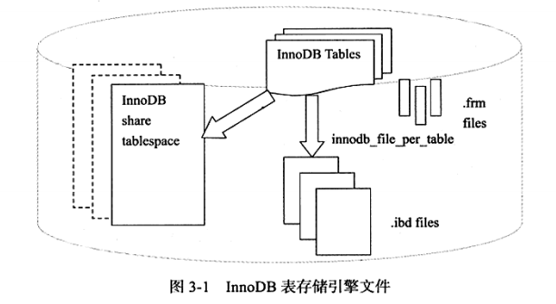
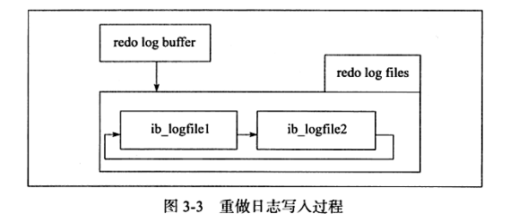

# 文件

## 1. 概述

本章介绍MySQL数据库和InnoDB存储引擎的各种类型文件。

* **参数文件**：告诉MySQL数据库实例在哪里可以找到数据库文件，并且指定某些初始化参数等；

* **日志文件**：用来记录MySQL实例对某种条件作出的响应时写入的文件，例如：错误日志文件、二进制日志文件、慢查询日志文件、查询日志文件；

* **socket文件**：当用UNIX域套接字方式进行连接时需要的文件；

* **pid文件**：MySQL实例的进程ID文件；

* **MySQL表结构文件**：用来存放MySQ表结构定义文件；

* **存储引擎文件**：存储引擎真正存储了记录和索引等数据。  


## 2. 参数文件

MySQL数据库的参数文件是以文本方式进行存储的。

### 1.什么是参数？

简单来说数据库参数可以看成一个键值对。

### 2. 参数类型

 MySQL数据库中参数分为：

* 动态参数：可以在MySQL实例运行中进行更改。
* 静态参数：在整个实例生命周期内都不能更改。

动态参数修改命令格式如下：

```mysql
SET [global|session] system_var_name = expr
```

其中global和session关键字表明该参数的修改是基于当前会话还是整个实例的生命周期(即全局)。

例如

```mysql
SET session read_buffer_size = 524288;
```

修改后其他客户端在查询也会是默认值，即当前修改只对当前会话生效。


## 3. 日志文件

 日志文件记录了影响MySQL数据库的各种类型活动。MySQL常见文件：

* 错误日志文件
* 二进制日志文件
* 慢查询日志文件
* 查询日志文件

### 1. 错误日志

错误日志文件对MySQL的启动、运行、关闭过程进行记录。可以得到进行数据库优化的信息。

默认文件名为`hostname.err`

### 2. 慢查询日志

慢查询日志可以定位可能存在问题的sql语句，从而进行sql层面的优化。

将会记录执行时间超过阈值的sql语句，阈值可通过参数`long_query_time`设置。

默认MySQL未开启慢查询日志，需要手动将`log_slow-queries`参数设置为ON。

MySQL5.1开始可以将慢日志记录在表`slow_log`中。

### 3. 查询日志

查询日志记录了所有对MySQL数据库请求的信息，无论这些请求是否得到正确的执行。

同样的可以记录到general_log表中。

### 4. 二进制日志

二进制日志记录了对MySQL数据库执行更改的所有操作。不包括select、show这类操作。

> 有点类似于redis的aof文件

二进制日志作用：

* 恢复：某些数据的回复需要二进制日志。
* 复制：通过复制和执行二进制数据使一台远程MySQL数据库和一台MySQL数据库进行实时同步。
* 审计：用户可以通过二进制日志中的信息来进行审计，判断是否有对数据库进行注入的攻击。


## 4. 表结构定义文件

MySQL数据的存储是根据表进行的，每个表都会与之对应的文件。MySQL中以frm为后缀的文件，记录了表的表结构定义，同时frm还用来存放视图的定义。

> mysql8.0之后就没有.frm文件了 元数据都放在系统表空间里。
>
> ibdata和mysql.ibd

## 5. InnoDB存储引擎文件

之前介绍的文件都是MySQL数据库本身的文件，和存储引擎无关。与innoDB存储引擎相关的文件有：表空间文件、重做日志文件。


### 1. 表空间文件

 InnoDB采用将存储的数据按照表空间进行存放的设计。默认配置下大小为10MB，名为ibdata1的文件就是表空间文件。

如果设置了参数`innodb_file_per_table=ON` ，则会为每张表产生独立表空间文件，文件名为`tbl_name.ibd`

独立表空间文件只存储了该表的数据、索引和插入缓冲等信息，其余信息还是存放在默认的表空间中的。




### 2. 重做日志文件

默认情况下会有两个文件，名称分别为ib_logfile0和ib_logfile1。MySQL官方手册中将其称为InnoDB存储引擎的日志文件，不过更准确的定义应该是重做日志文件(redo log file)。


为什么叫重做日志文件(redo log file)？

当数据库主机宕机后，InnoDB存储引擎会使用重做日志恢复到宕机前的状态，以此来保证数据的完整行。


对于写入重做日志文件的操作不是直接写，而是先写入一个重做日志缓冲（redo log buffer）中，然后根据按照一定的条件写入日志文件。




上面提到了从日志缓冲写入磁盘上的重做日志文件是按一定条件的，那这些条件有哪些呢？

在主线程中每秒会将重做日志缓冲写入磁盘的重做日志文件中，不论事务是否已经提交。

另一个触发这个过程是由参数`innodb_flush_log_at_trx_commit`控制，表示在提交（commit）操作时，处理重做日志的方式。

参数`innodb_flush_log_at_trx_commit`可设的值有0、1、2。

* `0`代表当提交事务时，并不将事务的重做日志写入磁盘上的日志文件，而是等待主线程每秒的刷新。

* `1`是在commit时将重做日志缓冲同步写到磁盘；

* `2`是重做日志异步写到磁盘，即不能完全保证commit时肯定会写入重做日志文件，只是有这个动作。

为了保证实物的持久性必须将`innodb_flush_log_at_trx_commit`的值设置为1，即每当事务提交时就必须保证事务都已经写入重做日志文件。

设置为其他值都可能出现事务的丢失。


## 6. 小结

ibdata共享表空间文件

tblname.ibd独立表空间文件,存储了表数据和索引

.frm 表结构定义文件(mysql8.0之后就没了，存在ibdata和mysql.ibd中)


如果是MyISAM引擎的话就是

.MYD文件存储数据(DATA)

.MYI文件存储索引(Index)

