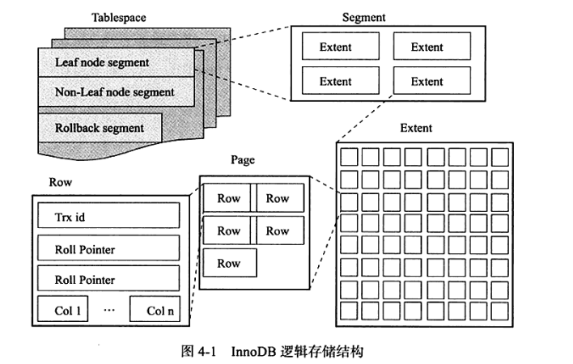

# 表

简单来说表就是关于特定实体的数据集合，这也是关系型数据库模型的核心。


## 1. 索引组织表

在InnoDB存储引擎中，表都是根据主键顺序组织存放的，这种存储方式的表称为索引组织表。若是创建表没有显示定义主键，InnoDB会自动创建主键：

* 1.将表中的第一个非空唯一索引设置为主键；
* 2.若是没有非空唯一的索引，则自动创建一个6字节大小的指针。

需要注意的是主键选择是根据**定义索引的顺序**而不是建表时列的顺序。


## 2. InnoDB逻辑存储结构

InnoDB存储引擎将所有的数据存储在表空间(tablespace)中。

表空间又由**段(segment)、区(extent)、页(page)、行(row)** 组成。

页有时又称为**块(block)**




### 1. 表空间

表空间是InnoDB所有数据存放的地方。

如果设置了参数`innodb_file_per_table=ON` ，则会为每张表产生独立表空间文件，文件名为`tbl_name.ibd`

独立表空间文件只存储了该表的数据、索引和插入缓冲等信息，其余信息还是存放在默认的表空间中的。

### 2. 段

表空间由各个段组成，常见的有数据段、索引段、回滚段等。

由于InnoDB存储引擎表时索引组织的，因此数据即索引，索引即数。

那么数据段即为B+树的叶子节点（图4-1中的`Leaf node segment`）,索引段为B+树的非索引节点（图4-1中的`Non-leaf node segment`）

### 3. 区

区是由连续页组成的空间，在任何情况下每个区都是1MB。为了保证区的连续性，通常InnoDB申请4~5个区。默认页是16kB,即一个区中有64个连续页。

### 4. 页

页（块）是InnoDB磁盘管理的最小单位，默认16KB，也可以设置为4KB 、8KB、16KB.

常见的页类型：

* （1）数据页（B-tree Node）

* （2）undo页（undo Log Page）

* （3）系统页（System Page）

* （4）事务数据页（Transaction System Page）

* （5）插入缓冲位图页（Insert Buffer Bitmap）

* （6）插入缓冲空闲列表页（Insert Buffer Free List）

* （7）未压缩的二进制大对象页（Uncompressed BLOB Page）

* （8）压缩的二进制大对象页（compressed BLOB Page）

### 5. 行

InnoDB是面向列的，也就是说数据是按行进行存放的。每个页存放16KB/2-200行的记录，就是7992行记录。


## 3. InnoDB行记录格式

InnoDB提供了Compact和Redundant两种格式来存放行记数据。


Redundant格式是为了兼容之前版本而保留的，MySQL5.1中默认使用Compact格式。


### 1. Compact行记录格式

Compact行记录是在MySQL5.0引入的，设计目的是高效地存储数据。简单来说一个页中存放的行数据越多其性能就越高。

格式如下

```sh
|变成字段长度列表|NULL标志位|记录头信息|列1数据|列2数据 ...|
```

* **变成字段长度列表**最大不超过`2字节`，因为MySQL数据库中VARCHAR类型最大长度限制为65535
* **NULL标志位**占`1字节`,该位指示了行中是否有NULL值 有则用1表示
* **记录头信息**固定占用`5字节`，具体内容见下表
* **列数据**最后是列数据 其中为NULL的列不占空间，即除了占用NULL标志位不占任何空间。

此外还有两个隐藏列，`事务ID列`和`回滚指针列`，分别为6字节和7字节。若innodb表没有定义主键，每行还会增加一个6字节的`rowid列`。

Compact记录头信息如下表

| 名称         | 大小(bit) | 描述                                                         |
| ------------ | --------- | ------------------------------------------------------------ |
| ()           | 1         | 未知                                                         |
| ()           | 1         | 未知                                                         |
| delete_flag  | 1         | 该行是否已被删除                                             |
| min_rec_flag | 1         | 为1，如果该记录是预先被定义为最小的记录                      |
| n_owned      | 4         | 该记录拥有的记录数                                           |
| heap_no      | 13        | 索引堆中该记录的排序记录                                     |
| record_type  | 3         | 记录类型，000表示普通，001表示B+树节点指针，010表示infimum，011表示supermum，1xx表示保留 |
| next_record  | 16        | 页中下一条记录的相对位置                                     |
| total        | 40        |                                                              |


### 2. Redundant行记录格式

Redundant是MySQL5.0之前的行记录存储方式，支持Redundant格式是为了兼容之前版本而保留的，MySQL5.1中默认使用Compact格式。

记录格式如下：

```sh
|字段长度偏移列表|记录头信息|列1数据|列2数据 ...|
```

首部为字段长度偏移列表，列长度小于255字节则占1字节，大于则用2字节表示。


### 3. 行溢出数据

InnoDB存储引擎可以将一条记录中的某些数据存储在真正的数据页面之外，即作为行溢出数据。

InnoDB存储引擎表是索引组织的，即B+树的结构。因此每个页中至少应该有两个行记录（否则失去了B+树的意义，变成链表了）。

**因此如果当页中只能存放下一条记录，那么InnoDB存储引擎会自动将行数据存放到溢出页中。**

大致情况下每行总长度不能超过16kb*1024/2=8192，由于还要存储其他信息实际这个阈值的长度为8098。

### 4.Compressed和Dynamic行记录格式

以前的Compact和Redndant称为Antelope，新的格式称为Barracuda，包含Compressed和Dynamic两种格式。

具体区别是这两种格式对于存放在BLOB中的数据采用了完全的行溢出方式，即数据页中只存放20字节的指针，实际数据全存放在OffPage中，之前的两种格式还会存放768个前缀字节。


### 5. Char的行结构存储

通常的理解**VARCHAR是存储变长长度的字符类型，CHAR是存储定长长度的字符类型**。从MySQL 4.1开始，CHAR（N）中的N指的是`字符的长度`，而不是之前版本的字节长度。那也就是说，**在不同的字符集下，CHAR的内部存储的不是定长的数据**。

例如

char(10)存储1字节的字符则长度为10字节，存储3字节的字符则长度为30字节。

在InnoDB存储引擎内部对于CHAR类型在多字节字符集类型的存储了，CHAR很明确地被视为了变长类型，对于未能占满长度的字符还是填充0x20。因此可以认为在`多字节字符集`情况下，char和varchar的实际行存储基本是没有区别的。


## 4. InnoDB数据页结构

  InnoDB数据页组成：

* File Header（文件头）
* Page Header（页头）
* Infimun和Supremun Records
* User Records（行记录）
* Free Space（空闲空间）
* Page Directory（页目录）
* File Trailer（文件结尾信息） 

## 5. Named File Formats机制

InnoDB通过Named File Formats机制来解决不同版本下页结构兼容性问题。

## 6. 约束

### 1. 数据完整性

关系数据库本身能保证存储的数据的完整性，不需要应用程序的控制。数据完整性有：实体完整性、域完整性（用户自定义完整性）、参照完整性.

InnoDB中的约束：

* 主键约束(Primary Key)
* 唯一约束(Unique Key)
* 外键约束(Foreign Key)
* 默认约束(Default)
* 不为空约束(NOT NULL)


### 2. 约束和索引区别

虽然用户创建一个唯一索引同时也创建了一个唯一约束，但是约束和索引概念还是不同的。

约束是一个逻辑的概念，用来保证数据的完整性；

索引是一个数据结构，即有逻辑上的概念，在数据库中还代表着物理存储的方式。


## 7. 视图

视图（View）是一个命名的`虚表`,它由一个SQL查询来定义，可以单做表使用，与持久表不同的是视图中的数据没有实际的物理存储。

虽然视图是一个虚表，但是用户可以对某些视图进行更新操作，其本质就是通过视图的定义来更新基表。

这种可以执行更新操作的视图也叫作`可更新视图`。

创建时增加`WITH CHECK OPTION`子句。

```mysql
CREATE TABLE t(id int);

CREATE VIEW v_t
AS
SELECT * FROM t WHERE id<10
WITH CHECK OPTION;
```

会对插入视图的数据进行检查，不满足视图定义条件的会抛出异常不允许视图更新。

```mysql
INSERT INTO v_t VALUES(10);
# 1369 - CHECK OPTION failed 'sampdb.v_t'
```

### 内联视图

内联视图即在select语句里的内联视图(in-line view),即`SELECT \* FROM ( 内联视图)`，上面由CREATE VIEW创建的暂且称为皮套是

例如

```mysql
SELECT * FROM (SELECT * FROM t WHERE id < 10)inlineView1;
```

其中`SELECT * FROM t WHERE id < 10`就是内联视图，外边的`inlineView1`就是它的名字。

### 视图的作用

 可以使得用户从不同的角度看待相同的数据；具有一定的安全性。

## 8. 分区表

MySQL数据库支持水平分区，不支持垂直分区，并且是局部分区索引。常见的分区：Range分区、List分区、Hash分区、Key分区。

**分区和性能：**

对于OLAPP(联机分析处理)的应用，分区可以很好的提高查询性能，因为OLAP大多数查询需要频繁的扫描一张很大的表。

对于OLTP(联机事务处理)的应用，分区不一定有很好的的效果，这种应用通常只查询一张大表中的10%的数据，B+树就能很好的满足查询需求性能要求。