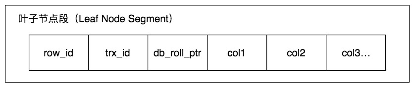
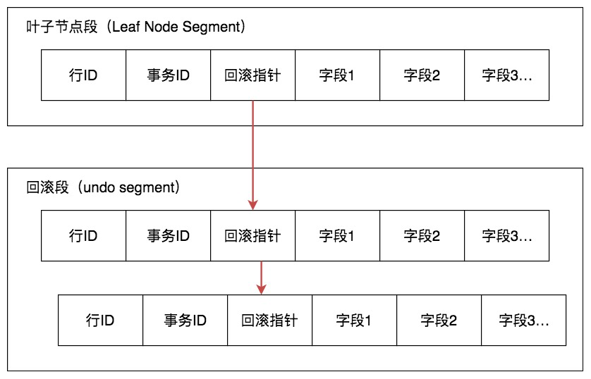
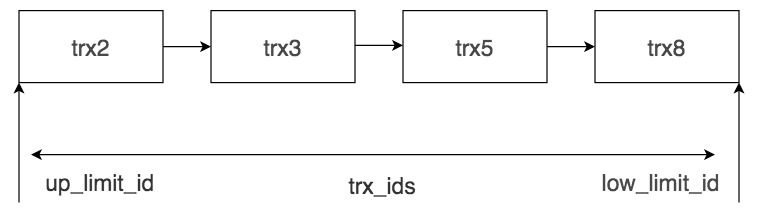

# 数据库中的 MVCC

## 1. 概述

MVCC的英文全称是Multiversion Concurrency Control，中文翻译过来就是多版本并发控制技术。从名字中也能看出来，MVCC是通过数据行的多个版本管理来实现数据库的并发控制，简单来说它的思想就是保存数据的历史版本。这样我们就可以通过比较版本号决定数据是否显示出来（具体的规则后面会介绍到），读取数据的时候不需要加锁也可以保证事务的隔离效果。

通过MVCC我们可以解决以下几个问题：

* 1）读写之间阻塞的问题，通过MVCC可以让读写互相不阻塞，即读不阻塞写，写不阻塞读，这样就可以提升事务并发处理能力。
* 2）降低了死锁的概率。这是因为MVCC采用了乐观锁的方式，读取数据时并不需要加锁，对于写操作，也只锁定必要的行。
* 3）解决一致性读的问题。一致性读也被称为快照读，当我们查询数据库在某个时间点的快照时，只能看到这个时间点之前事务提交更新的结果，而不能看到这个时间点之后事务提交的更新结果。


## 2. 快照读 & 当前读

快照读读取的是快照数据。不加锁的简单的SELECT都属于快照读，比如这样：

```
SELECT * FROM player WHERE ...
```

当前读就是读取最新数据，而不是历史版本的数据。加锁的SELECT，或者对数据进行增删改都会进行当前读，比如：

```mysql
SELECT * FROM player LOCK IN SHARE MODE;
SELECT * FROM player FOR UPDATE;
INSERT INTO player values ...
DELETE FROM player WHERE ...
UPDATE player SET ...
```

> 这里需要说明的是，**快照读就是普通的读操作，而当前读包括了加锁的读取和DML操作**。


## 3. InnoDB中的MVCC是如何实现的？

在了解InnoDB中MVCC的实现方式之前，我们需要了解InnoDB是如何存储记录的多个版本的。

我们需要了解和它相关的数据都有哪些，存储在哪里。这些数据包括事务版本号、行记录中的隐藏列和Undo Log。

### 事务版本号

每开启一个事务，我们都会从数据库中获得一个事务ID（也就是事务版本号），这个事务ID是自增长的，通过ID大小，我们就可以判断事务的时间顺序。

### 行记录的隐藏列

InnoDB的叶子段存储了数据页，数据页中保存了行记录，而在行记录中有一些重要的隐藏字段，如下图所示：

* 1）db_row_id：隐藏的行ID，用来生成默认聚集索引。如果我们创建数据表的时候没有指定聚集索引，这时InnoDB就会用这个隐藏ID来创建聚集索引。采用聚集索引的方式可以提升数据的查找效率。
* 2）db_trx_id：操作这个数据的事务ID，也就是最后一个对该数据进行插入或更新的事务ID。
* 3）db_roll_ptr：回滚指针，也就是指向这个记录的Undo Log信息。




### Undo Log

InnoDB将行记录快照保存在了Undo Log里，我们可以在回滚段中找到它们，如下图所示：




从图中你能看到**回滚指针将数据行的所有快照记录都通过链表的结构串联了起来**，每个快照的记录都保存了当时的db_trx_id，也是那个时间点操作这个数据的事务ID。这样**如果我们想要找历史快照，就可以通过遍历回滚指针的方式进行查找**。

## Read View是如何工作的

保存了多个版本，如果一个事务想要查询这个行记录，需要读取哪个版本的行记录呢？

这时就需要用到Read View了，它帮我们解决了行的可见性问题。Read View保存了当前事务开启时所有活跃（还没有提交）的事务列表，换个角度你可以理解为Read View保存了不应该让这个事务看到的其他的事务ID列表。

在Read VIew中有几个重要的属性：

* 1）trx_ids，系统当前正在活跃的事务ID集合。
* 2）low_limit_id，活跃的事务中最大的事务ID。
* 3）up_limit_id，活跃的事务中最小的事务ID。
* 4）creator_trx_id，创建这个Read View的事务ID。

如图所示，trx_ids为trx2、trx3、trx5和trx8的集合，活跃的最大事务ID（low_limit_id）为trx8，活跃的最小事务ID（up_limit_id）为trx2。



假设当前有事务creator_trx_id想要读取某个行记录，这个行记录的事务ID为trx_id，那么会出现以下几种情况。

如果**trx_id < 活跃的最小事务ID（up_limit_id）**，也就是说这个行记录在这些活跃的事务创建之前就已经提交了，那么这个行记录对该事务是可见的。

如果**trx_id > 活跃的最大事务ID（low_limit_id）**，这说明该行记录在这些活跃的事务创建之后才创建，那么这个行记录对当前事务不可见。

如果**up_limit_id < trx_id < low_limit_id**，说明该行记录所在的事务trx_id在目前creator_trx_id这个事务创建的时候，可能还处于活跃的状态，因此我们需要在trx_ids集合中进行遍历，如果trx_id存在于trx_ids集合中，证明这个事务trx_id还处于活跃状态，不可见。否则，如果trx_id不存在于trx_ids集合中，证明事务trx_id已经提交了，该行记录可见。

了解了这些概念之后，我们来看下当查询一条记录的时候，系统如何通过多版本并发控制技术找到它：

* 1）首先获取事务自己的版本号，也就是事务ID；
* 2）获取Read View；
* 3）查询得到的数据，然后与Read View中的事务版本号进行比较；
* 4）如果不符合ReadView规则，就需要从Undo Log中获取历史快照；
* 5）最后返回符合规则的数据。

你能看到 InnoDB 中，MVCC 是通过 Undo Log + Read View 进行数据读取，Undo Log 保存了历史快照，而 Read View 规则帮我们判断当前版本的数据是否可见。


隔离级别不同，查询语句获取 Read View 次数也会不同

| 事务                                     | 读已提交（Read Commit） | 可重复读 （Repeatable Read） |
| ---------------------------------------- | ----------------------- | ---------------------------: |
| BEGIN;                                   |                         |                              |
| SELECT * FROM player WHERE height > 2.08 | 获取一次 Read View      |           获取一次 Read View |
| ...                                      |                         |                              |
| SELECT * FROM player WHERE height > 2.08 | 再获取一次 ReadView     |      复用上次获取的 ReadView |
| COMMIT                                   |                         |                              |

读已提交会重新获取 ReadView，如果这两次获取的 ReadView 不同，就可能产生不可重复读或者幻读的情况

由于可重复读会**复用 ReadView**，所以就避免了不可重复读。

## InnoDB是如何解决幻读的

在**可重复读**的情况下，InnoDB 可以通过**Next-Key锁+MVCC**来解决幻读问题。


在读已提交的情况下，即使采用了MVCC方式也会出现幻读。如果我们同时开启事务A和事务B，先在事务A中进行某个条件范围的查询，读取的时候采用排它锁，在事务B中增加一条符合该条件范围的数据，并进行提交，然后我们在事务A中再次查询该条件范围的数据，就会发现结果集中多出一个符合条件的数据，这样就出现了幻读。

| 事务A                                                    | 事务B                                                     |
| -------------------------------------------------------- | --------------------------------------------------------- |
| SET SESSION TRANSACTION ISOLATION LEVEL READ COMMITTED； |                                                           |
| BEGIN；                                                  | BEGIN；                                                   |
| SELECT * FROM player WHERE height > 2.08 FOR UPDATE      |                                                           |
| ...                                                      | INSERT INTO player VALUES(10038,1003,'艾利克斯-伦'；2.16) |
| ...                                                      | COMMIT；                                                  |
| SELECT * FROM player WHERE height > 2.08                 |                                                           |
| COMMIT                                                   |                                                           |

出现幻读的原因是在读已提交的情况下，InnoDB只采用记录锁（Record Locking）。这里要介绍下InnoDB三种行锁的方式：

1. 记录锁：针对单个行记录添加锁。
2. 间隙锁（Gap Locking）：可以帮我们锁住一个范围（索引之间的空隙），但不包括记录本身。采用间隙锁的方式可以防止幻读情况的产生。
3. Next-Key锁：帮我们锁住一个范围，同时锁定记录本身，相当于间隙锁+记录锁，可以解决幻读的问题。

在隔离级别为**可重复读**时，InnoDB会采用**Next-Key锁**的机制，帮我们解决幻读问题。

还是这个例子，我们能看到当我们想要插入球员艾利克斯·伦（身高2.16米）的时候，事务B会超时，无法插入该数据。这是因为采用了Next-Key锁，**会将height>2.08的范围都进行锁定，就无法插入符合这个范围的数据了**。然后事务A重新进行条件范围的查询，就不会出现幻读的情况。


## 小结

MVCC的核心就是Undo Log+ Read View。

“MV”就是通过Undo Log来保存数据的历史版本，实现多版本的管理；

“CC”是通过Read View来实现管理，通过Read View原则来决定数据是否显示。同时针对不同的隔离级别，Read View的生成策略不同，也就实现了不同的隔离级别。