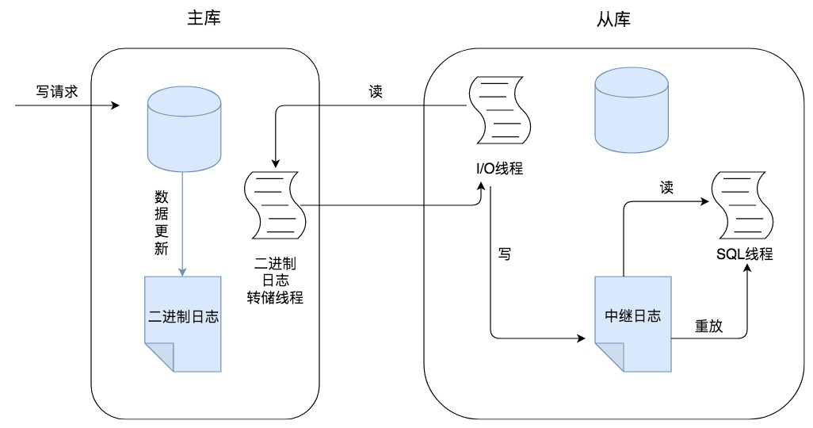

# 主从同步

## 为什么需要主从同步

### 1. 读写分离

我们可以通过主从复制的方式来同步数据，然后通过读写分离提高数据库并发处理能力。

### 2. 数据备份

我们通过主从复制将主库上的数据复制到了从库上，相当于是一种热备份机制，也就是在主库正常运行的情况下进行的备份，不会影响到服务。

### 3. 高可用性

我刚才讲到的数据备份实际上是一种冗余的机制，通过这种冗余的方式可以换取数据库的高可用性，也就是当服务器出现故障或宕机的情况下，可以切换到从服务器上，保证服务的正常运行。

## 主从同步的原理是怎样的

实际上主从同步的原理就是基于Binlog进行数据同步的。在主从复制过程中，会基于3个线程来操作，一个主库线程，两个从库线程。

* 1）**二进制日志转储线程**（Binlog dump thread）是一个主库线程。当从库线程连接的时候，主库可以将二进制日志发送给从库，当主库读取事件的时候，会在Binlog上加锁，读取完成之后，再将锁释放掉。
* 2）**从库I/O线程**会连接到主库，向主库发送请求更新Binlog。这时从库的I/O线程就可以读取到主库的二进制日志转储线程发送的Binlog更新部分，并且拷贝到本地形成中继日志（Relay log）。
* 3）**从库SQL线程**会读取从库中的中继日志，并且执行日志中的事件，从而将从库中的数据与主库保持同步。

## 如何解决主从同步的数据一致性问题

进行主从同步的内容是二进制日志，它是一个文件，在进行网络传输的过程中就一定会存在延迟（比如500ms），这样就可能造成用户在从库上读取的数据不是最新的数据，也就是主从同步中的数据不一致性问题。

### 1. 异步复制

异步模式就是**客户端提交 COMMIT 之后不需要等从库返回任何结果，而是直接将结果返回给客户端**，这样做的好处是不会影响主库写的效率，但可能会存在主库宕机，而Binlog还没有同步到从库的情况，也就是此时的主库和从库数据不一致。这时候从从库中选择一个作为新主，那么新主则可能缺少原来主服务器中已提交的事务。所以，这种复制模式下的数据一致性是最弱的。

### 2. 半同步复制

MySQL5.5版本之后开始支持半同步复制的方式。原理是**在客户端提交COMMIT之后不直接将结果返回给客户端，而是等待至少有一个从库接收到了Binlog，并且写入到中继日志中，再返回给客户端**。这样做的好处就是提高了数据的一致性，当然相比于异步复制来说，至少多增加了一个网络连接的延迟，降低了主库写的效率。

在 MySQL5.7 版本中还增加了一个`rpl_semi_sync_master_wait_for_slave_count`参数，我们可以对应答的从库数量进行设置，默认为 1。

### 3. 组复制

组复制技术，简称MGR（MySQL Group Replication）。是MySQL在5.7.17版本中推出的一种新的数据复制技术，这种复制技术是基于 Paxos 协议的状态机复制。

首先我们将多个节点共同组成一个复制组，在执行读写（RW）事务的时候，需要通过一致性协议层（Consensus层）的同意，也就是读写事务想要进行提交，必须要经过组里“大多数人”（对应Node节点）的同意，大多数指的是同意的节点数量需要大于（N/2+1），这样才可以进行提交，而不是原发起方一个说了算。而针对只读（RO）事务则不需要经过组内同意，直接COMMIT即可。