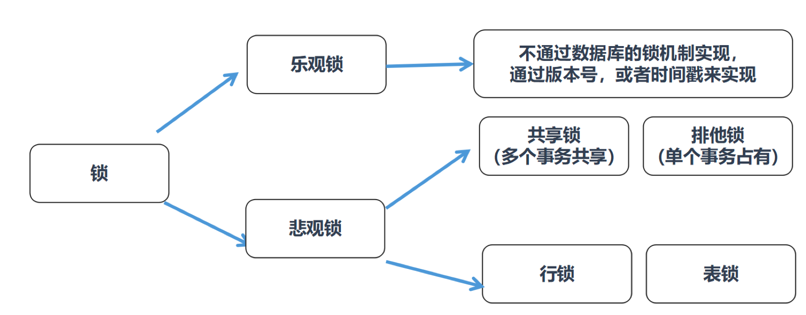

# 悲观锁和乐观锁


## 1. 按照锁粒度进行划分

锁用来对数据进行锁定，我们可以从锁定对象的粒度大小来对锁进行划分，分别为行锁、页锁和表锁。

顾名思义，行锁就是按照行的粒度对数据进行锁定。锁定力度小，发生锁冲突概率低，可以实现的并发度高，但是对于锁的开销比较大，加锁会比较慢，容易出现死锁情况。

页锁就是在页的粒度上进行锁定，锁定的数据资源比行锁要多，因为一个页中可以有多个行记录。当我们使用页锁的时候，会出现数据浪费的现象，但这样的浪费最多也就是一个页上的数据行。页锁的开销介于表锁和行锁之间，会出现死锁。锁定粒度介于表锁和行锁之间，并发度一般。

表锁就是对数据表进行锁定，锁定粒度很大，同时发生锁冲突的概率也会较高，数据访问的并发度低。不过好处在于对锁的使用开销小，加锁会很快。

行锁、页锁和表锁是相对常见的三种锁，除此以外我们还可以在区和数据库的粒度上锁定数据，对应区锁和数据库锁。

不同的数据库和存储引擎支持的锁粒度不同，具体如下：

|            | 行锁 | 页锁 | 表锁 |
| ---------- | ---- | ---- | ---- |
| InnoDB     | √    |      | √    |
| MyISAM     |      |      | √    |
| BDB        |      | √    | √    |
| Oracle     | √    |      | √    |
| SQL Server | √    | √    | √    |

> 这里需要说明下，**每个层级的锁数量是有限制的，因为锁会占用内存空间，锁空间的大小是有限的**。当某个层级的锁数量超过了这个层级的阈值时，就会进行**锁升级**。锁升级就是用更大粒度的锁替代多个更小粒度的锁，比如InnoDB中行锁升级为表锁，这样做的好处是占用的锁空间降低了，但同时数据的并发度也下降了。


## 2. 从数据库管理的角度对锁进行划分

从数据库管理的角度对锁进行划分有共享锁和排它锁。

**共享锁也叫读锁或S锁**，共享锁锁定的资源可以被其他用户读取，但不能修改。在进行`SELECT`的时候，会将对象进行共享锁锁定，当数据读取完毕之后，就会释放共享锁，这样就可以保证数据在读取时不被修改。

比如我们想给product_comment在表上加共享锁，可以使用下面这行命令：

```mysql
LOCK TABLE product_comment READ;
```

如果我们想要给某一行加上共享锁呢，比如想对user_id=912178的数据行加上共享锁，可以像下面这样：

```mysql
SELECT comment_id, product_id, comment_text, user_id FROM product_comment WHERE user_id = 912178 LOCK IN SHARE MODE
```


**排它锁也叫独占锁、写锁或X锁**。排它锁锁定的数据只允许进行锁定操作的事务使用，其他事务无法对已锁定的数据进行查询或修改。

如果我们想给product_comment数据表添加排它锁，可以使用下面这行命令：

```mysql
LOCK TABLE product_comment WRITE;
```

这时只有获得排它锁的事务可以对product_comment进行查询或修改，其他事务如果想要在product_comment表上查询数据，则需要等待。

同样的，如果我们想要在某个数据行上添加排它锁，比如针对user_id=912178的数据行，则写成如下这样：

```mysql
SELECT comment_id, product_id, comment_text, user_id FROM product_comment WHERE user_id = 912178 FOR UPDATE;
```

> 另外当我们对数据进行**更新**的时候，也就是`INSERT`、`DELETE`或者`UPDATE`的时候，数据库也会**自动使用排它锁**，防止其他事务对该数据行进行操作。


我们想要获取某个数据表的排它锁的时候，需要先看下这张数据表有没有上了排它锁。如果这个数据表中的某个数据行被上了行锁，我们就无法获取排它锁。这时需要对数据表中的行逐一排查，检查是否有行锁，如果没有，才可以获取这张数据表的排它锁。这个过程是不是有些麻烦？这里就需要用到意向锁。

**意向锁（Intent Lock）**，简单来说就是给更大一级别的空间示意里面是否已经上过锁。

> 如果我们给某一行数据加上了排它锁，**数据库会自动给更大一级的空间，比如数据页或数据表加上意向锁**。
>
> 告诉其他人这个数据页或数据表已经有人上过排它锁了，这样当其他人想要获取数据表排它锁的时候，只需要了解是否有人已经获取了这个数据表的意向排他锁即可。


**为什么共享锁会发生死锁的情况？**

假设事务 A 查询了记录 1（不提交事务），这时会加上 读锁。

此时事务 B 也查询记录 1 ，加读锁，没问题，但是当 事务 B 想修改 记录 1 的时候就会出错，因为 事务 A 中的读锁还未释放。


你能看到当有多个事务对同一数据获得读锁的时候，可能会出现死锁的情况。


## 3. 从程序员的角度对进行划分

如果从程序员的视角来看锁的话，可以将锁分成乐观锁和悲观锁。

**乐观锁（Optimistic Locking）**认为对同一数据的并发操作不会总发生，属于小概率事件，不用每次都对数据上锁，也就是不采用数据库自身的锁机制，而是通过程序来实现。在程序上，我们可以采用版本号机制或者时间戳机制实现。

**乐观锁的版本号机制**

在表中设计一个版本字段version，第一次读的时候，会获取version字段的取值。然后对数据进行更新或删除操作时，会执行`UPDATE ... SET version=version+1 WHERE version=version`。此时如果已经有事务对这条数据进行了更改，修改就不会成功。

**乐观锁的时间戳机制**

时间戳和版本号机制一样，也是在更新提交的时候，将当前数据的时间戳和更新之前取得的时间戳进行比较，如果两者一致则更新成功，否则就是版本冲突。

**悲观锁（Pessimistic Locking）**也是一种思想，对数据被其他事务的修改持保守态度，会通过数据库自身的锁机制来实现，从而保证数据操作的排它性。




从这两种锁的设计思想中，你能看出乐观锁和悲观锁的适用场景：

* 1）**乐观锁适合读操作多的场景**，相对来说写的操作比较少。它的优点在于程序实现，不存在死锁问题，不过适用场景也会相对乐观，因为它阻止不了除了程序以外的数据库操作。
* 2）**悲观锁适合写操作多的场景**，因为写的操作具有排它性。采用悲观锁的方式，可以在数据库层面阻止其他事务对该数据的操作权限，防止读-写和写-写的冲突。


## 4. 小结

乐观锁和悲观锁并不是锁，而是锁的**设计思想**。

避免死锁的方法：

* 1）如果事务涉及多个表，操作比较复杂，那么可以**尽量一次锁定所有的资源**，而不是逐步来获取，这样可以减少死锁发生的概率；
* 2）如果事务需要更新数据表中的大部分数据，数据表又比较大，这时可以采用**锁升级**的方式，比如将行级锁升级为表级锁，从而减少死锁产生的概率；
* 3）不同事务并发读写多张数据表，可以**约定访问表的顺序**，采用相同的顺序降低死锁发生的概率。