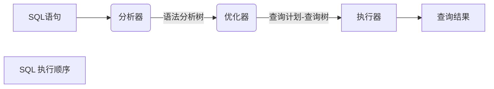
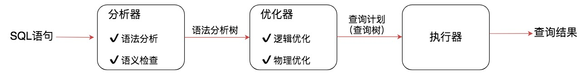
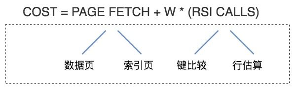

# 查询优化器





## 什么是查询优化器

SQL 语句执行流程:




首先会经过**分析器**，进行**语法分析和语义检查**。我们之前讲过语法分析是检查SQL拼写和语法是否正确，语义检查是检查SQL中的访问对象是否存在。比如我们在写SELECT语句的时候，列名写错了，系统就会提示错误。语法检查和语义检查可以保证SQL语句没有错误，最终得到一棵语法分析树，然后经过查询**优化器**得到**查询计划**，最后交给**执行器**进行执行。


在查询优化器中，可以分为**逻辑查询优化**阶段和**物理查询优化**阶段。

**逻辑查询优化**就是通过**改变SQL语句的内容**来使得SQL查询更高效，同时为物理查询优化提供更多的候选执行计划。

> 逻辑查询优化是基于关系代数进行的查询重写

## 查询优化器的两种优化方式

查询优化器的目的就是**生成最佳的执行计划**，而生成最佳执行计划的策略通常有以下两种方式：

* 基于规则的优化器（RBO，Rule-Based Optimizer）.规则就是人们以往的经验，或者是采用已经被证明是有效的方式。通过在优化器里面嵌入规则，来判断SQL查询符合哪种规则，就按照相应的规则来制定执行计划，同时采用启发式规则去掉明显不好的存取路径。
* 基于代价的优化器（CBO，Cost-Based Optimizer），这里会根据代价评估模型，计算每条可能的执行计划的代价，也就是COST，从中选择代价最小的作为执行计划。

相比于RBO来说，CBO对数据更敏感，因为它会利用数据表中的统计信息来做判断，针对不同的数据表，查询得到的执行计划可能是不同的，因此制定出来的执行计划也更符合数据表的实际情况。

> RBO的方式更像是一个出租车老司机，凭借自己的经验来选择从A到B的路径。而CBO更像是手机导航，通过数据驱动，来选择最佳的执行路径。

大部分RDBMS都支持基于代价的优化器（CBO），CBO随着版本的迭代也越来越成熟，但是CBO依然存在缺陷。

### 能调整的代价模型的参数有哪些

在5.7.10版本之后，MySQL会引入两张数据表，里面规定了各种步骤预估的代价（Cost Value） ，我们可以从`mysql.server_cost`和`mysql.engine_cost`这两张表中获得这些步骤的代价：

**server 层**

```mysql
mysql> SELECT * FROM mysql.server_cost;
+------------------------------+------------+---------------------+---------+---------------+
| cost_name                    | cost_value | last_update         | comment | default_value |
+------------------------------+------------+---------------------+---------+---------------+
| disk_temptable_create_cost   |       NULL | 2020-05-17 01:47:10 | NULL    |            20 |
| disk_temptable_row_cost      |       NULL | 2020-05-17 01:47:10 | NULL    |           0.5 |
| key_compare_cost             |       NULL | 2020-05-17 01:47:10 | NULL    |          0.05 |
| memory_temptable_create_cost |       NULL | 2020-05-17 01:47:10 | NULL    |             1 |
| memory_temptable_row_cost    |       NULL | 2020-05-17 01:47:10 | NULL    |           0.1 |
| row_evaluate_cost            |       NULL | 2020-05-17 01:47:10 | NULL    |           0.1 |
+------------------------------+------------+---------------------+---------+---------------+
6 rows in set (0.00 sec)
```

1. `disk_temptable_create_cost`，表示临时表文件（MyISAM或InnoDB）的创建代价，默认值为20。
2. `disk_temptable_row_cost`，表示临时表文件（MyISAM或InnoDB）的行代价，默认值0.5。
3. `key_compare_cost`，表示键比较的代价。键比较的次数越多，这项的代价就越大，这是一个重要的指标，默认值0.05。
4. `memory_temptable_create_cost`，表示内存中临时表的创建代价，默认值1。
5. `memory_temptable_row_cost`，表示内存中临时表的行代价，默认值0.1。
6. `row_evaluate_cost`，统计符合条件的行代价，如果符合条件的行数越多，那么这一项的代价就越大，因此这是个重要的指标，默认值0.1。

**引擎层**

```mysql
mysql> SELECT * FROM mysql.engine_cost;
+-------------+-------------+------------------------+------------+---------------------+---------+---------------+
| engine_name | device_type | cost_name              | cost_value | last_update         | comment | default_value |
+-------------+-------------+------------------------+------------+---------------------+---------+---------------+
| default     |           0 | io_block_read_cost     |       NULL | 2020-05-17 01:47:10 | NULL    |             1 |
| default     |           0 | memory_block_read_cost |       NULL | 2020-05-17 01:47:10 | NULL    |          0.25 |
+-------------+-------------+------------------------+------------+---------------------+---------+---------------+
2 rows in set (0.00 sec)
```

1. `io_block_read_cost`，从磁盘中读取一页数据的代价，默认是1。
2. `memory_block_read_cost`，从内存中读取一页数据的代价，默认是0.25。


既然MySQL将这些代价参数以数据表的形式呈现给了我们，我们就可以根据实际情况去修改这些参数。

因为随着硬件的提升，各种硬件的性能对比也可能发生变化，比如针对普通硬盘的情况，可以考虑适当增加`io_block_read_cost`的数值，这样就代表从磁盘上读取一页数据的成本变高了。当我们执行全表扫描的时候，相比于范围查询，成本也会增加很多。

比如我想将`io_block_read_cost`参数设置为2.0，那么使用下面这条命令就可以：

```mysql
UPDATE mysql.engine_cost
  SET cost_value = 2.0
  WHERE cost_name = 'io_block_read_cost';
FLUSH OPTIMIZER_COSTS;
```

### 代价模型如何计算

计算公式如图：



你可以简单地认为，总的执行代价等于I/O代价+CPU代价。在这里PAGE FETCH就是I/O代价，也就是页面加载的代价，包括数据页和索引页加载的代价。W*(RSI CALLS)就是CPU代价。W在这里是个权重因子，表示了CPU到I/O之间转化的相关系数，RSI CALLS代表了CPU的代价估算，包括了键比较（compare key）以及行估算（row evaluating）的代价。

> W is an adjustable weight between I/O and CPU utilization. The number of RSI calls is used to approximate CPU utilization。


总代价 = I/O代价 + CPU代价 + 内存代价 + 远程代价

这里对内存代价和远程代价不进行讲解，我们只需要关注I/O代价和CPU代价即可。