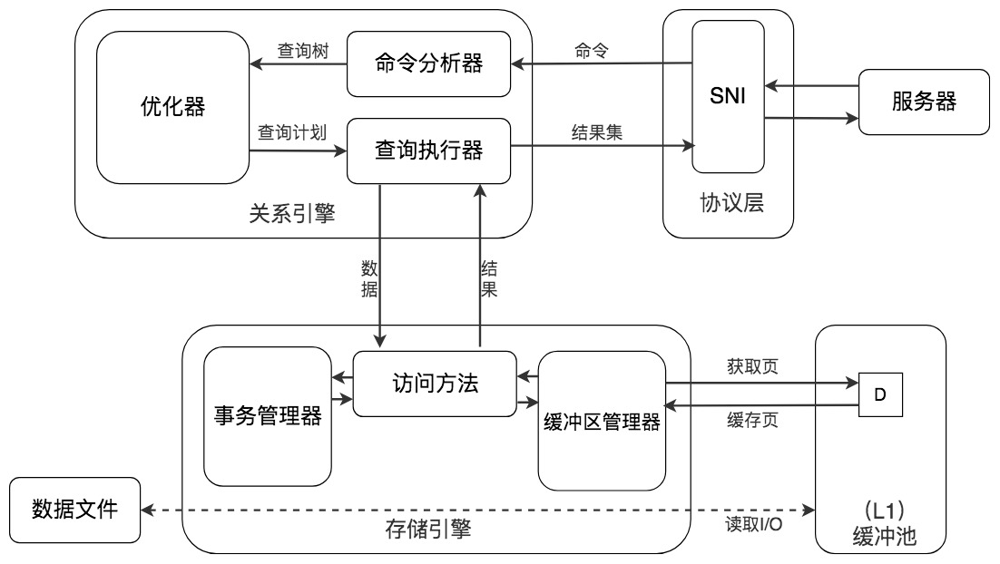

# 缓冲池


## 1. 数据库缓冲池

### 1. 概念

磁盘I/O需要消耗的时间很多，而在内存中进行操作，效率则会高很多，为了能让数据表或者索引中的数据随时被我们所用，DBMS会申请占用内存来作为数据缓冲池，这样做的好处是可以让磁盘活动最小化，从而减少与磁盘直接进行I/O的时间。要知道，这种策略对提升SQL语句的查询性能来说至关重要。如果索引的数据在缓冲池里，那么访问的成本就会降低很多。

那么缓冲池如何读取数据呢？

缓冲池管理器会尽量将经常使用的数据保存起来，在数据库进行页面读操作的时候，首先会判断该页面是否在缓冲池中，如果存在就直接读取，如果不存在，就会通过内存或磁盘将页面存放到缓冲池中再进行读取。

缓存在数据库中的结构和作用如下图所示：


如果我们执行SQL语句的时候更新了缓存池中的数据，那么这些数据会马上同步到磁盘上吗？

实际上，当我们对数据库中的记录进行修改的时候，首先会修改缓冲池中页里面的记录信息，然后数据库会以一定的频率刷新到磁盘上。注意并不是每次发生更新操作，都会立刻进行磁盘回写。缓冲池会采用一种叫做checkpoint的机制将数据回写到磁盘上，这样做的好处就是提升了数据库的整体性能。

比如，当缓冲池不够用时，需要释放掉一些不常用的页，就可以采用强行采用checkpoint的方式，将不常用的脏页回写到磁盘上，然后再从缓冲池中将这些页释放掉。这里脏页（dirty page）指的是缓冲池中被修改过的页，与磁盘上的数据页不一致。

### 2.查看缓冲池大小

如果你使用的是MySQL MyISAM存储引擎，它只缓存索引，不缓存数据，对应的键缓存参数为key_buffer_size，你可以用它进行查看。

如果你使用的是InnoDB存储引擎，可以通过查看innodb_buffer_pool_size变量来查看缓冲池的大小，命令如下：

```mysql
show variables like 'innodb_buffer_pool_size'
```

修改缓冲池大小为 128M

```mysql
set global inodb_buffer_pool_size = 134217728;
```

在InnoDB存储引擎中，我们可以同时开启多个缓冲池，这里我们看下如何查看缓冲池的个数，使用命令：

```mysql
show variables like 'innodb_buffer_pool_instances'
```

实际上`innodb_buffer_pool_instances`默认情况下为8，为什么只显示只有一个呢？

这里需要说明的是，如果想要开启多个缓冲池，你首先需要将`innodb_buffer_pool_size`参数设置为大于等于1GB，这时`innodb_buffer_pool_instances`才会大于1。

你可以在MySQL的配置文件中对`innodb_buffer_pool_size`进行设置，大于等于1GB，然后再针对`innodb_buffer_pool_instances`参数进行修改。


## 2. 数据页加载的三种方式


### 1. 内存读取

如果该数据存在于内存中，基本上执行时间在1ms左右，效率还是很高的。

### 2. 随机读取

如果数据没有在内存中，就需要在磁盘上对该页进行查找，整体时间预估在10ms左右，这10ms中有6ms是磁盘的实际繁忙时间（包括了寻道和半圈旋转时间），有3ms是对可能发生的排队时间的估计值，另外还有1ms的传输时间，将页从磁盘服务器缓冲区传输到数据库缓冲区中。这10ms看起来很快，但实际上对于数据库来说消耗的时间已经非常长了，因为这还只是一个页的读取时间。

### 3. 顺序读取

顺序读取其实是一种批量读取的方式，因为我们请求的数据在磁盘上往往都是相邻存储的，顺序读取可以帮我们批量读取页面，这样的话，一次性加载到缓冲池中就不需要再对其他页面单独进行磁盘I/O操作了。如果一个磁盘的吞吐量是40MB/S，那么对于一个16KB大小的页来说，一次可以顺序读取2560（40MB/16KB）个页，相当于一个页的读取时间为0.4ms。采用批量读取的方式，即使是从磁盘上进行读取，效率也比从内存中只单独读取一个页的效率要高。

### 4. 获取查询成本


我们先前已经讲过，一条SQL查询语句在执行前需要确定查询计划，如果存在多种查询计划的话，MySQL会计算每个查询计划所需要的成本，从中选择成本最小的一个作为最终执行的查询计划。

如果我们想要查看某条SQL语句的查询成本，可以在执行完这条SQL语句之后，通过查看当前会话中的last_query_cost变量值来得到当前查询的成本。这个查询成本对应的是SQL语句所需要读取的页的数量。

我以product_comment表为例，如果我们想要查询comment_id=900001的记录，然后看下查询成本，我们可以直接在聚集索引上进行查找：

```mysql
SHOW STATUS LIKE 'last_query_cost';
```


## 3. 小结

SQL查询是一个动态的过程，从页加载的角度来看，我们可以得到以下两点结论：

* 1）**位置决定效率**。如果页就在数据库缓冲池中，那么效率是最高的，否则还需要从内存或者磁盘中进行读取，当然针对单个页的读取来说，如果页存在于内存中，会比在磁盘中读取效率高很多。
* 2）**批量决定效率**。如果我们从磁盘中对单一页进行随机读，那么效率是很低的（差不多10ms），而采用顺序读取的方式，批量对页进行读取，平均一页的读取效率就会提升很多，甚至要快于单个页面在内存中的随机读取。