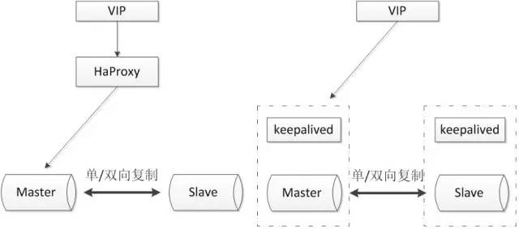

# MySQL 高可用架构

> [美团数据库高可用架构的演进与设想](https://tech.meituan.com/2017/06/29/database-availability-architecture.html)
>
> [Compute Engine 上 MySQL 集群的高可用性架构](https://cloud.google.com/architecture/architectures-high-availability-mysql-clusters-compute-engine)
>
> [MySQL 五个常见的高可用方案](https://zhuanlan.zhihu.com/p/25960208)
>
> [MySQL 高可用解决方案](https://www.modb.pro/db/15033)

# 

## 1. 概述

高可用存储架构核心为以下两点：

* 数据冗余
* 故障转移

比如双机架构（主备、主从）就满足了数据冗余。但是没有自动故障转移功能，因此配合上双机切换就可以实现高可用。

MySQL 数据库的高可用的架构时，主要要考虑如下几方面：

- 如果数据库发生了宕机或者意外中断等故障，能尽快恢复数据库的可用性，尽可能的减少停机时间，保证业务不会因为数据库的故障而中断。
- 用作备份、只读副本等功能的非主节点的数据应该和主节点的数据实时或者最终保持一致。
- 当业务发生数据库切换时，切换前后的数据库内容应当一致，不会因为数据缺失或者数据不一致而影响业务。关于对高可用的分级在这里我们不做详细的讨论，这里只讨论常用高可用方案的优缺点以及高可用方案的选型。

## 2. 基于 MySQL Replication

### 原理

MySQL Replication 是 MySQL 自带的复制功能，一般用于实现主备、主从等双机架构。

**MySQL Replication 是通过重放 binlog 实现主库数据的异步复制**。即当主库执行了一条 sql 命令，那么在从库同样的执行一遍，从而达到主从复制的效果。

MySQL 内部流程如下图：

从图中可以看到：

* 1）主库接收到客户端的更新请求后，执行内部事务的更新逻辑，同时写 binlog。
* 2）备库 B 跟主库 A 之间维持了一个长连接。主库 A 内部有一个线程，专门用于服务备库 B 的这个长连接。

**一个事务日志同步的完整过程**是这样的：

* 1）在备库 B 上通过 change master 命令，设置主库 A 的 IP、端口、用户名、密码，以及要从哪个位置开始请求 binlog，这个位置包含文件名和日志偏移量。
* 2）在备库 B 上执行 start slave 命令，这时候备库会启动两个线程，就是图中的 io_thread 和 sql_thread。其中 io_thread 负责与主库建立连接。
* 3）主库 A 校验完用户名、密码后，开始按照备库 B 传过来的位置，从本地读取 binlog，发给 B。
* 4）备库 B 拿到 binlog 后，写到本地文件，称为中转日志（relay log）。
* 5）sql_thread 读取中转日志，解析出日志里的命令，并执行。

> 后来由于多线程复制方案的引入，sql_thread 演化成为了多个线程，大致原理还是这样，暂且不展开。

### 主备、主从

基于自带的 MySQL Replication 我们可以实现常见的 主备、主从等架构。

> 一般来说，中小型规模的时候，采用这种架构是最省事的。

这些架构都满足了数据冗余这一项，但是没有故障转移功能，所以出问题后都需要手动切换。

### 双机切换

双机切换就是为了解决这上述问题而产生的，包括主备切换和主从切换两种方案。简单来说，这两个方案就是**在原有方案的基础上增加“切换”功能**，即系统自动决定主机角色，并完成角色切换。

一般是使用 Keepalived 来实现该功能。

> [KeepAlived保证Mysql主从自动切换](https://juejin.cn/post/6844904069027332109)
>
> [High-Availability MySQL cluster with load balancing using HAProxy and Heartbeat.](https://towardsdatascience.com/high-availability-mysql-cluster-with-load-balancing-using-haproxy-and-heartbeat-40a16e134691)

用户通过Virtual IP 访问 Master 和 Slave 节点，每个节点采用 keepalved 探活。配置主从关系，进行数据同步。使用 Keepalived 来检测 MySQL 是否存活，异常时通过漂移 Virtual IP 的方式进行切换，保证对客户端透明。

## 3. 基于 MySQL Replication的架构优化版

将双节点数据库扩展到多节点数据库，或者多节点数据库集群。可以根据自己的需要选择一主两从、一主多从或者多主多从的集群。
由于半同步复制，存在接收到一个从机的成功应答即认为半同步复制成功的特性，所以多从半同步复制的可靠性要优于单从半同步复制的可靠性。并且多节点同时宕机的几率也要小于单节点宕机的几率，所以多节点架构在一定程度上可以认为高可用性是好于双节点架构。
但是由于数据库数量较多，所以需要数据库管理软件来保证数据库的可维护性。可以选择 MMM、MHA 或者各个版本的 proxy 等等。

### MHA

MHA（MySQL Master High Availability）是由Facebook工程师 [Yoshinori Matsunobu](https://www.percona.com/live/mysql-conference-2014/users/yoshinori-matsunobu) 开发的一款MySQL高可用软件。

基于MHA的高可用架构： **部署一份MHA的Manager节点，在MySQL各个实例部署MHA Node节点**。MHA可以实现秒级的故障自动转移。 当然MySQL节点之间的数据同步还要以来MySQL自身的数据同步方式。

从名字就可以看出，MHA只负责MySQL主库的高可用。主库发生故障时，MHA会选择一个数据最接近原主库的候选主节点（这里只有一个从节点，所以该从节点即为候选主节点）作为新的主节点，并补齐和之前Dead Master 差异的Binlog。数据补齐之后，即将写VIP漂移到新主库上。整个故障转移过程对应用程序完全透明。

架构如下：

整个MHA架构切换流程如下（为简单起见，只描述一主一从）：

优点：

* 可以进行故障的自动检测和转移;
* 可扩展性较好，可以根据需要扩展 MySQL 的节点数量和结构;
* 相比于双节点的 MySQL 复制，三节点/多节点的 MySQL 发生不可用的概率更低

缺点：

* 至少需要三节点，相对于双节点需要更多的资源;
* 逻辑较为复杂，发生故障后排查问题，定位问题更加困难;
* 数据一致性仍然靠原生半同步复制保证，仍然存在数据不一致的风险;
* 可能因为网络分区发生脑裂现象;

###  etcd/zookeeper+proxy

Zookeeper 使用分布式算法保证集群数据的一致性，使用 zookeeper 可以有效的保证 proxy 的高可用性，可以较好的避免网络分区现象的产生。

优点：
- 较好的保证了整个系统的高可用性，包括 proxy、MySQL;
- 扩展性较好，可以扩展为大规模集群;

缺点：
- 数据一致性仍然依赖于原生的 mysql 半同步复制;
- 引入 zk，整个系统的逻辑变得更加复杂;

### MGR

MGR(MySQL Group Replication)集群是由所有的 MySQL Server 共同组成的，每个 Server 都有完整的副本数据，副本之间基于 Row 格式的日志和 GTID 来做副本之前的数据同步，采用 Paxos 算法实现数据的一致性保障。 MGR 架构要比前面讲述同步方式要复杂，具体可以参照 [MySQL 官方文档](https://link.juejin.cn?target=https%3A%2F%2Fdev.mysql.com%2Fdoc%2Frefman%2F8.0%2Fen%2Fgroup-replication.html)

> 感觉 MySQL 官方更看好 MGR 集群方案。

## 4. 共享存储

共享存储实现了数据库服务器和存储设备的解耦，不同数据库之间的数据同步不再依赖于 MySQL 的原生复制功能，而是通过磁盘数据同步的手段，来保证数据的一致性。

### SAN 共享储存

SAN 的概念是允许存储设备和处理器（服务器）之间建立直接的高速网络（与 LAN 相比）连接，通过这种连接实现数据的集中式存储。常用架构如下：

使用共享存储时，MySQL 服务器能够正常挂载文件系统并操作，如果主库发生宕机，备库可以挂载相同的文件系统，保证主库和备库使用相同的数据。

优点：
- 两节点即可，部署简单，切换逻辑简单；
- 很好的保证数据的强一致性；
- 不会因为 MySQL 的逻辑错误发生数据不一致的情况；

缺点：
- 需要考虑共享存储的高可用；
- 价格昂贵；

### DRBD 磁盘复制

DRBD 是一种基于软件、基于网络的块复制存储解决方案，主要用于对服务器之间的磁盘、分区、逻辑卷等进行数据镜像，当用户将数据写入本地磁盘时，还会将数据发送到网络中另一台主机的磁盘上，这样的本地主机(主节点)与远程主机(备节点)的数据就可以保证实时同步。常用架构如下：

当本地主机出现问题，远程主机上还保留着一份相同的数据，可以继续使用，保证了数据的安全。DRBD 是 linux 内核模块实现的快级别的同步复制技术，可以与 SAN 达到相同的共享存储效果。
优点：

* 两节点即可，部署简单，切换逻辑简单；
* 相比于 SAN 储存网络，价格低廉；
* 保证数据的强一致性；

缺点：

* 对 io 性能影响较大；
* 从库不提供读操作；

## 5. 分布式协议

### MySQL cluster

MySQL cluster 是官方集群的部署方案，通过使用 NDB 存储引擎实时备份冗余数据，实现数据库的高可用性和数据一致性。

优点：

- 全部使用官方组件，不依赖于第三方软件；
- 可以实现数据的强一致性；

缺点：
- 国内使用的较少；
- 配置较复杂，需要使用 NDB 储存引擎，与 MySQL 常规引擎存在一定差异；
- 至少三节点；

### Galera

Galera Cluster是由Codership开发的MySQL多主结构集群，这些主节点互为其它节点的从节点。不同于MySQL原生的主从异步复制，Galera采用的是多主同步复制，并针对同步复制过程中，会大概率出现的事务冲突和死锁进行优化，就是**复制不基于官方binlog而是Galera复制插件，重写了wsrep api**。

基于 Galera 的 MySQL 高可用集群， 是多主数据同步的 MySQL 集群解决方案，使用简单，没有单点故障，可用性高。

优点：
- 多主写入，无延迟复制，能保证数据强一致性；
- 有成熟的社区，有互联网公司在大规模的使用；
- 自动故障转移，自动添加、剔除节点；

缺点：
- 需要为原生 MySQL 节点打 wsrep 补丁
- 只支持 innodb 储存引擎
- 至少三节点；

### Paxos

Paxos 算法解决的问题是一个分布式系统如何就某个值（决议）达成一致。这个算法被认为是同类算法中最有效的。Paxos 与 MySQL 相结合可以实现在分布式的 MySQL 数据的强一致性。

优点：
- 多主写入，无延迟复制，能保证数据强一致性；
- 有成熟理论基础；
- 自动故障转移，自动添加、剔除节点；

缺点：
- 只支持 innodb 储存引擎
- 至少三节点；

## 6. 小结

随着人们对数据一致性的要求不断的提高，越来越多的方法被尝试用来解决分布式数据一致性的问题，如MySQL自身的优化、MySQL集群架构的优化、Paxos、Raft、2PC算法的引入等等。

而使用分布式算法用来解决MySQL数据库数据一致性的问题的方法，也越来越被人们所接受，一系列成熟的产品如PhxSQL、MariaDB Galera Cluster、Percona XtraDB Cluster等越来越多的被大规模使用。

随着官方MySQL Group Replication的GA，使用分布式协议来解决数据一致性问题已经成为了主流的方向。期望越来越多优秀的解决方案被提出，MySQL高可用问题可以被更好的解决。

一般来说，中小型规模的时候，采用这种基于 MySQL Replication 的 主从双机架构+ 基于 Keepalived 的双机切换这个架构是最省事的。

其他的就需要根据场景选择了，暂时没有一个完美的方案。
