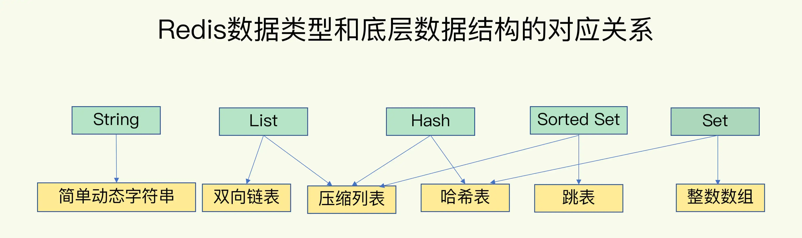

# 数据结构

## 1. 概述

数据库这么多，为啥 Redis 能有这么突出的表现呢？一方面，这是因为它是内存数据库，所有操作都在内存上完成，内存的访问速度本身就很快。另一方面，这要归功于它的数据结构。

Redis 基本数据类型String（字符串）、List（列表）、Hash（哈希）、Set（集合）和 Sorted Set（有序集合）。

底层数据结构一共有 6 种，分别是简单动态字符串、双向链表、压缩列表、哈希表、跳表和整数数组。

看到这里，其实有些问题已经值得我们去考虑了：

* 这些数据结构都是值的底层实现，键和值本身之间用什么结构组织？
* 为什么集合类型有那么多的底层结构，它们都是怎么组织数据的，都很快吗？
* 什么是简单动态字符串，和常用的字符串是一回事吗？

## 2. 全局哈希表

为了实现从键到值的快速访问，Redis 使用了一个**哈希表**来保存所有键值对。同时哈希桶中的元素保存的并不是值本身，而是指向具体值的**指针**。

> 使用指针就可以同时兼容 String 和集合类型。

因为这个哈希表保存了所有的键值对，所以，我也把它称为**全局哈希表**。

哈希表的最大好处很明显，就是让我们可以用**O(1) **的时间复杂度来快速查找到键值对。

> 我们只需要计算键的哈希值，就可以知道它所对应的哈希桶位置，然后就可以访问相应的 entry 元素。

Hash表存在潜在的风险点，那就是哈希表的**冲突**问题和 **rehash** 可能带来的操作阻塞。

### 哈希冲突

哈希冲突：指两个 key 的哈希值和哈希桶计算对应关系时，正好落在了同一个哈希桶中。

当你往哈希表中写入更多数据时，哈希冲突是不可避免的问题。

> 毕竟，哈希桶的个数通常要少于 key 的数量，这也就是说，难免会有一些 key 的哈希值对应到了同一个哈希桶中。

Redis 解决哈希冲突的方式，就是**链式哈希**。指**同一个哈希桶中的多个元素用一个链表来保存，它们之间依次用指针连接**。

### Rehash

哈希冲突链上的元素只能通过指针逐一查找再操作。如果某个哈希冲突链过长，就会导致这个链上的元素查找耗时长，效率降低。

所以，Redis 会对哈希表做 **rehash** 操作。**rehash 也就是增加现有的哈希桶数量，让逐渐增多的 entry 元素能在更多的桶之间分散保存，从而减少单个桶中的冲突**。

**为了使 rehash 操作更高效，Redis 默认使用了两个全局哈希表**：哈希表 1 和哈希表 2。一开始，当你刚插入数据时，默认使用哈希表 1，此时的哈希表 2 并没有被分配空间。随着数据逐步增多，Redis 开始执行 rehash，这个过程分为三步：

* 1）给哈希表 2 分配更大的空间，例如是当前哈希表 1 大小的两倍；
* 2）把哈希表 1 中的数据重新映射并拷贝到哈希表 2 中；
* 3）释放哈希表 1 的空间。

到此，我们就可以从哈希表 1 切换到哈希表 2，用增大的哈希表 2 保存更多数据，而原来的哈希表 1 留作下一次 rehash 扩容备用。

二步涉及大量的数据拷贝，如果一次性把哈希表 1 中的数据都迁移完，会造成 Redis 线程阻塞，为了避免这个问题，Redis 采用了**渐进式 rehash**。

简单来说就是：

Redis 仍然正常处理客户端请求，每处理一个请求时，从哈希表 1 中的第一个索引位置开始，顺带着将这个索引位置上的所有 entries 拷贝到哈希表 2 中；等处理下一个请求时，再顺带拷贝哈希表 1 中的下一个索引位置的 entries。

这样就巧妙地把一次性大量拷贝的开销，分摊到了多次处理请求的过程中，避免了耗时操作，保证了数据的快速访问。

## 3. 数据类型

### String

对于 String 类型来说，找到哈希桶就能直接增删改查了，所以，哈希表的 O(1) 操作复杂度也就是它的复杂度了。但是，对于集合类型来说，即使找到哈希桶了，还要在集合中再进一步操作

### 集合类型

集合类型的值，第一步是通过全局哈希表找到对应的哈希桶位置，第二步是在集合中再增删改查。

集合类型的底层数据结构主要有 5 种：整数数组、双向链表、哈希表、压缩列表和跳表。

整数数组和双向链表也很常见，它们的操作特征都是顺序读写，也就是通过数组下标或者链表的指针逐个元素访问，操作复杂度基本是 O(N)，操作效率比较低；

压缩列表实际上类似于一个数组，数组中的每一个元素都对应保存一个数据。和数组不同的是，压缩列表在表头有三个字段 zlbytes、zltail 和 zllen，分别表示列表长度、列表尾的偏移量和列表中的 entry 个数；压缩列表在表尾还有一个 zlend，表示列表结束。

在压缩列表中，如果我们要查找定位第一个元素和最后一个元素，可以通过表头三个字段的长度直接定位，复杂度是 O(1)。而查找其他元素时，就没有这么高效了，只能逐个查找，此时的复杂度就是 O(N) 了。

有序链表只能逐一查找元素，导致操作起来非常缓慢，于是就出现了跳表。具体来说，**跳表在链表的基础上，增加了多级索引，通过索引位置的几个跳转，实现数据的快速定位，跳表的查找复杂度是 O(logN)。**。

> 空间换时间

| 数据结构 | 时间复杂度 |
| -------- | ---------- |
| 哈希表   | O(1)       |
| 跳表     | O(logN)    |
| 双向链表 | O(N)       |
| 压缩链表 | O(N)       |
| 整数数组 | O(N)       |

### 不同操作的复杂度

集合类型的操作类型很多，有读写单个集合元素的，例如 HGET、HSET，也有操作多个元素的，例如 SADD，还有对整个集合进行遍历操作的，例如 SMEMBERS。它们的复杂度也各不相同。

四句口诀：

* 单元素操作是基础；
* 范围操作非常耗时；
* 统计操作通常高效；
* 例外情况只有几个。

**单元素操作，是指每一种集合类型对单个数据实现的增删改查操作。**

Hash 类型的 HGET、HSET 和 HDEL，Set 类型的 SADD、SREM、SRANDMEMBER 等。这些操作的复杂度由集合采用的数据结构决定，例如，HGET、HSET 和 HDEL 是对哈希表做操作，所以它们的复杂度都是 O(1)；Set 类型用哈希表作为底层数据结构时，它的 SADD、SREM、SRANDMEMBER 复杂度也是 O(1)。

**范围操作，是指集合类型中的遍历操作，可以返回集合中的所有数据**

比如 Hash 类型的 HGETALL 和 Set 类型的 SMEMBERS，或者返回一个范围内的部分数据，比如 List 类型的 LRANGE 和 ZSet 类型的 ZRANGE。**这类操作的复杂度一般是 O(N)**，比较耗时，我们应该尽量避免。

**统计操作，是指集合类型对集合中所有元素个数的记录**，例如 LLEN 和 SCARD。这类操作复杂度只有 O(1)，

> 这是因为当集合类型采用压缩列表、双向链表、整数数组这些数据结构时，这些结构中**专门记录了元素的个数统计**，因此可以高效地完成相关操作。

**例外情况，是指某些数据结构的特殊记录**

**压缩列表和双向链表都会记录表头和表尾的偏移量**。这样一来，对于 List 类型的 LPOP、RPOP、LPUSH、RPUSH 这四个操作来说，它们是在列表的头尾增删元素，这就可以通过偏移量直接定位，所以它们的复杂度也只有 O(1)，可以实现快速操作。

## 4. 小结

* 基本数据类型String（字符串）、List（列表）、Hash（哈希）、Set（集合）和 Sorted Set（有序集合）
* 底层数据结构一共有 6 种，分别是简单动态字符串、双向链表、压缩列表、哈希表、跳表和整数数组。

| 数据结构 | 时间复杂度 |
| -------- | ---------- |
| 哈希表   | O(1)       |
| 跳表     | O(logN)    |
| 双向链表 | O(N)       |
| 压缩链表 | O(N)       |
| 整数数组 | O(N)       |

