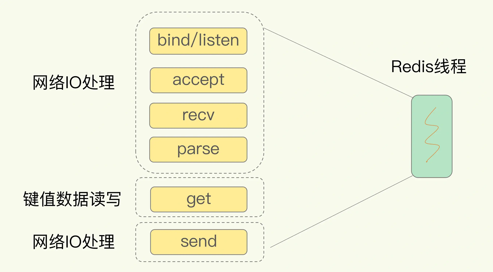

# 为什么单线程Redis能那么快？

## 1. 概述

我们通常说，Redis 是单线程，主要是指**Redis 的网络 IO 和键值对读写是由一个线程来完成的，这也是 Redis 对外提供键值存储服务的主要流程**。但 Redis 的其他功能，比如持久化、异步删除、集群数据同步等，其实是由额外的线程执行的。

## 2. Redis 为什么用单线程？

使用多线程，可以增加系统吞吐率，或是可以增加系统扩展性。但是线程数和吞吐并不是线性关系。因为**多线程编程模式会面临共享资源的并发访问控制问题**。

为了保证共享资源的正确性，就需要有额外的机制进行保证，而这个额外的机制，就会带来额外的开销。

**并发访问控制一直是多线程开发中的一个难点问题**，只是简单地采用一个粗粒度互斥锁，就会出现不理想的结果：即使增加了线程，大部分线程也在等待获取访问共享资源的互斥锁，并行变串行，系统吞吐率并没有随着线程的增加而增加。

而且，采用多线程开发一般会引入同步原语来保护共享资源的并发访问，这也**会降低系统代码的易调试性和可维护性**。

为了避免这些问题，Redis 直接采用了**单线程模式**。

## 3. 单线程 Redis 为什么那么快？

Redis 能使用单线程模型达到每秒数十万级别的处理能力，这是为什么呢？

* 一方面，Redis 的大部分操作在**内存**上完成，再加上它采用了**高效的数据结构**，例如哈希表和跳表，这是它实现高性能的一个重要原因。
* 另一方面，就是 Redis 采用了**多路复用机制**，使其在网络 IO 操作中能并发处理大量的客户端请求，实现高吞吐率。

### 基本 IO 模型与阻塞点

以一个 Get 请求为例：

其中，bind/listen、accept、recv、parse 和 send 属于网络 IO 处理，而 get 属于键值数据操作。既然 Redis 是单线程，那么，最基本的一种实现是在一个线程中依次执行上面说的这些操作。

但是，在这里的网络 IO 操作中，有潜在的阻塞点，分别是 accept() 和 recv()。

* 当 Redis 监听到一个客户端有连接请求，但一直未能成功建立起连接时，会阻塞在 accept() 函数这里，导致其他客户端无法和 Redis 建立连接。
* 类似的，当 Redis 通过 recv() 从一个客户端读取数据时，如果数据一直没有到达，Redis 也会一直阻塞在 recv()。

### 非阻塞模式

幸运的是，socket 网络模型本身支持非阻塞模式。

在 socket 模型中，不同操作调用后会返回不同的套接字类型。socket() 方法会返回主动套接字，然后调用 listen() 方法，将主动套接字转化为监听套接字，此时，可以监听来自客户端的连接请求。最后，调用 accept() 方法接收到达的客户端连接，并返回已连接套接字。

| 调用方法 | 返回套接字类型 | 非阻塞模式 | 效果                |
| -------- | -------------- | ---------- | ------------------- |
| socket() | 主动套接字     |            |                     |
| listen() | 监听套接字     | 可设置     | accept()非阻塞      |
| accept() | 已连接套接字   | 可设置     | send()/recv()非阻塞 |

针对监听套接字，我们可以设置非阻塞模式：当 Redis 调用 accept() 但一直未有连接请求到达时，Redis 线程可以返回处理其他操作，而不用一直等待。但是，你要注意的是，调用 accept() 时，已经存在监听套接字了。

虽然 Redis 线程可以不用继续等待，但是总得有机制继续在监听套接字上等待后续连接请求，并在有请求时通知 Redis。

### 基于多路复用的高性能 I/O 模型

Linux 中的 IO 多路复用机制是指一个线程处理多个 IO 流，就是我们经常听到的 select/epoll 机制。

在 Redis 只运行单线程的情况下，**该机制允许内核中，同时存在多个监听套接字和已连接套接字**。

内核会一直监听这些套接字上的连接请求或数据请求。一旦有请求到达，就会交给 Redis 线程处理，这就实现了一个 Redis 线程处理多个 IO 流的效果。

为了在请求到达时能通知到 Redis 线程，select/epoll 提供了基于事件的回调机制，即针对不同事件的发生，调用相应的处理函数。

*那么，回调机制是怎么工作的呢？*

其实，select/epoll 一旦监测到 FD 上有请求到达时，就会触发相应的事件。

这些事件会被放进一个事件队列，Redis 单线程对该事件队列不断进行处理。

> 这样一来，Redis 无需一直轮询是否有请求实际发生，这就可以避免造成 CPU 资源浪费。

同时，Redis 在对事件队列中的事件进行处理时，会调用相应的处理函数，这就实现了基于事件的回调。因为 Redis 一直在对事件队列进行处理，所以能及时响应客户端请求，提升 Redis 的响应性能。

## 4. 小结

1）Redis 真的只是单线程吗？

**Redis 的网络 IO 和键值对读写是由一个线程来完成的，这也是 Redis 对外提供键值存储服务的主要流程**。但 Redis 的其他功能，比如持久化、异步删除、集群数据同步等，其实是由额外的线程执行的。

2）Redis 为什么用单线程？

多线程编程模式会面临共享资源的并发访问控制问题，且多线程编程模式会降低系统代码的易调试性和可维护性。

3）单线程 Redis 为什么那么快？

主要因为多路复用的 IO 模型，因为这避免了 accept() 和 send()/recv() 潜在的网络 IO 操作阻塞点。

